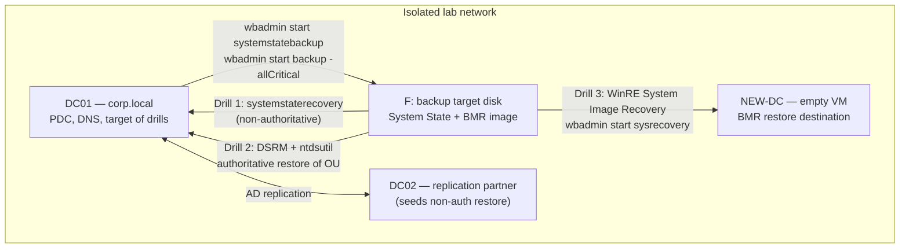

# Project 06 — Backup & Disaster Recovery Drill

Take real backups of the domain you built, then deliberately break it and prove you can bring it back. This project assembles Windows Server Backup, System State, Bare-Metal Recovery (BMR), and an **authoritative Active Directory restore** into one rehearsed disaster-recovery drill — because a backup that has never been restored is a hypothesis, not a plan.

## Overview

This project turns the [Backup, Restore and Recovery](../Windows-Server-Backup-Restore-and-Recovery/Readme.md) module from reference material into a rehearsed runbook. You will install and schedule Windows Server Backup on a domain controller, capture System State and a BMR-capable full-server backup, then run three separate recovery exercises: a **non-authoritative** System State restore, an **authoritative** restore of a deleted OU via DSRM + `ntdsutil`, and a **Bare-Metal Recovery** of the whole server into a fresh VM.

It proves you can: choose the correct recovery granularity for a given failure, drive `wbadmin` / the `WindowsServerBackup` PowerShell module, boot a DC into DSRM, make restored objects "win" replication, and verify AD health after a restore with `dcdiag` and `repadmin`.

> [!NOTE]
> **Where this sits in the course**
> Projects 01–05 build the enterprise; this project makes it survivable. It is the prerequisite mindset for Project 08 (hardening) and the recovery half of the Project 10 purple-team capstone — you cannot credibly claim ransomware resilience without a tested restore.

## Objective and Scope

Concrete end goal: on the lab domain from [Project-01-Single-DC-Domain](Project-01-Single-DC-Domain.md), produce a scheduled backup regime and then successfully complete **all three** recovery drills, each verified:

1. **System State restore (non-authoritative)** — recover a DC's OS/AD state from backup and let replication reconcile it.
2. **Authoritative AD restore** — delete an OU domain-wide, then restore it so the recovered copy overwrites every DC via `ntdsutil`.
3. **Bare-Metal Recovery** — rebuild the server from a BMR-capable backup into a brand-new empty VM booted from WinRE.

Out of scope: third-party backup products, offsite/cloud replication mechanics, and cluster-aware backups — this drill uses only in-box Windows Server Backup.

## Prerequisites

- **Completed [Project-01-Single-DC-Domain](Project-01-Single-DC-Domain.md)** — a working `corp.local` (or your chosen name) domain with at least `DC01`, some OUs, users, and Group Policy. A second DC (`DC02`) is **strongly recommended** so the non-authoritative restore has a healthy replication partner to reconcile from.
- **Lab environment** from [Lab Setup and Virtualization](../Lab-Setup-and-Virtualization/Readme.md), with the ability to create a fresh empty VM and mount Windows Server installation media for the WinRE/BMR step. **Snapshot every VM before you start** so you can re-run drills.
- **A dedicated backup target** — a second virtual disk on `DC01` (e.g. `F:`) or a network share. Do not back a DC up onto its own OS volume.
- Module reference: [Backup, Restore and Recovery](../Windows-Server-Backup-Restore-and-Recovery/Readme.md) (commands and concepts), [Active-Directory-Domain-Services](../Active-Directory-Domain-Services-AD-DS/Active-Directory-Domain-Services.md) (what System State protects on a DC), and [SAM-vs-NTDS.dit](../Active-Directory-Domain-Services-AD-DS/SAM-vs-NTDS.dit.md) (why a System State backup is a credential-bearing artifact).

## Architecture



## Build Sequence

1. **Install Windows Server Backup on `DC01`.** It is a Feature, not a Role.
   ```powershell
   Install-WindowsFeature -Name Windows-Server-Backup -IncludeManagementTools
   Get-WindowsFeature -Name Windows-Server-Backup
   ```

2. **Attach and identify the backup target.** Add a second disk to the VM, bring it online as `F:` in Disk Management, then confirm disk identifiers.
   ```cmd
   wbadmin get disks
   ```

3. **Take a baseline System State backup** (captures registry, SYSVOL, and `NTDS.dit` on the DC).
   ```cmd
   wbadmin start systemstatebackup -backupTarget:f:
   ```

4. **Take a BMR-capable full backup** so Drill 3 has an image to restore. `-allCritical` marks the backup Bare-Metal-Recovery-capable.
   ```cmd
   wbadmin start backup -backupTarget:f: -allCritical -systemState -vssCopy -quiet
   ```

5. **Schedule a recurring backup** so the regime is operational, not one-off. `-vssFull` gives incremental-like efficiency on later runs.
   ```cmd
   wbadmin enable backup -addtarget:DiskID -schedule:09:00,21:00 -allCritical -systemState -vssFull -quiet
   ```
   Or via the PowerShell module (edit the active policy):
   ```powershell
   $Policy = Get-WBPolicy -Editable
   Set-WBSchedule -Policy $Policy -Schedule 09:00,21:00
   Set-WBPolicy -Policy $Policy
   ```

6. **Record the version IDs** you will restore from — you need these for every recovery command.
   ```cmd
   wbadmin get versions -backupTarget:f:
   ```

7. **Drill 1 — Non-authoritative System State restore.** Reboot `DC01` into DSRM, then restore System State. Without `-authsysvol`/an `ntdsutil` step this is non-authoritative: AD comes back to backup-time state and replication updates it from `DC02`.
   ```cmd
   bcdedit /set safeboot dsrepair   :: untested — take effect on next reboot
   shutdown /r /t 0
   ```
   ```cmd
   :: while booted in DSRM, log in with the DSRM Administrator account
   wbadmin start systemstaterecovery -version:03/31/2026-09:00
   bcdedit /deletevalue safeboot    :: untested — clear the flag so the DC boots normally
   shutdown /r /t 0
   ```

8. **Drill 2 — Authoritative restore of a deleted OU.** First, simulate the disaster: delete a test OU so the deletion replicates domain-wide.
   ```powershell
   Remove-ADOrganizationalUnit -Identity "OU=DR-Test,DC=corp,DC=local" -Recursive -Confirm:$false
   ```
   Reboot into DSRM again (step 7's `bcdedit /set safeboot dsrepair`), restore System State non-authoritatively, then mark just that subtree authoritative **before** rebooting:
   ```cmd
   ntdsutil
   activate instance ntds
   authoritative restore
   restore subtree "OU=DR-Test,DC=corp,DC=local"
   quit
   quit
   ```
   `:: untested — sequence follows documented ntdsutil authoritative-restore syntax; validate the DN and instance name before running`
   Clear the safeboot flag and reboot; the version-incremented OU propagates outward and overwrites the (wrongly deleted) copies on every other DC.

9. **Drill 3 — Bare-Metal Recovery into a new VM.** Create a fresh empty VM (`NEW-DC`) with a disk layout matching `DC01`, attach the backup target/media, and boot from Windows Server installation media.
   - Choose **Repair your computer → Troubleshoot → Advanced options → System Image Recovery**, and point it at the `-allCritical` backup on `F:`.
   - Or from a WinRE command prompt:
   ```text
   wbadmin start sysrecovery -version:<id> -backupTarget:<location> -machine:DC01
   ```
   `:: untested — sysrecovery is intended to run from WinRE, not a live OS`

## Verification (Definition of Done)

- **Backups exist and are typed correctly:** `wbadmin get versions` lists each backup with its time, storage location, version identifier, and the recovery types it supports (System State and/or Bare Metal Recovery). An empty result means you have nothing to restore — fix that *before* the drills.
- **Job success, not just job start:** `wbadmin get status` (cmd) or `Get-WBJob` / `Get-WBSummary` (PowerShell) reports a completed job with no failed items.
- **Drill 1 done:** after the non-authoritative restore and reboot out of DSRM, `dcdiag /v` on `DC01` passes and `repadmin /replsummary` / `repadmin /showrepl` show clean, error-free replication with `DC02`.
- **Drill 2 done:** after the reboot, `Get-ADOrganizationalUnit -Identity "OU=DR-Test,DC=corp,DC=local"` returns the OU (and its child objects), and the same query **on `DC02`** returns it too — proving the authoritative copy won replication rather than being re-deleted.
- **Drill 3 done:** `NEW-DC` boots to a working logon, and (after a reboot) `dcdiag` comes back healthy — proving the BMR image was genuinely recoverable, not just present.

> [!TIP]
> **Prove it, don't assume it**
> Run `dcdiag` and `repadmin /replsummary` **before** each drill to record a known-good baseline, and again after — the diff is your evidence the restore actually reconciled the directory rather than leaving a silently broken DC.

## Security Considerations

> [!WARNING]
> **A System State backup is a credential-bearing artifact — treat it like the live DC**
> The System State / BMR images you create in this project contain `NTDS.dit` and the registry hives. Anyone who can read them can extract domain password hashes offline exactly as described in [SAM-vs-NTDS.dit](../Active-Directory-Domain-Services-AD-DS/SAM-vs-NTDS.dit.md) — no exploit required. Protect backup media with the same access controls as the domain controller itself, and never copy these images to a lower-trust host.

- **Backup Operators is a privilege-escalation path.** A member of `Backup Operators` can back up (and therefore read) `NTDS.dit`, SAM, and SECURITY hives on any machine they reach. Keep the group's membership as tight as Domain Admins.
- **Ransomware deletes backups first.** Attackers routinely run `vssadmin delete shadows /all /quiet`, `wbadmin delete catalog`, and `wbadmin delete systemstatebackup` before encrypting. Keep at least one copy **offline or immutable**, and (study/detection framing) alert on those commands via process-creation logging — see [Windows Monitoring and Logging](../Windows-Monitoring-and-Logging/Readme.md) and MITRE ATT&CK **T1490 — Inhibit System Recovery**.
- **DSRM passwords are out-of-band secrets.** Store them in a vault, not near the DC and not reused across DCs; an attacker who knows the DSRM password can boot a DC into an AD-offline state you cannot see with domain auditing.
- **Isolation.** Do the whole drill on an isolated lab network per the [Enterprise Projects](Readme.md) guidance — deleting OUs and rolling DCs back is destructive by design.

## Troubleshooting

| Symptom | Likely cause & fix |
| --- | --- |
| `wbadmin get versions` returns nothing | No successful backup exists — re-run step 3/4 and check `wbadmin get status` for a full target disk or a failed VSS writer |
| Backup fails onto the OS volume | You cannot back a server up onto a volume that's part of the backup — use a separate disk/share (step 2) |
| DC won't leave DSRM after a drill | The `safeboot dsrepair` flag is still set — from an elevated prompt run `bcdedit /deletevalue safeboot` then reboot |
| Restored OU gets deleted again after reboot | The restore was non-authoritative — you must run the `ntdsutil` `authoritative restore` subtree step (Drill 2) *before* rebooting out of DSRM |
| Restored DC stops replicating / USN rollback warning in Directory Service log | DC was rolled back outside a supported path — restore via System State/BMR (not ad hoc VM snapshot) and confirm within the tombstone-lifetime window |
| BMR restore fails on the new VM | Replacement disk layout/capacity doesn't match the source — give `NEW-DC` a disk at least as large as `DC01`'s critical volumes and matching the partition scheme |

## References

- [Windows Server Backup (Microsoft Learn)](https://learn.microsoft.com/en-us/windows-server/administration/windows-server-backup/)
- [`wbadmin` command reference (Microsoft Learn)](https://learn.microsoft.com/en-us/windows-server/administration/windows-commands/wbadmin)
- [AD forest recovery guide (Microsoft Learn)](https://learn.microsoft.com/en-us/windows-server/identity/ad-ds/manage/ad-forest-recovery-guide)
- [MITRE ATT&CK — Inhibit System Recovery (T1490)](https://attack.mitre.org/techniques/T1490/)

## Related

- [Backup, Restore and Recovery](../Windows-Server-Backup-Restore-and-Recovery/Readme.md) — the module this project operationalizes
- [Active-Directory-Domain-Services](../Active-Directory-Domain-Services-AD-DS/Active-Directory-Domain-Services.md) — what System State protects and restores on a DC
- [SAM-vs-NTDS.dit](../Active-Directory-Domain-Services-AD-DS/SAM-vs-NTDS.dit.md) — why a System State backup is a credential-bearing artifact
- [Windows Monitoring and Logging](../Windows-Monitoring-and-Logging/Readme.md) — detecting backup-deletion TTPs
- [Lab Setup and Virtualization](../Lab-Setup-and-Virtualization/Readme.md) — the VM environment this drill runs on
- [Project-01-Single-DC-Domain](Project-01-Single-DC-Domain.md) — the domain this project backs up and restores
- [Project-07-Monitoring-and-Detection-Pipeline](Project-07-Monitoring-and-Detection-Pipeline.md) — sibling project (detect the TTPs flagged here)
- [Project-08-Harden-the-Enterprise](Project-08-Harden-the-Enterprise.md) — sibling project (Backup Operators / tiering hardening)
- [Project-10-Purple-Team-Capstone](Project-10-Purple-Team-Capstone.md) — sibling project (recovery as the defensive half)
- [Enterprise Projects](Readme.md) — module hub for all ten capstone builds
- [Enterprise Windows Infrastructure Security](../Readme.md) — course hub
