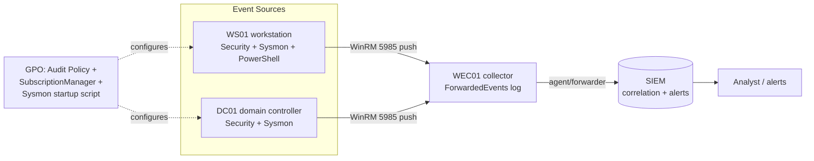

# Project 07 — Monitoring & Detection Pipeline

This project assembles the course's monitoring modules into a working end-to-end detection pipeline: an audit-policy baseline at the source, Sysmon for high-fidelity endpoint telemetry, Windows Event Forwarding (WEF) to centralize logs on a collector, and a SIEM to correlate and alert. Finishing it proves you can make an enterprise Windows estate *observable* — so the attack projects that follow have something to detect.

## Overview

The four monitoring modules teach one layer each; real detection needs them stacked. Auditing decides **what gets recorded**, Sysmon adds **what the Security log misses** (hashes, network, image loads, LSASS handle access), WEF **ships events off-host before they can be cleared**, and the SIEM **correlates across sources and alerts**. This build wires all four into one pipeline and validates that a test action on a workstation surfaces as an alert downstream.

The skills it proves: designing an audit baseline from attacker-relevant [event IDs](../Windows-Monitoring-and-Logging/Key-Security-Event-IDs.md), deploying Sysmon at scale, standing up a source-initiated WEF subscription, and closing the loop so cleared or missing telemetry is itself an alert.

## Objective and Scope

Stand up a centralized, tamper-resistant monitoring pipeline for the lab domain:

- A **GPO-enforced Advanced Audit Policy** baseline applied to the DC and workstations.
- **Sysmon** deployed with a tuned config on all Windows hosts.
- A **source-initiated WEF subscription** forwarding Security, Sysmon, and PowerShell logs to a **Windows Event Collector (WEC)**.
- A **SIEM** ingesting the collector's `ForwardedEvents` and firing at least one detection rule (e.g. log-clear `1102`, audit-policy-change `4719`).

Out of scope: writing production detection content at scale — the goal is a verified pipeline with representative rules, not a full SOC ruleset.

## Prerequisites

- **[Project-01-Single-DC-Domain](Project-01-Single-DC-Domain.md)** — a working single-DC domain (`corp.local`) with at least one domain-joined workstation.
- Baseline lab from **[Lab Setup and Virtualization](../Lab-Setup-and-Virtualization/Readme.md)** (isolated network, snapshot capability).
- Module knowledge: **[Windows-Advanced-Audit-Policy](../Windows-Monitoring-and-Logging/Windows-Advanced-Audit-Policy.md)**, **[Sysmon-Deployment-and-Configuration](../Windows-Monitoring-and-Logging/Sysmon-Deployment-and-Configuration.md)**, **[Windows-Event-Forwarding-WEF-WEC](../Windows-Monitoring-and-Logging/Windows-Event-Forwarding-WEF-WEC.md)**, **[SIEM-Integration](../Windows-Monitoring-and-Logging/SIEM-Integration.md)**, and **[Group-Policy(GPO)](../Group-Policy-Objects-GPO/Group-Policy(GPO).md)** for pushing the config.

> [!NOTE]
> **Lab VMs used**
> - **DC01** — domain controller (`corp.local`), also hosts the audit-policy GPO.
> - **WEC01** — member server acting as the Windows Event Collector.
> - **WS01** — domain-joined Windows 10/11 workstation (the "source" endpoint you test against).
> - **SIEM** — a Splunk/Elastic/Sentinel forwarder-agent host or the collector itself forwarding on.

## Architecture



## Build Sequence

1. **Define and deploy the audit baseline.** On the DC, inspect the live policy, set the attacker-relevant subcategories, and export the baseline for diffing. Then move the same settings into a GPO so they survive refresh.

   ```cmd
   auditpol /get /category:*
   auditpol /set /subcategory:"Process Creation" /success:enable /failure:enable
   auditpol /backup /file:C:\audit-baseline.csv
   ```

   > [!WARNING]
   > **auditpol is inspection, not deployment**
   > `auditpol /set` is local and transient — it is overwritten at the next Group Policy refresh if a GPO defines Advanced Audit Policy. Use `auditpol` to *verify*; deploy the durable baseline through GPO (and enable "Force audit policy subcategory settings to override audit policy category settings").

2. **Enable command-line process auditing.** In the GPO, set **Administrative Templates > System > Audit Process Creation > Include command line in process creation events** so `4688` carries the full command line — see [Command-Line-and-Process-Auditing](../Windows-Monitoring-and-Logging/Command-Line-and-Process-Auditing.md).

3. **Deploy Sysmon to all hosts.** Install with a curated, tuned config and push updates by re-applying the config. At scale, deliver the binary + config via a GPO startup script.

   ```cmd
   sysmon -accepteula -i sysmonconfig.xml
   sysmon -c sysmonconfig.xml
   ```

   Start from a community baseline (SwiftOnSecurity's `sysmon-config` or Olaf Hartong's `sysmon-modular`) and tune. Sysmon writes to `Microsoft-Windows-Sysmon/Operational`.

4. **Prepare the collector (WEC01).** Configure WinRM and the collector service, then create the source-initiated subscription.

   ```cmd
   winrm qc -q
   wecutil qc /q
   wecutil cs subscription.xml
   ```

5. **Point sources at the collector via GPO.** Set **Computer Configuration > Administrative Templates > Windows Components > Event Forwarding > Configure target Subscription Manager** to the collector connection string:

   ```text
   Server=http://collector.corp.local:5985/wsman/SubscriptionManager/WEC,Refresh=60
   ```

6. **Grant read on the Security log.** On each source, add **`NETWORK SERVICE`** to the local **Event Log Readers** group — otherwise the Security channel silently fails to forward while other logs succeed.

7. **Ingest into the SIEM.** Point the SIEM agent/forwarder at the collector's **`ForwardedEvents`** log. Confirm each source type parses into searchable fields, then author detection rules for high-value events (log clear `1102`, audit-policy change `4719`, Sysmon config change `16`).

8. **Snapshot** every VM once the pipeline verifies, so the attack projects can run from a known-good monitored baseline.

## Verification (Definition of Done)

> [!IMPORTANT]
> **The pipeline is "done" only when a source action reaches the SIEM as an alert**
> Test end-to-end, not layer-by-layer in isolation.

- **Audit policy applied:** `auditpol /get /category:*` on a source reflects the baseline (Process Creation Success/Failure enabled); `gpresult /r` shows the audit GPO applied.
- **Sysmon running:** the `Sysmon` service is running and `Microsoft-Windows-Sysmon/Operational` is populating; `sysmon -c` (no argument) shows the intended config.
- **Subscription active:** `wecutil gr <SubscriptionName>` reports sources as **Active**; on a healthy source, event **100** appears in `Microsoft-Windows-Eventlog-ForwardingPlugin/Operational`, and events land in `ForwardedEvents` on WEC01.
- **SIEM correlating:** run a benign test — clear a test log or toggle an audit subcategory — and confirm the corresponding **`1102`** / **`4719`** event surfaces as a SIEM alert within the refresh window.

## Security Considerations

> [!WARNING]
> **The pipeline is a target, and its silence is a signal**
> - Attackers disable logging as a standard evasion step (MITRE ATT&CK **T1562.002 — Impair Defenses: Disable Windows Event Logging**): `auditpol /clear`, selectively disabling a subcategory, or pushing a permissive Sysmon config with `sysmon -c`.
> - They clear evidence with **T1070.001 — Clear Windows Event Logs** (event **1102**). Forwarding off-host *before* the clear is the only reason the evidence survives an endpoint wipe.
> - The collector and SIEM must sit **outside the blast radius** of the hosts they watch — an attacker who owns a source must not be able to reach the collector's storage or the SIEM index.

- **Alert on the loss of telemetry:** a source that stops forwarding, a stopped `Wecsvc`/agent, `4719`, `1102`, or Sysmon event **16** (config change) are high-priority signals, not gaps to ignore.
- **Forward continuously, not on demand** — logs only survive if they were already shipped.
- **Protect and time-sync the pipeline** — restrict who can read/modify the collector and SIEM, and keep all hosts on synchronized time (PDC emulator / NTP) so cross-source correlation is accurate.

## Troubleshooting

| Symptom | Likely cause & fix |
|---------|--------------------|
| Source never appears / 0 active in `wecutil gr` | GPO not applied or wrong `SubscriptionManager` URL/port — run `gpupdate /force`, confirm WinRM reachable on 5985/5986 |
| All logs forward *except* Security | `NETWORK SERVICE` not in **Event Log Readers** on the source |
| Local `auditpol` changes revert | A GPO redefines Advanced Audit Policy and wins at refresh — change it in the GPO |
| `4688` events lack command line | "Include command line in process creation events" not enabled in the GPO |
| Events reach WEC but not the SIEM | Collector-side agent/forwarder stopped or misconfigured output/index — check the agent service |
| SIEM timeline correlation is wrong | Clock skew between hosts — enforce time sync via the PDC emulator / NTP |

## References

- [Use Windows Event Forwarding to assist in intrusion detection (Microsoft Learn)](https://learn.microsoft.com/en-us/windows/security/threat-protection/use-windows-event-forwarding-to-assist-in-intrusion-detection)
- [Sysmon — Sysinternals (Microsoft Learn)](https://learn.microsoft.com/en-us/sysinternals/downloads/sysmon)
- [MITRE ATT&CK T1562.002 — Impair Defenses: Disable Windows Event Logging](https://attack.mitre.org/techniques/T1562/002/)
- [Connect Windows Security Events to Microsoft Sentinel (Microsoft Learn)](https://learn.microsoft.com/en-us/azure/sentinel/connect-windows-security-events)

## Related

- [Windows-Advanced-Audit-Policy](../Windows-Monitoring-and-Logging/Windows-Advanced-Audit-Policy.md) — what gets recorded at the source
- [Sysmon-Deployment-and-Configuration](../Windows-Monitoring-and-Logging/Sysmon-Deployment-and-Configuration.md) — high-fidelity endpoint telemetry
- [Windows-Event-Forwarding-WEF-WEC](../Windows-Monitoring-and-Logging/Windows-Event-Forwarding-WEF-WEC.md) — centralizing logs on a collector
- [SIEM-Integration](../Windows-Monitoring-and-Logging/SIEM-Integration.md) — correlation and alerting
- [Key-Security-Event-IDs](../Windows-Monitoring-and-Logging/Key-Security-Event-IDs.md) — the events this pipeline is built to catch
- [Command-Line-and-Process-Auditing](../Windows-Monitoring-and-Logging/Command-Line-and-Process-Auditing.md) — enriching `4688` with command line
- [Group-Policy(GPO)](../Group-Policy-Objects-GPO/Group-Policy(GPO).md) — deploying audit policy, Sysmon, and the SubscriptionManager
- [Windows Monitoring and Logging](../Windows-Monitoring-and-Logging/Readme.md) — module hub
- [Project-01-Single-DC-Domain](Project-01-Single-DC-Domain.md) — the domain this pipeline monitors
- [Project-08-Harden-the-Enterprise](Project-08-Harden-the-Enterprise.md) — sibling project (hardening the monitored estate)
- [Project-09-Attack-the-Lab](Project-09-Attack-the-Lab.md) — sibling project (generates the activity this pipeline detects)
- [Project-10-Purple-Team-Capstone](Project-10-Purple-Team-Capstone.md) — sibling project (attack + detect + remediate end to end)
- [Enterprise Windows Infrastructure Security](../Readme.md) — course hub
