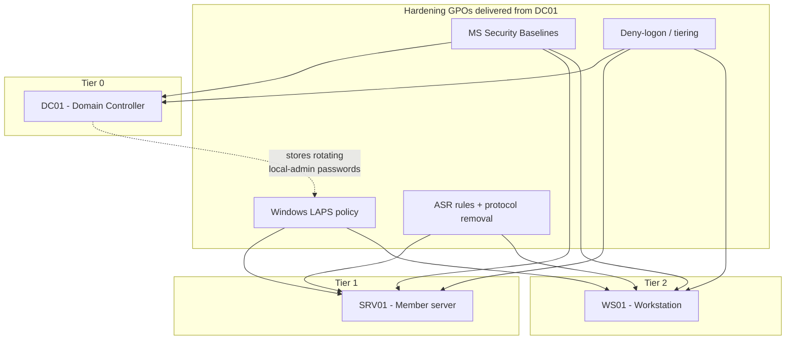

# Project 08 — Harden the Enterprise

This capstone takes the working domain you built in earlier projects and hardens it end to end: it applies vendor **security baselines**, deploys **Windows LAPS** to kill shared local-admin passwords, enforces a **tiered administration** model, and reduces the machine attack surface. It proves you can turn a *functional* estate into a *defensible* one and measure the difference.

## Overview

Projects 01–07 stood up a domain, published services, connected a branch, and wired monitoring — but they optimized for *working*, not for *surviving an attacker*. This project layers the four core hardening controls from the [Enterprise Security](../Enterprise-Security/Readme.md) module onto that estate:

- **Security baselines** — apply the Microsoft Security Compliance Toolkit GPO baselines to DCs, member servers, and workstations.
- **LAPS** — give every domain-joined machine a unique, rotating local Administrator password stored in AD.
- **Tiered administration** — partition admin accounts and assets into Tier 0/1/2 with deny-logon enforcement so a Tier 0 credential never lands on a workstation.
- **Attack surface reduction (ASR)** — enable ASR rules, controlled folder access, and remove legacy protocols (SMBv1, NTLMv1).

Skills proven: reading a threat model into concrete GPOs, delegating AD permissions safely, and verifying a control actually took effect rather than assuming a GPO link equals enforcement.

## Objective and Scope

**End goal:** every machine in the lab domain has a baseline GPO applied, a unique LAPS-managed local-admin password readable only by a tiered admin group, and ASR rules in block mode — verified with `Get-...`, `gpresult`, and a deliberately-failed cross-tier logon.

In scope: GPO-delivered hardening of `armour.local` (or your lab domain), LAPS on-prem AD backend, and the three-tier account model. Out of scope: the offensive validation of these controls — that is [Project-09-Attack-the-Lab](Project-09-Attack-the-Lab.md), and the full attack-then-remediate loop is [Project-10-Purple-Team-Capstone](Project-10-Purple-Team-Capstone.md).

## Prerequisites

- [Project-01-Single-DC-Domain](Project-01-Single-DC-Domain.md) — a healthy domain with DNS and a working OU structure.
- [Project-07-Monitoring-and-Detection-Pipeline](Project-07-Monitoring-and-Detection-Pipeline.md) — audit policy and event forwarding, so you can *see* the 4662/4740 events these controls generate.
- Module notes this project applies directly: [Security-Baselines](../Enterprise-Security/Security-Baselines.md), [LAPS](../Enterprise-Security/LAPS.md), [Tiered-Administration-Model](../Enterprise-Security/Tiered-Administration-Model.md), [Attack-Surface-Reduction](../Enterprise-Security/Attack-Surface-Reduction.md), and [Group Policy Objects](../Group-Policy-Objects-GPO/Readme.md) for delivery.
- **Lab VMs:** `DC01` (Domain Controller, Tier 0), `SRV01` (member server, Tier 1), `WS01` (workstation, Tier 2), and an admin console — all snapshotted before you begin. Build on [Lab Setup and Virtualization](../Lab-Setup-and-Virtualization/Readme.md).

> [!IMPORTANT]
> **Snapshot first, harden second**
> Baselines and deny-logon GPOs can lock you out if mis-scoped. Take a clean snapshot of every VM *before* the first GPO link, and keep one break-glass Domain Admin account excluded from the tier-restriction groups.

## Architecture



## Build Sequence

1. **Baseline the tiers.** Download the Microsoft Security Compliance Toolkit, import the baseline GPO backups for your OS versions, and link the matching baseline to each tier's OU. Import with LGPO or the AD GPO cmdlets.

   ```powershell
   # Import a baseline GPO backup into the domain, then link it to an OU
   Import-GPO -BackupGpoName "MSFT Windows Server - Domain Controller" `
       -TargetName "Baseline - Domain Controllers" -Path "C:\SCT\GPOs" -CreateIfNeeded   # untested
   New-GPLink -Name "Baseline - Domain Controllers" -Target "OU=Domain Controllers,DC=armour,DC=local"
   ```

2. **Deploy Windows LAPS.** Extend the schema once as a Schema Admin, grant each computer OU self-write, and configure rotation via the LAPS Administrative Templates. (Details in [LAPS](../Enterprise-Security/LAPS.md).)

   ```powershell
   Update-LapsADSchema
   Set-LapsADComputerSelfPermission -Identity "OU=Workstations,DC=armour,DC=local"
   Set-LapsADComputerSelfPermission -Identity "OU=Servers,DC=armour,DC=local"
   ```

   Configure length, complexity, and a short rotation interval under Group Policy:

   ```text
   Computer Configuration > Administrative Templates > System > LAPS
   ```

3. **Delegate LAPS read to a tiered group only.** Grant the extended read right on the password attribute to a small `Tier1-Admins` / `Tier2-Admins` group per OU — never a broad or nested group.

4. **Build the tier model.** Create `Tier0-Admins`, `Tier1-Admins`, `Tier2-Admins` groups and separate per-tier admin accounts (e.g. `jdoe`, `jdoe-t1`, `jdoe-t0`). Enforce logon isolation with deny-logon user rights in a GPO linked to each lower tier. (Rationale in [Tiered-Administration-Model](../Enterprise-Security/Tiered-Administration-Model.md).)

   ```text
   Computer Configuration > Policies > Windows Settings > Security Settings >
   Local Policies > User Rights Assignment > Deny log on locally / through RDP / from the network / as a batch job / as a service
   ```

5. **Reduce attack surface.** Enable Defender ASR rules in block mode, turn on controlled folder access, and remove legacy protocols. Do this by GPO for scale; the machine-local equivalents for verification are below.

   ```powershell
   # Remove SMBv1 (both the client and server should be gone)
   Disable-WindowsOptionalFeature -Online -FeatureName SMB1Protocol -NoRestart

   # Set an ASR rule to Block (example rule GUID from Microsoft's published list)
   Add-MpPreference -AttackSurfaceReductionRules_Ids <ASR-Rule-GUID> `
       -AttackSurfaceReductionRules_Actions Enabled   # untested
   ```

6. **Refuse LM/NTLMv1.** Set the LAN Manager authentication level to *Send NTLMv2 response only, refuse LM & NTLM* via GPO, after auditing NTLM usage first. (See [Kerberos-and-NTLM-Hardening](../Enterprise-Security/Kerberos-and-NTLM-Hardening.md) and [NTLM](../Active-Directory-Domain-Services-AD-DS/NTLM.md).)

7. **Force policy and snapshot.** Run `gpupdate /force` on each VM (or wait a refresh cycle), then take a "hardened" snapshot per host.

## Verification (Definition of Done)

Success is proven by output, not by a GPO link existing.

- **Domain health first.** `dcdiag /v` on `DC01` passes and `repadmin /replsummary` shows no failures — baselines did not break DC function.
- **Baseline applied.** `gpresult /r /scope:computer` on each host lists the correct baseline GPO under "Applied Group Policy Objects".
- **LAPS working.** An authorized tier admin can read a unique password per host and a *non*-authorized user cannot:

  ```powershell
  Get-LapsADPassword -Identity "WS01" -AsPlainText
  ```

  Confirm two different machines return two *different* passwords, and that reads generate **Event ID 4662** on `DC01` (with the attribute SACL set).
- **Tiering enforced.** Attempt to RDP as a `Tier0-Admins` account to `WS01` — it must be **denied**. `gpresult` on `WS01` shows the Tier 0 group under the "Deny log on through Remote Desktop Services" right.
- **ASR / protocols.** `Get-MpPreference | Select AttackSurfaceReductionRules_Ids,AttackSurfaceReductionRules_Actions` shows rules in block mode, and `Get-WindowsOptionalFeature -Online -FeatureName SMB1Protocol` reports `Disabled`.

## Security Considerations

> [!WARNING]
> **Hardening controls are themselves high-value targets**
> Every control here concentrates trust somewhere an attacker will look. **LAPS read ACLs** — if delegated to a broad or nested group, one compromised helpdesk account can dump the local-admin password of *every* machine over LDAP (NetExec `laps`, pyLAPS). **Tier 0 definition** — a backup server or a GPO that applies to DCs is *effectively* Tier 0 by the clean-source principle; miss it and tiering has a hole. **Break-glass accounts** excluded from deny-logon must have long, vaulted, rotated passwords or they become the soft path in. Treat delegation on the LAPS attribute and Tier 0 group membership with the same scrutiny as Domain Admins.

- Frame this project as building the controls that [Project-09-Attack-the-Lab](Project-09-Attack-the-Lab.md) will test — you verify a *reduction* in attack surface, then prove it offensively.
- Detection matters as much as prevention: alert on any Tier 0 account authenticating from a non-Tier 0 host, and on bulk/off-hours reads of the LAPS attribute (4662). Wire these into the pipeline from [Project-07-Monitoring-and-Detection-Pipeline](Project-07-Monitoring-and-Detection-Pipeline.md).
- Layer, don't substitute: baselines + LAPS + tiering + ASR each close a different rung of the credential-theft → lateral-movement → domain-dominance chain (MITRE T1003/T1550/T1078).

## Troubleshooting

| Symptom | Likely cause & fix |
| --- | --- |
| Baseline GPO breaks a service (e.g. RDP, legacy app) | Baseline disabled a protocol the app needs — identify via `gpresult`/event logs, override the single setting in a higher-precedence GPO rather than dropping the whole baseline |
| LAPS password never populates | Schema not extended or computer lacks self-write — re-run `Update-LapsADSchema` / `Set-LapsADComputerSelfPermission`, then `Invoke-LapsPolicyProcessing` |
| Deny-logon GPO locks out a legitimate admin | Account in the wrong tier group, or no break-glass exclusion — verify group membership with `gpresult`, keep one excluded emergency account |
| Cross-tier RDP still succeeds | Deny GPO not linked/applied to that OU — confirm the link and refresh with `gpupdate /force` |
| ASR rule blocks a needed app | Rule too aggressive for the workload — move that rule to Audit mode, review Defender events, then add a scoped exclusion |

## References

- [Microsoft — Security Compliance Toolkit (baselines)](https://learn.microsoft.com/windows/security/operating-system-security/device-management/windows-security-configuration-framework/security-compliance-toolkit-10)
- [Microsoft Learn — Windows LAPS overview](https://learn.microsoft.com/windows-server/identity/laps/laps-overview)
- [Microsoft Learn — Securing privileged access (tiering / Enterprise Access Model)](https://learn.microsoft.com/security/privileged-access-workstations/overview)
- [MITRE ATT&CK — Enterprise matrix](https://attack.mitre.org/matrices/enterprise/)

## Related

- [Security-Baselines](../Enterprise-Security/Security-Baselines.md) — baseline GPOs applied per tier
- [LAPS](../Enterprise-Security/LAPS.md) — unique rotating local-admin passwords
- [Tiered-Administration-Model](../Enterprise-Security/Tiered-Administration-Model.md) — Tier 0/1/2 isolation and deny-logon rules
- [Attack-Surface-Reduction](../Enterprise-Security/Attack-Surface-Reduction.md) — ASR rules and legacy-protocol removal
- [Kerberos-and-NTLM-Hardening](../Enterprise-Security/Kerberos-and-NTLM-Hardening.md) — refuse LM/NTLMv1
- [Enterprise Security](../Enterprise-Security/Readme.md) — the module these controls come from
- [Group Policy Objects](../Group-Policy-Objects-GPO/Readme.md) — how every control is delivered
- [Project-07-Monitoring-and-Detection-Pipeline](Project-07-Monitoring-and-Detection-Pipeline.md) — supplies the detection this hardening feeds
- [Project-09-Attack-the-Lab](Project-09-Attack-the-Lab.md) — validates these controls offensively
- [Project-10-Purple-Team-Capstone](Project-10-Purple-Team-Capstone.md) — attack, detect, remediate end to end
- [Enterprise Windows Infrastructure Security](../Readme.md) — course hub
