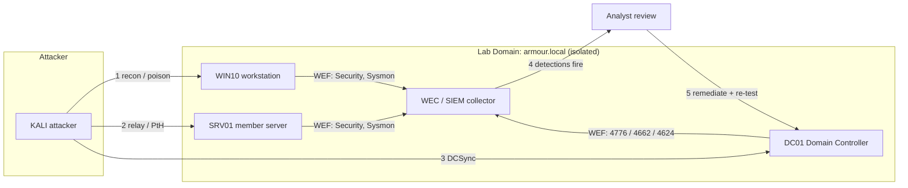

# Project 10 — Purple-Team Capstone

The final capstone that ties every module together: you run a controlled attack against the enterprise lab you built, **detect** it in your monitoring pipeline, then **remediate** the weaknesses and prove the same attack no longer succeeds. This is a full red-blue loop — attack, detect, remediate — executed end-to-end across the whole environment.

## Overview

This project proves you can operate on both sides of an engagement. You reuse the vulnerable-then-hardened lab from the earlier projects, execute a realistic multi-stage attack chain (recon → credential theft → lateral movement → domain dominance), watch it light up your detection stack, and close each gap with a concrete control. The deliverable is a short **attack-detect-remediate matrix** mapping each technique to a [MITRE ATT&CK](../Enterprise-Security/Readme.md)-style ID, the detection that fired, and the fix.

Skills proven:

- Chaining offensive techniques into a coherent kill chain against AD DS.
- Building detections that reliably fire on those techniques (event IDs, Sysmon, log forwarding).
- Applying and **verifying** hardening so the loop closes (the attack fails on re-test).

> [!NOTE]
> **Capstone, not a new build**
> You are not standing up new servers here. Projects 01–08 built the environment; Project 09 attacked it. Project 10 formalizes the whole cycle into a repeatable purple-team exercise with measurable before/after results.

## Objective and Scope

Deliver a documented purple-team loop in which **every** attack step is (a) executed, (b) detected in your logging pipeline, and (c) remediated, with a re-test showing the detection still fires or the technique is blocked. Concrete end goal: a filled-in matrix of at least six techniques spanning initial recon to domain compromise, each with proof of detection and proof of remediation.

- **In scope**: the isolated lab domain (`armour.local`), its DCs, member servers, and one attacker VM (Kali).
- **Out of scope**: any host, credential, or network outside the lab. Everything stays on the isolated segment.

## Prerequisites

- [Project-01-Single-DC-Domain](Project-01-Single-DC-Domain.md) through [Project-08-Harden-the-Enterprise](Project-08-Harden-the-Enterprise.md) — the built and partially hardened environment.
- [Project-07-Monitoring-and-Detection-Pipeline](Project-07-Monitoring-and-Detection-Pipeline.md) — the log-forwarding / SIEM pipeline that detections run in.
- [Project-09-Attack-the-Lab](Project-09-Attack-the-Lab.md) — the offensive playbook you will re-run under observation.
- Module knowledge: [Active-Directory-Domain-Services](../Active-Directory-Domain-Services-AD-DS/Active-Directory-Domain-Services.md), [NTLM](../Active-Directory-Domain-Services-AD-DS/NTLM.md), [Windows Monitoring and Logging](../Windows-Monitoring-and-Logging/Readme.md), [Enterprise Security](../Enterprise-Security/Readme.md), [Group Policy Objects (GPO)](../Group-Policy-Objects-GPO/Readme.md).
- **Lab VMs**: DC01 (Domain Controller), SRV01 (member/file or web server), WIN10 (domain workstation), a WEC/SIEM collector, and KALI (attacker). See [Lab Setup and Virtualization](../Lab-Setup-and-Virtualization/Readme.md).

> [!IMPORTANT]
> **Snapshot everything first**
> Take a clean VM snapshot of every lab host before you begin. The attack phase intentionally degrades security state; snapshots let you roll back and re-run the loop cleanly.

## Architecture



## Build Sequence

The loop runs in three phases. Repeat phases per technique so detection and remediation stay paired.

1. **Baseline the pipeline.** Confirm every lab host forwards Security and Sysmon logs to the collector before you attack — an undetected attack is a monitoring failure, not a success.

   ```powershell
   # On the collector, confirm forwarded events are arriving
   Get-WinEvent -LogName "ForwardedEvents" -MaxEvents 20   # untested
   ```

2. **Recon / credential harvesting (attack).** From KALI, run LLMNR/NBT-NS poisoning to capture an NTLMv2 response, and enumerate the domain.

   ```bash
   # Attacker VM — capture hashes via name-resolution poisoning
   responder -I eth0 -wv   # untested
   ```

3. **Detect the poisoning.** On DC01, NTLM credential validation logs as **Event ID 4776**; correlate with a spike of failed/odd logons in `ForwardedEvents`.

   ```powershell
   Get-WinEvent -FilterHashtable @{LogName='Security'; Id=4776} -MaxEvents 25   # untested
   ```

4. **Lateral movement (attack).** Use a captured/relayed credential or NT hash to move to SRV01 (relay or pass-the-hash). See [NTLM](../Active-Directory-Domain-Services-AD-DS/NTLM.md) for why this works when SMB signing is off.

   ```bash
   # Study-level: relay NTLM auth to an SMB target (lab only)
   ntlmrelayx.py -tf targets.txt -smb2support   # untested
   ```

5. **Detect lateral movement.** Look for **4624** logon type 3 with NTLM, remote service creation (**7045**), and Sysmon process-creation (**Event ID 1**) anomalies on SRV01.

6. **Domain dominance (attack).** Demonstrate DCSync-style replication abuse from a privileged context to pull hashes (study/detection level).

7. **Detect DCSync.** Directory-service access replication requests log as **Event ID 4662** with the DS-Replication-Get-Changes GUID on DC01 — a high-fidelity DCSync signal.

   ```powershell
   Get-WinEvent -FilterHashtable @{LogName='Security'; Id=4662} -MaxEvents 25   # untested
   ```

8. **Remediate each technique.** Apply the paired control, then roll forward:
   - Poisoning → disable LLMNR/NBT-NS via GPO ([GPO](../Group-Policy-Objects-GPO/Readme.md)).
   - Relay/PtH → enforce **SMB signing** and **LDAP signing + channel binding**; add sensitive accounts to **Protected Users**.
   - DCSync → audit/limit replication rights on the domain object; alert on 4662 replication GUIDs.

9. **Re-test.** Re-run each attack step from the snapshot-restored KALI. Record whether the technique now fails or is still detected, and fill in the matrix.

## Verification (Definition of Done)

- **Pipeline healthy**: `dcdiag /v` on DC01 is clean and `repadmin /replsummary` shows no replication failures, confirming the domain (and its logging) is in a known-good state before and after the exercise.
- **Every technique detected**: for each of the six-plus techniques you can point to a specific forwarded event (4776 for NTLM validation, 4624 for the lateral logon, 4662 for DCSync) in `ForwardedEvents` on the collector.
- **Remediation proven**: after applying controls, `Get-SmbServerConfiguration | Select EnableSecuritySignature, RequireSecuritySignature` reports signing required, and the LLMNR-disabling GPO shows applied via `gpresult /r`.
- **Matrix complete**: the attack-detect-remediate table has every row filled with technique, detection source, control, and re-test outcome.

> [!TIP]
> **"Detected" means it fired, not that it could**
> Definition of Done requires the detection to actually appear in the collector during the exercise — not merely that the log source exists. Trigger it, screenshot it, then remediate.

## Security Considerations

> [!WARNING]
> **Keep the whole loop in the isolated lab**
> - This project runs **real** credential-theft and lateral-movement tooling (Responder, ntlmrelayx, DCSync). Run it **only** against the disposable lab domain on an isolated network segment — never against production, a corporate network, or any host you were not explicitly authorized to test.
> - The attack phase deliberately weakens security (disabled signing, captured hashes). **Restore snapshots** after the exercise so a degraded lab is not mistaken for a hardened one.
> - Captured hashes and relay artifacts are real secrets *for that lab*. Wipe them; do not reuse lab passwords anywhere real.
> - Treat the attacker VM as untrusted: keep it off any bridged/production adapter for the duration.

Framed defensively, the whole point is the **remediation half**: enforce SMB/LDAP signing and channel binding to break relay, disable LLMNR/NBT-NS to stop poisoning, use **Protected Users** and tiered admin to blunt PtH, and monitor 4662 replication rights to catch DCSync. See [Enterprise Security](../Enterprise-Security/Readme.md) and [Project-08-Harden-the-Enterprise](Project-08-Harden-the-Enterprise.md).

## Troubleshooting

| Symptom | Likely cause & fix |
|---------|--------------------|
| No events on the collector | Subscription/WinRM not configured or GPO not applied; re-check the [forwarding pipeline](../Windows-Monitoring-and-Logging/Readme.md) and run `gpupdate /force`. |
| Attack works but nothing detected | Audit policy too coarse or Sysmon not deployed; enable the relevant advanced audit subcategories and confirm Sysmon service is running. |
| Responder captures nothing | LLMNR/NBT-NS already disabled, or attacker on wrong VLAN/adapter; verify the lab segment and interface. |
| DCSync succeeds after remediation | Replication rights still delegated to a non-DC principal; review ACLs on the domain object. |
| `repadmin` shows replication errors | DNS or time skew; fix DC DNS pointing and resync time before re-testing. |

## References

- MITRE ATT&CK — Enterprise Matrix (technique IDs for the matrix): https://attack.mitre.org/matrices/enterprise/
- Microsoft Learn — Advanced security audit policy settings: https://learn.microsoft.com/windows/security/threat-protection/auditing/advanced-security-audit-policy-settings
- Microsoft Learn — Overview of Server Message Block signing: https://learn.microsoft.com/windows-server/storage/file-server/smb-signing
- Microsoft Learn — NTLM overview: https://learn.microsoft.com/windows-server/security/windows-authentication/ntlm-overview

## Related

- [Project-07-Monitoring-and-Detection-Pipeline](Project-07-Monitoring-and-Detection-Pipeline.md) — the detection stack this project exercises
- [Project-08-Harden-the-Enterprise](Project-08-Harden-the-Enterprise.md) — the controls applied in the remediate phase
- [Project-09-Attack-the-Lab](Project-09-Attack-the-Lab.md) — the offensive playbook re-run under observation
- [Project-01-Single-DC-Domain](Project-01-Single-DC-Domain.md) — the domain foundation this all runs on
- [Active-Directory-Domain-Services](../Active-Directory-Domain-Services-AD-DS/Active-Directory-Domain-Services.md) — the directory service under test
- [NTLM](../Active-Directory-Domain-Services-AD-DS/NTLM.md) — the protocol behind the poisoning/relay/PtH chain
- [Windows Monitoring and Logging](../Windows-Monitoring-and-Logging/Readme.md) — detection sources and event IDs
- [Enterprise Security](../Enterprise-Security/Readme.md) — hardening and defensive controls
- [Group Policy Objects (GPO)](../Group-Policy-Objects-GPO/Readme.md) — how remediations are deployed
- [Enterprise Windows Infrastructure Security](../Readme.md) — course hub
