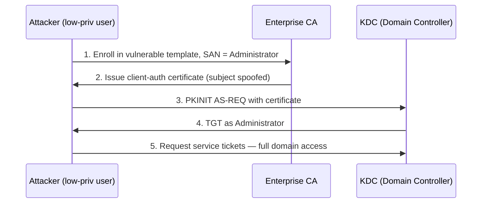

# AD CS Security

Active Directory Certificate Services (AD CS) is Microsoft's on-premises Public Key Infrastructure (PKI). It issues and manages the certificates that underpin smart-card logon, LDAPS, code signing, and machine authentication. Because a certificate can be an alternate proof of identity, a misconfigured AD CS deployment is one of the most reliable domain-privilege-escalation paths in modern Active Directory.

## Overview

AD CS binds a public key to an identity by issuing X.509 certificates from a **Certification Authority (CA)**. Clients enroll against **certificate templates** — reusable policy objects that define who may enroll, what the certificate can be used for (its **EKUs**), and how the subject is derived. When a template allows a low-privileged user to obtain a certificate that authenticates *as someone else*, the attacker gains that identity's Kerberos access without ever touching a password.

The offensive research community (SpecterOps' *Certified Pre-Owned*) catalogued these flaws as **ESC (Escalation) classes**, ESC1 through ESC13+, each a distinct misconfiguration. Tooling such as **Certify**, **Certipy**, and **PSPKIAudit** enumerates and exploits them. This note is a defender's map of those classes: what each one is, how it is detected, and how it is remediated. See [Active-Directory-Domain-Services](../Active-Directory-Domain-Services-AD-DS/Active-Directory-Domain-Services.md) for the directory it plugs into and [Kerberos-Authentication](../Active-Directory-Domain-Services-AD-DS/Kerberos-Authentication.md) for how the resulting certificate is redeemed for a TGT.

> [!IMPORTANT]
> **A certificate is a credential**
> A client-authentication certificate is a long-lived, offline-usable credential. Unlike a password it survives a reset, cannot be trivially rotated, and (pre-2022 hardening) maps to an account by an attacker-supplied name. Treat certificate issuance with the same suspicion as handing out a password.

## Core Components

- **Enterprise CA** — a CA integrated with AD DS; publishes templates and issues certificates to domain principals.
- **Certificate template** — an AD object (`CN=…,CN=Certificate Templates,CN=Public Key Services,CN=Services,CN=Configuration,…`) defining enrollment rights, EKUs, and subject-name rules.
- **EKU (Extended Key Usage)** — declares what a certificate may do. **Client Authentication** (`1.3.6.1.5.5.7.3.2`), **Smart Card Logon** (`1.3.6.1.4.1.311.20.2.2`), and **Any Purpose** (`2.5.29.37.0`) all permit authentication and are the interesting ones offensively.
- **SAN (Subject Alternative Name)** — the identity a certificate asserts. If an enrollee can specify the SAN freely, they can assert *any* identity.
- **Enrollment rights** — the ACL controlling who can request a certificate from a template.

## ESC Misconfiguration Classes

| Class | Misconfiguration | Impact |
| --- | --- | --- |
| **ESC1** | Template allows enrollee-supplied SAN + client-auth EKU, low-priv enrollment | Enroll as any user (e.g. Domain Admin) |
| **ESC2** | Template has Any Purpose or no EKU | Certificate usable for authentication |
| **ESC3** | Enrollment Agent template abuse | Request certs on behalf of others |
| **ESC4** | Weak ACL on the template object (write access) | Reconfigure a template into ESC1 |
| **ESC6** | `EDITF_ATTRIBUTESUBJECTALTNAME2` set on the CA | Any template becomes SAN-spoofable |
| **ESC7** | Weak ACL on the CA (`ManageCA`/`ManageCertificates`) | Approve requests, enable flags |
| **ESC8** | NTLM relay to the web-enrollment (HTTP) endpoint | Relay a DC/machine into a cert |
| **ESC9/ESC10** | No SID security extension / weak cert mappings | Bypass strong binding, impersonate |

> [!WARNING]
> **ESC1 is the classic**
> The single most common finding: a template with **"Supply in the request"** for the subject name, a **Client Authentication** EKU, and **Domain Users** granted enroll. Any user requests a certificate with `Administrator` as the SAN and then authenticates to Kerberos as that administrator.

## ESC1 Attack Chain



## Enumeration and Detection

Enumeration is the same for attacker and defender — audit your own PKI the way an adversary would.

```powershell
# Enumerate CAs and vulnerable templates (Certipy, from an attacker/audit host)
certipy find -u user@corp.local -p 'Password' -dc-ip 10.0.0.10 -vulnerable   # untested

# Native: check the CA's EditFlags for the dangerous ESC6 SAN flag
certutil -config "CA-HOST\corp-CA" -getreg policy\EditFlags               # untested
```

If `EDITF_ATTRIBUTESUBJECTALTNAME2` appears in the EditFlags output, the CA is ESC6-vulnerable and every issued certificate can carry an attacker-chosen SAN.

CA request auditing must be enabled (it is off by default) to get issuance telemetry:

```text
CA properties > Auditing tab  →  enable "Issue and manage certificate requests"
(or set the CA AuditFilter). Requires the "Audit Certification Services"
subcategory enabled in audit policy.
```

Key CA security-log events once auditing is on:

| Event ID | Meaning |
| --- | --- |
| 4886 | Certificate Services received a certificate request |
| 4887 | Certificate Services approved a request and issued a certificate |
| 4888 | Certificate Services denied a certificate request |
| 4899 | A certificate template was updated |
| 4900 | Certificate Services template security was updated |

> [!TIP]
> **Hunt for spoofed subjects**
> A certificate issued (4887) where the SAN/subject does not match the requesting account is the strongest ESC1/ESC6 signal. Correlate the request (4886/4887) with a subsequent PKINIT authentication (Event ID **4768**, a TGT request that used a certificate) for the impersonated account.

## Security Considerations

> [!WARNING]
> **Why AD CS abuse is high-severity**
> - **Domain escalation from any user** — ESC1/ESC6 turn an unprivileged foothold into Domain Admin with a single certificate request; MITRE ATT&CK tracks this as **T1649 (Steal or Forge Authentication Certificates)**.
> - **Stealthy persistence** — a stolen or forged CA/user certificate is valid until it expires (often years) and survives password resets. Theft of the **CA private key** (**"golden certificate"**) lets an attacker forge certificates for anyone, indefinitely.
> - **NTLM relay (ESC8)** — the AD CS web-enrollment (`/certsrv`) endpoint historically accepted relayed NTLM; an attacker can coerce a Domain Controller (e.g. PetitPotam) and relay it into a DC certificate, then act as the DC.
> - **Certifried (CVE-2022-26923)** — before the May 2022 patches, a low-priv user could abuse machine-account certificate mapping to impersonate a DC.

The controls that blunt these: enforce **strong certificate binding** (the SID security extension `szOID_NTDS_CA_SECURITY_EXT`, OID `1.3.6.1.4.1.311.25.2`, introduced by the May 2022 updates / KB5014754), tighten template and CA ACLs, remove enrollee-supplied SANs, and disable NTLM on enrollment endpoints (see [NTLM](../Active-Directory-Domain-Services-AD-DS/NTLM.md) and [Kerberos-and-NTLM-Hardening](Kerberos-and-NTLM-Hardening.md)).

## Best Practices

- **Remove enrollee-supplied SAN** — no client-authentication template should have "Supply in the request"; use **Build from this Active Directory information** instead. This closes ESC1.
- **Clear `EDITF_ATTRIBUTESUBJECTALTNAME2`** on the CA (closes ESC6) and require **CA certificate-manager approval** for sensitive templates.
- **Lock down ACLs** — audit write/enroll rights on templates and `ManageCA`/`ManageCertificates` on the CA; restrict them to Tier 0 (see [Tiered-Administration-Model](Tiered-Administration-Model.md)).
- **Enforce strong certificate binding** (KB5014754) and disable NTLM / require EPA on the web-enrollment endpoint to kill ESC8.
- **Enable CA request auditing** and forward CA security events to your SIEM; treat the CA as a Tier 0 asset and protect its private key.

## Troubleshooting

| Symptom | Likely cause & fix |
| --- | --- |
| No 4886/4887 events appear | CA request auditing not enabled — turn on auditing on the CA and enable the Certification Services audit subcategory |
| Legit smart-card logon breaks after May 2022 patches | Strong binding rejecting a certificate with no SID extension — reissue certificates so they carry `szOID_NTDS_CA_SECURITY_EXT`, do not weaken `StrongCertificateBindingEnforcement` back to Compatibility |
| `certipy find` reports a template ESC1-vulnerable that is intended | Confirm enrollment ACL really is restricted; "vulnerable" flags the config, verify the *who-can-enroll* before dismissing |

## References

- Microsoft Learn — Active Directory Certificate Services overview: https://learn.microsoft.com/windows-server/identity/ad-cs/active-directory-certificate-services-overview
- Microsoft Support — KB5014754: Certificate-based authentication changes (strong mapping): https://support.microsoft.com/topic/kb5014754-certificate-based-authentication-changes-on-windows-domain-controllers-ad2c23b0-15d8-4340-a468-4d4f3b188f16
- MITRE ATT&CK — T1649 Steal or Forge Authentication Certificates: https://attack.mitre.org/techniques/T1649/
- SpecterOps — Certified Pre-Owned (AD CS abuse whitepaper): https://posts.specterops.io/certified-pre-owned-d95910965cd2

## Related

- [Kerberos-and-NTLM-Hardening](Kerberos-and-NTLM-Hardening.md) — sibling control (PKINIT and relay hardening)
- [Tiered-Administration-Model](Tiered-Administration-Model.md) — sibling control (the CA belongs to Tier 0)
- [Credential-Theft-Defenses](Credential-Theft-Defenses.md) — sibling control (certificates are stealable credentials)
- [Credential-Guard-and-Protected-Users](Credential-Guard-and-Protected-Users.md) — sibling control (protecting the identities certificates assert)
- [Security-Baselines](Security-Baselines.md) — sibling control (baseline PKI configuration)
- [Attack-Surface-Reduction](Attack-Surface-Reduction.md) — sibling control (limiting enrollment reach)
- [LAPS](LAPS.md) — sibling control (local-admin credential hygiene)
- [NTLM](../Active-Directory-Domain-Services-AD-DS/NTLM.md) — related note (the relay primitive behind ESC8)
- [Kerberos-Authentication](../Active-Directory-Domain-Services-AD-DS/Kerberos-Authentication.md) — related note (PKINIT redeems certificates for TGTs)
- [Active-Directory-Domain-Services](../Active-Directory-Domain-Services-AD-DS/Active-Directory-Domain-Services.md) — related note (the directory AD CS integrates with)
- [Enterprise Windows Infrastructure Security](../Readme.md) — course hub
