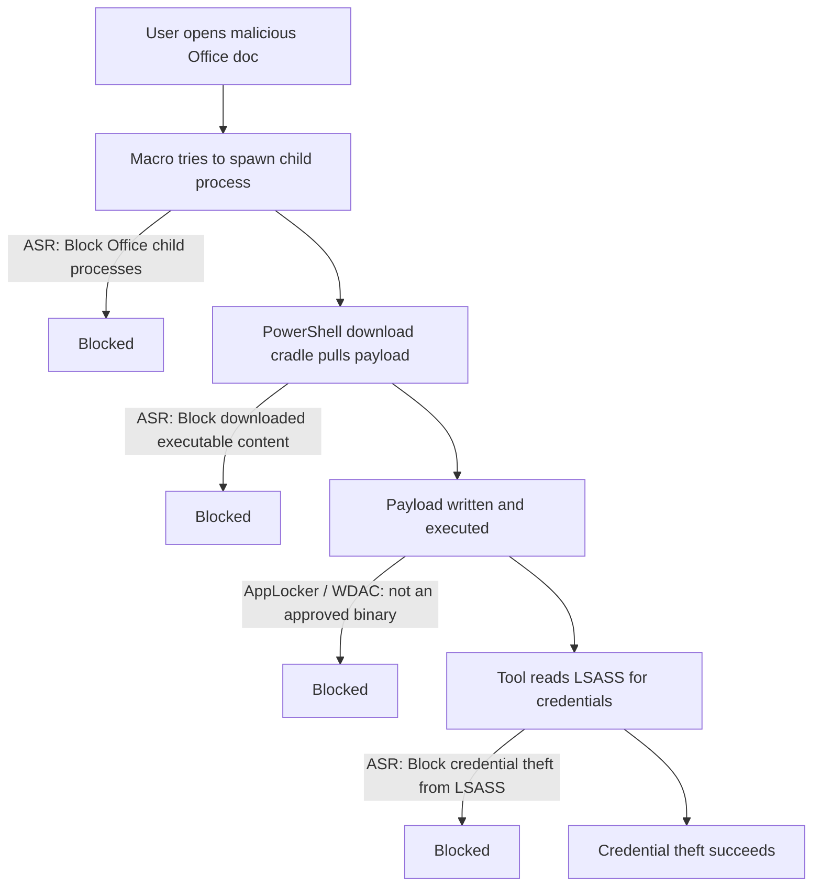

# Attack Surface Reduction

Attack Surface Reduction (ASR) is the practice of removing or constraining the code paths, features, and behaviours an attacker can abuse on a Windows host. In the Microsoft ecosystem it spans a specific Microsoft Defender feature (**ASR rules**) plus the application-control stack (**AppLocker** and **WDAC / App Control for Business**). Together they turn a permissive "run anything" endpoint into one where only trusted code runs and common malware behaviours are blocked outright.

## Overview

Most intrusions do not begin with a memory-corruption exploit; they begin with a user running attacker-supplied code — a macro that spawns PowerShell, a script that pulls a payload from the internet, a signed-but-vulnerable driver loaded to kill the [EDR](../Windows-Operating-System-Administration/Windows-Event-Logs.md). Attack surface reduction attacks that class of technique directly: instead of detecting the payload, it forbids the *behaviour* (Office spawning a child process, a script launching a downloaded executable, a process reading [LSASS](Credential-Guard-and-Protected-Users.md) memory).

It layers with the rest of the [Enterprise Windows Infrastructure Security](../Readme.md) hardening story: [Security-Baselines](Security-Baselines.md) set the safe defaults, the [Tiered-Administration-Model](Tiered-Administration-Model.md) limits where privileged code runs, and ASR/application control constrain *what* code runs at all. It is delivered through [Group Policy](../Group-Policy-Objects-GPO/Group-Policy(GPO).md) or Intune and pairs with monitoring so that every block is also a detection.

> [!NOTE]
> **Three distinct mechanisms, one goal**
> **ASR rules** (behaviour blocking, part of Defender Antivirus), **AppLocker** (legacy allow/deny by publisher/path/hash), and **WDAC / App Control for Business** (kernel-enforced code integrity) are separate technologies. They overlap and are best deployed together — ASR blunts common tradecraft, application control enforces "only approved code runs."

## Microsoft Defender ASR Rules

ASR rules are a Microsoft Defender Antivirus feature. Each rule targets one malicious behaviour and is identified by a GUID. Rules run in one of four states.

| Action | Value | Behaviour |
| --- | --- | --- |
| Not configured / Disabled | `Disabled` | Rule off |
| Block | `Enabled` | Behaviour is blocked and logged |
| Audit | `AuditMode` | Behaviour is allowed but logged (would-have-blocked) |
| Warn | `Warn` | User is prompted; can bypass (not all rules support it) |

A representative subset of the rules an attacker cares about:

| Rule | GUID |
| --- | --- |
| Block credential stealing from LSASS | `9e6c4e1f-7d60-472f-ba1a-a39ef669e4b2` |
| Block all Office applications from creating child processes | `d4f940ab-401b-4efc-aadc-ad5f3c50688a` |
| Block executable content from email client and webmail | `be9ba2d9-53ea-4cdc-84e5-9b1eeee46550` |
| Block JavaScript/VBScript from launching downloaded executable content | `d3e037e1-3eb8-44c8-a917-57927947596d` |
| Block process creations originating from PSExec and WMI commands | `d1e49aac-8f56-4280-b9ba-993a6d77406c` |
| Block untrusted and unsigned processes that run from USB | `b2b3f03d-6a65-4f7b-a9c7-1c7ef74a9ba4` |
| Block Win32 API calls from Office macros | `92e97fa1-2edf-4476-bdd6-9dd0b4dddc7b` |
| Block abuse of exploited vulnerable signed drivers | `56a863a9-875e-4185-98a7-b882c64b5ce5` |

Configure a rule with PowerShell (`Add-MpPreference` merges rather than overwriting):

```powershell
# Put the LSASS-theft rule into Block mode
Add-MpPreference -AttackSurfaceReductionRules_Ids 9e6c4e1f-7d60-472f-ba1a-a39ef669e4b2 `
                 -AttackSurfaceReductionRules_Actions Enabled

# Review the current state of all configured rules
Get-MpPreference | Select-Object -ExpandProperty AttackSurfaceReductionRules_Ids
```

> [!TIP]
> **Audit before you block**
> Deploy each rule in `AuditMode` first and review the generated events. Some rules are noisy against legitimate line-of-business software (the LSASS rule in particular), and a global switch to `Enabled` can break benign automation. Move to `Enabled` per rule once the audit data is clean.

## Application Control: AppLocker

AppLocker is the older allow-listing engine. It uses rule collections (**Executable**, **Windows Installer**, **Script**, **Packaged apps**, and optionally **DLL**) and rules based on **publisher** (code-signing certificate), **path**, or **file hash**. Each collection runs in **Enforce** or **Audit only** mode. It is configured through [GPO](../Group-Policy-Objects-GPO/Group-Policy(GPO).md) and enforced by the Application Identity (`AppIDSvc`) service.

```powershell
# Export the effective policy and test whether a binary would be allowed
Get-AppLockerPolicy -Effective -Xml > C:\Temp\applocker.xml
Get-ChildItem C:\Users\Public\payload.exe | Convert-Path |
    Test-AppLockerPolicy -XmlPolicy C:\Temp\applocker.xml -User Everyone
```

AppLocker's classic weakness is that it is a user-mode control and does not, by itself, cover every interpreter — attackers reach for LOLBins and script hosts (`mshta`, `regsvr32`, `msbuild`, unconstrained-mode PowerShell) to run code that the executable rules never see. Path rules over user-writable directories are also bypassable. Treat AppLocker as a strong speed bump, not a boundary.

## Application Control: WDAC / App Control for Business

Windows Defender Application Control (WDAC), now branded **App Control for Business**, enforces a code-integrity policy in the kernel. It is far harder to bypass than AppLocker: policies are tamper-resistant, can enforce both **user-mode** and **kernel-mode** (driver) code, and integrate with the Microsoft vulnerable-driver block list. Policies are authored in XML with the `ConfigCI` module, compiled to a binary policy, and deployed.

```powershell
# Scaffold a policy from a known-good reference system, then compile it
New-CIPolicy -FilePath C:\Temp\policy.xml -Level Publisher -UserPEs -ScanPath 'C:\Program Files'
ConvertFrom-CIPolicy -XmlFilePath C:\Temp\policy.xml -BinaryFilePath C:\Temp\policy.cip   # untested
```

> [!IMPORTANT]
> **AppLocker vs WDAC**
> AppLocker is easier to deploy and scope per-user/group but is user-mode and more bypassable. WDAC is machine-wide, kernel-enforced, and covers drivers, but demands disciplined authoring (audit mode, managed installers, supplemental policies) to avoid locking a fleet out of its own software. For a serious application-control boundary, WDAC is the target state; AppLocker complements it for per-user rules WDAC cannot express.

## How ASR Breaks an Attack Chain

The controls stack against a classic phishing-to-execution "download cradle": a macro launches a shell, which pulls and runs a payload. Multiple ASR rules and application control each sever a different link.



Each block is also a log event, so a well-configured host both stops the technique and generates a detection for the [monitoring stack](../Windows-Monitoring-and-Logging/Readme.md).

## Security Considerations

> [!WARNING]
> **Reduction is not elimination — attackers hunt the gaps**
> - **LOLBins and interpreters** — application control that lists `.exe` files but leaves `mshta.exe`, `regsvr32.exe`, `msbuild.exe`, or unconstrained PowerShell available is routinely bypassed. Enforce PowerShell **Constrained Language Mode** and block/scope the known LOLBins.
> - **Audit mode is not protection** — a rule left in `AuditMode` logs the behaviour but allows it. Confirm rules are actually in `Enabled`/`Enforce`, not just deployed.
> - **Per-rule exclusions widen the surface** — every ASR exclusion path and AppLocker path rule over a user-writable directory is a bypass primitive. Keep exclusions minimal and specific.
> - **The LSASS ASR rule is complementary, not a replacement** — it hardens against Mimikatz-style [LSASS scraping](Credential-Theft-Defenses.md) but is superseded by [LSA protection and Credential Guard](Credential-Guard-and-Protected-Users.md); deploy those as the primary control.
> - **Vulnerable signed drivers** — "bring your own vulnerable driver" (BYOVD) loads a legitimately signed but buggy driver to disable security tooling. The ASR signed-driver rule plus the WDAC vulnerable-driver block list close this. Maps to MITRE ATT&CK **T1562.001 (Impair Defenses)**.

## Best Practices

- Deploy ASR rules in **audit mode first**, review the events, then enforce per rule — never flip everything to block blindly.
- Layer the stack: ASR rules for behaviour, WDAC as the kernel-enforced application-control boundary, AppLocker for per-user rules WDAC cannot express.
- Enforce **PowerShell Constrained Language Mode** and remove/scope common LOLBins so application control cannot be trivially bypassed.
- Prefer **publisher** rules over **path** rules; path rules over user-writable locations are attacker-controllable.
- Pair every enforced control with logging so blocks feed detection — hardening without monitoring is blind.

## Troubleshooting

| Symptom | Likely cause & fix |
| --- | --- |
| Legitimate app blocked after enabling ASR | Rule too broad for this environment — return it to `AuditMode`, add a narrow per-rule exclusion, then re-enforce |
| ASR rule "deployed" but not blocking | Rule is in `AuditMode`, or Defender Antivirus is in passive mode / disabled — verify with `Get-MpPreference` |
| AppLocker rules not applied | Application Identity service (`AppIDSvc`) not running, or GPO not scoped to the OU |
| WDAC policy locks users out of their software | Authored in enforce mode without an audit pass — rebuild from a clean reference image in audit mode, add managed installer / supplemental policy |

Relevant logs for verification:

```text
ASR blocks/audits:  Microsoft-Windows-Windows Defender/Operational  (Event ID 1121 block, 1122 audit)
AppLocker:          Microsoft-Windows-AppLocker/*                    (8004 blocked, 8003 would-be-blocked)
WDAC:               Microsoft-Windows-CodeIntegrity/Operational      (3077 enforced block, 3076 audit block)
```

## References

- [Microsoft Learn — Attack surface reduction rules reference](https://learn.microsoft.com/en-us/defender-endpoint/attack-surface-reduction-rules-reference)
- [Microsoft Learn — Attack surface reduction rules overview](https://learn.microsoft.com/en-us/defender-endpoint/attack-surface-reduction-rules)
- [Microsoft Learn — Application Control for Windows (WDAC)](https://learn.microsoft.com/en-us/windows/security/application-security/application-control/app-control-for-business/appcontrol)
- [MITRE ATT&CK — M1038 Execution Prevention](https://attack.mitre.org/mitigations/M1038/)

## Related

- [Security-Baselines](Security-Baselines.md) — the safe defaults ASR builds on
- [Tiered-Administration-Model](Tiered-Administration-Model.md) — limits where privileged code runs
- [LAPS](LAPS.md) — local-admin password isolation
- [Credential-Guard-and-Protected-Users](Credential-Guard-and-Protected-Users.md) — the primary LSASS/credential control ASR complements
- [Credential-Theft-Defenses](Credential-Theft-Defenses.md) — mitigating Mimikatz / pass-the-hash
- [AD-CS-Security](AD-CS-Security.md) — PKI hardening, related enterprise control
- [Kerberos-and-NTLM-Hardening](Kerberos-and-NTLM-Hardening.md) — authentication-layer hardening
- [NTLM](../Active-Directory-Domain-Services-AD-DS/NTLM.md) — legacy protocol frequently targeted post-execution
- [Group-Policy(GPO)](../Group-Policy-Objects-GPO/Group-Policy(GPO).md) — primary deployment channel for ASR/AppLocker
- [Windows-Event-Logs](../Windows-Operating-System-Administration/Windows-Event-Logs.md) — where ASR/AppLocker/WDAC blocks are recorded
- [Enterprise Windows Infrastructure Security](../Readme.md) — course hub
