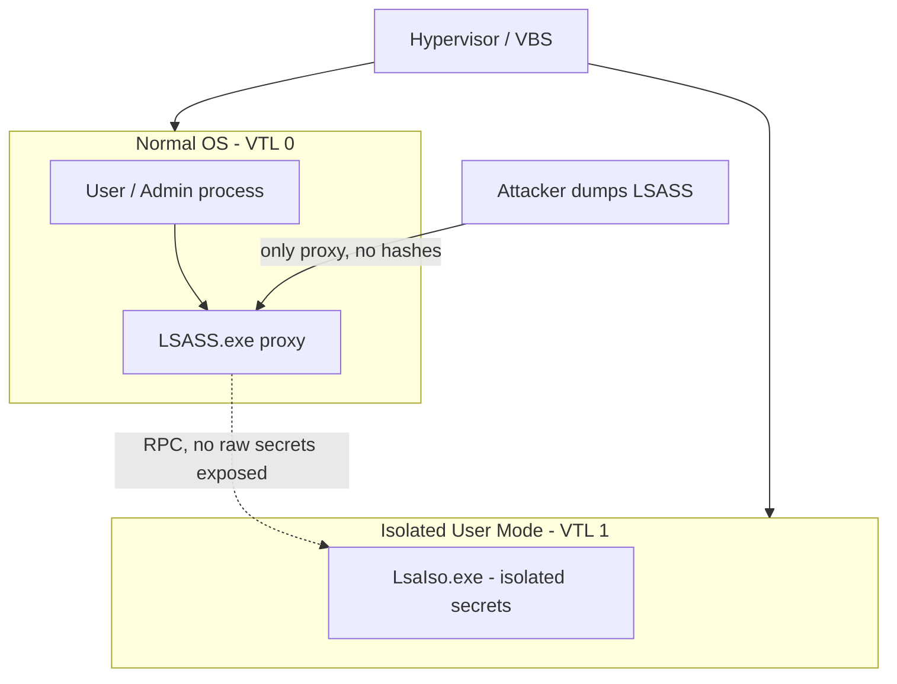

# Credential Guard and Protected Users

Credential Guard and the Protected Users group are two complementary Windows credential-protection controls: Credential Guard isolates secrets in memory on the endpoint using virtualization, while the Protected Users group hardens how privileged domain accounts authenticate. Together they break the credential-theft and reuse chains that underpin most Windows lateral movement.

## Overview

Most Windows compromises escalate by stealing derived credentials — NTLM hashes, Kerberos tickets, and cached verifiers — from the memory of the LSASS process, then replaying them with Pass-the-Hash or Pass-the-Ticket techniques. These two controls attack that problem from different angles:

- **Credential Guard** uses **Virtualization-Based Security (VBS)** to move the Local Security Authority's secrets into an isolated process the normal OS (and therefore an attacker with admin rights) cannot read.
- **Protected Users** is an [Active Directory](../Active-Directory-Domain-Services-AD-DS/Active-Directory-Domain-Services.md) security group that forces its members onto stronger authentication paths and strips away the weaker, cacheable credential material an attacker would otherwise harvest.

Neither is a silver bullet; they are layered with [LAPS](LAPS.md), the [Tiered-Administration-Model](Tiered-Administration-Model.md), and [Kerberos-and-NTLM-Hardening](Kerberos-and-NTLM-Hardening.md) as part of a defense-in-depth posture.

## Credential Guard

### How it works

Windows normally stores derived secrets (NTLM hashes, Kerberos TGTs and keys, cached domain credentials) inside the **LSASS** process. Any process running as SYSTEM — including tooling such as Mimikatz after privilege escalation — can read that memory and extract the secrets.

Credential Guard uses the hypervisor to create an **isolated user mode (Virtual Trust Level 1)** that the normal OS kernel (VTL 0) cannot access. The secrets are moved into an isolated LSA process (**`LsaIso.exe`**) running in VTL 1. The normal `LSASS.exe` keeps a proxy but no longer holds the raw secrets, so dumping LSASS yields no usable NTLM hashes or Kerberos keys.



### Requirements

Credential Guard depends on the VBS platform being available and enabled:

| Requirement | Detail |
|-------------|--------|
| CPU | 64-bit, virtualization extensions (Intel VT-x / AMD-V) with SLAT |
| Firmware | UEFI with **Secure Boot** enabled |
| TPM | TPM 2.0 recommended (protects VBS keys); optional but advised |
| OS | Windows 10/11 Enterprise & Education, Windows Server 2016+ |
| Feature | Hyper-V / VBS platform components enabled |

> [!NOTE]
> **Enabled by default on modern Windows**
> On Windows 11 (22H2 and later) enterprise editions and on newer Windows Server builds, Credential Guard is enabled **by default** on hardware that meets the requirements. On older builds it must be turned on explicitly.

### Enabling

Credential Guard is enabled through Group Policy under Device Guard:

```text
Computer Configuration > Administrative Templates > System > Device Guard >
Turn On Virtualization Based Security
  - Select Platform Security Level (Secure Boot, or Secure Boot and DMA Protection)
  - Credential Guard Configuration: Enabled with UEFI lock
```

The equivalent registry values live under the Device Guard and LSA keys:

```text
HKLM\SYSTEM\CurrentControlSet\Control\DeviceGuard\EnableVirtualizationBasedSecurity = 1
HKLM\SYSTEM\CurrentControlSet\Control\LSA\LsaCfgFlags = 1   # 1 = enabled with UEFI lock
```

### Verifying

Query the Device Guard WMI class to confirm Credential Guard is actually running (not just configured):

```powershell
Get-CimInstance -ClassName Win32_DeviceGuard -Namespace root\Microsoft\Windows\DeviceGuard |
    Select-Object SecurityServicesConfigured, SecurityServicesRunning
```

A value of **1** in `SecurityServicesRunning` indicates Credential Guard is running. `msinfo32.exe` (System Information) reports the same under **Virtualization-based security Services Running: Credential Guard**.

## Protected Users Group

The **Protected Users** global security group (well-known RID **525**) ships with Active Directory from Windows Server 2012 R2 onward. Adding a privileged account to it applies non-configurable, hardened authentication rules on both the client and the Domain Controller.

Members are subject to the following restrictions:

| Protection | Effect |
|------------|--------|
| No NTLM | The account cannot authenticate with [NTLM](../Active-Directory-Domain-Services-AD-DS/NTLM.md) — Kerberos only |
| No weak Kerberos ciphers | DES and RC4 are refused; **AES** is required for Kerberos pre-authentication |
| No delegation | Account cannot be delegated via constrained or unconstrained delegation |
| No long-term keys / caching | No cached (offline) logon; no NTLM/Kerberos verifier is cached on the device |
| Short TGT lifetime | The Kerberos TGT is limited to its initial lifetime (default 4 hours) with no renewal, shrinking the ticket-theft window |

> [!WARNING]
> **Do not add the wrong accounts**
> Because members lose NTLM, cached logon, RC4, and delegation, adding the **wrong** accounts breaks things. Never add **service accounts**, **computer accounts**, or accounts that rely on NTLM or offline logon (e.g. laptops used off-network). Client-side protections also require Windows 8.1 / Server 2012 R2 or later — older clients get no benefit. Test with a non-critical admin before adding your only Domain Admin.

Add a vetted privileged user to the group:

```powershell
Add-ADGroupMember -Identity "Protected Users" -Members "adm-jdoe"
```

## Security Considerations

> [!WARNING]
> **What these controls stop — and what they don't**
> **The attack:** after gaining local admin, an attacker dumps LSASS ([MITRE ATT&CK T1003.001](https://attack.mitre.org/techniques/T1003/001/)) to steal NTLM hashes and Kerberos tickets, then moves laterally with Pass-the-Hash (T1550.002) or Pass-the-Ticket (T1550.003).
> **The control:** Credential Guard removes the raw secrets from LSASS so the dump is empty; Protected Users prevents privileged accounts from leaving NTLM hashes and cacheable credentials on member servers/workstations in the first place.
> **The gap:** Credential Guard does **not** protect local SAM accounts (see [LAPS](LAPS.md)), does not stop keylogging or credential *entry* capture, and does not defend against secrets an attacker phishes or the user types. It also protects only what LSAIso isolates — an attacker who already has a live session can still abuse it. Assume-breach and pair these with monitoring ([Windows-Event-Logs](../Windows-Operating-System-Administration/Windows-Event-Logs.md)).

Offensive relevance: on a host **with** Credential Guard, a Mimikatz `sekurlsa::logonpasswords` dump returns no NTLM hashes or Kerberos keys, which is itself a useful signal to attackers that VBS is active. Attackers then pivot to alternatives — targeting non-Credential-Guard hosts, local accounts, or coercing/relaying authentication rather than dumping it.

## Best Practices

- Enable Credential Guard with a **UEFI lock** across all supported endpoints and servers, and verify it is *running* (not just configured) via `Win32_DeviceGuard`.
- Place **all Tier 0 / privileged accounts** in the Protected Users group after confirming they do not depend on NTLM, RC4, or cached logon.
- Raise the domain and forest functional level to at least **Windows Server 2012 R2** so the DC-side Protected Users restrictions apply.
- Combine with the [Tiered-Administration-Model](Tiered-Administration-Model.md), [LAPS](LAPS.md), and [Kerberos-and-NTLM-Hardening](Kerberos-and-NTLM-Hardening.md) — these controls assume weak protocols are already being restricted.
- Roll out in **audit/pilot** first: test a small set of admin accounts and hosts before enterprise-wide enforcement to catch legacy dependencies.

## Troubleshooting

| Symptom | Likely cause & fix |
|---------|--------------------|
| Credential Guard configured but not running | VBS prerequisites missing (Secure Boot off, virtualization disabled in firmware) — verify with `msinfo32` / `Win32_DeviceGuard` |
| A privileged account can no longer log on to an app | App or logon path depends on NTLM/RC4/cached logon and the account is in Protected Users — remove it or fix the app's auth |
| Service account breaks after being added to Protected Users | Service accounts should not be members (no delegation, no NTLM) — remove it from the group |
| Off-network laptop admin cannot log on | Protected Users blocks cached/offline logon — do not add roaming accounts |
| Cannot disable Credential Guard | It was enabled **with UEFI lock**; removal requires clearing the UEFI variable per Microsoft's documented procedure |

## References

- Microsoft Learn — How Credential Guard works: https://learn.microsoft.com/windows/security/identity-protection/credential-guard/how-it-works
- Microsoft Learn — Configure Credential Guard: https://learn.microsoft.com/windows/security/identity-protection/credential-guard/configure
- Microsoft Learn — Protected Users Security Group: https://learn.microsoft.com/windows-server/security/credentials-protection-and-management/protected-users-security-group
- MITRE ATT&CK — OS Credential Dumping: LSASS Memory (T1003.001): https://attack.mitre.org/techniques/T1003/001/

## Related

- [Enterprise Windows Infrastructure Security](../Readme.md) — course hub
- [Credential-Theft-Defenses](Credential-Theft-Defenses.md) — related note (mitigating Mimikatz / PtH / PtT)
- [LAPS](LAPS.md) — related note (protecting local administrator accounts)
- [Tiered-Administration-Model](Tiered-Administration-Model.md) — related note (Tier 0 privileged account isolation)
- [Kerberos-and-NTLM-Hardening](Kerberos-and-NTLM-Hardening.md) — related note (restricting weak auth protocols)
- [Security-Baselines](Security-Baselines.md) — related note (baseline settings that enable VBS)
- [Attack-Surface-Reduction](Attack-Surface-Reduction.md) — related note (complementary endpoint hardening)
- [AD-CS-Security](AD-CS-Security.md) — related note (PKI hardening in the same module)
- [NTLM](../Active-Directory-Domain-Services-AD-DS/NTLM.md) — related note (the protocol Protected Users blocks)
- [Kerberos-Authentication](../Active-Directory-Domain-Services-AD-DS/Kerberos-Authentication.md) — related note (the enforced protocol)
- [Windows-Event-Logs](../Windows-Operating-System-Administration/Windows-Event-Logs.md) — related note (detecting credential-theft attempts)
