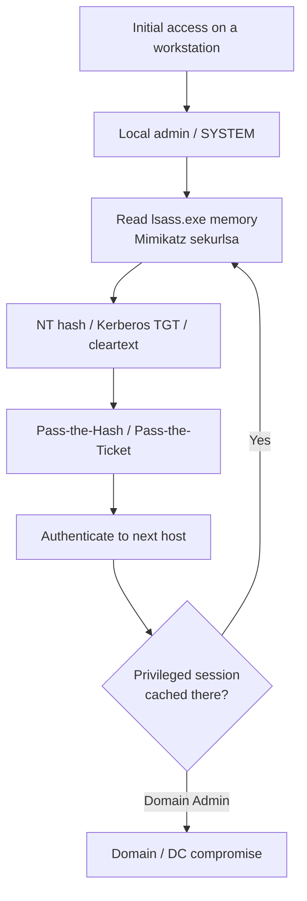

# Credential-Theft Defenses

Credential theft is the pivot that turns a single compromised host into a domain takeover: an attacker who lands on one machine harvests secrets from memory and reuses them to move laterally without ever cracking a password. This note covers the controls that break that chain — protecting where secrets live, and detecting the harvest and reuse when a control is missing.

## Overview

Windows keeps authentication secrets in the **Local Security Authority Subsystem Service (`lsass.exe`)** so interactive sessions can support single sign-on. Tools such as **Mimikatz** read that process memory to recover [NTLM](../Active-Directory-Domain-Services-AD-DS/NTLM.md) hashes, Kerberos tickets and keys, and — on legacy or misconfigured hosts — cleartext passwords. The recovered material feeds three reuse techniques: **pass-the-hash (PtH)**, **pass-the-ticket (PtT)**, and **overpass-the-hash**. Defending against credential theft therefore means three things at once: shrink what is exposed in `lsass`, stop stolen material from being replayed, and monitor for the harvest and the reuse.

This topic sits at the centre of the [Enterprise Security](Readme.md) module and leans on its siblings: [Credential-Guard-and-Protected-Users](Credential-Guard-and-Protected-Users.md) isolates secrets in memory, [LAPS](LAPS.md) removes shared local-admin passwords, the [Tiered-Administration-Model](Tiered-Administration-Model.md) stops Tier 0 credentials from ever touching workstations, and [Kerberos-and-NTLM-Hardening](Kerberos-and-NTLM-Hardening.md) closes the protocol-level replay paths.

## The Attack Chain

Credential theft is rarely a single step — it is a loop of harvest, reuse, and re-harvest that walks toward Tier 0.



- **MITRE ATT&CK** maps this to **T1003.001** (OS Credential Dumping: LSASS Memory), **T1550.002** (Use Alternate Authentication Material: Pass the Hash), and **T1550.003** (Pass the Ticket).

> [!IMPORTANT]
> **Assume-breach framing**
> These controls do not assume the attacker stays out. They assume the attacker already has code execution on *some* host and work to ensure that foothold cannot be laundered into privileged, reusable credentials. Layering matters more than any single setting.

## Reducing What LSASS Exposes

### Disable WDigest cleartext caching

WDigest caches the cleartext password in `lsass` memory. It is disabled by default on Windows 8.1 / Server 2012 R2 and later, but should be explicitly enforced (and audited on older or re-imaged hosts) so `sekurlsa::wdigest` returns nothing.

```cmd
reg add "HKLM\SYSTEM\CurrentControlSet\Control\SecurityProviders\WDigest" /v UseLogonCredential /t REG_DWORD /d 0 /f
```

### LSA Protection (RunAsPPL)

Running `lsass` as a **Protected Process Light (PPL)** blocks unsigned, non-protected processes from opening its memory, defeating the naive `OpenProcess` read that most dumpers use.

```cmd
reg add "HKLM\SYSTEM\CurrentControlSet\Control\Lsa" /v RunAsPPL /t REG_DWORD /d 1 /f
```

> [!WARNING]
> **PPL is a speed bump, not a wall**
> LSA Protection stops off-the-shelf dumping but can be bypassed by a signed vulnerable driver (BYOVD) or a kernel-mode attacker. Pair it with [Credential Guard](Credential-Guard-and-Protected-Users.md), which moves the secrets into a VBS-isolated trustlet the OS kernel itself cannot read.

### Credential Guard and Protected Users

- **Credential Guard** uses virtualization-based security to store NTLM hashes and Kerberos TGTs in an isolated LSA process, so even SYSTEM on the host cannot extract them. See [Credential-Guard-and-Protected-Users](Credential-Guard-and-Protected-Users.md).
- The **Protected Users** group hardens its members: no NTLM, no WDigest/CredSSP credential caching, no cached (offline) sign-in, and Kerberos restricted to AES. Add Tier 0 accounts (Domain Admins, Enterprise Admins) to it.

### Limit cached domain credentials

Domain-cached credentials (**MSCache v2 / DCC2**) let a laptop log on offline, but they are crackable if the host is stolen. Reduce the cache count on servers and privileged workstations (never to `0` on mobile devices, which would break offline logon).

```text
HKLM\SOFTWARE\Microsoft\Windows NT\CurrentVersion\Winlogon
    Value: CachedLogonsCount  (default "10")
```

## Stopping Credential Reuse

- **Restricted Admin mode** and **Remote Credential Guard** for RDP prevent the client's reusable credentials from landing in the remote host's `lsass` — the remote session authenticates back rather than caching a fresh secret.
- **Enforce SMB signing and LDAP signing + channel binding** so a stolen or relayed NTLM authentication cannot be replayed to another service (see [NTLM](../Active-Directory-Domain-Services-AD-DS/NTLM.md) and [Kerberos-and-NTLM-Hardening](Kerberos-and-NTLM-Hardening.md)).
- **Rotate the `krbtgt` account password twice** to invalidate forged **golden tickets**; protect service account keys to limit **silver tickets**.
- **[LAPS](LAPS.md)** gives every machine a unique, rotated local Administrator password, so a stolen local hash cannot be sprayed across the estate via pass-the-hash.

> [!TIP]
> **Break the lateral-movement graph**
> The highest-leverage control is administrative isolation: with a [Tiered-Administration-Model](Tiered-Administration-Model.md) and Privileged Access Workstations, a Domain Admin credential is never typed on a workstation, so it is never in that workstation's `lsass` to steal. Point controls buy time; the tier model removes the target.

## Detection

Prevention will be incomplete, so instrument both the harvest and the reuse. See [Windows-Event-Logs](../Windows-Operating-System-Administration/Windows-Event-Logs.md) for the underlying logging model.

```text
Sysmon Event ID 10 (ProcessAccess): TargetImage ending in lsass.exe
    with GrantedAccess masks such as 0x1010 / 0x1410 — classic memory-read dumping.
```

- **`lsass` access** — the strongest signal. Sysmon **Event ID 10** targeting `lsass.exe` from an unexpected process, or Microsoft Defender for Endpoint's LSASS-access telemetry.
- **Pass-the-hash** — Security **Event ID 4624** logon **type 3** using **NTLM** to hosts that normally use Kerberos; correlate with **4776** (NTLM credential validation) on Domain Controllers.
- **Pass-the-ticket / golden ticket** — anomalous **4768/4769** (TGT/service-ticket requests), tickets with implausible lifetimes, or TGS requests with no preceding TGT request.
- **Sensitive-privilege use** — **Event ID 4672** (special privileges assigned) on accounts or hosts where it is not expected.

## Security Considerations

> [!WARNING]
> **One unprotected privileged session undoes everything**
> If a Domain Admin logs on interactively (or via unrestricted RDP) to a workstation an attacker already controls, LSA Protection and WDigest hardening are moot — the attacker captures a fresh, fully privileged credential the moment it is cached. Credential-theft defense is *behavioural* as much as technical: privileged accounts must only authenticate to hosts of equal or higher trust. Treat any Tier 0 logon on a lower tier as an incident, not a convenience.

- **Local admin equivalence** — reused local Administrator passwords mean one stolen SAM hash unlocks every machine; [LAPS](LAPS.md) plus `LocalAccountTokenFilterPolicy` restrictions close this.
- **BYOVD** — a signed vulnerable driver can strip PPL and Credential Guard is the durable answer, not RunAsPPL alone.
- **Monitoring blind spots** — without Sysmon or EDR, `lsass` reads are largely invisible; hardening without detection is one bypass away from silent failure.

## Best Practices

- Enable **Credential Guard** and **LSA Protection (RunAsPPL)** on every supported host, and add Tier 0 accounts to **Protected Users**.
- Deploy **[LAPS](LAPS.md)** and forbid interactive privileged logon to lower-tier hosts via the **[Tiered-Administration-Model](Tiered-Administration-Model.md)**.
- Enforce **WDigest disabled**, **SMB/LDAP signing**, and **Restricted Admin / Remote Credential Guard** for RDP.
- Monitor **`lsass` access (Sysmon 10)**, **NTLM logons (4624 type 3 / 4776)**, and **special-privilege use (4672)** — and alert on Tier violations.
- Rotate **`krbtgt` twice** on a schedule and after any suspected DC compromise.

## Troubleshooting

| Symptom | Likely cause & fix |
| --- | --- |
| `RunAsPPL` set but a legitimate security tool cannot read `lsass` | The tool's driver/plugin is not a signed protected process — verify vendor PPL compatibility before enforcing fleet-wide |
| Credential Guard enabled but a legacy app breaks | App relies on NTLMv1 / unconstrained delegation / cleartext creds — Credential Guard blocks these by design; remediate the app, do not disable CG |
| Adding an admin to Protected Users breaks a scheduled task or service | Protected Users forbids cached/NTLM credentials — run the workload under a dedicated service account (gMSA) instead of a Protected Users member |
| No `lsass`-access alerts ever fire | Sysmon config not filtering `ProcessAccess` on `lsass.exe`, or EDR tamper-protection off — validate with a benign access test |

## References

- Microsoft Learn — Configuring Additional LSA Protection (RunAsPPL): https://learn.microsoft.com/windows-server/security/credentials-protection-and-management/configuring-additional-lsa-protection
- Microsoft Learn — How Credential Guard works: https://learn.microsoft.com/windows/security/identity-protection/credential-guard/how-it-works
- Microsoft Learn — Protected Users security group: https://learn.microsoft.com/windows-server/security/credentials-protection-and-management/protected-users-security-group
- MITRE ATT&CK — T1003.001 OS Credential Dumping: LSASS Memory: https://attack.mitre.org/techniques/T1003/001/

## Related

- [Enterprise Windows Infrastructure Security](../Readme.md) — course hub
- [Credential-Guard-and-Protected-Users](Credential-Guard-and-Protected-Users.md) — isolating secrets in memory and hardening privileged accounts
- [LAPS](LAPS.md) — unique, rotated local-admin passwords
- [Tiered-Administration-Model](Tiered-Administration-Model.md) — administrative isolation that removes the target
- [Kerberos-and-NTLM-Hardening](Kerberos-and-NTLM-Hardening.md) — protocol-level replay defenses
- [Security-Baselines](Security-Baselines.md) — baselining these settings across the estate
- [Attack-Surface-Reduction](Attack-Surface-Reduction.md) — blocking the tooling that dumps credentials
- [AD-CS-Security](AD-CS-Security.md) — certificate-based credential theft paths
- [NTLM](../Active-Directory-Domain-Services-AD-DS/NTLM.md) — hash-based authentication and pass-the-hash
- [Kerberos-Authentication](../Active-Directory-Domain-Services-AD-DS/Kerberos-Authentication.md) — ticket-based authentication and pass-the-ticket
- [Windows-Event-Logs](../Windows-Operating-System-Administration/Windows-Event-Logs.md) — the logging backbone for the detections above
- [SAM-vs-NTDS.dit](../Active-Directory-Domain-Services-AD-DS/SAM-vs-NTDS.dit.md) — where the stolen hashes are stored
