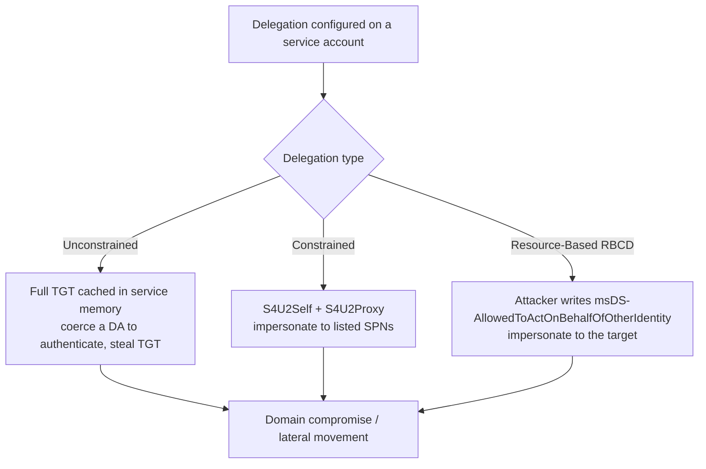

# Kerberos and NTLM Hardening

Kerberos and NTLM are the two authentication protocols underpinning a Windows enterprise, and both are recurring privilege-escalation avenues. Hardening them means removing the weak encryption, careless delegation, and legacy fallbacks that attackers turn into domain compromise.

## Overview

[Kerberos](../Active-Directory-Domain-Services-AD-DS/Kerberos-Authentication.md) is the default protocol in [AD DS](../Active-Directory-Domain-Services-AD-DS/Active-Directory-Domain-Services.md); [NTLM](../Active-Directory-Domain-Services-AD-DS/NTLM.md) remains only for backward compatibility. Attackers rarely break the cryptography — they abuse *configuration*: service accounts with weak passwords and RC4 tickets (Kerberoasting), accounts that skip pre-authentication (AS-REP roasting), over-broad delegation, and NTLM's relay-ability. This note maps each attack to the control that blunts it, matching the adversary-aware framing of the wider [Enterprise Windows Infrastructure Security](../Readme.md) course.

Hardening splits into three fronts: **Kerberos ticket abuse** (roasting and forgery), **delegation abuse**, and **NTLM restriction**. All three are far more effective when paired with detection — see [Windows-Event-Logs](../Windows-Operating-System-Administration/Windows-Event-Logs.md).

## Kerberos Ticket Abuse

The ticket-granting flow is sound; the weakness is what tickets are encrypted with and which accounts an attacker can target.

- **Kerberoasting** (MITRE **T1558.003**) — any authenticated user can request a service ticket (TGS) for an account with a Service Principal Name (SPN). If the ticket is issued with **RC4 (etype 23)**, it is encrypted with the service account's NT hash and can be cracked offline. Service accounts with weak, non-rotated passwords are the target.
- **AS-REP Roasting** (MITRE **T1558.004**) — accounts flagged **"Do not require Kerberos pre-authentication"** (`DONT_REQ_PREAUTH`) let an attacker request an AS-REP without knowing the password, then crack the encrypted blob offline.
- **Golden Ticket** (MITRE **T1558.001**) — a forged TGT signed with the **krbtgt** account's hash, granting arbitrary access for the ticket's lifetime. Follows full domain compromise.
- **Silver Ticket** (MITRE **T1558.002**) — a forged TGS signed with a single service account's hash, granting access to that one service without touching a DC.

> [!WARNING]
> **RC4 is the common thread**
> Kerberoasting and much ticket forgery depend on **RC4-HMAC (etype 23)**, which is keyed on the NT hash. Enforcing **AES (etypes 17/18)** removes the offline-crackable material for AES-capable accounts and raises the cost of forgery.

Enforce AES and disable RC4 for Kerberos via Group Policy:

```text
Computer Configuration > Windows Settings > Security Settings >
Local Policies > Security Options >
Network security: Configure encryption types allowed for Kerberos
```

Select AES128_HMAC_SHA1 and AES256_HMAC_SHA1 (and Future encryption types); clear the RC4 and DES options. Confirm accounts declare AES support so tickets are not silently downgraded:

```powershell
# Find accounts whose declared Kerberos etypes still allow RC4/DES
Get-ADUser -Filter * -Properties msDS-SupportedEncryptionTypes |
  Where-Object { $_.'msDS-SupportedEncryptionTypes' -in @($null,0,1,2,3,4,7) } |
  Select-Object SamAccountName, msDS-SupportedEncryptionTypes
```

Detect roasting by watching for TGS requests with RC4:

```text
Event ID 4769 (TGS requested) — Ticket Encryption Type 0x17 = RC4
  High volume of 4769 for many SPNs from one account = likely Kerberoasting
Event ID 4768 (TGT/AS requested) with Pre-Auth Type 0 = possible AS-REP roasting
```

## Delegation Abuse

Kerberos delegation lets a service impersonate a user to a back-end service. Misconfigured, it is a direct path to privilege escalation.



- **Unconstrained delegation** (`TRUSTED_FOR_DELEGATION`) — the service caches the *full TGT* of every user that authenticates to it. An attacker who controls such a host can coerce a privileged account (for example via authentication coercion) to authenticate, then replay the captured TGT. Avoid it entirely; use constrained delegation instead.
- **Constrained delegation** (`msDS-AllowedToDelegateTo`) — limits delegation to named services, but S4U2Self/S4U2Proxy abuse can still impersonate arbitrary users (including protected ones unless excluded) to those services.
- **Resource-based constrained delegation (RBCD)** — controlled by `msDS-AllowedToActOnBehalfOfOtherIdentity` on the *target*. An attacker with write access to a computer object can configure RBCD to impersonate to it.

> [!IMPORTANT]
> **Mark high-value accounts sensitive**
> Flag privileged accounts **"Account is sensitive and cannot be delegated"** (`NOT_DELEGATED`) and add them to **Protected Users**. Both prevent their credentials from being delegated, defeating unconstrained-delegation TGT theft. See [Credential-Guard-and-Protected-Users](Credential-Guard-and-Protected-Users.md).

```powershell
# Audit accounts trusted for unconstrained delegation (exclude DCs)
Get-ADObject -Filter { (UserAccountControl -band 0x80000) -eq 0x80000 } `
  -Properties UserAccountControl, servicePrincipalName |
  Select-Object Name, servicePrincipalName
```

## NTLM Restriction

NTLM has no mutual authentication and is relay-able. Restrict it toward Kerberos-only where possible.

- **Pass-the-Hash** (MITRE **T1550.002**) and **NTLM relay** (MITRE **T1187** forced authentication) both stem from NTLM's hash-based, unsigned exchanges.
- Set the **LAN Manager authentication level** to *Send NTLMv2 response only. Refuse LM & NTLM* and disable NTLMv1/LM.
- Enforce **SMB signing**, **LDAP signing + channel binding**, and **Extended Protection for Authentication (EPA)** to break relay.
- Restrict and *audit* NTLM before enforcing a deny.

```text
Computer Configuration > Windows Settings > Security Settings >
Local Policies > Security Options > Network security: Restrict NTLM: ...
Network security: LAN Manager authentication level
```

> [!TIP]
> **Audit NTLM before you block it**
> Turn on **Restrict NTLM: Audit** first to inventory which apps still depend on NTLM (surfaced in `Microsoft-Windows-NTLM/Operational`). Blocking NTLM cold breaks legacy and IP-based access. Full detail in [NTLM](../Active-Directory-Domain-Services-AD-DS/NTLM.md).

## Security Considerations

> [!WARNING]
> **krbtgt is the master key**
> A single Golden Ticket forged from the **krbtgt** hash defeats every Kerberos control until the key is changed — and it must be reset **twice**, with time for replication between resets, to fully invalidate outstanding tickets. Guard the krbtgt hash as you would the domain itself: it is only exposed by full DC compromise (DCSync / NTDS.dit theft), so restrict who can replicate directory changes and monitor for it. See [Credential-Theft-Defenses](Credential-Theft-Defenses.md).

- **Attack → control**: Kerberoasting → AES-only + strong (25+ char) managed service-account passwords + 4769/RC4 detection. AS-REP roasting → remove `DONT_REQ_PREAUTH`. Unconstrained delegation → eliminate it, mark accounts sensitive, Protected Users. NTLM relay → signing + channel binding + EPA. Golden/Silver ticket → protect krbtgt/service hashes, monitor forged-ticket anomalies (tickets with implausible lifetimes or missing preceding 4768).
- Use **group Managed Service Accounts (gMSA)** for service identities — 120-character machine-managed passwords make Kerberoasting infeasible.
- Hardening without monitoring is blind; wire every control to [Windows-Event-Logs](../Windows-Operating-System-Administration/Windows-Event-Logs.md) and the monitoring stack.

## Best Practices

- Enforce **AES** and disable **RC4/DES** for Kerberos domain-wide; verify accounts declare AES support so tickets aren't downgraded.
- Replace weak service-account passwords with **gMSA**; remove `DONT_REQ_PREAUTH` from every account.
- Eliminate **unconstrained delegation**; prefer constrained/RBCD and mark privileged accounts sensitive + add to **Protected Users**.
- Restrict NTLM to **NTLMv2 only**, enforce **SMB/LDAP signing + channel binding + EPA**, and audit before enforcing.
- Rotate the **krbtgt** key on a schedule (and twice on suspected compromise); protect it via [Tier 0](Tiered-Administration-Model.md) isolation.

## Troubleshooting

| Symptom | Likely cause & fix |
| --- | --- |
| Apps break after enforcing AES-only | An account/service still expects RC4 — set `msDS-SupportedEncryptionTypes` to include AES, or stage the change; watch **Event ID 4769** for downgrade attempts |
| Kerberos fails with clock-skew errors | Time drift > 5 min — Kerberos requires time sync; check the PDC Emulator / NTP hierarchy |
| Legacy app fails after NTLM restriction | Over-broad Restrict NTLM policy — return to **Audit** mode, review `Microsoft-Windows-NTLM/Operational`, then scope the exception |
| Delegation change breaks a service | Constrained delegation SPN list incomplete — verify `msDS-AllowedToDelegateTo` matches the exact back-end SPNs |

## References

- Microsoft Learn — Kerberos Authentication Overview: https://learn.microsoft.com/en-us/windows-server/security/kerberos/kerberos-authentication-overview
- Microsoft Learn — Network security: Restrict NTLM: https://learn.microsoft.com/en-us/windows/security/threat-protection/security-policy-settings/network-security-restrict-ntlm-in-this-domain
- Microsoft Learn — Configure encryption types allowed for Kerberos: https://learn.microsoft.com/en-us/previous-versions/windows/it-pro/windows-10/security/threat-protection/security-policy-settings/network-security-configure-encryption-types-allowed-for-kerberos
- MITRE ATT&CK — T1558 Steal or Forge Kerberos Tickets: https://attack.mitre.org/techniques/T1558/

## Related

- [NTLM](../Active-Directory-Domain-Services-AD-DS/NTLM.md) — related note (legacy protocol this hardens away from)
- [Kerberos-Authentication](../Active-Directory-Domain-Services-AD-DS/Kerberos-Authentication.md) — related note (the protocol being hardened)
- [Credential-Guard-and-Protected-Users](Credential-Guard-and-Protected-Users.md) — related note (memory secret + delegation protection)
- [Credential-Theft-Defenses](Credential-Theft-Defenses.md) — related note (Mimikatz / PtH / PtT mitigation)
- [AD-CS-Security](AD-CS-Security.md) — related note (PKI-based authentication attacks)
- [Security-Baselines](Security-Baselines.md) — related note (baseline that sets these policies)
- [Tiered-Administration-Model](Tiered-Administration-Model.md) — related note (Tier 0 isolation of krbtgt/DCs)
- [LAPS](LAPS.md) — related note (local-admin password protection)
- [Attack-Surface-Reduction](Attack-Surface-Reduction.md) — related note (reducing execution surface)
- [Windows-Event-Logs](../Windows-Operating-System-Administration/Windows-Event-Logs.md) — related note (4768/4769/4776 detection source)
- [Group-Policy(GPO)](../Group-Policy-Objects-GPO/Group-Policy(GPO).md) — related note (where these controls are deployed)
- [Enterprise Windows Infrastructure Security](../Readme.md) — course hub
