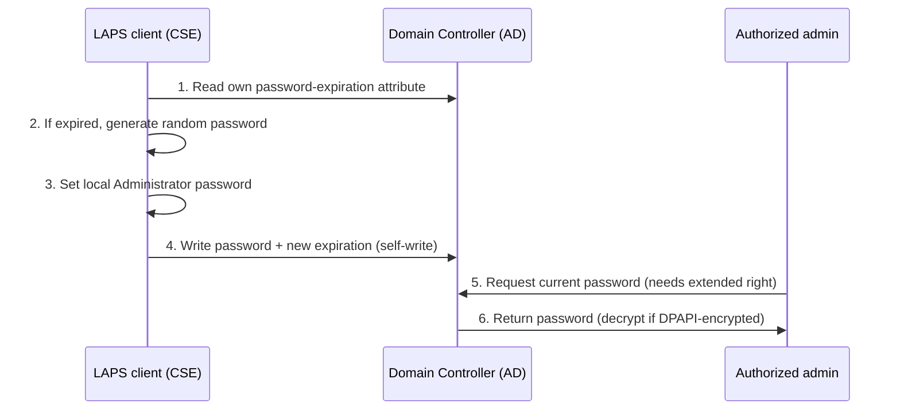

# Local Administrator Password Solution (LAPS)

The Local Administrator Password Solution (LAPS) automatically sets a **unique, random, regularly rotated password** for the built-in local Administrator account on each domain-joined machine and stores it centrally. It removes the single shared local-admin password that otherwise lets one stolen credential unlock an entire fleet.

## Overview

Without LAPS, organizations frequently image every workstation and server from a common template, leaving every machine with the **same** local Administrator password. An attacker who recovers that password (or its NT hash) from one host can then move laterally across the whole estate using [pass-the-hash](../Active-Directory-Domain-Services-AD-DS/NTLM.md) — no cracking required. LAPS breaks this reuse: each computer manages its own account, rotates the password on a schedule, and publishes the current value to a protected location that only authorized principals can read.

There are two generations:

- **Legacy Microsoft LAPS** — a separate downloadable product (client-side extension + `AdmPwd.PS` module) that stores the password in a **cleartext** confidential AD attribute.
- **Windows LAPS** — built into modern Windows (Windows 11, Windows 10, and Windows Server 2019/2022+ via the April 2023 updates). It ships in-box, adds **password encryption** and **password history**, and can back up to either on-premises [Active Directory](../Active-Directory-Domain-Services-AD-DS/Active-Directory-Domain-Services.md) or Microsoft Entra ID (Azure AD).

> [!IMPORTANT]
> **Windows LAPS supersedes legacy LAPS**
> New deployments should use **Windows LAPS**. The legacy product is deprecated. The two use different AD attributes and different PowerShell modules, so know which one an environment runs before auditing or attacking it.

## How LAPS Works

The password lifecycle is driven by a client-side component applied through [Group Policy](../Group-Policy-Objects-GPO/Group-Policy(GPO).md) (or Intune CSP):

1. The schema is extended with LAPS attributes on the **computer** object.
2. Each computer is granted the right to **write its own** password attributes (self-permission).
3. On policy processing, the client checks the expiration attribute; if expired, it generates a new random password, sets it on the local Administrator account, and writes the value + new expiration back to its own AD object.
4. Authorized admins (or tooling) read the current password on demand.

### AD attributes

| Generation | Password attribute | Expiration attribute | Storage |
|---|---|---|---|
| **Legacy LAPS** | `ms-Mcs-AdmPwd` | `ms-Mcs-AdmPwdExpirationTime` | Cleartext (confidential attribute) |
| **Windows LAPS** | `msLAPS-Password` | `msLAPS-PasswordExpirationTime` | Cleartext JSON blob |
| **Windows LAPS (encrypted)** | `msLAPS-EncryptedPassword`, `msLAPS-EncryptedPasswordHistory` | `msLAPS-PasswordExpirationTime` | DPAPI-encrypted for authorized decryptors |

> [!NOTE]
> **Confidential attributes**
> The password attributes are flagged **confidential** in the schema: reading them requires the `CONTROL_ACCESS` (All Extended Rights) right on the attribute, not merely generic read. This is the primary access control that keeps ordinary users from reading local-admin passwords — and the thing attackers hunt for misconfigurations in.

## Architecture



## Deployment

Windows LAPS is managed with the built-in **`LAPS`** PowerShell module. A minimal on-prem AD rollout extends the schema, then grants each computer OU self-write permission.

```powershell
# Extend the AD schema with the Windows LAPS attributes (run once, Schema Admin)
Update-LapsADSchema

# Allow computers in an OU to write (rotate) their own LAPS password
Set-LapsADComputerSelfPermission -Identity "OU=Workstations,DC=armour,DC=local"
```

Legacy LAPS used the separate **`AdmPwd.PS`** module with parallel cmdlets (`Update-AdmPwdADSchema`, `Set-AdmPwdComputerSelfPermission`, `Set-AdmPwdReadPasswordPermission`, `Get-AdmPwdPassword`).

Rotation cadence, password length/complexity, the managed account name, and (for Windows LAPS) whether to encrypt are all configured through Group Policy under:

```text
Computer Configuration > Administrative Templates > System > LAPS
```

## Retrieving the Password

An authorized operator reads the current value with the module. `-AsPlainText` returns the password as a string; without it, a masked object is returned.

```powershell
# Windows LAPS
Get-LapsADPassword -Identity "WS01" -AsPlainText

# Legacy LAPS
Get-AdmPwdPassword -ComputerName "WS01"   # untested
```

You can also force an immediate rotation (invalidate the current password) with `Reset-LapsPassword` on the target machine.

## Security Considerations

LAPS is a **defensive** control, but the way it centralizes secrets in AD makes its **permissions** a high-value target. Whoever can read the password attributes effectively holds local admin on those machines.

> [!WARNING]
> **Overprivileged read ACLs leak every local-admin password**
> If the confidential password attribute (`ms-Mcs-AdmPwd` / `msLAPS-Password`) is delegated too broadly — a nested group, a helpdesk role, or an inherited ACE granting **All Extended Rights** over a computer OU — an attacker who compromises any such principal can enumerate the LAPS attribute over LDAP and harvest the cleartext local-admin password for **every** machine in scope. Tools such as NetExec's `laps` module, `pyLAPS`, LAPSDumper, and PowerView-style LDAP queries automate exactly this. Audit read delegation on the LAPS attributes as carefully as you audit Domain Admin membership.

- **Attack chain**: compromise a low-tier account → discover it has (directly or via nesting) the extended read right on a computer OU → read `ms-Mcs-AdmPwd` for target hosts → authenticate as local Administrator → lateral movement / [pass-the-hash](../Active-Directory-Domain-Services-AD-DS/NTLM.md) blunted only because each password is unique, so the attacker must read AD for each host rather than reuse one hash.
- **What LAPS mitigates**: shared-local-admin pass-the-hash sweeps, and long-lived static local passwords. A dumped hash from one workstation is useless elsewhere. This complements [Credential-Guard-and-Protected-Users](Credential-Guard-and-Protected-Users.md) and the [Tiered-Administration-Model](Tiered-Administration-Model.md).
- **What LAPS does not do**: it does not protect the account while it is *in use* on a host — an attacker with SYSTEM/admin on a machine can still read its own local password from AD or dump it from memory. Encryption (Windows LAPS) narrows read exposure but the DPAPI-authorized group is itself a target.
- **Detection**: reads of the LAPS attribute generate **AD object-access auditing** (Event ID **4662**) on Domain Controllers when SACLs are set on the attribute; anomalous bulk reads of `ms-Mcs-AdmPwd` are a strong indicator of harvesting. Windows LAPS also writes its own operational log (see Troubleshooting). Correlate with [Windows-Event-Logs](../Windows-Operating-System-Administration/Windows-Event-Logs.md).

## Best Practices

- Deploy **Windows LAPS** (not legacy) and enable **password encryption**, restricting the decryptor to a small, tiered admin group.
- Grant the **read/extended right** only to the minimum set of principals; review delegated and inherited ACLs on computer OUs regularly.
- Set **audit SACLs** on the password attributes so reads produce Event ID 4662, and alert on bulk or off-hours reads.
- Keep the **rotation interval short** (e.g. 30 days or less) and force rotation after any password is retrieved for break-glass use.
- Combine LAPS with the [Tiered-Administration-Model](Tiered-Administration-Model.md) and [Security-Baselines](Security-Baselines.md) so recovered local admin can't reach Tier 0.

## Troubleshooting

| Symptom | Likely cause & fix |
|---|---|
| Password never populates / never rotates | Schema not extended, or computer lacks self-write — re-run `Update-LapsADSchema` and `Set-LapsADComputerSelfPermission`; confirm the GPO applied |
| Admin cannot read the password | Missing the extended/read right on the confidential attribute — delegate read to the intended group |
| Attribute is empty but expiration is set | Client-side extension not installed/enabled for that OS, or policy not yet processed — run `Invoke-LapsPolicyProcessing` |
| Encrypted password can't be decrypted | Reader is not in the configured DPAPI decryptor group, or DFL below the required level for encryption |

Windows LAPS records its activity in the **`Microsoft-Windows-LAPS/Operational`** event log channel for local diagnostics of policy processing and rotation.

## References

- Microsoft Learn — Windows LAPS overview: https://learn.microsoft.com/windows-server/identity/laps/laps-overview
- Microsoft Learn — Windows LAPS with Active Directory scenarios: https://learn.microsoft.com/windows-server/identity/laps/laps-scenarios-windows-server-active-directory
- Microsoft Learn — Windows LAPS PowerShell module reference: https://learn.microsoft.com/powershell/module/laps
- MITRE ATT&CK — Valid Accounts: Local Accounts (T1078.003): https://attack.mitre.org/techniques/T1078/003/

## Related

- [Enterprise Windows Infrastructure Security](../Readme.md) — course hub
- [Security-Baselines](Security-Baselines.md) — related note (baseline hardening this fits into)
- [Tiered-Administration-Model](Tiered-Administration-Model.md) — related note (keep recovered local admin out of Tier 0)
- [Credential-Guard-and-Protected-Users](Credential-Guard-and-Protected-Users.md) — related note (protecting credentials in memory)
- [Credential-Theft-Defenses](Credential-Theft-Defenses.md) — related note (breaking credential-reuse chains)
- [Attack-Surface-Reduction](Attack-Surface-Reduction.md) — related note (companion hardening control)
- [Kerberos-and-NTLM-Hardening](Kerberos-and-NTLM-Hardening.md) — related note (paired authentication hardening)
- [AD-CS-Security](AD-CS-Security.md) — related note (another AD attack surface to harden)
- [NTLM](../Active-Directory-Domain-Services-AD-DS/NTLM.md) — related note (pass-the-hash, the reuse attack LAPS blunts)
- [Active-Directory-Domain-Services](../Active-Directory-Domain-Services-AD-DS/Active-Directory-Domain-Services.md) — related note (where LAPS attributes live)
- [Group-Policy(GPO)](../Group-Policy-Objects-GPO/Group-Policy(GPO).md) — related note (how LAPS policy is delivered)
- [Windows-Event-Logs](../Windows-Operating-System-Administration/Windows-Event-Logs.md) — related note (Event ID 4662 read detection)
