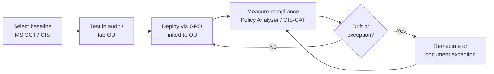

# Security Baselines

A **security baseline** is a curated set of configuration settings — registry values, Group Policy settings, audit policy, and account controls — that hardens Windows and Active Directory to a known, defensible state. Baselines replace insecure out-of-the-box defaults with vendor- or community-recommended values, giving every host a measurable starting posture instead of ad-hoc tuning.

## Overview

Windows ships with defaults chosen for compatibility, not security: legacy protocols enabled, weak authentication levels permitted, and thin auditing. A baseline codifies "what secure looks like" for a role (workstation, member server, [Domain Controller](../Active-Directory-Domain-Services-AD-DS/Active-Directory-Domain-Services.md)) so it can be deployed consistently and re-checked over time. In an AD environment baselines are normally delivered as [Group Policy](../Group-Policy-Objects-GPO/Group-Policy(GPO).md) objects linked to OUs, then verified against drift.

The two dominant baseline sources are **Microsoft Security Baselines** (shipped in the Security Compliance Toolkit) and the **CIS Benchmarks**. Both map settings to the same underlying Windows controls; they differ in packaging, scoring tooling, and how prescriptive they are. Baselines underpin the sibling controls in this module — a [Tiered-Administration-Model](Tiered-Administration-Model.md), [LAPS](LAPS.md), [Credential-Guard-and-Protected-Users](Credential-Guard-and-Protected-Users.md), and [Attack-Surface-Reduction](Attack-Surface-Reduction.md) all assume a hardened base to build on.

> [!NOTE]
> **Baseline vs. benchmark vs. STIG**
> A **baseline** is the applied configuration. A **benchmark** (CIS) or **STIG** (DISA) is a published standard the baseline implements. A **framework** (e.g. Microsoft's Security Configuration Framework, SECCON) tiers those standards by how much friction the organization can absorb.

## Microsoft Security Baselines and the Security Compliance Toolkit

Microsoft publishes free baselines for Windows 10/11, Windows Server, Microsoft 365 Apps, and Microsoft Edge through the **Security Compliance Toolkit (SCT)**. Each baseline is distributed as a set of **GPO backups** plus documentation and spreadsheets listing every setting and its rationale.

The toolkit bundles the tools used to apply and audit those settings:

| Tool | Purpose |
|------|---------|
| **Policy Analyzer** | Compare GPOs / baselines against each other and against the live local policy; highlight differences and conflicts |
| **LGPO.exe** | Apply, import, and export local Group Policy from a backup or policy file (useful on non-domain-joined hosts) |
| **Set Object Security / GPO to PolicyRules** | Convert and manage baseline artifacts |

Compare a machine's effective policy to a baseline before deploying it, so you understand what will change:

```cmd
:: Apply a Microsoft baseline GPO backup to local policy (SCT tool)
LGPO.exe /g ".\GPOs\{GUID}"   # untested
```

```powershell
# Export the current effective GPO settings for review / diffing in Policy Analyzer
Get-GPOReport -All -ReportType HTML -Path "C:\Reports\AllGPOs.html"
```

> [!TIP]
> **Diff before you deploy**
> Load your existing GPOs and the new baseline into **Policy Analyzer** side by side. It surfaces conflicts (two GPOs setting the same value) and shows exactly which insecure defaults the baseline flips, so a rollout is a reviewed change rather than a surprise.

## CIS Benchmarks

The **CIS Microsoft Windows Benchmarks** are consensus-developed hardening guides maintained by the Center for Internet Security. They are organized into profiles by tolerance for operational impact:

- **Level 1 (L1)** — practical, broadly safe settings that reduce attack surface with minimal disruption.
- **Level 2 (L2)** — defense-in-depth settings for high-security environments that may break legacy functionality.
- **BitLocker / NG (Next Generation)** — supplemental profiles for specific technologies.

Compliance is scored with **CIS-CAT** (CIS Configuration Assessment Tool), which reads the live configuration and reports a percentage-compliant score against the chosen profile. CIS also ships **Build Kits** (GPO/Intune bundles) to apply the recommendations directly.

## Applying and Measuring a Baseline

A baseline is a lifecycle, not a one-time GPO import. The value is in continuously detecting **drift** — settings that regress because of a new app, a manual change, or a conflicting GPO.



Verify that a baseline GPO actually reached a host and see the resultant set of policy:

```cmd
gpupdate /force
gpresult /r
gpresult /h C:\Temp\rsop.html
```

> [!IMPORTANT]
> **Exceptions are part of the baseline**
> No environment applies 100% of a baseline. Every deviation should be a **documented, approved exception** with a compensating control — not a silent gap. Track exceptions so an auditor (or an attacker) can't find a hardening hole you forgot about.

## Security Considerations

> [!WARNING]
> **Defaults are the attacker's foothold**
> Baselines exist because Windows' compatibility defaults hand attackers cheap wins:
> - **NTLMv1 / LM allowed** → weak challenge/response is captured and cracked, or relayed. A baseline sets the LAN Manager authentication level to *"Send NTLMv2 response only. Refuse LM & NTLM"* — see [NTLM](../Active-Directory-Domain-Services-AD-DS/NTLM.md) and [Kerberos-and-NTLM-Hardening](Kerberos-and-NTLM-Hardening.md).
> - **SMB signing not required** → NTLM relay to SMB/LDAP succeeds. Baselines enforce SMB signing and LDAP signing + channel binding.
> - **Thin audit policy** → post-exploitation is invisible. Baselines turn on advanced audit policy so events land in [Windows-Event-Logs](../Windows-Operating-System-Administration/Windows-Event-Logs.md) (correlate with [Key-Security-Event-IDs](../Windows-Monitoring-and-Logging/Key-Security-Event-IDs.md)).
> - **Cached credentials / plaintext exposure** → feeds credential theft; pair the baseline with [Credential-Guard-and-Protected-Users](Credential-Guard-and-Protected-Users.md) and [Credential-Theft-Defenses](Credential-Theft-Defenses.md).

From an offensive standpoint, an early recon step is measuring **how far a host has drifted from a baseline** — unsigned SMB, NTLMv1, permissive local admin, and weak audit settings are all baseline failures that open the exploitation chain. From a defensive standpoint, the baseline plus continuous drift measurement is what turns "we have a GPO" into "we can prove the control is live." A GPO that fails to apply (link, filtering, or precedence issue) is a control that exists only on paper.

## Best Practices

- **Start from a published baseline** (Microsoft SCT or CIS L1), then layer organization-specific settings — don't hand-roll from scratch.
- **Deploy in audit/monitor mode first**, scoped to a pilot OU, before enforcing broadly; baselines can break legacy apps just like [Attack-Surface-Reduction](Attack-Surface-Reduction.md) rules can.
- **Role-scope baselines** — Domain Controllers, member servers, and workstations get different profiles; over-applying a DC baseline to workstations breaks things.
- **Measure drift continuously** with Policy Analyzer, CIS-CAT, or DSC/Intune compliance — a one-time apply decays.
- **Version and document exceptions**; treat the baseline like code with change control, and pair every setting with detection in the monitoring stack.

## Troubleshooting

| Symptom | Likely cause & fix |
|---------|--------------------|
| Baseline GPO not applying | Wrong OU link, security/WMI filtering, or precedence — check with `gpresult /r` and the Group Policy Operational log |
| A baseline setting broke an app | Over-strict control (e.g. NTLM/SMB signing, UAC) — roll back that setting, add a documented exception, or scope it away from affected hosts |
| Two GPOs fight over a value | Conflict resolved by GPO precedence — use **Policy Analyzer** to find the winning GPO and consolidate |
| Audit-policy setting won't stick | Legacy audit policy overriding advanced audit policy — enable *"Force audit policy subcategory settings"* so subcategories apply |

> [!NOTE]
> **Watch for policy-change events**
> Event ID **4719** (*System audit policy was changed*) and Group Policy Operational log entries flag when hardening is altered — legitimately or by an attacker weakening the baseline. Alert on them.

## References

- Microsoft Learn — Security Compliance Toolkit (SCT) and Windows Security Configuration Framework: https://learn.microsoft.com/en-us/windows/security/operating-system-security/device-management/windows-security-configuration-framework/security-compliance-toolkit-10
- Microsoft Learn — Windows security baselines: https://learn.microsoft.com/en-us/windows/security/operating-system-security/device-management/windows-security-configuration-framework/windows-security-baselines
- CIS — Microsoft Windows Benchmarks: https://www.cisecurity.org/cis-benchmarks
- DISA — Security Technical Implementation Guides (STIGs): https://public.cyber.mil/stigs/

## Related

- [Tiered-Administration-Model](Tiered-Administration-Model.md) — related note (baseline the base, then tier privilege)
- [LAPS](LAPS.md) — related note (local admin password control layered on the baseline)
- [Credential-Guard-and-Protected-Users](Credential-Guard-and-Protected-Users.md) — related note (credential protection controls)
- [Attack-Surface-Reduction](Attack-Surface-Reduction.md) — related note (ASR / application control hardening)
- [AD-CS-Security](AD-CS-Security.md) — related note (PKI baseline and ESC misconfigurations)
- [Kerberos-and-NTLM-Hardening](Kerberos-and-NTLM-Hardening.md) — related note (authentication hardening the baseline enforces)
- [Credential-Theft-Defenses](Credential-Theft-Defenses.md) — related note (mitigating pass-the-hash / pass-the-ticket)
- [Group-Policy(GPO)](../Group-Policy-Objects-GPO/Group-Policy(GPO).md) — related note (delivery mechanism for AD baselines)
- [NTLM](../Active-Directory-Domain-Services-AD-DS/NTLM.md) — related note (a default the baseline restricts)
- [Windows-Event-Logs](../Windows-Operating-System-Administration/Windows-Event-Logs.md) — related note (where baseline auditing lands)
- [Active-Directory-Domain-Services](../Active-Directory-Domain-Services-AD-DS/Active-Directory-Domain-Services.md) — related note (the environment being baselined)
- [Enterprise Windows Infrastructure Security](../Readme.md) — course hub
