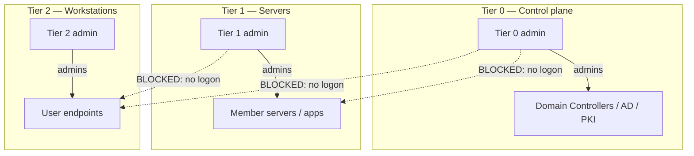

# Tiered Administration Model

The Tiered Administration Model is a privileged-access design that partitions an enterprise's assets and administrative accounts into isolation tiers, so that credentials for high-value systems are never exposed on lower-trust machines. It is the structural defense against credential theft and lateral movement in a Windows/[Active Directory](../Active-Directory-Domain-Services-AD-DS/Active-Directory-Domain-Services.md) environment.

## Overview

Most Active Directory compromises follow the same arc: an attacker lands on an ordinary workstation, steals whatever privileged credentials are cached there, and reuses them to move up toward the domain. Tiering breaks that arc by defining **who may administer what**, and — critically — **where a privileged credential is ever allowed to appear**. A [Kerberos](../Active-Directory-Domain-Services-AD-DS/Kerberos-Authentication.md) TGT or [NTLM](../Active-Directory-Domain-Services-AD-DS/NTLM.md) hash for a Domain Admin only becomes stealable if that admin logs on somewhere an attacker can reach; the model's whole purpose is to guarantee they never do.

The classic model defines three tiers, and Microsoft's newer **Enterprise Access Model** reframes them as control/management/data planes — the isolation principle is identical.

## The Three Tiers

| Tier | Scope | Example assets | Example admin accounts |
| --- | --- | --- | --- |
| **Tier 0** | Identity / control plane | Domain Controllers, AD forest, [AD CS](AD-CS-Security.md)/PKI, Entra Connect, anything with direct or indirect control of AD | Domain Admins, Enterprise Admins, Schema Admins |
| **Tier 1** | Server / application plane | Member servers, business applications, databases, cloud workloads | Server and application administrators |
| **Tier 2** | Workstation / device plane | User endpoints, laptops, POS devices | Helpdesk, workstation admins |

> [!IMPORTANT]
> **Tier 0 is defined by control, not by label**
> Any object that can *control* a Tier 0 asset is itself Tier 0 — this is the **clean source principle** (a security dependency must be at least as trusted as the thing it controls). A backup server that can restore a Domain Controller, a GPO that applies to DCs, or a service account with `DCSync` rights are all effectively Tier 0, even if nobody planned it that way. Mapping these hidden dependencies is the hard part of tiering.

## The Two Rules

The model rests on two enforcement rules applied in both directions:

- **Control restriction** — an administrator may only manage assets *within their own tier*. A Tier 2 helpdesk account cannot administer a Tier 1 server.
- **Logon restriction** — a higher-tier account may **never** log on to a lower-tier asset, because doing so caches its credential where lower-trust code (and attackers) can harvest it. A Tier 0 Domain Admin never signs in to a Tier 2 laptop.



## Privileged Access Workstations (PAWs)

A **Privileged Access Workstation** is a dedicated, hardened endpoint used *only* for privileged administration — no email, no web browsing, no arbitrary software. Tier 0 tasks are performed from a PAW so that the administrative session never shares an OS with the high-risk activities (opening attachments, browsing) that deliver malware. Each tier ideally has its own PAW class; the Tier 0 PAW is the most locked down and is itself a Tier 0 asset.

> [!TIP]
> **Separate accounts per tier**
> Give each administrator distinct accounts — for example a normal `jdoe` for Tier 2 daily work and a separate `jdoe-t0` used only from a PAW for Tier 0. One human, several identities, no credential ever crossing a tier boundary.

## Enforcement

### Deny-logon user rights (Group Policy)

The logon restriction is enforced with **"Deny log on"** user-rights assignments applied by [GPO](../Group-Policy-Objects-GPO/Group-Policy(GPO).md). A group containing all higher-tier accounts is denied every logon type on lower-tier machines. The relevant rights, under:

```text
Computer Configuration > Policies > Windows Settings > Security Settings >
Local Policies > User Rights Assignment
```

| User right | Blocks |
| --- | --- |
| Deny log on locally | Interactive/console logon |
| Deny log on through Remote Desktop Services | RDP logon |
| Deny access to this computer from the network | Network logon (SMB, etc.) |
| Deny log on as a batch job | Scheduled tasks |
| Deny log on as a service | Service accounts |

For example, add the Tier 0 admin group to all five "Deny" rights in a GPO linked to Tier 1 and Tier 2 machines, and vice versa, so no tier's credentials can land on a lower tier.

### Authentication Policies and Silos

**Authentication Policy Silos** (Windows Server 2012 R2 and later) enforce tiering at the Kerberos level: accounts placed in a silo can only obtain tickets when authenticating from permitted hosts, backed by **Kerberos armoring (FAST)**. This is stronger than deny-logon rights because it is enforced by the KDC, not just the target machine.

```powershell
# Create an authentication policy silo for Tier 0 (schema/syntax varies by version)
New-ADAuthenticationPolicySilo -Name "Tier0-Silo" -Enforce   # untested
New-ADAuthenticationPolicy -Name "Tier0-Policy" -Enforce      # untested
```

Adding sensitive accounts to the [Protected Users](Credential-Guard-and-Protected-Users.md) group complements this by disabling NTLM, weak Kerberos ciphers, and credential delegation for those accounts.

## Security Considerations

> [!WARNING]
> **What tiering actually stops**
> Without tiering, a single reused Domain Admin logon is fatal. An attacker who compromises a Tier 2 workstation where a Tier 0 admin has authenticated can dump LSASS with a tool like Mimikatz, recover the admin's NTLM hash or Kerberos TGT, and replay it to a Domain Controller. This is the classic **credential-theft → lateral-movement → domain-dominance** chain:
> - **T1003 — OS Credential Dumping** (harvesting the cached secret from LSASS/`NTDS.dit`)
> - **T1550 — Use Alternate Authentication Material** (pass-the-hash / pass-the-ticket)
> - **T1078 — Valid Accounts** (reusing the stolen privileged identity)
>
> Tiering removes the precondition: the Tier 0 credential is never present on the Tier 2 machine in the first place, so there is nothing to steal.

The model is a *containment* control. It does not stop the initial workstation compromise — it ensures that compromise cannot be escalated into control-plane compromise. It must be paired with monitoring: alert on any Tier 0 account authenticating from a non-Tier 0 host, which is always either a misconfiguration or an attack. See [Credential-Theft-Defenses](Credential-Theft-Defenses.md) and [Kerberos-and-NTLM-Hardening](Kerberos-and-NTLM-Hardening.md).

## Best Practices

- Map Tier 0 by **control dependency**, not by asset name — include backup systems, PKI, sync servers, and any account with `DCSync`/replication or GPO rights over DCs.
- Issue **separate per-tier admin accounts** and perform Tier 0 work only from a dedicated **PAW**.
- Enforce logon isolation with **Deny-logon GPOs** in both directions, and strengthen it with **Authentication Policy Silos** and the **Protected Users** group.
- Never let a lower-tier account manage a higher-tier asset; audit group memberships and delegated ACLs for silent violations.
- Pair the model with detection — treat a cross-tier privileged logon as a high-severity alert.

## Troubleshooting

| Symptom | Likely cause & fix |
| --- | --- |
| A deny-logon GPO locks out a legitimate admin | The account was placed in the wrong tier group, or a service depends on a cross-tier logon — audit the dependency, then re-tier the account |
| Tier 0 admin still able to RDP to a workstation | GPO not linked/applied to that OU, or the account is missing from the deny group — verify with `gpresult` and refresh policy |
| Authentication Policy Silo blocks expected access | Host not added to the silo's permitted computers, or Kerberos armoring/FAST unsupported by a client — confirm silo membership and DC/client capability |

## References

- Microsoft Learn — Securing privileged access / Enterprise Access Model: https://learn.microsoft.com/security/privileged-access-workstations/overview
- Microsoft Learn — Privileged Access Workstations: https://learn.microsoft.com/security/privileged-access-workstations/privileged-access-devices
- Microsoft Learn — Authentication policies and authentication policy silos: https://learn.microsoft.com/windows-server/security/credentials-protection-and-management/authentication-policies-and-authentication-policy-silos
- MITRE ATT&CK — Use Alternate Authentication Material (T1550): https://attack.mitre.org/techniques/T1550/

## Related

- [Security-Baselines](Security-Baselines.md) — related note (baseline hardening that tiering builds on)
- [LAPS](LAPS.md) — related note (removes shared local-admin passwords across a tier)
- [Credential-Guard-and-Protected-Users](Credential-Guard-and-Protected-Users.md) — related note (protects the credentials tiering isolates)
- [Attack-Surface-Reduction](Attack-Surface-Reduction.md) — related note (reduces what runs on tiered hosts)
- [AD-CS-Security](AD-CS-Security.md) — related note (PKI is a Tier 0 asset)
- [Kerberos-and-NTLM-Hardening](Kerberos-and-NTLM-Hardening.md) — related note (auth-layer enforcement of tiers)
- [Credential-Theft-Defenses](Credential-Theft-Defenses.md) — related note (the attack class tiering contains)
- [NTLM](../Active-Directory-Domain-Services-AD-DS/NTLM.md) — related note (hash/relay theft that crosses tiers)
- [Kerberos-Authentication](../Active-Directory-Domain-Services-AD-DS/Kerberos-Authentication.md) — related note (ticket theft that crosses tiers)
- [Group-Policy(GPO)](../Group-Policy-Objects-GPO/Group-Policy(GPO).md) — related note (how deny-logon rules are delivered)
- [Windows-Event-Logs](../Windows-Operating-System-Administration/Windows-Event-Logs.md) — related note (detecting cross-tier logons)
- [Enterprise Windows Infrastructure Security](../Readme.md) — course hub
