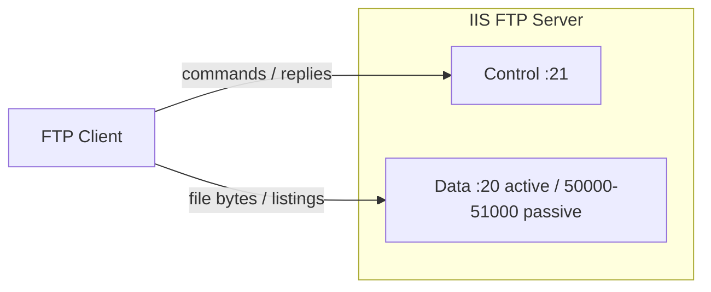

# FTP Setup in IIS

FTP (File Transfer Protocol) is a **standard network protocol** used to transfer files between a **client** and a **server** over a TCP/IP network (Internet or LAN). This note walks through installing and configuring the built-in **IIS FTP Server** role on Windows Server or Windows 10/11 Pro, and covers the operational tasks around it.

## Overview

FTP allows users to:

- **Download** files from a server
- **Upload** files to a server
- **List directories** and file details
- **Rename, delete, and move** files

### Common Use Cases

- Uploading website content to web servers
- Sharing large files internally or externally
- Remote file management for developers or IT admins
- Backup and archival file transfers

> [!NOTE]
> **Scope**
> This note is the setup hub for FTP on Windows/IIS. Deeper treatment of specific areas lives in dedicated notes: [FTPS](FTPS.md) (TLS encryption), [FTP-User-Isolation](FTP-User-Isolation.md) (per-user sandboxing), [FTP-Security](FTP-Security.md) (hardening), and [FTP-Logging](FTP-Logging.md) (auditing and monitoring).

## Concepts

### How FTP Works

- **Client**: Software that initiates the connection.

> Examples: `FileZilla`, `WinSCP`, command-line FTP tools

- **Server**: Hosts files and responds to client requests.

> Examples: `IIS FTP`, `vsftpd`, `ProFTPD`

#### FTP uses two channels

| Channel         | Port(s)              | Purpose                                |
|-----------------|----------------------|----------------------------------------|
| Control Channel | 21                   | Sends commands (login, list files, etc.) |
| Data Channel    | 20 (Active) or Passive Ports | Transfers files and listings |

### FTP Modes

- **Active Mode**
  - Client opens a port and waits for the server connection
  - Control = Port 21
  - Data = Server opens connection from port 20
  - Often blocked by client firewalls
- **Passive Mode (Recommended)**
  - Server opens a range of ports and waits for client connection
  - Control = Port 21
  - Data = Random port (configurable, e.g., 50000–51000)
  - Works better behind NAT/firewalls

### FTP Ports

| Port/Range         | Usage                               |
|--------------------|-------------------------------------|
| 21                 | Control channel                     |
| 20                 | Data channel (Active Mode)          |
| 1024–65535 (custom) | Passive Mode data transfer (configurable range recommended, e.g. 50000–51000) |

## Architecture

The control channel carries commands and replies; a separate data channel carries the actual file bytes and directory listings. In passive mode the client opens both connections, which is why passive mode traverses NAT/firewalls more reliably.



## Installation

### Step 1: Install IIS and FTP Server

1. Open **Server Manager** or run `OptionalFeatures.exe`
2. Enable components:
   - `Web Server (IIS)`
   - `FTP Server`
     - FTP Service
     - FTP Extensibility
   - `IIS Management Console`

> [!NOTE]
> **Screenshot**
> 

## Configuration

### Step 2: Create an FTP Site

1. Open **IIS Manager** (`inetmgr`)
2. Right-click **Sites > Add FTP Site**
3. Set:
   - FTP Site Name: `MyFTPSite`
   - Physical Path: `C:\FTP\MySite`
4. Configure Bindings:
   - IP Address: Choose or "All Unassigned"
   - Port: `21` (default)
   - SSL: "No SSL" (or configure if using FTPS)

> [!NOTE]
> **Screenshot**
> 

### Step 3: Configure Authentication & Authorization

- **Authentication**:
  - Enable **Basic Authentication** (credentials required)
- **Authorization**:
  - Allow Access To: `All users` or `Specific users/groups`
  - Permissions: `Read` or `Read/Write`

> [!WARNING]
> **Disable anonymous access**
> Leave **Anonymous Authentication** disabled unless the site is deliberately public. See [FTP-Security](FTP-Security.md) for the full hardening checklist.

### Step 4: Add Firewall Rules

1. Open **Windows Defender Firewall > Advanced Settings**
2. Add **Inbound Rules** for:
   - `Port 21` (Control)
   - Passive Data Ports (`50000-51000`)
3. In IIS:
   - Go to **FTP Firewall Support**
   - Set:
     - `Data Channel Port Range`: `50000-51000`
     - External IP Address (if behind NAT)

> [!NOTE]
> **Screenshot**
> 

## Administration

### Step 5: Create FTP Users

To create a dedicated FTP user:

```cmd
net user ftpuser P@ssword123 /add
```

Assign permissions on the `C:\FTP\MySite` folder:

- `Read` or `Modify` (if upload required)

### Optional: FTP User Isolation

1. In IIS, select your FTP site
2. Open **FTP User Isolation**
3. Choose → **Isolate users**
4. Folder Structure Example:

```text
C:\FTP\LocalUser\ftpuser1
```

> [!TIP]
> **Deep dive**
> User isolation has strict folder-layout requirements per isolation mode. See [FTP-User-Isolation](FTP-User-Isolation.md) for the full directory conventions and edge cases.

## Examples

### Test Your FTP Server

Using the command line:

```cmd
ftp <server-ip>
```

GUI FTP Clients: `FileZilla`, `WinSCP`

### Windows Built-in `ftp.exe`

Windows ships a minimal command-line FTP client (`ftp.exe`) suitable for quick admin checks. Typical session:

```cmd
ftp ftp.contoso.local
```

```text
ftp> user ftpuser
ftp> binary
ftp> get report.zip
ftp> put update.pkg
ftp> ls
ftp> bye
```

| Subcommand | Purpose |
|---|---|
| `open <host>` | Connect to an FTP server (also usable as `ftp <host>` at launch) |
| `user <name>` | Authenticate with a username (prompts for password) |
| `ascii` / `binary` | Switch transfer mode — `binary` for anything non-text |
| `get <file>` / `put <file>` | Download / upload a single file |
| `mget` / `mput` | Download / upload multiple files (wildcards supported) |
| `ls` / `dir` | List remote directory contents |
| `cd` / `lcd` | Change remote / local working directory |
| `pwd` | Print remote working directory |
| `prompt` | Toggle interactive confirmation for `mget`/`mput` |
| `bye` / `quit` | Close the session |

- For the full `ftp.exe`/generic FTP client subcommand walkthrough (navigation, deletes, renames, permissions) see FTP-Client-Commands — the same command set applies whether you're an attacker or an administrator validating a server.
- Note: the built-in Windows `ftp.exe` client has no dedicated interactive command to force passive mode — passive vs. active is negotiated with the server, and `ftp.exe` offers no user-facing toggle for it. If you need to control or verify passive mode explicitly (e.g. testing a NAT/firewall path), use a GUI client instead.   # untested — verify against your build of ftp.exe before treating as authoritative

### GUI Clients (FTPS / SFTP)

- **FileZilla** and **WinSCP** are the common GUI clients for administrators. Both support explicit and implicit FTPS; WinSCP additionally supports SFTP/SCP (useful if the server side has been moved to an SSH-based file transfer service instead of IIS FTP).
- In FileZilla's Site Manager, set **Encryption** to `Require explicit FTP over TLS` or `Require implicit FTP over TLS` to match how the IIS site was configured — a mismatch produces a connection/handshake failure, not a silent plaintext fallback, if the server enforces `SslRequire`. See [FTPS](FTPS.md) for how the server side is configured.

## Security Considerations

> [!WARNING]
> **FTP is cleartext by default**
> Plain FTP transmits **usernames, passwords, commands, and file contents in plain text**. It is not secure over public networks and is vulnerable to eavesdropping / MITM attacks (see Network-Sniffing).

### Secure Alternatives

- **FTPS**: FTP with SSL/TLS encryption — natively supported by the IIS FTP role. See [FTPS](FTPS.md).
- **SFTP**: File transfer over SSH (a different protocol, more secure) — **not** provided by the IIS FTP role; needs a separate SSH server.

For the complete hardening checklist (disable anonymous auth, enforce FTPS, isolate users, restrict at the firewall, enable Dynamic IP Restrictions, strong password policy) and monitoring guidance, see the dedicated notes [FTP-Security](FTP-Security.md) and [FTP-Logging](FTP-Logging.md). FTPS configuration (certificates, SSL policy, explicit vs implicit) is covered in [FTPS](FTPS.md).

## Best Practices

- Prefer **SFTP or FTPS** over plain FTP
- Use **Passive Mode** for firewall/NAT compatibility
- Restrict users to **their own directories** (see [FTP-User-Isolation](FTP-User-Isolation.md))
- Regularly monitor **IIS FTP logs** for suspicious access (see [FTP-Logging](FTP-Logging.md))
- Apply **strong password policies** and disable anonymous access
- Use **Windows Groups** for easier ACL management

## Troubleshooting

- **530 Login incorrect** → Wrong credentials or permissions
- **Connection Timeout** → Firewall blocking port 21 or passive ports
- **Data Channel not opening** → Passive port range not set on firewall/IIS
- **Cannot connect externally** → External IP or NAT not set in `FTP Firewall Support`

## References

- Microsoft Learn — [FTP Publishing Service for IIS 7 and later](https://learn.microsoft.com/en-us/iis/get-started/whats-new-in-iis-8/installing-and-configuring-ftp-on-iis-8)
- Microsoft Learn — [Configure FTP Firewall Settings](https://learn.microsoft.com/en-us/iis/configuration/system.applicationhost/sites/site/ftpserver/firewallsupport)
- RFC 959 — File Transfer Protocol (FTP)

## Related

- [Enterprise Windows Infrastructure Security](../Readme.md) — course hub and map of content
- [FTPS](FTPS.md) — adding SSL/TLS encryption to the FTP site — related note
- [FTP-User-Isolation](FTP-User-Isolation.md) — sandboxing users into their own home directories — related note
- [FTP-Security](FTP-Security.md) — hardening checklist and attack surface — related note
- [FTP-Logging](FTP-Logging.md) — logging, auditing, and monitoring the FTP service — related note
- [Internet-Information-Services(IIS)](../Web-Server-IIS/Internet-Information-Services(IIS).md) — IIS hosts the FTP service — related note
- [Types-of-Site-Binding-in-IIS](../Web-Server-IIS/Types-of-Site-Binding-in-IIS.md) — bindings used to expose the FTP site (including the 990 implicit-FTPS binding) — related note
- [Hosting](../Software-Development-Life-Cycle/Hosting.md) — hosting model the FTP site fits into — related note
- [Authentication-Methods-in-Windows](../Web-Server-IIS/Authentication-Methods-in-Windows.md) — how FTP Basic Authentication fits into broader Windows auth — related note
- [Windows-Firewall-and-AV-Commands](../Windows-Commands/Windows-Firewall-and-AV-Commands.md) — firewall command syntax used for FTP rules — related note
- Network-Sniffing — why plaintext FTP credentials/data are exposed on the wire — related note
- [Windows-Event-Logs](../Windows-Operating-System-Administration/Windows-Event-Logs.md) — Security-log event IDs for correlating FTP logon activity — related note
- FTP-Client-Commands — full `ftp.exe`/generic FTP client subcommand reference — related note
- File-Transfers — cross-course index of file-transfer techniques and protocols — related note
