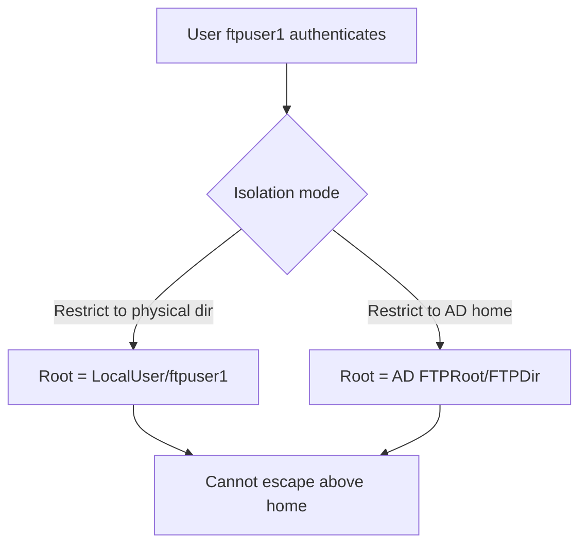

# FTP User Isolation

FTP User Isolation is an IIS FTP feature that confines each authenticated user to their own home directory so they cannot browse, read, or write outside it. It is the primary control that stops one compromised or curious FTP account from roaming the entire site's file tree.

## Overview

Without isolation, every user who logs into an FTP site lands in (and can navigate the whole of) the site's physical root. Isolation instead maps each user to a dedicated home folder and treats that folder as their FTP root ("jail"). IIS supports several isolation modes, from none, through physical-directory isolation, up to Active Directory-driven home directories.

> [!IMPORTANT]
> **Folder layout is not optional**
> Physical-directory isolation only works when the on-disk folder structure follows the exact naming convention IIS expects. A misnamed folder produces login failures or, worse, silently drops the user into the wrong root.

## Concepts

### Isolation Modes

| Mode | Where the user lands | Isolated? | Typical use |
|---|---|---|---|
| Do not isolate users — start in user name directory | Named subfolder if it exists, else site root | Partial | Simple shared sites |
| Do not isolate users — start in FTP root directory | Site physical root | No | Public/anonymous or fully trusted |
| Isolate users — restrict to physical directory | The user's own `LocalUser\<name>` (or domain) folder as root | Yes | Multi-tenant / per-user uploads |
| Isolate users — restrict to Active Directory home | The `FTPRoot`/`FTPDir` home path from the user's AD object | Yes | Domain-integrated deployments |

### Required Physical Directory Structure

For **physical-directory isolation**, the FTP site's physical path must contain a folder that matches the user's authentication realm, then a per-user folder named for the account:

| Authentication type | Required folder path (under the FTP site root) |
|---|---|
| Anonymous users | `\LocalUser\Public` |
| Local Windows accounts | `\LocalUser\<username>` |
| Windows domain accounts | `\<domain>\<username>` |
| IIS Manager / custom (ASP.NET) users | `\LocalUser\<username>` |

Example on-disk layout for two local accounts:

```text
C:\FTP\MySite\
  LocalUser\
    Public\
    ftpuser1\
    ftpuser2\
```

When `ftpuser1` logs in, `C:\FTP\MySite\LocalUser\ftpuser1` becomes their FTP root, and they cannot see `ftpuser2` or the site root above them.

## Architecture



## Configuration

### GUI Steps

1. In IIS Manager, select your FTP site.
2. Double-click **FTP User Isolation**.
3. Choose the mode — for a sandboxed multi-user site select **Isolate users → Restrict users to the following directory: User name physical directory (enable global virtual directories)** or the plain physical-directory option.
4. Create the matching `LocalUser\<username>` folders on disk (see structure above).
5. Set NTFS permissions so each user has access only to their own folder.
6. Click **Apply**.

> [!NOTE]
> **Screenshot**
> 

## PowerShell

Set the isolation mode via the `WebAdministration` provider (the `userIsolation.mode` values are `None`, `StartInUsersDirectory`, `IsolateAllDirectories`, `IsolateRootDirectoryOnly`, `ActiveDirectory`):

```powershell
Import-Module WebAdministration   # untested
Set-ItemProperty "IIS:\Sites\MyFTPSite" -Name ftpServer.userIsolation.mode -Value IsolateAllDirectories   # untested
```

Create the per-user home folders programmatically:

```powershell
# untested
$root = "C:\FTP\MySite\LocalUser"
"Public","ftpuser1","ftpuser2" | ForEach-Object { New-Item -ItemType Directory -Path (Join-Path $root $_) -Force }
```

## Security Considerations

- Isolation is a containment control, not authentication — pair it with strong per-user passwords and [FTPS](FTPS.md) so credentials aren't sniffed.
- Set **NTFS ACLs** to match the isolation boundary; isolation restricts the FTP view, but weak NTFS permissions could still expose files through other services (SMB, local logon).
- Watch logs for any `UriStem` path that appears to escape a user's home directory — a sign of misconfiguration or a path-traversal attempt. See [FTP-Logging](FTP-Logging.md).
- Prefer AD-home isolation in domain environments so home paths are centrally managed and cannot drift from the on-disk layout.

## Troubleshooting

- **User lands in the wrong folder / site root** → the `LocalUser\<name>` (or `<domain>\<name>`) folder is missing or misnamed; the folder name must exactly match the account name.
- **Login succeeds but directory listing is empty** → correct isolation but missing NTFS read permission on the home folder.
- **Domain users fail with isolation enabled** → AD home-directory attributes (`FTPRoot`/`FTPDir`) not populated, or physical-directory folders not created under `\<domain>\<username>`.

## References

- Microsoft Learn — [Configure FTP User Isolation in IIS](https://learn.microsoft.com/en-us/iis/configuration/system.applicationhost/sites/site/ftpserver/userisolation/)
- Microsoft Learn — [FTP User Isolation `<userIsolation>` element](https://learn.microsoft.com/en-us/iis/configuration/system.applicationhost/sites/site/ftpserver/userisolation)

## Related

- [Enterprise Windows Infrastructure Security](../Readme.md) — course hub and map of content
- [FTP-Setup-in-IIS](FTP-Setup-in-IIS.md) — creating the FTP site and users isolation is applied to — related note
- [FTP-Security](FTP-Security.md) — hardening checklist that includes enforcing isolation — related note
- [FTPS](FTPS.md) — encrypting the isolated users' sessions — related note
- [FTP-Logging](FTP-Logging.md) — detecting isolation-escape attempts in the logs — related note
- [Authentication-Methods-in-Windows](../Web-Server-IIS/Authentication-Methods-in-Windows.md) — the account types that map to isolation folders — related note
