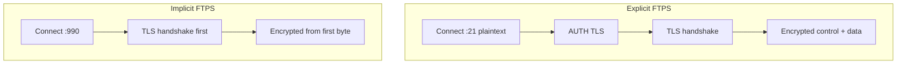

# FTPS

FTPS (FTP over SSL/TLS) adds a TLS encryption layer to the classic FTP protocol so that credentials, commands, and file contents are no longer sent in plaintext. It is the encryption option **natively supported by the IIS FTP Server role** — no third-party software required.

## Overview

Plain FTP sends the username, password, commands, and file contents **unencrypted**. Before exposing an FTP site beyond a trusted LAN, add TLS by enabling FTPS on the site. FTPS reuses the FTP command model (control port 21, negotiated data ports) and wraps the connections in TLS.

> [!WARNING]
> **FTPS is not SFTP**
> These are two different protocols. Choosing the wrong one is the single most common FTPS mistake — see the comparison below.

## Concepts

### FTPS vs SFTP — Not the Same Protocol

- **FTPS (FTP over SSL/TLS)** is what IIS's built-in FTP Server role supports natively — it is the classic FTP protocol (control port 21, negotiated data ports) with a TLS handshake layered on top.
- **SFTP (SSH File Transfer Protocol)** is a completely different protocol tunneled over SSH (port 22). **IIS FTP does not do SFTP** — there is no `sftp` option anywhere in the FTP role. To offer SFTP on Windows Server you need a separate SSH server (e.g. the optional `OpenSSH Server` Windows feature, or a third-party product) — that is out of scope for the IIS FTP role.

### Explicit vs Implicit FTPS

- **Explicit FTPS (FTPES)**: client connects on the normal control port (21) in plaintext, then issues an `AUTH TLS` command to upgrade the connection before authenticating. This is the IIS default when SSL is enabled on a site bound to any port other than 990.
- **Implicit FTPS**: the entire session is TLS-encrypted from the first byte — no `AUTH TLS` negotiation. IIS treats a site as implicit FTPS when it is bound to **port 990**.

| Feature | Plain FTP | Explicit FTPS | Implicit FTPS | SFTP |
|---|---|---|---|---|
| Port | 21 | 21 (upgrades via `AUTH TLS`) | 990 | 22 |
| Encryption | None | Negotiated after connect | From first packet | SSH channel |
| Native to IIS FTP role | Yes | Yes | Yes | **No** — needs a separate SSH server |
| Underlying protocol | FTP | FTP + TLS | FTP + TLS | SSH |
| Common clients | `ftp.exe`, any FTP client | FileZilla, WinSCP, `curl --ftp-ssl` | FileZilla, WinSCP (older systems) | FileZilla, WinSCP, OpenSSH `sftp` |

## Architecture

Explicit FTPS starts plaintext on port 21 and upgrades in-band; implicit FTPS is encrypted from the first packet on port 990. Both encrypt the control channel and (per policy) the data channel.



## Configuration

### Configuring FTPS on an IIS FTP Site

1. Obtain or generate a server certificate and install it into the server's personal certificate store (**IIS Manager → Server Certificates**, or request one from an internal/enterprise CA). For a lab-only self-signed cert:

```powershell
New-SelfSignedCertificate -DnsName "ftp.contoso.local" -CertStoreLocation "cert:\LocalMachine\My"   # untested
```

2. In **IIS Manager**, select the FTP site → double-click **FTP SSL Settings**.
3. Choose the certificate from the **SSL Certificate** dropdown.
4. Under **SSL Policy**, pick:
   - **Allow SSL connections** — client decides whether to encrypt (least secure).
   - **Require SSL connections** — encryption mandatory for the whole session.
   - **Custom** — set **Control Channel** and **Data Channel** independently. `SslRequireCredentialsOnly` on the control channel + `SslRequire` on the data channel is a common balance: credentials are always encrypted, and all transferred data is always encrypted.
5. Click **Apply**.

> [!NOTE]
> **Screenshot**
> 

### appcmd.exe equivalent

Equivalent from the command line with `appcmd.exe` (syntax per Microsoft Learn's FTP-over-SSL reference):

```cmd
appcmd.exe set config -section:system.applicationHost/sites /[name='MyFTPSite'].ftpServer.security.ssl.serverCertHash:"<cert-thumbprint>" /commit:apphost
:: untested
appcmd.exe set config -section:system.applicationHost/sites /[name='MyFTPSite'].ftpServer.security.ssl.controlChannelPolicy:"SslRequire" /commit:apphost
:: untested
appcmd.exe set config -section:system.applicationHost/sites /[name='MyFTPSite'].ftpServer.security.ssl.dataChannelPolicy:"SslRequire" /commit:apphost
:: untested
```

## PowerShell

Equivalent pattern via the `WebAdministration` PowerShell `IIS:\` provider (property names follow the same `ftpServer.security.ssl.*` config path shown above):

```powershell
Import-Module WebAdministration   # untested
Set-ItemProperty "IIS:\Sites\MyFTPSite" -Name ftpServer.security.ssl.serverCertHash -Value "<cert-thumbprint>"   # untested
Set-ItemProperty "IIS:\Sites\MyFTPSite" -Name ftpServer.security.ssl.controlChannelPolicy -Value SslRequire   # untested
Set-ItemProperty "IIS:\Sites\MyFTPSite" -Name ftpServer.security.ssl.dataChannelPolicy -Value SslRequire   # untested
```

- To force implicit FTPS instead, bind the FTP site to port **990** (Site Bindings) and require SSL as above — see [Types-of-Site-Binding-in-IIS](../Web-Server-IIS/Types-of-Site-Binding-in-IIS.md) for how FTP bindings work.

## Examples

Connect and verify FTPS from a client:

- **FileZilla**: in Site Manager set **Encryption** to `Require explicit FTP over TLS` (port 21) or `Require implicit FTP over TLS` (port 990) to match the server. A mismatch produces a handshake failure, not a silent plaintext fallback, when the server enforces `SslRequire`.
- **curl** (explicit FTPS):

```bash
curl --ftp-ssl -u ftpuser ftp://ftp.contoso.local/report.zip -o report.zip   # untested
```

## Security Considerations

- Prefer **Require SSL** (or a Custom policy that requires SSL on both channels) so encryption cannot be skipped by the client.
- Use a certificate issued by an internal/enterprise CA rather than self-signed for production — self-signed certs force clients to trust-on-first-use and are easy to spoof.
- Disable weak TLS versions/ciphers at the OS SChannel level; IIS FTP relies on the Windows TLS stack, so system-wide SChannel hardening applies.
- FTPS still exposes the passive data-port range at the firewall — pair it with the restrictions in [FTP-Security](FTP-Security.md).

## Troubleshooting

- **Handshake fails immediately** → client encryption mode (explicit vs implicit) does not match the server binding (port 21 vs 990).
- **Data transfer stalls after login** → data-channel TLS required but the passive-port range is blocked at the firewall; open the passive range.
- **Certificate errors on the client** → self-signed or untrusted CA; import the CA/cert into the client trust store.

## References

- Microsoft Learn — [Configuring FTP over SSL in IIS 7 and later](https://learn.microsoft.com/en-us/iis/configuration/system.applicationhost/sites/site/ftpserver/security/ssl)
- Microsoft Learn — [New-SelfSignedCertificate](https://learn.microsoft.com/en-us/powershell/module/pki/new-selfsignedcertificate)
- RFC 4217 — Securing FTP with TLS

## Related

- [Enterprise Windows Infrastructure Security](../Readme.md) — course hub and map of content
- [FTP-Setup-in-IIS](FTP-Setup-in-IIS.md) — installing and configuring the FTP site FTPS is applied to — related note
- [FTP-Security](FTP-Security.md) — broader hardening checklist for the FTP service — related note
- [FTP-User-Isolation](FTP-User-Isolation.md) — sandboxing users into their own directories — related note
- [FTP-Logging](FTP-Logging.md) — auditing FTPS connections and TLS failures — related note
- [Types-of-Site-Binding-in-IIS](../Web-Server-IIS/Types-of-Site-Binding-in-IIS.md) — the 990 implicit-FTPS binding and control-port bindings — related note
- [Internet-Information-Services(IIS)](../Web-Server-IIS/Internet-Information-Services(IIS).md) — the IIS role hosting the FTP service — related note
- Network-Sniffing — the plaintext-capture threat FTPS defends against — related note
