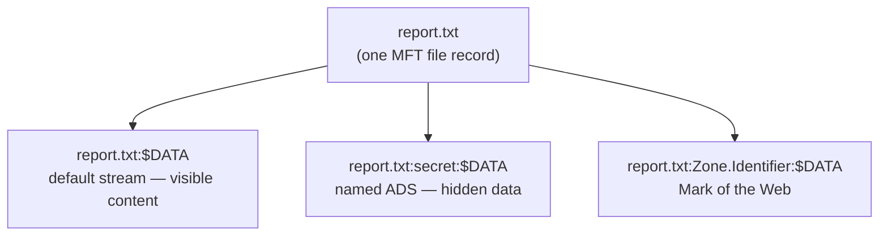

# Alternate Data Streams (ADS)

Alternate Data Streams (ADS) are an NTFS feature that lets a single file or folder hold more than one separate stream of data under the same name. They are hidden named data forks attached to a file, so one file entry can carry multiple independent data streams that ordinary tools (like a plain `dir`) never show.

## Overview

On NTFS, every file has a primary (default) data stream that holds its visible content, plus optional extra **named** streams that each behave like an independent chunk of data attached to the same file entry. The feature originates from NTFS's design goal of interoperating with the Apple HFS resource-fork model, and it remains a legitimate mechanism for attaching metadata to a file without altering the file's visible content. Because most GUI tools and many older utilities ignore alternate streams, ADS is also a well-known data-hiding and persistence technique. See [File-System](File-System.md) for the wider NTFS context and [NTFS-(New-Technology-File-System)-Permissions](NTFS-(New-Technology-File-System)-Permissions.md) for the access-control model that governs the underlying file.

> [!NOTE]
> **NTFS only**
> ADS is a property of **NTFS**. Copying a file that carries alternate streams onto a FAT/FAT32/exFAT volume, into a ZIP archive, or across many network protocols silently strips the extra streams — the default stream survives, the named streams do not.

## How It Works

Each stream is addressed with a colon syntax, and the stream type is `$DATA`:

```cmd
filename:streamname:$DATA
```

- `filename` — the host file (or directory).
- `streamname` — the alternate stream's name; omitting it (and the colon) refers to the default unnamed stream, which is the normal file content shown simply as `filename`.
- `$DATA` — the stream **attribute type**. It is implicit and rarely typed, but `filename:$DATA` is a valid way to name the default stream explicitly.

A single file therefore looks like this on disk:



The file's reported size reflects only the default stream, which is why alternate streams are so easy to overlook — a "0-byte" file can hold megabytes of hidden data in a named stream.

## Working with ADS

### Creating streams

- Open (or create) a normal file `2.txt` with only its default data stream `2.txt:$DATA`:

```cmd
notepad 2.txt
```

- Write `Test` into the main stream of `3.txt` (`3.txt:$DATA`):

```cmd
echo Test > 3.txt
```

- Open (creating if needed) a named ADS `test2` on `4.txt` → `4.txt:test2:$DATA`. Whatever you save in Notepad goes into the stream, not into the visible `4.txt` content:

```cmd
notepad 4.txt:test2
```

- Same idea on `5.txt`; the primary `5.txt` can stay empty while data hides in the `test1` stream:

```cmd
notepad 5.txt:test1
```

- Write text straight into a named stream from the shell:

```cmd
echo Secret info > normal.txt:hidden
```

### Reading and extracting streams

- Read a named stream (redirection is required — you cannot `type` a stream by name on all versions):

```cmd
more < normal.txt:hidden
```

- Copy a stream back out to a normal, visible file:

```cmd
more < normal.txt:hidden > extracted.txt
```

### PowerShell

PowerShell exposes streams first-class through the `-Stream` parameter:

- List every stream on a file:

```powershell
Get-Item .\normal.txt -Stream *
```

- Read one specific stream:

```powershell
Get-Content .\normal.txt -Stream hidden
```

- Empty a stream's contents:

```powershell
Clear-Content .\normal.txt -Stream hidden
```

- Delete a stream outright (leaving the host file intact):

```powershell
Remove-Item .\normal.txt -Stream hidden
```

## Detecting and Enumerating Streams

- `dir /R` lists alternate data streams for the current directory. The first line per file is the main stream; indented lines beneath it are ADS with their sizes:

```cmd
dir /R
```

- Add `/s` to recurse into subdirectories and `/b` for bare (path-only) output — useful for hunting hidden streams across an entire drive:

```cmd
dir /R /b /s
```

- PowerShell recursion is often cleaner for hunting; list files that carry any non-default stream:

```powershell
Get-ChildItem -Recurse | Get-Item -Stream * | Where-Object Stream -ne ':$DATA'
```

- **Sysinternals `streams.exe`** (Mark Russinovich) recursively reports and can delete alternate streams:

```cmd
streams.exe -s C:\path\to\scan
streams.exe -d suspicious.txt
```

- **NirSoft AlternateStreamView** — a GUI utility that scans an NTFS volume, lists all ADS, and can export a report or extract/delete streams. More convenient than `dir /R` for auditing at scale: <https://www.nirsoft.net/utils/alternate_data_streams.html>

> [!TIP]
> **Hunt the whole volume, not one folder**
> A single file can appear empty in Explorer while hiding a payload in a named stream. When triaging a host, sweep recursively (`streams.exe -s C:\`, `dir /R /s`, or a PowerShell recurse) rather than inspecting suspect files one at a time.

## Zone.Identifier and Mark of the Web

The most common ADS you will meet in the wild is **`Zone.Identifier`**. When a file is downloaded via a browser or saved from email, Windows attaches a `Zone.Identifier` stream recording the security zone it came from — this is the **Mark of the Web (MOTW)** that triggers SmartScreen prompts and Protected View in Office.

- Inspect the tag:

```powershell
Get-Content .\installer.exe -Stream Zone.Identifier
```

- A `ZoneId=3` value marks the file as originating from the Internet zone.

> [!IMPORTANT]
> **Attackers strip the Mark of the Web**
> Because MOTW lives in a *removable* alternate stream, a downloaded payload can be "de-quarantined" simply by deleting its `Zone.Identifier` stream (for example with `Remove-Item -Stream Zone.Identifier` or `Unblock-File`), or by delivering the payload inside a container format (older ISO/VHD mounts, some archives) that never propagated the mark to the extracted contents. Defensively, the presence or absence of `Zone.Identifier` is a useful triage signal.

## Security Considerations

> [!WARNING]
> **ADS as a hiding and persistence primitive**
> - **Concealment** — payloads, tools, and exfiltrated data can be parked in a named stream on an innocuous host file; the host file's size and Explorer view do not reveal it. See [Windows-Registry](../Windows-Commands/Windows-Registry.md) for another stealthy on-host storage location.
> - **Execution** — an executable stored in a stream can be launched via living-off-the-land binaries. Copy a binary into a stream and reference it by full path; modern Windows restricts direct invocation of some streams, so treat the exact launch technique as version-dependent:
>   ```cmd
>   type C:\tools\nc.exe > C:\Users\Public\report.txt:nc.exe
>   wmic process call create "C:\Users\Public\report.txt:nc.exe" # untested
>   ```
> - **MOTW bypass** — deleting the `Zone.Identifier` stream removes the Mark of the Web that would otherwise trip SmartScreen and Protected View.
> - **Blind backups** — backup, copy, and antivirus tools that are not ADS-aware may miss malicious streams (leaving persistence in place) or drop legitimate metadata streams on restore.

For defenders, alternate streams should be part of file-integrity monitoring and incident triage; see the module-level [Enterprise Windows Infrastructure Security](../Readme.md) guidance and Remote-Code-Execution-to-Reverse-shell for how hidden payloads become execution.

## Best Practices

- Include ADS enumeration (`streams.exe -s`, `dir /R /s`, or a PowerShell recurse) in host triage and file-integrity monitoring — do not trust Explorer's view.
- Preserve legitimate streams during backup/restore by using ADS-aware tooling; verify that copies to non-NTFS targets are acceptable given that streams are stripped.
- Treat a missing `Zone.Identifier` on a recently downloaded executable as suspicious; keep MOTW enforcement (SmartScreen, Protected View) enabled.
- Alert on `type`/redirection into `file:stream` and on stream execution via LOLBins (`wmic`, `mshta`, etc.) in endpoint logging.
- Remove unknown or unneeded streams with `Remove-Item -Stream` or `streams.exe -d` after investigation.

## Troubleshooting

| Symptom | Likely cause & fix |
| --- | --- |
| A file looks empty but "feels" large or suspicious | Data hidden in a named stream — enumerate with `dir /R` or `Get-Item -Stream *` |
| Hidden streams disappeared after copying | The copy crossed to FAT/exFAT, a ZIP, or a non-ADS-aware transfer — streams only survive on NTFS |
| `type file:stream` errors out | Use redirection instead: `more < file:stream` |
| Downloaded app runs with no SmartScreen warning | The `Zone.Identifier` (Mark of the Web) stream is absent or was stripped |
| `dir /R` shows no streams you expected | Wrong directory, non-NTFS volume, or the stream is on a different file — recurse with `dir /R /s` |

## References

- Microsoft Learn — NTFS streams (`$DATA` attribute / named streams): <https://learn.microsoft.com/en-us/openspecs/windows_protocols/ms-fscc/c54dec26-1551-4d3a-a0ea-4fa40f848eb3>
- Microsoft Learn — `FILE_STREAM_INFORMATION` and enumerating file streams: <https://learn.microsoft.com/en-us/windows-hardware/drivers/ddi/ntifs/ns-ntifs-_file_stream_information>
- Sysinternals — Streams (`streams.exe`) utility: <https://learn.microsoft.com/en-us/sysinternals/downloads/streams>
- NirSoft — AlternateStreamView: <https://www.nirsoft.net/utils/alternate_data_streams.html>

## Related
- [Enterprise Windows Infrastructure Security](../Readme.md) — course hub and map of content
- [File-System](File-System.md) — related note (NTFS and the file systems that back it)
- [NTFS-(New-Technology-File-System)-Permissions](NTFS-(New-Technology-File-System)-Permissions.md) — related note (ACL model on the host file)
- [Windows-Basic-Commands](../Windows-Commands/Windows-Basic-Commands.md) — related note (`dir /r`, `more`, `type` used to inspect streams)
- [Windows-Registry](../Windows-Commands/Windows-Registry.md) — related note (another stealthy on-host storage location)
- Remote-Code-Execution-to-Reverse-shell — related note (ADS can hide payloads for execution)
