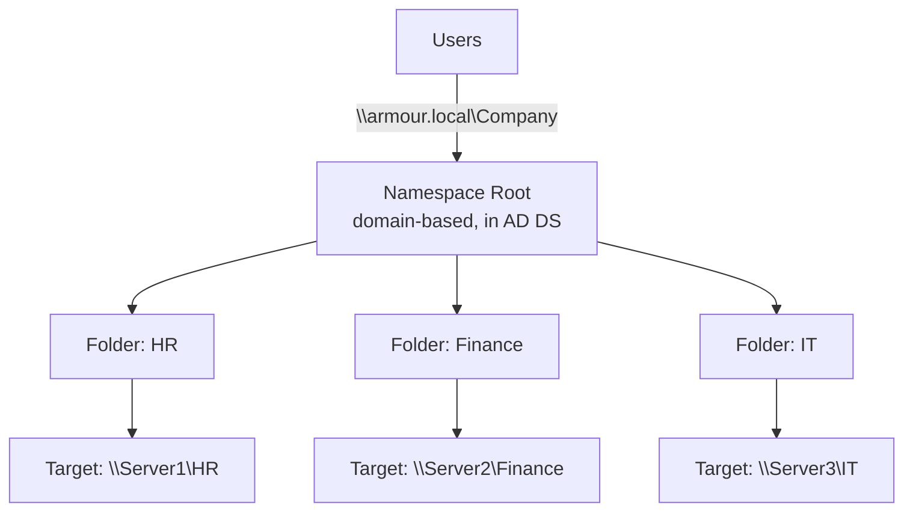

# DFS Namespaces (Distributed File System Namespaces)

DFS Namespaces (DFS-N) is a Windows Server role service that groups shared folders located on different servers into one or more logically structured namespaces. Each namespace presents users with a single, unified directory tree of shared folders, streamlining access, management, and fault tolerance for network file resources.

## Overview

Instead of asking users to remember which server hosts which share (`\\Server1\HR`, `\\Server2\Finance`, `\\Server3\IT`), DFS Namespaces exposes all of them under one path such as `\\armour.local\Company`. The underlying folder targets can be moved, added, or removed without changing the path that users and applications see.

> [!NOTE]
> **DFS-N vs DFS-R**
> DFS **Namespaces** provides the unified logical view of shares. DFS **Replication** (DFS-R) keeps the *contents* of folder targets synchronized across servers. They are separate role services that are frequently deployed together — see [DFS-Replication](DFS-Replication.md).

## Concepts

Key components of a DFS deployment:

| Component | Description |
| --- | --- |
| **Namespace** | A virtual collection presenting shared folders from various servers under one logical view, accessed via a single UNC path (e.g., `\\DomainName\Namespace`). |
| **Namespace server** | Hosts and manages the namespace, processes client referral requests, and can be a member server or a domain controller. |
| **Folder target** | The actual network shared folder (UNC path) that a namespace folder points to. |
| **DFS root** | The entry point or starting node for a DFS namespace (domain-based or standalone). |
| **Referral** | The ordered list of folder targets a client receives when it accesses a namespace folder; enables failover and load balancing. |

## Architecture

Types of DFS namespaces:

| Type | Storage Location | Example Path | Replication / Fault Tolerance |
| :-- | :-- | :-- | :-- |
| Domain-based | Active Directory (AD DS) | `\\domain\DFS` | Supports multi-server hosting, automatic metadata replication, high availability |
| Standalone | Local registry on server | `\\Server\DFS` | No automatic replication unless a failover cluster is used |

### Domain-based DFS

- Namespace information is stored in Active Directory.
- Multiple namespace servers can host the same namespace for redundancy.
- High availability, automatic metadata replication, and larger scalability (recommended up to 50,000 folders with targets).
- Enhanced support for DFS Replication (DFSR) on Windows Server 2008 or newer.

### Standalone DFS

- Namespace information is saved on a single server (in the registry).
- No built-in redundancy or automatic failover (unless deployed using Windows Failover Clustering).
- Limited to the availability of the hosting server.



## Installation

Install the DFS Namespaces role service with PowerShell:

```powershell
# untested
Install-WindowsFeature -Name FS-DFS-Namespace -IncludeManagementTools
```

## Configuration

### 1. Create a new namespace

```powershell
New-DfsnRoot -Path "\\armour.local\Company" -TargetPath "\\Server1\SharedFolder" -Type DomainV2
```

### 2. Add folder targets

```powershell
New-DfsnFolder -Path "\\armour.local\Company\HR" -TargetPath "\\Server1\HR"
New-DfsnFolder -Path "\\armour.local\Company\Finance" -TargetPath "\\Server2\Finance"
New-DfsnFolder -Path "\\armour.local\Company\IT" -TargetPath "\\Server3\IT"
```

### 3. Enable DFS Replication for a folder

Pair the namespace with DFS-R so folder targets stay in sync (covered fully in [DFS-Replication](DFS-Replication.md)):

```powershell
New-DfsReplicationGroup -GroupName "Company" -DomainName "armour.local"
Add-DfsrMember -GroupName "Company" -ComputerName "Server1", "Server2", "Server3"
Add-DfsrConnection -GroupName "Company" -SendingMember "Server1" -ReceivingMember "Server2"
Set-DfsrMembership -GroupName "Company" -FolderName "HR" -ContentPath "C:\Shares\HR" -ComputerName "Server1"
```

## Administration

DFS namespaces can be managed with several tools:

- **DFS Management console (GUI)** — the MMC snap-in for creating namespaces and folder targets.
- **PowerShell cmdlets** — the `DFSN` module (namespaces) and `DFSR` module (replication).
- **DfsUtil and WMI scripts** — legacy command-line management.

## GUI Steps

1. Open **Server Manager → Tools → DFS Management**.
2. Right-click **Namespaces → New Namespace**, choose the hosting server and namespace name, and select **Domain-based namespace**.
3. Right-click the new namespace → **New Folder**, name it, and add one or more **folder targets** (UNC paths).

> [!NOTE]
> **Screenshot**
> 

## Examples

Given these physical shares:

- `\\Server1\HR`
- `\\Server2\Finance`
- `\\Server3\IT`

Create a DFS namespace:

```text
\\armour.local\Company
```

Map folders to targets:

- `HR` → `\\Server1\HR`
- `Finance` → `\\Server2\Finance`
- `IT` → `\\Server3\IT`

Users then connect via a single, server-independent path:

```text
\\armour.local\Company\HR
\\armour.local\Company\Finance
\\armour.local\Company\IT
```

## Enterprise Deployment

DFS benefits at enterprise scale:

- **Centralized access** to file shares dispersed across multiple servers.
- **Load balancing and fault tolerance** with domain-based namespaces and multiple folder targets.
- **Easy migration** — change or repoint targets without affecting the paths users rely on.
- **DFS Replication (DFSR)** support for high availability and redundancy.
- **Access-based enumeration (ABE)** and granular permissions at the namespace and folder level.

## Security Considerations

- Namespace and folder permissions layer on top of the underlying **share** and **NTFS** permissions of each target; the most restrictive of the three wins. See [Share-Permissions](Share-Permissions.md) and [NTFS-(New-Technology-File-System)-Permissions](NTFS-(New-Technology-File-System)-Permissions.md).
- Domain-based namespace metadata lives in AD DS — protect namespace-server and domain-controller access accordingly.
- Enable **access-based enumeration** so users only see folders they can access, reducing information disclosure during share enumeration.

## Best Practices

- Prefer **domain-based (DomainV2)** namespaces for availability and transparent server migration.
- Add multiple **folder targets** and pair with **DFS-R** for redundancy.
- Keep namespace folder structure shallow and meaningful; stay within the ~50,000 folders-with-targets guidance.
- Set referral ordering and target priorities to keep clients on same-site targets.

## Troubleshooting

| Symptom | Likely cause | Resolution |
| --- | --- | --- |
| DFS path unreachable | Broken folder target or disabled referral | Check target health and enabled referrals in DFS Management |
| Users routed to a remote-site target | Referral ordering / site costing misconfigured | Configure target priorities and enable site-aware referrals |
| Namespace missing after DC change | Domain-based metadata replication lag | Verify AD replication; confirm namespace servers are online |
| Access denied through DFS | Restrictive share/NTFS ACL on the target | Reconcile share and NTFS permissions on the folder target |

## References

- Microsoft Learn — DFS Namespaces overview: <https://learn.microsoft.com/en-us/windows-server/storage/dfs-namespaces/dfs-overview>
- Microsoft Learn — DFSN PowerShell module: <https://learn.microsoft.com/en-us/powershell/module/dfsn/>

## Related

- [Enterprise Windows Infrastructure Security](../Readme.md) — course hub and map of content
- [DFS-Replication](DFS-Replication.md) — keeps folder-target contents synchronized across servers — related note
- [Share-Permissions](Share-Permissions.md) — SMB share permissions that layer under DFS folders — related note
- [File-Server-Resource-Manager(FSRM)](File-Server-Resource-Manager(FSRM).md) — storage governance for file-server shares — related note
