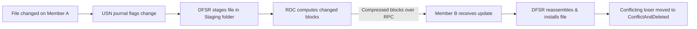

# DFS Replication

DFS Replication (DFSR) is a multi-master, state-based replication engine in Windows Server that keeps folders synchronized across multiple servers. It replicates only the changed blocks of files using **Remote Differential Compression (RDC)**, making it efficient over WAN links, and it is the mechanism modern Active Directory domains use to replicate **SYSVOL** between Domain Controllers.

## Overview

DFSR replaces the older **File Replication Service (FRS)** and is commonly paired with [DFS-Namespaces-(Distributed-File-System-Namespaces)](DFS-Namespaces-(Distributed-File-System-Namespaces).md) to provide both a unified logical path *and* redundant, load-balanced copies of the underlying data. Where a DFS namespace points several folder targets at the same logical share, DFSR is what keeps those targets identical.

Because it is **multi-master**, a change made on any member replicates outward to all other members — there is no single authoritative source. This is powerful for availability but means write conflicts are resolved automatically (last-writer-wins), so DFSR is unsuitable for workloads where multiple users edit the same open file simultaneously.

> [!NOTE]
> **DFSR vs. AD replication**
> DFSR is *file* replication (folder contents, including SYSVOL scripts and GPO files). The directory database itself (`NTDS.dit`) is synchronized separately by [AD-Replication](../Active-Directory-Domain-Services-AD-DS/AD-Replication.md). In a domain at the Windows Server 2008+ functional level, DFSR handles SYSVOL; FRS handled it in older domains.

## How It Works

DFSR watches each replicated volume's NTFS **USN change journal** to detect modifications. When a file changes, DFSR computes the differences, stages a compressed copy, and sends only the changed blocks to downstream members over authenticated RPC.



- **Remote Differential Compression (RDC)** — transfers only the byte ranges that changed instead of the whole file; especially effective for large files with small edits.
- **Staging folder** — a per-replicated-folder cache holding compressed copies of files marshaled for transmission. Sizing it correctly is critical for throughput (see Troubleshooting).
- **DFSR database** — an ESE (Jet) database per replicated volume under `System Volume Information\DFSR`, tracking file metadata and version vectors.
- **Conflict resolution** — file conflicts use **last-writer-wins**; the losing copy is moved to the hidden **ConflictAndDeleted** folder rather than being lost outright.

## Components

| Component | Description |
| --- | --- |
| **Replication group** | A set of servers (members) that participate in replicating one or more folders. |
| **Replicated folder** | A folder kept in sync across all members of the group; each has its own settings and filters. |
| **Member** | A server that hosts a copy of the replicated folder(s). |
| **Connection** | A one-way replication path between two members; two connections form a bidirectional link. |
| **Topology** | The connection layout — **full mesh** (every member to every other) or **hub-and-spoke** (branches replicate through a central hub). |
| **Schedule & bandwidth throttling** | When replication may run and how much bandwidth it may consume, tunable per connection. |

## Configuration

DFSR is part of the **DFS Replication** role service under the File and Storage Services role. Install it, then create a replication group.

```powershell
# Install the DFS Replication role service
Install-WindowsFeature -Name FS-DFS-Replication -IncludeManagementTools
```

Inspect replication topology and health with the DFSR PowerShell module:

```powershell
Get-DfsReplicationGroup
Get-DfsrMember -GroupName "Group1"
Get-DfsReplicatedFolder -GroupName "Group1"
Get-DfsrConnection -GroupName "Group1"
```

Check for a replication **backlog** (files queued but not yet replicated) between two members:

```powershell
# Backlog from a sending to a receiving member
Get-DfsrBacklog -GroupName "Group1" -FolderName "Folder1" `
    -SourceComputerName "SRV-HUB" -DestinationComputerName "SRV-BRANCH"
```

```cmd
:: Legacy diagnostic equivalents
dfsrdiag backlog /rgname:Group1 /rfname:Folder1 /smem:SRV-HUB /rmem:SRV-BRANCH
dfsrdiag replicationstate
```

> [!TIP]
> **Pre-seed before first sync**
> For large data sets, copy the files to each downstream member *before* enabling replication (pre-seeding / pre-staging) so DFSR only has to reconcile hashes rather than transfer everything over the wire. This dramatically shortens initial replication.

### SYSVOL replication

Modern domains replicate SYSVOL with DFSR. Legacy domains that were built on FRS must be migrated using `dfsrmig`, which walks through the **Prepared → Redirected → Eliminated** states.

```cmd
dfsrmig /getglobalstate
dfsrmig /setglobalstate 1
dfsrmig /setglobalstate 2
dfsrmig /setglobalstate 3
```

## Security Considerations

DFSR's replicated content is only as trustworthy as its least-secure member, and SYSVOL replication makes it a domain-wide code-distribution channel.

> [!WARNING]
> **Offensive and defensive relevance**
> - **SYSVOL is a payload highway.** SYSVOL (replicated by DFSR) carries Group Policy files and logon scripts. An attacker who gains **write** access to SYSVOL on any DC can plant a malicious script or GPO that DFSR replicates to every DC and applies domain-wide. The classic **GPP `cpassword`** leak (an AES-encrypted password in `Groups.xml`) was readable by any domain user precisely because SYSVOL is replicated everywhere.
> - **Poisoned member.** Because DFSR is multi-master, malicious files written to a compromised member replicate *outward* to healthy members. Segment and monitor write access to replicated folders.
> - **Data remanence.** The **Staging** and **ConflictAndDeleted** folders retain copies of files — including files a user believes were deleted or overwritten. Treat them as potential sources of sensitive-data leakage and as forensic artifacts.
> - **Stale FRS.** Domains still using FRS for SYSVOL run a deprecated, unsupported engine; migrate to DFSR.

- Restrict NTFS write permissions on replicated folders (especially SYSVOL) to trusted administrators — see [NTFS-(New-Technology-File-System)-Permissions](NTFS-(New-Technology-File-System)-Permissions.md).
- Monitor the **DFS Replication** event log and include Staging/ConflictAndDeleted folders in file-integrity monitoring.
- Be aware DFSR does not replicate [Alternate-Data-Streams(ADS)](Alternate-Data-Streams(ADS).md) by default in older versions — do not rely on it to carry stream-hidden data.

## Best Practices

- **Migrate SYSVOL from FRS to DFSR** with `dfsrmig` if the domain has not already done so.
- **Size the staging folder** to at least the combined size of the 32 largest files in each replicated folder to avoid throttling and repeated staging churn.
- **Use hub-and-spoke** topology and **schedule/throttle bandwidth** for large or WAN-connected deployments.
- **Do not use DFSR** for data with constantly open files (live databases, roaming profiles, PST files) — multi-master conflicts and file locks cause data loss.
- **Monitor backlog** routinely with `Get-DfsrBacklog` / `dfsrdiag backlog` so replication lag is caught before it becomes divergence.

## Troubleshooting

| Symptom | Likely cause & fix |
| --- | --- |
| Replication stopped; Event ID **2213** logged | DFSR database dirty shutdown; replication is auto-suspended pending manual resume. Resume via the `ResumeReplication` WMI method on the volume config. |
| Large, growing backlog | Bandwidth/schedule limits or a still-running initial sync. Check with `Get-DfsrBacklog`; pre-seed and widen the schedule. |
| Files never replicate | File larger than the staging quota, or matched by a file/subfolder filter. Increase the staging quota and review filters. |
| SYSVOL not replicating to a new DC | Domain still using FRS for SYSVOL. Migrate with `dfsrmig`. |
| "Lost" edits / duplicate files | Multi-master last-writer-wins conflict; loser is in **ConflictAndDeleted**. Redesign so only one member writes a given file. |

## References

- Microsoft Learn — DFS Replication overview: <https://learn.microsoft.com/windows-server/storage/dfs-replication/dfsr-overview>
- Microsoft Learn — Migrate SYSVOL replication to DFS Replication (`dfsrmig`): <https://learn.microsoft.com/windows-server/storage/dfs-replication/migrate-sysvol-to-dfsr>
- Microsoft Learn — DFSR staging folder and Conflict/Deleted sizing: <https://learn.microsoft.com/troubleshoot/windows-server/networking/dfsr-sizing-guidelines-staging-conflictanddeleted-folders>

## Related

- [DFS-Namespaces-(Distributed-File-System-Namespaces)](DFS-Namespaces-(Distributed-File-System-Namespaces).md) — related note (the logical namespace DFSR keeps in sync)
- [File-Server-Resource-Manager(FSRM)](File-Server-Resource-Manager(FSRM).md) — related note (governing the storage DFSR replicates)
- [NTFS-(New-Technology-File-System)-Permissions](NTFS-(New-Technology-File-System)-Permissions.md) — related note (securing replicated folders)
- [Alternate-Data-Streams(ADS)](Alternate-Data-Streams(ADS).md) — related note (NTFS streams and replication behavior)
- [AD-Replication](../Active-Directory-Domain-Services-AD-DS/AD-Replication.md) — related note (how the AD database, distinct from SYSVOL files, replicates)
- [Enterprise Windows Infrastructure Security](../Readme.md) — course hub
