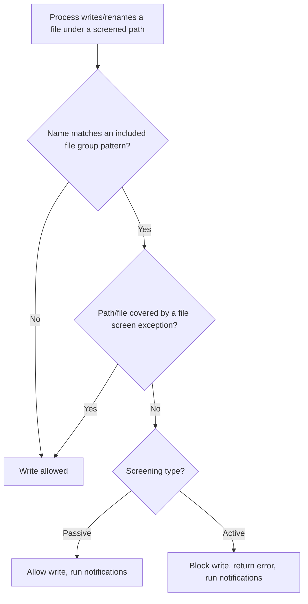

# File Screening (FSRM)

File screening is a **File Server Resource Manager (FSRM)** feature that controls which **file types** users may save to a folder and its subfolders. It matches files by **extension** against defined **file groups** and either blocks the write (active screening) or allows it while recording and notifying (passive screening).

## Overview

File screening is one of the storage-governance controls provided by [File-Server-Resource-Manager(FSRM)](File-Server-Resource-Manager(FSRM).md), alongside quotas, classification, and reporting. Where an [NTFS permission](NTFS-(New-Technology-File-System)-Permissions.md) answers *who* may write to a folder, a file screen answers *what* they may write there — for example, preventing users from storing `.mp3`, `.mp4`, or executable files on a shared documents volume, or acting as an early-warning tripwire for ransomware file extensions.

Screening is applied per path and is inherited by subfolders. It is enforced by the FSRM service (`SRMSVC`) at the moment of the file-system write, not by a periodic scan.

> [!IMPORTANT]
> **Extension-based, not content-based**
> File screening matches on the **file name pattern** (typically the extension), not the file's actual content. It is a storage-hygiene and policy control, **not** a data-loss-prevention (DLP) or antimalware engine. Renaming a blocked file to an allowed extension bypasses the screen.

## How It Works

A file screen combines two things:

- **File groups** — named sets of include/exclude patterns (for example the built-in *Audio and Video Files* group: `*.mp3`, `*.mp4`, `*.wav`, …).
- **Screening type** — how the service reacts when a matching file is written:
  - **Active screening** — *blocks* the save and runs any configured notifications. The user receives an "access denied"-style error.
  - **Passive screening** — *allows* the save but runs notifications (email, event, report). Useful for monitoring and for a warn-before-enforce rollout.

When a process attempts to create or rename a file under a screened path, FSRM evaluates the name against the applicable file groups before the write completes.



> [!NOTE]
> **Exceptions override, and only downward**
> A **file screen exception** can only be created on a **subfolder** of a path that already has a screen, and it *loosens* the parent screen for that branch (allowing otherwise-blocked groups). You cannot tighten a screen with an exception — use a more specific screen or template for that.

## Components

| Component | Purpose | Key cmdlet(s) |
| --- | --- | --- |
| **File group** | Reusable set of include/exclude filename patterns | `New-FsrmFileGroup`, `Get-FsrmFileGroup` |
| **File screen** | Binds file groups + screening type to a path | `New-FsrmFileScreen`, `Get-FsrmFileScreen` |
| **File screen template** | Reusable screen definition applied to many paths; central updates propagate | `New-FsrmFileScreenTemplate` |
| **File screen exception** | Loosens a parent screen on a specific subfolder | `New-FsrmFileScreenException` |
| **Notification action** | Email / event log / command / report run on a screening event | `New-FsrmAction` |

## Configuration

Install the role feature and manage screens from the **File Server Resource Manager** console (`fsrm.msc`) or PowerShell (module `FileServerResourceManager`).

```powershell
# Install FSRM (Windows Server)
Install-WindowsFeature -Name FS-Resource-Manager -IncludeManagementTools
```

Create a custom file group and an **active** file screen that blocks it:

```powershell
# Define a file group of executable/script types
New-FsrmFileGroup -Name "Executables" `
    -IncludePattern @("*.exe","*.bat","*.cmd","*.ps1","*.vbs","*.scr")

# Active screen: block those types on the share and notify by event log
$action = New-FsrmAction -Type Event -EventType Warning `
    -Body "Blocked write of [Source File Path] by [Source Io Owner]"

New-FsrmFileScreen -Path "D:\Shares\Docs" -Active `
    -IncludeGroup "Executables" -Notification $action
```

Apply a reusable template, and add an exception for a subfolder:

```powershell
# Template-driven screen (central updates via Update mode)
New-FsrmFileScreenTemplate -Name "Block Executables" -Active `
    -IncludeGroup "Executables"
New-FsrmFileScreen -Path "D:\Shares\Docs" -Template "Block Executables"

# Allow executables only under a tooling subfolder
New-FsrmFileScreenException -Path "D:\Shares\Docs\Tools" `
    -IncludeGroup "Executables"
```

> [!TIP]
> **Roll out with passive screening first**
> Deploy a new screen with `-Active:$false` (passive) so it only logs and notifies. Review the events for legitimate hits, refine the file groups and exceptions, then flip it to active. This mirrors the "audit before you block" pattern used for [NTLM](../Active-Directory-Domain-Services-AD-DS/NTLM.md) restriction.

The legacy command-line tool `Filescrn.exe` performs the same operations (`filescrn filegroup`, `filescrn filescreen`, `filescrn template`) and remains available for scripting on older builds.

```cmd
:: Legacy CLI equivalent — list configured file screens
Filescrn.exe filescreen list   & rem # untested
```

## Security Considerations

> [!WARNING]
> **File screening is a policy control, not a security boundary**
> - **Trivial extension bypass** — because matching is by filename pattern, an attacker or user can rename `payload.exe` to `payload.txt`, save it, and rename it back. Screening will not stop content-based threats.
> - **Alternate Data Streams** — data written to an [NTFS Alternate Data Stream](Alternate-Data-Streams(ADS).md) rides on the host file's name, so it is not evaluated against the screen independently; ADS remains a data-hiding avenue on screened volumes.
> - **Exceptions widen exposure** — a broad file screen exception (or one placed on a widely writable folder) can silently re-open a path you believed was locked down. Audit exceptions like you audit permissive ACLs.
> - **Requires local admin to change** — an attacker with administrative rights on the file server can disable the `SRMSVC` service or delete screens; treat FSRM config as sensitive and monitor changes to it.

On the **defensive** side, active file screens are a cheap, high-signal control: blocking known ransomware extensions (or using passive screens + email/command notifications as a canary) can flag mass-encryption activity early. Because screening events name the offending path and the `Source Io Owner`, they are useful telemetry — forward the FSRM `SRMSVC` Application-log events and screening reports to your SIEM.

## Best Practices

- Start every new screen **passive**, review real hits, then promote to **active**.
- Manage screens with **templates** so a single change propagates to every path that uses it.
- Keep **file groups** small and purpose-named; combine include/exclude patterns instead of many overlapping screens.
- Restrict and audit **file screen exceptions** — scope them to the narrowest subfolder that needs the relief.
- Configure at least an **event-log or email notification** so screening activity is observable, and forward it to a SIEM.
- Remember screening layers *on top of* NTFS and share permissions — it does not replace least-privilege ACLs.

## Troubleshooting

| Symptom | Likely cause & fix |
| --- | --- |
| Blocked file type still gets saved | Screen is **passive**, not active — recreate/set it with `-Active`, or the path isn't covered (check inheritance and exceptions) |
| Users blocked in a folder that should be allowed | A parent **active screen** applies — add a scoped `New-FsrmFileScreenException` on the subfolder |
| No email/event on a screening hit | No notification action defined, or SMTP not configured — add `New-FsrmAction`; test mail with `Send-FsrmTestEmail` |
| Screen not enforced after path change | Templates propagate on update; re-apply the template or verify the screen `Path` matches the real share target |
| Renamed file evades the screen | Expected — screening is extension-based; combine with classification/AV for content control |

## References

- Microsoft Learn — File Server Resource Manager overview: <https://learn.microsoft.com/en-us/windows-server/storage/fsrm/fsrm-overview>
- Microsoft Learn — File Screening Management: <https://learn.microsoft.com/en-us/previous-versions/windows/it-pro/windows-server-2012-r2-and-2012/dn383587(v=ws.11)>
- Microsoft Learn — `FileServerResourceManager` PowerShell module: <https://learn.microsoft.com/en-us/powershell/module/fileserverresourcemanager/>

## Related

- [File-Server-Resource-Manager(FSRM)](File-Server-Resource-Manager(FSRM).md) — parent role that provides file screening, quotas, and classification
- [DFS-Namespaces-(Distributed-File-System-Namespaces)](DFS-Namespaces-(Distributed-File-System-Namespaces).md) — related note (presenting the shares that screens govern)
- [NTFS-(New-Technology-File-System)-Permissions](NTFS-(New-Technology-File-System)-Permissions.md) — related note (the *who*-can-write control that screening complements)
- [Alternate-Data-Streams(ADS)](Alternate-Data-Streams(ADS).md) — related note (an NTFS data-hiding avenue that screening does not inspect)
- [Enterprise Windows Infrastructure Security](../Readme.md) — course hub
