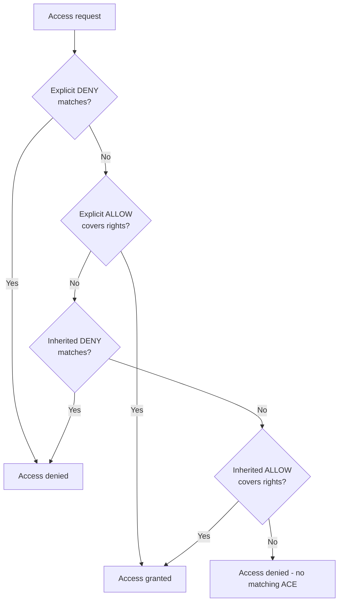

# ICACLS Command

`icacls` (Improved Change ACLs) is the modern Windows command-line utility for viewing, modifying, backing up, restoring, and verifying **NTFS Access Control Lists (ACLs)**. It replaces the deprecated `cacls` utility and adds support for advanced permissions, integrity levels, inheritance control, and ownership management.

## Overview

Every file and folder on an NTFS volume carries a **discretionary access control list (DACL)** — an ordered set of **access control entries (ACEs)** that grant or deny rights to specific users and groups. `icacls` is the primary command-line tool for reading and editing that list. It is the console counterpart to the **Security** tab in a file's Properties dialog, and the go-to tool for scripting permission changes across many files with `/T` (recursive) processing.

For the underlying permission model, see [NTFS-(New-Technology-File-System)-Permissions](NTFS-(New-Technology-File-System)-Permissions.md) and [NTFS-Default-Permissions](NTFS-Default-Permissions.md); for the PowerShell equivalent (`Get-Acl` / `Set-Acl`), see [NTFS-Permissions-Setup-with-PowerShell](NTFS-Permissions-Setup-with-PowerShell.md). `icacls` is closely paired with [TAKEOWN-Command](TAKEOWN-Command.md) (seizing ownership) and supersedes the legacy [CACLS-Command](CACLS-Command.md).

> [!NOTE]
> **icacls replaces cacls**
> `cacls` is deprecated. Microsoft recommends using `icacls` for all ACL management tasks — it correctly handles inherited ACEs, long paths, integrity levels, and Unicode, which `cacls` does not.

### Prerequisites

- Windows Vista / Windows Server 2008 or later.
- An **NTFS** file system (ACLs do not exist on FAT/FAT32 — see [File-System](File-System.md)).
- **Administrator** privileges to modify protected files or folders, or to change ownership.

## Syntax

```cmd
icacls <name> [/save <ACLfile> [/T]] [/restore <ACLfile>]
       [/grant[:r] <SID>:perm [...]]
       [/deny <SID>:perm [...]]
       [/remove[:g|:d] <SID> [...]]
       [/inheritance:e|d|r]
       [/setowner <user>]
       [/findsid <SID>]
       [/verify]
       [/reset]
       [/T] [/C] [/L] [/Q]
```

## Permission Codes

Simple rights (grant one keyword per user):

| Permission | Description |
|------------|-------------|
| `F` | Full Control |
| `M` | Modify |
| `RX` | Read & Execute |
| `R` | Read |
| `W` | Write |
| `D` | Delete |
| `N` | No Access |

Advanced (specific) rights, combined in parentheses for granular control:

| Code | Permission |
|------|------------|
| `DE` | Delete |
| `RC` | Read Control (read the DACL) |
| `WDAC` | Write DAC (modify the DACL) |
| `WO` | Write Owner (take ownership) |
| `S` | Synchronize |
| `AS` | Access System Security |
| `MA` | Maximum Allowed |
| `GR` | Generic Read |
| `GW` | Generic Write |
| `GE` | Generic Execute |
| `GA` | Generic All |

> [!TIP]
> **Inheritance flags on an ACE**
> When granting a permission you can append inheritance flags in parentheses, e.g. `(OI)(CI)(F)` = *Object Inherit* + *Container Inherit* + *Full Control*, so the ACE propagates to files (`OI`) and subfolders (`CI`). Other flags: `IO` (inherit only), `NP` (do not propagate), `I` (marks an already-inherited ACE in output).

## Display Permissions

Display the ACL of a file.

```cmd
icacls C:\Data\report.txt
```

Example output:

```text
C:\Data\report.txt BUILTIN\Administrators:(F)
                    NT AUTHORITY\SYSTEM:(F)
                    SRV01\Rahul:(M)
                    Everyone:(RX)

Successfully processed 1 files; Failed processing 0 files
```

Display permissions for a directory.

```cmd
icacls C:\Data
```

## Grant Permissions

Grant Full Control.

```cmd
icacls C:\Data /grant Rahul:F
```

Grant Modify permission.

```cmd
icacls C:\Data /grant Rahul:M
```

Grant Read and Execute.

```cmd
icacls C:\Data /grant Rahul:RX
```

Grant permissions recursively to a folder and its contents.

```cmd
icacls C:\Data /grant Rahul:F /T
```

## Replace Existing Permissions

`:r` replaces any existing explicit grant for that principal instead of adding to it.

```cmd
icacls C:\Data /grant:r Rahul:M
```

## Remove Permissions

Remove all explicit permissions (both granted and denied) for a user.

```cmd
icacls C:\Data /remove Rahul
```

Remove only granted (allow) ACEs.

```cmd
icacls C:\Data /remove:g Rahul
```

Remove only denied (deny) ACEs.

```cmd
icacls C:\Data /remove:d Rahul
```

## Deny Permissions

Deny Delete permission.

```cmd
icacls C:\Data /deny Rahul:D
```

Deny Full Control.

```cmd
icacls C:\Data /deny Rahul:F
```

> [!WARNING]
> **Deny takes precedence**
> An explicit **deny** ACE overrides an explicit **allow** ACE for the same right. Use deny sparingly — broad deny entries are hard to reason about and often produce "access denied" surprises. Prefer simply *not granting* a permission over explicitly denying it.

## Reset Permissions

Reset the ACL to the parent's inherited defaults, discarding explicit ACEs.

```cmd
icacls C:\Data /reset
```

Reset recursively.

```cmd
icacls C:\Data /reset /T
```

## Manage Inheritance

Enable inheritance.

```cmd
icacls C:\Data /inheritance:e
```

Disable inheritance while copying the previously inherited ACLs onto the object (preserves current effective access).

```cmd
icacls C:\Data /inheritance:d
```

Disable inheritance and remove all inherited ACLs (can leave an object with no access — use with care).

```cmd
icacls C:\Data /inheritance:r
```

## Change Ownership

Assign ownership to a user.

```cmd
icacls C:\Data /setowner Rahul
```

Recursive ownership change.

```cmd
icacls C:\Data /setowner Rahul /T
```

## Backup and Restore ACLs

Save ACLs to a file (recurse with `/T`).

```cmd
icacls C:\Data /save C:\Backup\data.acl /T
```

Restore previously saved ACLs. The restore is applied to the *contents* of the target directory using the file names recorded in the ACL file.

```cmd
icacls C:\ /restore C:\Backup\data.acl
```

## Verify, Find, and Utility Switches

Verify ACL consistency (reports canonical-order and other integrity problems).

```cmd
icacls C:\Data /verify
```

Locate files containing a specific SID.

```cmd
icacls C:\Data /findsid S-1-5-21-1234567890-1111111111-2222222222-1001
```

Continue past errors when processing many files.

```cmd
icacls C:\Data /grant Rahul:F /T /C
```

Suppress success messages (quiet mode).

```cmd
icacls C:\Data /grant Rahul:F /Q
```

Operate on a symbolic link itself instead of its target.

```cmd
icacls C:\Link /L
```

## How ACEs Are Evaluated

When a user requests access, Windows walks the DACL in canonical order and stops as soon as the requested rights are fully granted or any one of them is denied. Explicit ACEs are checked before inherited ones, and within each group deny entries precede allow entries.



## Common Examples

Grant Full Control recursively.

```cmd
icacls C:\Projects /grant Rahul:F /T
```

Grant Modify permission to a domain user.

```cmd
icacls C:\Shared /grant CONTOSO\John:M
```

Grant Read access to Everyone.

```cmd
icacls C:\Public /grant Everyone:R
```

Change owner recursively to the local Administrators group.

```cmd
icacls C:\Data /setowner Administrators /T
```

## Useful Switches

| Switch | Description |
|---------|-------------|
| `/grant` | Grant permissions (adds to existing) |
| `/grant:r` | Replace existing explicit permissions |
| `/deny` | Deny permissions |
| `/remove` | Remove all explicit permissions for a principal |
| `/remove:g` | Remove granted (allow) permissions |
| `/remove:d` | Remove denied (deny) permissions |
| `/reset` | Reset ACLs to inherited defaults |
| `/save` | Save ACLs to a file |
| `/restore` | Restore ACLs from a file |
| `/verify` | Verify ACL integrity |
| `/findsid` | Search for files containing a SID |
| `/setowner` | Change ownership |
| `/inheritance:e` | Enable inheritance |
| `/inheritance:d` | Disable inheritance and copy inherited ACLs |
| `/inheritance:r` | Disable inheritance and remove inherited ACLs |
| `/T` | Process subdirectories recursively |
| `/C` | Continue on errors |
| `/L` | Operate on symbolic links |
| `/Q` | Quiet mode (suppress success messages) |

## Security Considerations

`icacls` is a dual-use tool. Defenders use it to audit and lock down permissions; attackers use it to *find* and *abuse* weak ones.

> [!WARNING]
> **Offensive relevance**
> - **Privilege-escalation hunting** — a low-privileged user who has write access to a service binary, a scheduled-task script, or a folder in a privileged process's search path can escalate. `icacls` is the quick way to spot these weak ACLs, e.g. `icacls "C:\Program Files\SomeService\service.exe"` looking for `Users:(M)`, `Everyone:(F)`, or `BUILTIN\Users:(W)`.
> - **Persistence / tampering** — an attacker with sufficient rights can grant themselves access (`icacls target /grant attacker:F`) or take ownership (`/setowner`) to overwrite protected files, then reset the ACL to hide the change.
> - **Overly broad ACEs** — `Everyone:(F)` or `Users:(M)` on data or program folders is a primary lateral-movement and data-exposure finding.

Defensive notes:

- Auditing DACL changes requires **SACL** auditing (object-access auditing via Group Policy plus an audit ACE on the object); `icacls` edits the DACL, not the SACL, so it does not configure auditing itself.
- Ownership changes are a strong tamper signal — monitor `takeown`/`/setowner` activity on sensitive paths.
- Remember that **share permissions** and **NTFS permissions** are evaluated together; the most restrictive of the two wins. `icacls` only shows the NTFS side.

## Best Practices

- Use `icacls` instead of the deprecated `cacls`.
- Always back up ACLs with `/save` before bulk permission changes so you can `/restore`.
- Grant permissions to **groups**, not individual users, and apply **least privilege**.
- Let permissions **inherit** from a well-designed folder root; break inheritance only when necessary.
- Avoid explicit **deny** ACEs and broad grants such as `Everyone:F`.
- Test permission changes in a non-production environment before applying them to critical systems.

## Troubleshooting

| Symptom | Likely cause & fix |
|---------|--------------------|
| "Access is denied" when editing an ACL | You are not the owner and lack Write-DAC. Use [TAKEOWN-Command](TAKEOWN-Command.md) (or `icacls /setowner`) to seize ownership, then re-grant. |
| Change did not recurse to existing files | Missing `/T`. Re-run with `/T` (and `/C` to continue past locked files). |
| Object left with no access after `/inheritance:r` | `:r` removed inherited ACEs with no explicit grant present. Add an explicit `/grant` or run `/reset`. |
| `/grant` seems to have no effect | An explicit or inherited **deny** overrides it. Inspect the full DACL and remove/adjust the deny ACE. |
| "The requested value cannot be determined" / order errors | Non-canonical ACL. Run `icacls <path> /verify`, then `/reset` to rebuild from inherited defaults. |
| ACL applied to link target, not the link | Add `/L` to operate on the symbolic link itself. |

## Related Commands

| Command | Description |
|---------|-------------|
| `cacls` | Legacy ACL management tool (deprecated) — see [CACLS-Command](CACLS-Command.md) |
| `takeown` | Take ownership of files and directories — see [TAKEOWN-Command](TAKEOWN-Command.md) |
| `attrib` | Change file attributes (read-only, hidden, system) |
| `robocopy` | Advanced file copy that can preserve ACLs (`/COPYALL`, `/SEC`) |
| `whoami /all` | Display current user, groups, SIDs, and privileges |

## References

- Microsoft Learn — icacls command reference: https://learn.microsoft.com/windows-server/administration/windows-commands/icacls
- Microsoft Learn — NTFS overview: https://learn.microsoft.com/windows-server/storage/file-server/ntfs-overview
- Microsoft Learn — takeown command reference: https://learn.microsoft.com/windows-server/administration/windows-commands/takeown

## Related

- [NTFS-(New-Technology-File-System)-Permissions](NTFS-(New-Technology-File-System)-Permissions.md) — the permission model icacls edits
- [NTFS-Default-Permissions](NTFS-Default-Permissions.md) — baseline permission sets
- [NTFS-Permissions-Setup-with-PowerShell](NTFS-Permissions-Setup-with-PowerShell.md) — `Get-Acl` / `Set-Acl` equivalent
- [CACLS-Command](CACLS-Command.md) — deprecated predecessor
- [TAKEOWN-Command](TAKEOWN-Command.md) — seizing ownership before re-granting access
- [Alternate-Data-Streams(ADS)](Alternate-Data-Streams(ADS).md) — related NTFS feature with offensive relevance
- [File-System](File-System.md) — NTFS vs FAT/ReFS context
- [Enterprise Windows Infrastructure Security](../Readme.md) — course hub
