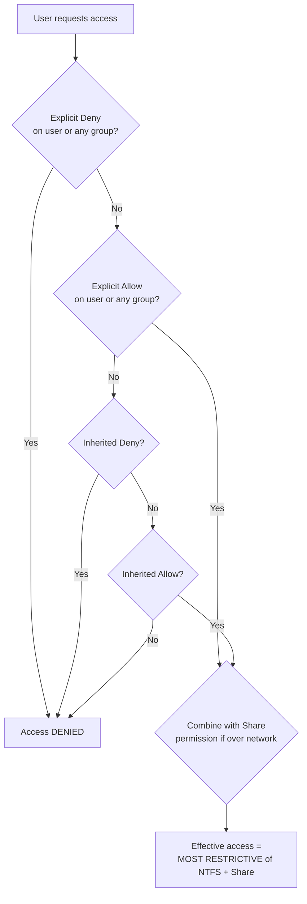

# NTFS (New Technology File System) Permissions

NTFS permissions control access to files and folders stored on NTFS-formatted volumes in Windows. They form a discretionary access-control list (DACL) on each object that defines exactly what actions a user or group may perform — read, write, execute, delete, change permissions, or take ownership.

## Overview

Every file and folder on an NTFS volume carries a security descriptor whose DACL is an ordered list of access control entries (ACEs). Each ACE binds a security principal (a user or group SID) to an allow or deny of specific rights. Because NTFS permissions are enforced by the file system itself, they apply to **both local and network access** — unlike [share permissions](File-System.md), which only apply over the network. NTFS permissions are the primary access-control mechanism for Windows file services and the foundation the [ICACLS-Command](ICACLS-Command.md), [CACLS-Command](CACLS-Command.md), and [TAKEOWN-Command](TAKEOWN-Command.md) tools operate on. See [NTFS-Default-Permissions](NTFS-Default-Permissions.md) for the out-of-the-box ACLs that ship on a fresh volume.

## Types of NTFS Permissions

NTFS permissions can be applied to both **files** and **folders**, with some variation in their behavior. They are grouped into *basic* permissions (common presets) and *special* (advanced, granular) permissions.

### Basic NTFS Permissions

| Permission             | Files                         | Folders                            |
|------------------------|-------------------------------|-------------------------------------|
| **Full Control**       | Full access, including ownership and permission changes | Full access to folder and subitems |
| **Modify**             | Read, write, delete           | Read, write, delete                 |
| **Read & Execute**     | Open and run executables      | Open files and traverse folders     |
| **List Folder Contents** | N/A                          | View folder contents                |
| **Read**               | Open and view contents        | View folder and file attributes     |
| **Write**              | Create and modify files       | Create files and subfolders         |

### Special NTFS Permissions

These allow granular control, configurable via the **Advanced** security settings:

| Special NTFS Permission | Description | Scope | Default Inheritance |
|---|---|---|---|
| Take Ownership | Allows users to take ownership of files or folders. | Both | Not inherited |
| Change Permissions | Allows modifying existing NTFS permission settings on files or folders. | Both | Not inherited |
| Delete | Permission to delete files or folders. | Both | Inherited |
| Traverse Folder / Execute File | Traverse Folder allows entering folders without listing contents; Execute File lets users run executable files. | Folder (traverse) / File (execute) | Inherited |
| Write Attributes | Permission to change file or folder attributes like hidden or read-only. | Both | Inherited |

> [!NOTE]
> **Basic permissions are bundles of special permissions**
> Each basic permission (Read, Modify, Full Control, …) is simply a preset combination of the underlying special permissions. Editing the **Advanced** view lets you mix individual rights — for example, granting Write without Delete — when a preset does not fit.

## Inheritance in NTFS

- **Parent-Child Model** — child items inherit permissions from their parent folder by default, so a well-designed folder root propagates access downward automatically.
- **Breaking Inheritance** — you can disable inheritance on a subtree and set custom permissions manually. When you break it, Windows offers to *copy* the inherited ACEs (convert them to explicit) or *remove* them.
- **Inheritance flags** — in PowerShell these map to `ContainerInherit` (subfolders) and `ObjectInherit` (files); propagation flags (`None`, `InheritOnly`, `NoPropagateInherit`) control how far a rule reaches.

## Effective Permissions

A user's **effective access** on an object is the net result of several inputs evaluated together:

- Explicit permissions on the object.
- Group memberships (permissions accumulate across all groups the user belongs to).
- Inherited permissions from parent folders.
- **Deny** entries, which override matching **Allow** entries.



> [!TIP]
> **Analyze effective access before troubleshooting**
> Use the **Effective Access** tab under a folder's *Properties → Security → Advanced*, or script it with PowerShell, to see the real resolved rights for a principal instead of guessing from the ACE list. This is faster than reasoning through inheritance and group nesting by hand.

## NTFS vs. Share Permissions

| Aspect | NTFS Permissions | Share Permissions |
|---|---|---|
| Applies To | Local + Network Access | Network Access only |
| Granularity | Very detailed | Basic (Full, Change, Read) |
| Priority | **Most restrictive** of the two applies when both are used | |

When a folder is accessed over the network, Windows evaluates share and NTFS permissions independently and grants the **more restrictive** result. Combine both wisely — use NTFS for granular control and share permissions as broad gatekeepers.

## Managing NTFS Permissions with PowerShell

### 1. View NTFS Permissions

```powershell
Get-Acl -Path "C:\data" | Format-List
```

For cleaner output:

```powershell
(Get-Acl -Path "C:\data").Access | Format-Table IdentityReference, FileSystemRights, AccessControlType, IsInherited -AutoSize
```

### 2. Set NTFS Permissions (Grant Full Control)

```powershell
$acl = Get-Acl "C:\data"
$rule = New-Object System.Security.AccessControl.FileSystemAccessRule("hr1", "FullControl", "ContainerInherit, ObjectInherit", "None", "Allow")
$acl.SetAccessRule($rule)
Set-Acl -Path "C:\data" -AclObject $acl
```

### 3. Remove NTFS Permissions

```powershell
$acl = Get-Acl "C:\data"
$rule = New-Object System.Security.AccessControl.FileSystemAccessRule("hr1", "FullControl", "ContainerInherit, ObjectInherit", "None", "Allow")
$acl.RemoveAccessRule($rule)
Set-Acl -Path "C:\data" -AclObject $acl
```

### 4. Disable Inheritance

Disable and remove inherited permissions:

```powershell
$acl = Get-Acl "C:\data"
$acl.SetAccessRuleProtection($true, $false)
Set-Acl -Path "C:\data" -AclObject $acl
```

Disable but **keep inherited as explicit**:

```powershell
$acl.SetAccessRuleProtection($true, $true)
```

### 5. Take Ownership of Folder or File

Using the command line:

```cmd
takeown /f "C:\data" /r /d y
```

Using PowerShell:

```powershell
$acl = Get-Acl "C:\data"
$acl.SetOwner([System.Security.Principal.NTAccount] "hr1")
Set-Acl -Path "C:\data" -AclObject $acl
```

### 6. Reset NTFS Permissions to Default

```powershell
icacls "C:\data" /reset /t /c /l
```

- `/t` — include subfolders/files
- `/c` — continue on errors
- `/l` — operate on a symbolic link itself instead of its target

### 7. Grant Read-Only Access to a Group

```powershell
$acl = Get-Acl "C:\data"
$rule = New-Object System.Security.AccessControl.FileSystemAccessRule("Domain\Users", "ReadAndExecute", "ContainerInherit, ObjectInherit", "None", "Allow")
$acl.AddAccessRule($rule)
Set-Acl -Path "C:\data" -AclObject $acl
```

### 8. Check Access for a Specific User

```powershell
icacls "C:\data" | findstr "JohnDoe"
```

See [NTFS-Permissions-Setup-with-PowerShell](NTFS-Permissions-Setup-with-PowerShell.md) for a fuller scripting walkthrough and [ICACLS-Command](ICACLS-Command.md) for the complete `icacls` reference.

## Security Considerations

NTFS ACLs are a primary control that offensive operators probe and defenders harden. Misconfigured permissions enable both data exposure and privilege escalation.

> [!WARNING]
> **Common NTFS permission weaknesses**
> - **Overly broad ACLs** — `Everyone: Full Control` or `Authenticated Users: Modify` on sensitive shares is a leading cause of data exposure and lateral movement.
> - **Writable service/binary paths** — if a low-privileged user has Write or Modify on a folder holding a service executable or scheduled-task script, they can replace it and escalate. This is a classic [weak-ACL](NTFS-Permissions-Setup-with-PowerShell.md) privilege-escalation vector that tools like `icacls` and `accesschk` surface.
> - **Take Ownership abuse** — a principal with the *Take Ownership* right (or `SeTakeOwnershipPrivilege`) can seize an object and then rewrite its DACL, silently overriding deny ACEs. Audit `takeown` and ownership changes.
> - **Broken inheritance drift** — subtrees where inheritance was broken accumulate stale, over-permissive explicit ACEs that routine reviews miss.
> - **Alternate Data Streams** — NTFS lets data hide in named streams that standard ACL reviews and directory listings ignore. See [Alternate-Data-Streams(ADS)](Alternate-Data-Streams(ADS).md).

Defensively, enable object-access auditing (Event IDs **4656**, **4663**, **4670** for handle requests, access attempts, and permission changes) on sensitive folders so ACL abuse is logged and detectable.

## Best Practices

- Use **NTFS permissions** as the primary control mechanism; keep share permissions broad and simple.
- Assign permissions to **groups**, not individual users, and follow least privilege.
- Let permissions **inherit** from a well-designed folder root; break inheritance only when genuinely necessary.
- Avoid using **Deny** unless required — rely on the absence of an Allow instead, since deny ACEs complicate troubleshooting.
- Regularly **audit** and review folder permissions, and remove stale explicit ACEs left by broken inheritance.

## Troubleshooting

| Symptom | Likely cause & fix |
|---|---|
| "Access denied" over the network despite a share grant | Restrictive NTFS ACL under a permissive share — reconcile both; effective access is the most restrictive of NTFS and share. |
| Cannot modify a file's ACL | Current user is not the owner — use `takeown /f <path>` to seize ownership, then re-grant with `icacls`. |
| Permission changes on a folder don't reach files | Inheritance broken on the subtree, or missing `ContainerInherit, ObjectInherit` flags — re-enable inheritance or apply with `/t`. |
| User still has access after removing their ACE | Access granted via a group membership or an inherited Allow — check group nesting and inherited ACEs via **Effective Access**. |
| ACLs corrupted or wildly inconsistent | Reset to default inherited ACLs with `icacls "<path>" /reset /t /c`. |

## References

- Microsoft Learn — icacls command reference: https://learn.microsoft.com/en-us/windows-server/administration/windows-commands/icacls
- Microsoft Learn — NTFS overview: https://learn.microsoft.com/en-us/windows-server/storage/file-server/ntfs-overview
- Microsoft Learn — takeown command reference: https://learn.microsoft.com/en-us/windows-server/administration/windows-commands/takeown
- Microsoft Learn — How permissions work (DACLs and ACEs): https://learn.microsoft.com/en-us/windows/win32/secauthz/access-control-lists

## Related

- [NTFS-Default-Permissions](NTFS-Default-Permissions.md) — out-of-the-box NTFS ACLs to compare against
- [NTFS-Permissions-Setup-with-PowerShell](NTFS-Permissions-Setup-with-PowerShell.md) — manage these permissions programmatically
- [ICACLS-Command](ICACLS-Command.md) — modern command-line ACL management
- [CACLS-Command](CACLS-Command.md) — legacy predecessor to icacls
- [TAKEOWN-Command](TAKEOWN-Command.md) — taking ownership of files and directories
- [Alternate-Data-Streams(ADS)](Alternate-Data-Streams(ADS).md) — hidden NTFS data streams and their security relevance
- [File-System](File-System.md) — broader file-system context (FAT, NTFS, ReFS)
- [Enterprise Windows Infrastructure Security](../Readme.md) — course hub
