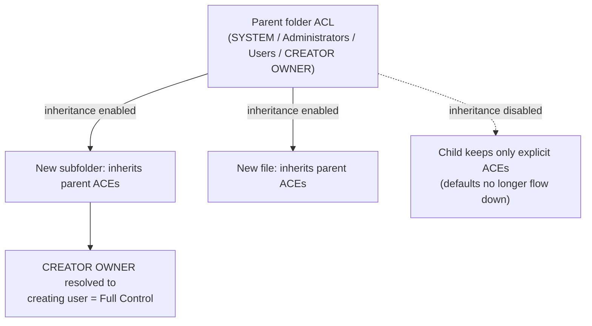

# NTFS Default Permissions

NTFS (New Technology File System) applies a set of default access-control entries (ACEs) whenever Windows is installed, a volume is formatted, or a new file or folder is created. Knowing these defaults is essential for spotting misconfigurations, because most real-world permission problems are deviations from — or unexpected inheritance of — these baseline sets.

## Overview

NTFS secures drives, folders, and files through discretionary access-control lists (DACLs) built from ACEs that grant or deny rights to security principals such as `SYSTEM`, `Administrators`, `Users`, and `CREATOR OWNER`. The full model — permission types, inheritance, and effective access — is covered in [NTFS-(New-Technology-File-System)-Permissions](NTFS-(New-Technology-File-System)-Permissions.md); this note focuses on the *default* ACLs Windows assigns in common scenarios and how to inspect, reset, and back them up with `icacls` and PowerShell.

The defaults differ meaningfully between the **system drive** (`C:\`, locked down to protect the OS) and **non-system volumes** (`D:\`, `E:\`, more permissive to standard users), and they flow down to new files and folders through **inheritance**.

## Default Permissions on C:\ (System Drive Root)

When Windows is installed, it sets restrictive permissions on the root of the system drive (`C:\`) to prevent unauthorized modification of system files.

| Principal | Permissions | Applies To |
| --- | --- | --- |
| `SYSTEM` | Full Control | This folder, subfolders, files |
| `Administrators` | Full Control | This folder, subfolders, files |
| `Users` | Read & Execute, List Folder Contents, Read | This folder only |
| `Authenticated Users` | Modify, Read & Execute, List Folder Contents, Read, Write | Subfolders, files |
| `CREATOR OWNER` | Full Control (on created files and folders only) | Subfolders, files |

> [!NOTE]
> **Standard users cannot write to the C:\ root**
> On the system drive root, non-admin `Users` get only read and list access. The `Authenticated Users` entry that allows Modify/Write applies to **subfolders and files**, not to the root folder itself — so a standard user can create content inside subfolders they own but cannot tamper with the drive root.

## Default Permissions on Non-System NTFS Drives (e.g. D:\, E:\)

When formatting or mounting a non-system NTFS volume, the default permissions are more permissive than the system drive.

| Principal | Permissions | Applies To |
| --- | --- | --- |
| `Administrators` | Full Control | This folder, subfolders, files |
| `SYSTEM` | Full Control | This folder, subfolders, files |
| `Users` | Modify, Read & Execute, List Folder Contents, Read, Write | This folder, subfolders, files |
| `CREATOR OWNER` | Full Control (on created files and folders only) | Subfolders, files |

> [!WARNING]
> **Data drives are writable by all users by default**
> On a freshly formatted non-system NTFS volume, standard `Users` can read, write, and modify content at the drive root. This is a frequent source of insecure default ACLs — data drives should be locked down to least privilege before hosting shares or application data.

## Default Permissions for New Folders

When a user creates a new folder, the following default NTFS permissions apply (most are inherited from the parent):

| Group/User | Permissions |
| --- | --- |
| Creator (Owner) | Full Control |
| Administrators | Full Control (inherited from parent) |
| SYSTEM | Full Control (inherited from parent) |
| Users | Read & Execute (inherited if set on parent) |

## Default Permissions for New Files

When a user creates a file inside a folder, these permissions typically apply:

| Group/User | Permissions |
| --- | --- |
| Creator (Owner) | Full Control |
| SYSTEM | Full Control (if inherited) |
| Administrators | Full Control (if inherited) |
| Users | Usually no access unless inherited |

## Key Concepts

- **Inheritance** — child objects inherit permissions from the parent folder unless inheritance is explicitly disabled. This is what makes the "new file/folder" defaults depend on where the object is created.
- **CREATOR OWNER** — a placeholder ACE representing whoever creates a file or folder; at creation time it is resolved to that user and granted the configured rights (typically Full Control) on the created object.
- **Users** — the built-in group of standard local users; deliberately limited to protect system integrity.
- **Authenticated Users** — any principal that signs in with a valid account (local or domain); broader than `Users`.

The following diagram shows how the default ACL on a parent folder propagates to newly created children, and where the chain breaks.



## Viewing NTFS Permissions

To view the ACL on a drive or folder with PowerShell:

```powershell
Get-Acl C:\ | Format-List
Get-Acl "C:\Path\To\Folder" | Format-List
```

To recursively list permissions across a tree:

```powershell
Get-ChildItem -Recurse | Get-Acl
```

The `icacls` utility gives the same view from the command line and is the standard tool for scripted ACL work — see [ICACLS-Command](ICACLS-Command.md) (and its legacy predecessor [CACLS-Command](CACLS-Command.md)).

## Resetting NTFS Permissions

To replace explicit permissions with the inherited defaults recursively:

```cmd
icacls C:\ /reset /T /C /Q
```

Switch reference:

| Switch | Meaning |
| --- | --- |
| `/reset` | Replace explicit permissions with inherited ones |
| `/T` | Traverse subdirectories recursively |
| `/C` | Continue on errors |
| `/Q` | Quiet mode (suppress success messages) |

> [!WARNING]
> **Reset can lock you out of data**
> `icacls /reset /T` on a large tree removes every explicit ACE and forces inheritance. If a folder legitimately relied on a broken-inheritance ACL (for example a locked-down share), the reset will silently re-open it or strip required access. Back up ACLs first (below) and scope the reset to the smallest path possible.

## Backing Up and Restoring Permissions

Back up the ACLs of a tree before making major changes:

```cmd
icacls C:\ /save "C:\acl-backup.txt" /T
```

Restore them from that backup:

```cmd
icacls C:\ /restore "C:\acl-backup.txt"
```

## Security Considerations

Default ACLs are a first-class concern in both offensive and defensive work: the difference between a hardened host and an easy privilege-escalation target is often just which principals inherited write access to an executable path.

> [!WARNING]
> **Offensive and defensive relevance**
> - **Writable service/executable paths** — if a non-system drive's permissive `Users: Modify` default is inherited by a folder that holds a service binary or a `PATH` directory, a standard user can plant or replace an executable and escalate privileges. Enumeration tools (WinPEAS, PowerUp, `icacls`) hunt exactly these weak inherited ACLs.
> - **Least privilege** — grant only the rights a principal genuinely needs; never leave `Users` with Modify on a drive that hosts sensitive data or code.
> - **Broken inheritance hides risk** — an explicitly-permissive ACE on a child folder survives a parent lockdown, so auditing only the root can miss an exposed subtree.
> - **Ownership overrides** — a user who takes ownership (`takeown`) of an object can rewrite its ACL regardless of deny ACEs; audit ownership changes. See [TAKEOWN-Command](TAKEOWN-Command.md).

- The root of `C:\` is protected by design to prevent tampering with system files; do not weaken it.
- Non-system drives allow general read/write by default and should be locked down manually before use.
- Apply the **principle of least privilege** when replacing defaults.

## Best Practices

- **Avoid writing to drive roots.** Use dedicated subdirectories (e.g. `D:\Data\`) for user and application content, and set explicit ACLs there.
- **Assign permissions to groups, not individual users**, and prefer least privilege over the permissive defaults.
- **Do not disable inheritance** unless you fully understand the consequences; broken inheritance is a common audit blind spot.
- **Audit permissions regularly** using `icacls`, `Get-Acl`, or a dedicated ACL-review tool.
- **Back up ACLs** with `icacls /save` before any bulk permission change so you can restore a known-good state.

## Troubleshooting

| Symptom | Likely cause & fix |
| --- | --- |
| Standard user can write to a data-drive root unexpectedly | Default `Users: Modify` on a non-system NTFS volume — tighten the root ACL to least privilege |
| New file has no access for `Users` | Parent folder does not grant `Users` an inheritable ACE; the file inherits nothing — set the ACE on the parent |
| A subfolder ignores a parent lockdown | Inheritance is disabled on that child (explicit ACEs only) — re-enable inheritance or fix the explicit ACL |
| Cannot edit an ACL you should control | You are not the object owner — take ownership with `takeown`, then re-grant with `icacls` |
| `icacls /reset` re-opened a locked-down folder | Reset forced inheritance and dropped the protective explicit ACE — restore from an `icacls /save` backup |

## References

- Microsoft Learn — icacls command reference: https://learn.microsoft.com/windows-server/administration/windows-commands/icacls
- Microsoft Learn — Get-Acl (Microsoft.PowerShell.Security): https://learn.microsoft.com/powershell/module/microsoft.powershell.security/get-acl
- Microsoft Learn — How permissions work (ACLs, ACEs, inheritance): https://learn.microsoft.com/windows/win32/secauthz/access-control-lists

## Related

- [NTFS-(New-Technology-File-System)-Permissions](NTFS-(New-Technology-File-System)-Permissions.md) — full NTFS permission model
- [NTFS-Permissions-Setup-with-PowerShell](NTFS-Permissions-Setup-with-PowerShell.md) — change defaults via PowerShell
- [ICACLS-Command](ICACLS-Command.md) — modern command-line ACL management
- [CACLS-Command](CACLS-Command.md) — legacy ACL command (predecessor to icacls)
- [TAKEOWN-Command](TAKEOWN-Command.md) — taking ownership when ACL edits are blocked
- [File-System](File-System.md) — broader file-system context
- [Enterprise Windows Infrastructure Security](../Readme.md) — course hub
