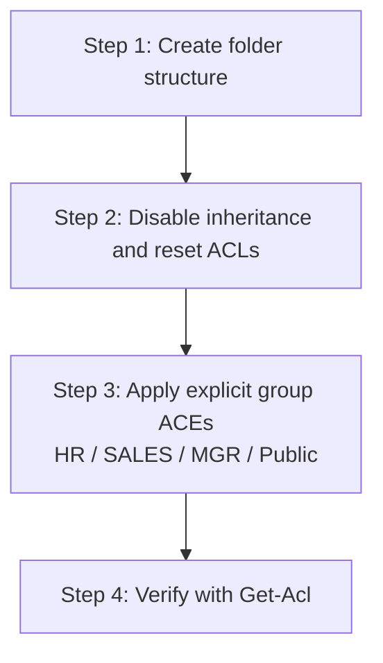

# NTFS Permissions Setup with PowerShell

Configuring NTFS permissions with PowerShell lets you provision department-based, least-privilege access control as repeatable, auditable code instead of clicking through the Security tab. This note walks through a complete department-share example — creating folders, resetting inheritance, and applying group-based Access Control Entries (ACEs) — using `Get-Acl`, `Set-Acl`, and the .NET `FileSystemAccessRule` class.

## Overview

NTFS stores access control on every file and folder in a **discretionary access control list (DACL)** made up of individual **ACEs** that grant or deny rights to a security principal (user or group). PowerShell exposes this model through `Get-Acl` (read the current security descriptor) and `Set-Acl` (write it back), while the `[System.Security.AccessControl.FileSystemAccessRule]` class builds the individual ACEs. See [NTFS-(New-Technology-File-System)-Permissions](NTFS-(New-Technology-File-System)-Permissions.md) for the concepts behind these commands and [NTFS-Default-Permissions](NTFS-Default-Permissions.md) for the baseline ACLs you are modifying. The same DACL can also be managed from the command line with [ICACLS-Command](ICACLS-Command.md) and [TAKEOWN-Command](TAKEOWN-Command.md).

This example builds a department share on `E:\CompanyData` and grants access to three pre-created local groups:

- `HR`
- `SALES`
- `MGR`

## How It Works

An NTFS `FileSystemAccessRule` is defined by five values: the **identity** (principal), the **rights** (`Modify`, `FullControl`, `ReadAndExecute`, …), the **inheritance flags**, the **propagation flags**, and the **access type** (`Allow` / `Deny`).

| Constructor argument | Value used here | Meaning |
|----------------------|-----------------|---------|
| Identity | `HR`, `MGR`, `Administrators`, `Users` | Security principal the ACE applies to |
| Rights | `Modify`, `FullControl`, `ReadAndExecute` | Level of access granted |
| Inheritance flags | `ContainerInherit,ObjectInherit` | ACE propagates to subfolders **and** files |
| Propagation flags | `None` | Applies to this folder, its subfolders, and files |
| Access type | `Allow` | Grant (rather than `Deny`) |

- **`Modify`** allows read, write, execute, and delete of the item — enough for day-to-day work without the destructive power of `FullControl` (which also lets a user change permissions and take ownership).
- **`SetAccessRule`** replaces any existing rule for that identity, while **`AddAccessRule`** adds a new ACE — using `Set` for the first grant and `Add` for the rest avoids duplicate ACEs.
- **`SetAccessRuleProtection($true, $false)`** disables inheritance on the folder (`$true` = protect from the parent) and does **not** copy the previously inherited rules down (`$false` = discard them), giving a clean slate before you apply explicit ACEs.

> [!IMPORTANT]
> **Inheritance protection is destructive**
> `SetAccessRuleProtection($true, $false)` removes all inherited ACEs. Always re-grant `Administrators` (and any other required principals) explicitly afterward, or you can lock yourself out of the folder.

The setup follows a fixed four-step workflow:



## Folder Structure

```text

E:\CompanyData  
├── HR  
├── SALES  
├── MGR  
└── Public

```

## Step 1: Create Folder Structure

```powershell
$basePath = "E:\CompanyData"

$folders = @(
    "$basePath\HR",
    "$basePath\SALES",
    "$basePath\MGR",
    "$basePath\Public"
)

foreach ($folder in $folders) {
    if (-not (Test-Path $folder)) {
        New-Item -Path $folder -ItemType Directory | Out-Null
    }
}
```

## Step 2: Disable Inheritance and Reset ACLs

Ensures a clean permission state before applying new rules.

```powershell
foreach ($folder in $folders) {
    $acl = Get-Acl $folder
    $acl.SetAccessRuleProtection($true, $false)

    # Remove existing explicit rules
    $acl.Access | ForEach-Object { $acl.RemoveAccessRule($_) }

    Set-Acl -Path $folder -AclObject $acl
}
```

## Step 3: Apply NTFS Permissions

Uses `Modify` instead of `FullControl` for users, avoids duplicate rules, and always includes `Administrators` access.

### HR Folder

- Access: `HR`, `MGR`, `Administrators`

```powershell
$hrPath = "$basePath\HR"
$acl = Get-Acl $hrPath

$acl.SetAccessRule(
    [System.Security.AccessControl.FileSystemAccessRule]::new(
        "HR","Modify","ContainerInherit,ObjectInherit","None","Allow"
    )
)

$acl.AddAccessRule(
    [System.Security.AccessControl.FileSystemAccessRule]::new(
        "MGR","Modify","ContainerInherit,ObjectInherit","None","Allow"
    )
)

$acl.AddAccessRule(
    [System.Security.AccessControl.FileSystemAccessRule]::new(
        "Administrators","FullControl","ContainerInherit,ObjectInherit","None","Allow"
    )
)

Set-Acl -Path $hrPath -AclObject $acl
```

### SALES Folder

- Access: `SALES`, `MGR`, `Administrators`

```powershell
$salesPath = "$basePath\SALES"
$acl = Get-Acl $salesPath

$acl.SetAccessRule(
    [System.Security.AccessControl.FileSystemAccessRule]::new(
        "SALES","Modify","ContainerInherit,ObjectInherit","None","Allow"
    )
)

$acl.AddAccessRule(
    [System.Security.AccessControl.FileSystemAccessRule]::new(
        "MGR","Modify","ContainerInherit,ObjectInherit","None","Allow"
    )
)

$acl.AddAccessRule(
    [System.Security.AccessControl.FileSystemAccessRule]::new(
        "Administrators","FullControl","ContainerInherit,ObjectInherit","None","Allow"
    )
)

Set-Acl -Path $salesPath -AclObject $acl
```

### MGR Folder

- Access: `MGR`, `Administrators`

```powershell
$mgrPath = "$basePath\MGR"
$acl = Get-Acl $mgrPath

$acl.SetAccessRule(
    [System.Security.AccessControl.FileSystemAccessRule]::new(
        "MGR","Modify","ContainerInherit,ObjectInherit","None","Allow"
    )
)

$acl.AddAccessRule(
    [System.Security.AccessControl.FileSystemAccessRule]::new(
        "Administrators","FullControl","ContainerInherit,ObjectInherit","None","Allow"
    )
)

Set-Acl -Path $mgrPath -AclObject $acl
```

### Public Folder

Access:

- `Users` → Read and Execute
- `MGR` → Modify
- `Administrators` → Full Control

```powershell
$publicPath = "$basePath\Public"
$acl = Get-Acl $publicPath

$acl.SetAccessRule(
    [System.Security.AccessControl.FileSystemAccessRule]::new(
        "Users","ReadAndExecute","ContainerInherit,ObjectInherit","None","Allow"
    )
)

$acl.AddAccessRule(
    [System.Security.AccessControl.FileSystemAccessRule]::new(
        "MGR","Modify","ContainerInherit,ObjectInherit","None","Allow"
    )
)

$acl.AddAccessRule(
    [System.Security.AccessControl.FileSystemAccessRule]::new(
        "Administrators","FullControl","ContainerInherit,ObjectInherit","None","Allow"
    )
)

Set-Acl -Path $publicPath -AclObject $acl
```

> [!TIP]
> **Prefer `Modify` over `FullControl` for users**
> `FullControl` also grants **Change Permissions** and **Take Ownership** — a standard user with that right can re-open access to data you intended to restrict. Reserve `FullControl` for administrators and grant everyone else `Modify` or less.

## Step 4: Verify Permissions

```powershell
Get-Acl "E:\CompanyData\HR" | Format-List
Get-Acl "E:\CompanyData\SALES" | Format-List
Get-Acl "E:\CompanyData\MGR" | Format-List
Get-Acl "E:\CompanyData\Public" | Format-List
```

## Full Automation Script

```powershell
# Base Path
$basePath = "E:\CompanyData"

# Folder Structure
$folders = @(
    "$basePath\HR",
    "$basePath\SALES",
    "$basePath\MGR",
    "$basePath\Public"
)

# Step 1: Create Folders
foreach ($folder in $folders) {
    if (-not (Test-Path $folder)) {
        New-Item -Path $folder -ItemType Directory | Out-Null
    }
}

# Step 2: Disable Inheritance and Reset ACLs
foreach ($folder in $folders) {
    $acl = Get-Acl $folder
    $acl.SetAccessRuleProtection($true, $false)

    # Remove existing explicit rules
    $acl.Access | ForEach-Object { $acl.RemoveAccessRule($_) }

    Set-Acl -Path $folder -AclObject $acl
}

# Function to simplify rule creation
function New-ACLRule {
    param ($Identity, $Permission)

    return [System.Security.AccessControl.FileSystemAccessRule]::new(
        $Identity,
        $Permission,
        "ContainerInherit,ObjectInherit",
        "None",
        "Allow"
    )
}

# Step 3: Apply Permissions

# HR Folder
$hrPath = "$basePath\HR"
$acl = Get-Acl $hrPath

$acl.SetAccessRule((New-ACLRule "HR" "Modify"))
$acl.AddAccessRule((New-ACLRule "MGR" "Modify"))
$acl.AddAccessRule((New-ACLRule "Administrators" "FullControl"))

Set-Acl -Path $hrPath -AclObject $acl


# SALES Folder
$salesPath = "$basePath\SALES"
$acl = Get-Acl $salesPath

$acl.SetAccessRule((New-ACLRule "SALES" "Modify"))
$acl.AddAccessRule((New-ACLRule "MGR" "Modify"))
$acl.AddAccessRule((New-ACLRule "Administrators" "FullControl"))

Set-Acl -Path $salesPath -AclObject $acl


# MGR Folder
$mgrPath = "$basePath\MGR"
$acl = Get-Acl $mgrPath

$acl.SetAccessRule((New-ACLRule "MGR" "Modify"))
$acl.AddAccessRule((New-ACLRule "Administrators" "FullControl"))

Set-Acl -Path $mgrPath -AclObject $acl


# Public Folder
$publicPath = "$basePath\Public"
$acl = Get-Acl $publicPath

$acl.SetAccessRule((New-ACLRule "Users" "ReadAndExecute"))
$acl.AddAccessRule((New-ACLRule "MGR" "Modify"))
$acl.AddAccessRule((New-ACLRule "Administrators" "FullControl"))

Set-Acl -Path $publicPath -AclObject $acl


# Step 4: Verify
Get-Acl "$basePath\HR" | Format-List
Get-Acl "$basePath\SALES" | Format-List
Get-Acl "$basePath\MGR" | Format-List
Get-Acl "$basePath\Public" | Format-List
```

## Access Control Summary

| Folder | Permissions |
|---|---|
| HR | HR, MGR, Administrators |
| SALES | SALES, MGR, Administrators |
| MGR | MGR, Administrators |
| Public | Users (Read), MGR (Modify), Administrators |

## Security Considerations

NTFS ACLs are one of the most common places for privilege-escalation and lateral-movement footholds to hide. Well-scoped, least-privilege ACEs like the ones above are a defensive control; sloppy ones are an attacker's shortcut.

> [!WARNING]
> **Weak ACLs are an attack surface**
> - **Overly broad grants** such as `Everyone: FullControl` or `Users: Modify` on sensitive folders let any authenticated user read, alter, or plant files — a classic data-exposure and persistence vector.
> - **`FullControl` on a service or scheduled-task path** allows a low-privileged user to replace a binary or script that runs as SYSTEM (writable-path privilege escalation).
> - **NTFS and share permissions layer** — network access is the **most restrictive** of the two. A tight NTFS ACL can still be undermined by a permissive share, so review both. See [NTFS-(New-Technology-File-System)-Permissions](NTFS-(New-Technology-File-System)-Permissions.md).
> - Ownership changes via [TAKEOWN-Command](TAKEOWN-Command.md) can silently override deny ACEs — audit ownership changes on sensitive trees.

- NTFS permissions apply only to NTFS-formatted volumes; FAT/exFAT provide no file-level access control.
- Combine NTFS permissions with SMB share permissions for network access, and always test with a non-admin account.
- Enumerate effective access defensively with `Get-Acl`, `icacls`, or `AccessChk` to catch weak ACEs before an attacker does.

## Best Practices

- Use `Modify` instead of `FullControl` for standard users; reserve `FullControl` for administrators.
- Always keep `Administrators` with `FullControl` to prevent lockout after disabling inheritance.
- Prefer **groups** over individual users, and use **domain groups** in enterprise environments.
- Assign permissions at a well-designed folder root and let them inherit; break inheritance only when necessary.
- Avoid weak passwords on the accounts you grant access to, and always verify with a non-admin account.

## Troubleshooting

| Symptom | Likely cause & fix |
|---|---|
| "Access denied" applying `Set-Acl` | Not running elevated, or you are not the owner — run PowerShell as Administrator, or seize ownership with [TAKEOWN-Command](TAKEOWN-Command.md) first |
| Duplicate ACEs after re-running the script | Used `AddAccessRule` where `SetAccessRule` was needed — `SetAccessRule` replaces the existing rule for that identity |
| New permissions not taking effect on existing files | Inheritance was disabled but child items keep old explicit ACEs — reset children or re-apply with inheritance flags |
| Locked out of a folder after reset | `SetAccessRuleProtection($true,$false)` stripped inherited ACEs without re-granting `Administrators` — re-grant via `takeown` + `icacls` |
| `IdentityNotMappedException` on `Set-Acl` | Group/user name misspelled or does not exist — verify the principal, prefix with domain/computer name if needed |

## References

- Microsoft Learn — `Get-Acl`: https://learn.microsoft.com/powershell/module/microsoft.powershell.security/get-acl
- Microsoft Learn — `Set-Acl`: https://learn.microsoft.com/powershell/module/microsoft.powershell.security/set-acl
- Microsoft Learn — `FileSystemAccessRule` class: https://learn.microsoft.com/dotnet/api/system.security.accesscontrol.filesystemaccessrule
- Microsoft Learn — `FileSystemRights` enumeration: https://learn.microsoft.com/dotnet/api/system.security.accesscontrol.filesystemrights

## Related

- [NTFS-(New-Technology-File-System)-Permissions](NTFS-(New-Technology-File-System)-Permissions.md) — concepts behind the commands
- [NTFS-Default-Permissions](NTFS-Default-Permissions.md) — baseline ACLs you are modifying
- [ICACLS-Command](ICACLS-Command.md) — command-line ACL management alternative
- [TAKEOWN-Command](TAKEOWN-Command.md) — taking ownership before re-granting access
- [File-System](File-System.md) — broader file system context
- [Enterprise Windows Infrastructure Security](../Readme.md) — course hub
