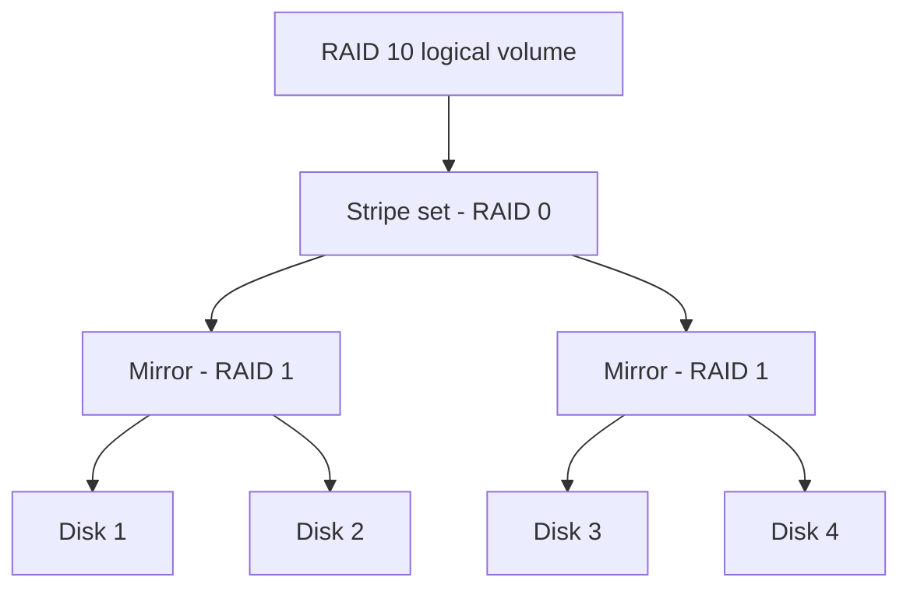

# RAID (Redundant Array of Independent Disks)

RAID is a technology that combines multiple physical disk drives into one logical unit to improve **performance**, **data redundancy**, or both, depending on the RAID level implemented.

## Overview

RAID sits between the physical disks — see [Types-of-Internal-Disks](Types-of-Internal-Disks.md) — and the [File-System](File-System.md) that an operating system mounts on top of the resulting logical volume. It achieves its goals through three underlying techniques, combined in different ways by each RAID level:

- **Striping** — data is split into blocks and spread across multiple disks so reads and writes happen in parallel, increasing throughput.
- **Mirroring** — data is written identically to two or more disks so a full copy survives a drive failure.
- **Parity** — redundancy information is calculated and distributed across disks, allowing a failed drive's data to be reconstructed without storing a full mirror.

RAID can be implemented in **hardware** (a dedicated RAID controller with its own cache and battery backup) or in **software** (managed by the OS — for example Windows **Storage Spaces** or Linux `mdadm`). Hardware RAID offloads parity math from the CPU; software RAID is cheaper and more portable but consumes host resources.

> [!IMPORTANT]
> **RAID is availability, not backup**
> RAID protects against **disk hardware failure** — it does not protect against accidental deletion, file corruption, ransomware, or site-level disasters. All of those are written faithfully to every member disk. RAID and backups solve different problems and are not interchangeable.

## RAID Levels

| RAID Level | Purpose | Description | Minimum Drives | Fault Tolerance | Performance | Capacity Efficiency | Typical Use Cases |
| :-- | :-- | :-- | :-- | :-- | :-- | :-- | :-- |
| **RAID 0** | Performance | Data is striped across multiple disks to increase read/write speed. No redundancy. | 2 | None (one drive failure causes total data loss) | High (best read/write speed) | 100% (full storage capacity used) | High-performance computing, gaming systems |
| **RAID 1** | Redundancy | Data is mirrored on two or more disks; exact copies for fault tolerance. | 2 | Can tolerate 1 drive failure | Read performance improved, write performance similar | 50% (half the capacity used) | Critical data storage, OS drives |
| **RAID 5** | Performance \& Redundancy | Data and distributed parity striped across drives; protects from single drive failure. | 3 | Can tolerate 1 drive failure | Good read, slower write due to parity calculations | N-1 drives' capacity | File and application servers |
| **RAID 6** | Enhanced Redundancy \& Performance | Similar to RAID 5, with double parity allowing two simultaneous drive failures. | 4 | Can tolerate 2 drive failures | Good read, slower write than RAID 5 | N-2 drives' capacity | Enterprise storage, critical systems |
| **RAID 10 (1+0)** | Performance \& Redundancy | Combines mirroring and striping; data mirrored and then striped to balance performance and fault tolerance. | 4 | Can tolerate multiple drive failures if not in the same mirrored pair | Very high read/write performance | 50% (half the capacity used) | Databases, high-availability systems |
| **RAID 50 (5+0)** | Performance \& Redundancy | Stripes data across multiple RAID 5 arrays. Improves write performance and provides redundancy. | 6 | Can tolerate 1 drive failure per RAID 5 set | Higher than RAID 5, better write performance | (N-1) * number of RAID 5 arrays | Large databases, data warehouses |
| **RAID 60 (6+0)** | Performance \& Enhanced Redundancy | Stripes data across multiple RAID 6 arrays combining speed with double parity fault tolerance. | 8 | Can tolerate 2 drive failures per RAID 6 set | Better write than RAID 6 alone | (N-2) * number of RAID 6 arrays | Enterprise environments, critical mission data |

### Nested RAID — how RAID 10 combines techniques

Nested (hybrid) levels layer one RAID type on another. RAID 10 stripes across mirrored pairs, so it survives a drive loss in each pair while keeping the parallel-read speed of striping.



## Key RAID Benefits and Drawbacks

| Benefit | Description | Applicable RAID Levels |
| :-- | :-- | :-- |
| **Performance** | Parallel reading/writing across multiple disks increases throughput and reduces latency. | RAID 0, RAID 10, RAID 50, RAID 60 |
| **Fault Tolerance** | Ability to survive drive failure(s) without data loss via mirroring or parity data. | RAID 1, RAID 5, RAID 6, RAID 10, RAID 50, RAID 60 |
| **Increased Capacity** | Combine multiple disks into one logical volume for larger storage. Sacrifices some space for redundancy. | RAID 0, RAID 5, RAID 6, RAID 50, RAID 60 |
| **Cost Efficiency** | Some RAID levels (like RAID 5) offer a good balance between redundancy and usable capacity. | RAID 5, RAID 6 |

| Drawbacks | Description |
| :-- | :-- |
| **No Redundancy** | RAID 0 offers no fault tolerance; one disk failure results in total data loss. |
| **Reduced Capacity** | Mirroring halves available capacity (RAID 1, RAID 10), extra parity reduces capacity (RAID 5/6). |
| **Performance Overhead** | Parity calculations can slow write speeds (RAID 5, RAID 6). |
| **Minimum Drives Required** | Higher RAID levels require more disks, increasing cost and complexity. |

> [!TIP]
> **Choosing a level**
> Match the level to the workload: **RAID 1** for OS/boot volumes, **RAID 5/6** for capacity-oriented file servers that can tolerate slower writes, and **RAID 10** for write-heavy databases where both speed and fault tolerance matter. Add **hot-spare** disks so a rebuild can start automatically the moment a member fails.

## Configuration

On Windows Server, RAID-like resiliency is typically delivered through **Storage Spaces** rather than legacy dynamic-disk RAID. Storage Spaces exposes three resiliency types that map onto the classic techniques:

| Storage Spaces resiliency | Equivalent RAID concept | Fault tolerance |
| :-- | :-- | :-- |
| Simple | RAID 0 (striping) | None |
| Mirror (two-way / three-way) | RAID 1 / RAID 1 triple | 1 / 2 drive failures |
| Parity | RAID 5 (single) / RAID 6 (dual) | 1 / 2 drive failures |

List the physical disks eligible to be pooled, then confirm pool and virtual-disk health:

```powershell
Get-PhysicalDisk
Get-StoragePool
Get-VirtualDisk | Format-Table FriendlyName, ResiliencySettingName, HealthStatus, OperationalStatus   # untested
```

## Security Considerations

RAID is an **availability** control. It does nothing for **confidentiality** or **integrity against malicious change**, and that gap has direct offensive and defensive relevance.

> [!WARNING]
> **Data remanence and false assurance**
> - **RAID is not encryption.** Data on every member disk is stored in cleartext (unless a separate encryption layer such as BitLocker is applied). A single **stolen or discarded member disk** can leak data, and a pulled RAID member can often be reconstructed by an attacker who knows the stripe size and disk order — a common data-recovery/forensic technique. Sanitize or destroy failed RAID disks before disposal.
> - **RAID does not stop ransomware or deletion.** Encryption or wiping by an attacker is faithfully mirrored/parity-protected across all disks. Recovery still depends on offline [backups](Tape-Storage.md).
> - **A degraded array is an availability risk.** During a rebuild, performance drops and a second failure (RAID 5) or third failure (RAID 6/RAID 10 same pair) causes total loss — an attacker who can induce or prolong that window widens the blast radius.
> - **No integrity guarantee.** Standard parity RAID does not detect silent bit-rot; it only reconstructs data on an *announced* drive failure.

## Best Practices

- Treat RAID as availability only — always keep independent, offline **backups** as well.
- Choose the level for the workload and use **hot spares** so rebuilds start automatically.
- Combine RAID with **full-disk encryption** (for example BitLocker) so a lost or decommissioned member disk does not leak data.
- **Sanitize or physically destroy** failed and retired RAID disks before disposal to defeat data remanence.
- Monitor array health and act on the first degraded/predictive-failure alert; do not run degraded longer than necessary.

## Troubleshooting

| Symptom | Likely cause & fix |
| :-- | :-- |
| Array reports "degraded" | A member disk failed — replace the failed drive (or a hot spare takes over) and let the array rebuild. |
| Total data loss after a single failure | Array was RAID 0 (no redundancy) — restore from backup; use a redundant level next time. |
| Rebuild is very slow / performance drops | Expected during parity recalculation — avoid heavy I/O until the rebuild completes. |
| Array goes offline mid-rebuild | A second drive failed during a RAID 5 rebuild — data is lost; RAID 6 or RAID 10 tolerates this. Restore from backup. |
| Usable capacity lower than raw total | Mirror (50%) or parity (N-1 / N-2) overhead — this is by design. |

## References

- Microsoft Learn — Storage Spaces overview: https://learn.microsoft.com/en-us/windows-server/storage/storage-spaces/overview
- Microsoft Learn — Storage Spaces fault tolerance and resiliency: https://learn.microsoft.com/en-us/windows-server/storage/storage-spaces/storage-spaces-fault-tolerance
- SNIA — Storage terminology and RAID definitions: https://www.snia.org/education/dictionary

## Related

- [Types-of-Internal-Disks](Types-of-Internal-Disks.md) — drives that make up a RAID array
- [Tape-Storage](Tape-Storage.md) — alternative backup/redundancy medium (RAID is not a backup)
- [File-System](File-System.md) — file systems run on top of RAID volumes
- [Enterprise Windows Infrastructure Security](../Readme.md) — course hub
