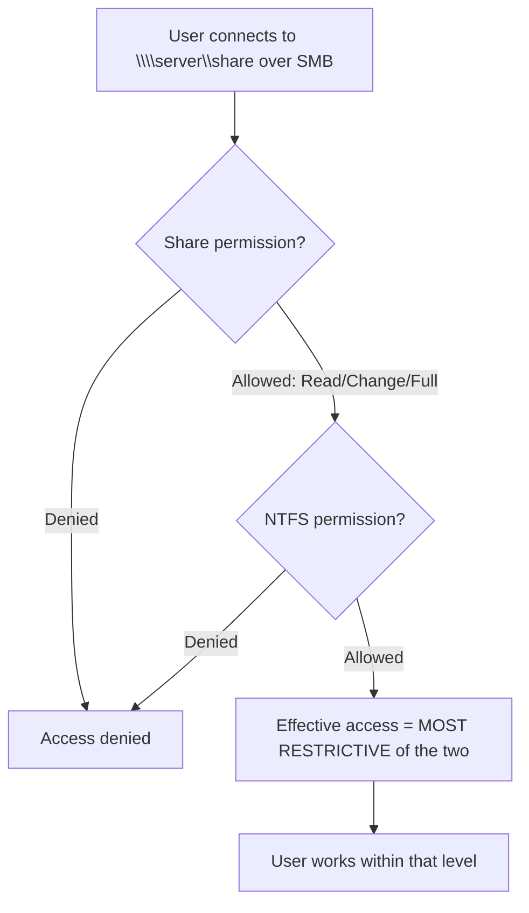

# Share Permissions

Share permissions are the access-control list applied to an **SMB network share** itself. They gate who may reach a shared folder **over the network** (port 445) and at what level, and they are enforced independently of, and in combination with, the underlying [NTFS permissions](NTFS-(New-Technology-File-System)-Permissions.md).

## Overview

When a folder is published as a shared folder, Windows attaches two separate permission layers to it: the **share permission** (evaluated only for network/SMB access) and the **NTFS permission** (evaluated for both network and local access). A user reaching the folder across the network passes through *both* gates, and the **most restrictive** of the two wins. Share permissions are therefore a coarse outer perimeter; NTFS permissions do the fine-grained work.

Share permissions are conceptually simpler than NTFS: they offer only three levels and apply to the share as a whole, not to individual files or subfolders. This module also covers the file-server roles that sit on top of shared storage — see [DFS-Namespaces-(Distributed-File-System-Namespaces)](DFS-Namespaces-(Distributed-File-System-Namespaces).md) and [File-Server-Resource-Manager(FSRM)](File-Server-Resource-Manager(FSRM).md) — and the ACL tooling used on the NTFS side, [ICACLS-Command](ICACLS-Command.md) and [NTFS-Default-Permissions](NTFS-Default-Permissions.md).

## Permission Levels

Share permissions expose three access rights that can each be Allowed or Denied:

| Level | Grants |
| --- | --- |
| **Read** | View file and subfolder names, open files, run programs |
| **Change** | Everything Read allows, plus create/modify/delete files and subfolders |
| **Full Control** | Everything Change allows, plus change the **share permissions** themselves |

> [!NOTE]
> **Share permissions have no "ownership" concept**
> Unlike NTFS, share permissions do not track ownership, inheritance, or per-file ACEs. They are a flat ACL on the share object. All granular control — who owns what, which subfolder is off-limits — must be done with NTFS permissions.

## How Effective Access Is Calculated

Access over the network is the **intersection** (most restrictive) of the share ACL and the NTFS ACL. A generous share permission cannot loosen a tight NTFS ACL, and vice-versa.



A classic example: the share grants **Change**, but NTFS grants only **Read** — the user gets **Read**. Reverse the two and the result is still **Read**. Local (console/RDP) logons bypass the share ACL entirely and are governed by NTFS alone.

## Default Share Permission

On modern Windows, creating a share through **Advanced Sharing** assigns the built-in **Everyone** group **Read** by default (older Windows historically granted `Everyone: Full Control`, a habit that persists in bad configurations).

> [!WARNING]
> **Everyone: Full Control is a red flag**
> A share ACL of `Everyone: Full Control` delegates all real access control to NTFS. If the NTFS ACL is also loose, any authenticated (or anonymous, where allowed) user can read or tamper with the data. This is one of the most common misconfigurations offensive testers hunt for.

## Configuration

### GUI

Right-click folder → **Properties** → **Sharing** tab → **Advanced Sharing** → **Permissions**. Share permissions are set here; NTFS permissions live on the separate **Security** tab.

### Command line (net share)

List, create, and remove shares with the legacy `net share` command:

```cmd
:: List all shares on the local host
net share

:: Create a share and grant a group Change access
net share Data=D:\Data /GRANT:"CORP\FileUsers",CHANGE

:: Remove a share (the folder is untouched)
net share Data /DELETE
```

### PowerShell (SmbShare module)

The `SmbShare` module is the modern, scriptable way to manage share permissions:

```powershell
# Create a share with tiered access in one command
New-SmbShare -Name "Data" -Path "D:\Data" `
    -FullAccess "CORP\FileAdmins" `
    -ChangeAccess "CORP\FileUsers" `
    -ReadAccess "Everyone"

# Inspect the share ACL
Get-SmbShare -Name "Data"
Get-SmbShareAccess -Name "Data"

# Grant, revoke, or explicitly deny access
Grant-SmbShareAccess  -Name "Data" -AccountName "CORP\Auditors" -AccessRight Read -Force
Revoke-SmbShareAccess -Name "Data" -AccountName "Everyone" -Force
Block-SmbShareAccess  -Name "Data" -AccountName "CORP\Interns" -Force
```

Valid `-AccessRight` values are `Full`, `Change`, and `Read`.

## Administrative and Hidden Shares

Windows auto-creates hidden shares whose names end in `$` (not shown in normal browsing):

| Share | Purpose |
| --- | --- |
| `C$`, `D$`, … | Root of each fixed drive; usable only by administrators |
| `ADMIN$` | Maps to `%SystemRoot%` (`C:\Windows`); used by remote admin tooling |
| `IPC$` | Inter-process communication; underpins named-pipe / RPC sessions |

Any share can be hidden from browsing simply by appending `$` to its name, but this is **obscurity, not security** — the share is still reachable by anyone who knows or guesses the name.

## Security Considerations

Share permissions are directly relevant to lateral movement and data exposure in Windows engagements.

> [!WARNING]
> **Offensive relevance**
> - **Enumeration** — anonymous or authenticated share listing (`smbclient -L`, `net view \\host`, `enum4linux`, `crackmapexec smb`) reveals shares and, on weak configs, their contents. `IPC$` historically enabled **null-session** enumeration.
> - **`ADMIN$` / `C$` abuse** — with local-admin credentials or a valid hash, tools like PsExec, `wmiexec`, and `smbexec` drop payloads via the admin shares for remote code execution and lateral movement.
> - **NTLM relay** — SMB access flows over [NTLM](../Active-Directory-Domain-Services-AD-DS/NTLM.md) when Kerberos is unavailable; unsigned SMB lets an attacker relay authentication to reach shares as the victim. Enforce **SMB signing** to break this.
> - **Loose ACLs = data leak** — `Everyone`/`Authenticated Users` with Change or Full Control on a share holding sensitive files is a frequent finding.

On the defensive side, audit share access with the Windows Security log: **Event ID 5140** ("A network share object was accessed") and **Event ID 5145** (detailed file-share access) record who touched which share when object-access auditing is enabled.

## Best Practices

- Set the share permission to a sensible ceiling (often `Authenticated Users: Change` or `Full Control`) and enforce real access control with **NTFS permissions**.
- Never leave `Everyone: Full Control` on shares that hold sensitive data.
- Grant to **groups**, not individual users, and apply least privilege.
- Enforce **SMB signing** and disable SMBv1 to blunt relay and downgrade attacks.
- Restrict, monitor, and alert on access to `C$`/`ADMIN$`; enable object-access auditing on important shares.

## Troubleshooting

| Symptom | Likely cause & fix |
| --- | --- |
| "Access denied" over the network despite a Full-Control share grant | Restrictive NTFS ACL underneath — effective access is the most restrictive; reconcile NTFS with `icacls` |
| User can read locally but not over the share | Share permission too tight or user not in the granted group; check `Get-SmbShareAccess` |
| Share not visible when browsing | Name ends in `$` (hidden) or client browsing disabled — connect by explicit UNC path `\\host\share` |
| Changes to share permissions not taking effect | Existing SMB session is cached; reconnect (`net use /delete`) or wait for the session to reset |
| Anonymous users can list/read a share | `Everyone`/null-session access enabled; tighten the share ACL and disable anonymous access |

## References

- Microsoft Learn — SMB share cmdlets (`Grant-SmbShareAccess`): https://learn.microsoft.com/powershell/module/smbshare/grant-smbshareaccess
- Microsoft Learn — `New-SmbShare`: https://learn.microsoft.com/powershell/module/smbshare/new-smbshare
- Microsoft Learn — Special (administrative) shares / Server service: https://learn.microsoft.com/troubleshoot/windows-server/networking/administrative-shares-are-not-created
- Microsoft Learn — Overview of file sharing using SMB: https://learn.microsoft.com/windows-server/storage/file-server/file-server-smb-overview

## Related

- [Enterprise Windows Infrastructure Security](../Readme.md) — course hub
- [NTFS-(New-Technology-File-System)-Permissions](NTFS-(New-Technology-File-System)-Permissions.md) — the fine-grained ACL layer share permissions combine with
- [NTFS-Default-Permissions](NTFS-Default-Permissions.md) — default NTFS ACLs on a fresh share
- [ICACLS-Command](ICACLS-Command.md) — inspect and modify the NTFS side from the command line
- [DFS-Namespaces-(Distributed-File-System-Namespaces)](DFS-Namespaces-(Distributed-File-System-Namespaces).md) — presenting shares behind a unified namespace
- [File-Server-Resource-Manager(FSRM)](File-Server-Resource-Manager(FSRM).md) — quotas and file screening on shared storage
- [NTLM](../Active-Directory-Domain-Services-AD-DS/NTLM.md) — authentication SMB falls back to, and the basis of relay attacks
