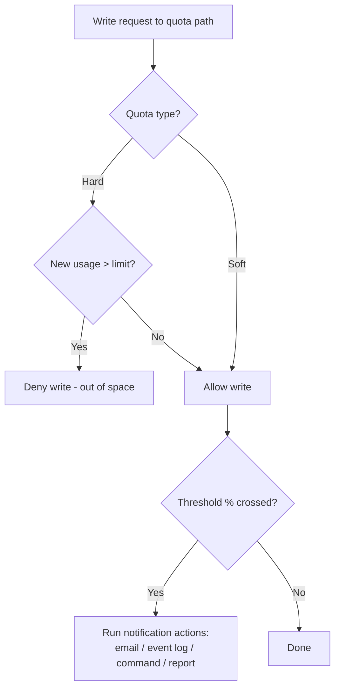

# Storage Quotas (FSRM)

Storage quotas are a File Server Resource Manager (FSRM) feature that limits how much data can be stored in a folder or volume and raises notifications as usage approaches or exceeds the limit. They give administrators a way to cap uncontrolled storage growth on Windows file servers.

## Overview

Quotas are one of the four pillars of [File-Server-Resource-Manager(FSRM)](File-Server-Resource-Manager(FSRM).md), alongside file screening, classification, and reporting. Unlike the older per-user **NTFS disk quotas** (which track ownership per user across an entire volume), an FSRM quota is applied to a **folder or volume path** and measures the **total** space consumed by everyone writing beneath that path. This makes FSRM quotas the natural fit for governing shared folders and home-directory roots exposed over SMB, often in front of a [DFS-Namespaces-(Distributed-File-System-Namespaces)](DFS-Namespaces-(Distributed-File-System-Namespaces).md) namespace.

FSRM is a role service of the File and Storage Services role and applies only to [NTFS/ReFS volumes](File-System.md).

## How It Works

A quota defines a **space limit** on a path and a set of **notification thresholds** expressed as a percentage of that limit. When data is written under the path, FSRM compares live usage against the limit and, as each threshold is crossed, runs the actions configured for it.



### Hard vs. Soft Quotas

| Type | Enforcement | Typical use |
| --- | --- | --- |
| **Hard quota** | Physically **prevents** writes that would exceed the limit | Enforce a firm storage cap |
| **Soft quota** | **Allows** the limit to be exceeded; only logs and notifies | Monitoring and usage reporting without blocking users |

> [!IMPORTANT]
> **Soft quotas do not block**
> A soft quota is a monitoring tool, not a control. If users report that files still save after passing the limit, the quota is almost certainly soft — switch it to hard to actually enforce the cap.

### Notification Thresholds

Each threshold is a percentage of the limit (for example 85%, 95%, 100%) with one or more attached **actions**:

- **Email** — notify the user and/or administrators.
- **Event log** — write an entry (source `SRMSVC`) for monitoring/SIEM pickup.
- **Command** — run a program or script.
- **Report** — generate a storage report (for example a Quota Usage report).

### Quota Templates and Auto Apply

Quotas are best created from a **quota template** (for example *200 MB Limit Reports to User*) so that limits and thresholds stay consistent and can be updated centrally. An **auto apply quota** attaches a template to a parent folder so that a matching quota is created automatically on every existing and future subfolder — ideal for a home-directory or user-profile root.

## Configuration

FSRM must be installed before quotas can be managed.

```powershell
# Install the FSRM role service with its management tools
Install-WindowsFeature -Name FS-Resource-Manager -IncludeManagementTools
```

Create a threshold, an action, and a hard quota with PowerShell (the `FileServerResourceManager` module):

```powershell
# 100% threshold that writes an event-log entry and emails the user
$action = New-FsrmAction -Type Event -EventType Warning `
  -Body "Quota limit reached on [Quota Path] by [Source Io Owner]." # untested
$threshold = New-FsrmQuotaThreshold -Percentage 100 -Action $action  # untested

# Apply a 5 GB hard quota to a shared folder
New-FsrmQuota -Path "D:\Shares\Projects" -Size 5GB `
  -Threshold $threshold                                              # untested
```

Inspect existing quotas:

```powershell
Get-FsrmQuota | Format-Table Path, Size, Usage, SoftLimit           # untested
```

The legacy command-line tool `dirquota.exe` still exists for scripting but is deprecated in favour of the PowerShell cmdlets and the FSRM console (`fsrm.msc`).

```cmd
:: Legacy: add a 5 GB hard quota to a path (deprecated)
dirquota quota add /path:D:\Shares\Projects /limit:5GB              # untested
```

> [!TIP]
> **Manage templates, not individual quotas**
> Point quotas at a shared template and edit the template when limits change. Updating the template can push the new limit and thresholds to every quota derived from it, instead of editing folders one by one.

## Components

| Component | Role |
| --- | --- |
| **Quota** | The limit + thresholds bound to a specific path |
| **Quota template** | A reusable limit/threshold definition quotas are derived from |
| **Threshold** | A usage percentage that triggers actions |
| **Action** | What runs at a threshold — email, event, command, report |
| **Auto apply quota** | Template propagated to all subfolders of a parent |

## Security Considerations

Quotas are primarily an **availability and hardening** control rather than a confidentiality one, but they carry real security weight on a file server.

> [!WARNING]
> **Quota abuse and evasion**
> - **Disk-exhaustion denial of service** — without hard quotas, a single share or user can fill a volume and take an entire file server (and any hosted roles) offline. Hard quotas on shared and user-writable paths contain this.
> - **Threshold events are detection signal** — sudden mass writes tripping quota thresholds can indicate ransomware encryption, staging of exfiltration data, or log flooding. Forward `SRMSVC` events to your SIEM.
> - **Quotas are not access control** — a quota limits *how much* data lands in a folder, never *who* can read or write it. Pair every quota with correct [NTFS-(New-Technology-File-System)-Permissions](NTFS-(New-Technology-File-System)-Permissions.md) and share permissions; the most restrictive of NTFS and share still wins.
> - **Quotas measure logical size** — they do not account for data hidden in [Alternate-Data-Streams(ADS)](Alternate-Data-Streams(ADS).md) the same way users expect, so do not treat a quota as a data-hiding control.

## Best Practices

- Apply **hard quotas** to user-writable shares and home-directory roots; reserve soft quotas for pure monitoring.
- Drive quotas from **templates** and use **auto apply** on directory roots so new subfolders are governed automatically.
- Set **graduated thresholds** (for example 85%, 95%, 100%) so users get warned well before writes are blocked.
- Route threshold **event-log and email actions** into monitoring so quota breaches are visible, not silent.
- Combine quotas with **file screening** (block unwanted file types) for complete FSRM storage governance.

## Troubleshooting

| Symptom | Likely cause & fix |
| --- | --- |
| Users exceed the limit but are not blocked | Quota is **soft** — recreate or set it as a **hard** quota |
| Quota not enforced at all | Quota applied to the **wrong path**, or FSRM role service not installed |
| No notification emails | SMTP not configured in FSRM options; set the mail server under *Configure Options* |
| Subfolders have no quota | Used a single quota instead of an **auto apply quota** on the parent |
| Usage looks higher than visible files | Quota counts all data under the path, including other users' and hidden content |

## References

- Microsoft Learn — File Server Resource Manager (FSRM) overview: <https://learn.microsoft.com/en-us/windows-server/storage/fsrm/fsrm-overview>
- Microsoft Learn — Quota management: <https://learn.microsoft.com/en-us/windows-server/storage/fsrm/quota-management>
- Microsoft Learn — FileServerResourceManager PowerShell module: <https://learn.microsoft.com/en-us/powershell/module/fileserverresourcemanager/>

## Related

- [File-Server-Resource-Manager(FSRM)](File-Server-Resource-Manager(FSRM).md) — parent role service (quotas, screening, classification, reporting)
- [File-System](File-System.md) — NTFS/ReFS volumes that quotas apply to
- [NTFS-(New-Technology-File-System)-Permissions](NTFS-(New-Technology-File-System)-Permissions.md) — access control that quotas complement
- [DFS-Namespaces-(Distributed-File-System-Namespaces)](DFS-Namespaces-(Distributed-File-System-Namespaces).md) — namespace often fronting quota-governed shares
- [Alternate-Data-Streams(ADS)](Alternate-Data-Streams(ADS).md) — NTFS data-hiding feature to consider alongside quotas
- [Enterprise Windows Infrastructure Security](../Readme.md) — course hub
