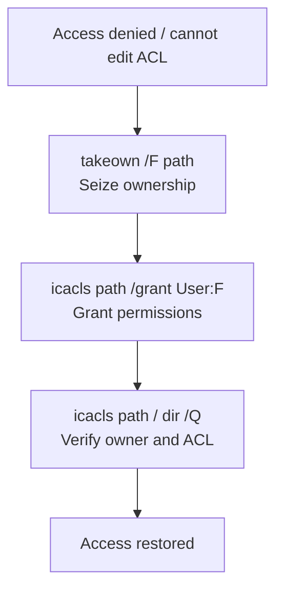

# TAKEOWN Command

`TAKEOWN` is a built-in Windows command-line tool that lets an administrator seize ownership of a file or directory. Taking ownership is usually the first step before an administrator can repair or modify permissions on protected files or folders they cannot otherwise touch.

## Overview

On NTFS, every securable object has an **owner** who can always modify that object's Access Control List, regardless of the permissions currently set. `TAKEOWN` uses the caller's **`SeTakeOwnershipPrivilege`** (held by administrators) to reassign that owner to the current user or to the local **Administrators** group. This breaks the deadlock where a restrictive or misconfigured ACL locks everyone out of a file — including administrators.

Ownership and permissions are **separate concepts**. `TAKEOWN` changes only *who owns* the object; it does **not** grant any access rights. To actually read or write the object afterward you pair it with [icacls](ICACLS-Command.md) to rewrite the ACL. Together, `takeown` + `icacls` are the standard command-line workflow for recovering access to locked resources, complementing the GUI **Security > Advanced > Owner** tab and the [PowerShell approach](NTFS-Permissions-Setup-with-PowerShell.md) to the [NTFS permissions model](NTFS-(New-Technology-File-System)-Permissions.md).

> [!NOTE]
> **Ownership is not access**
> Taking ownership does **not** automatically grant Full Control or modify existing ACLs. After taking ownership, use `ICACLS` to grant the permissions you actually need.

## How It Works

The typical remediation flow is three steps: seize ownership, grant permissions, then verify.



Because the owner can always rewrite the ACL, step 1 is what makes step 2 possible. On a folder tree, `/R` walks every child so ownership is reassigned recursively.

## Synopsis

```cmd
takeown [/S system [/U username [/P [password]]]]
        /F filename
        [/A]
        [/R [/D prompt]]
```

Display built-in help:

```cmd
takeown /?
```

## Purpose

The `TAKEOWN` command is commonly used to:

- Take ownership of files or folders.
- Recover access to files after permission issues.
- Repair access to orphaned files.
- Gain ownership of files before modifying ACLs.
- Prepare protected files for administrative maintenance.

## Parameters

| Parameter | Description |
|-----------|-------------|
| `/F <filename>` | Specifies the file or folder to take ownership of. |
| `/A` | Assigns ownership to the **Administrators** group instead of the current user. |
| `/R` | Recursively processes all files and subdirectories. |
| `/D Y` | Automatically answers **Yes** when prompted during recursive operations. Required when the current user lacks List Folder permission. |
| `/S <system>` | Specifies a remote computer. |
| `/U <username>` | Specifies the user account for the remote computer. |
| `/P <password>` | Specifies the password for the user account. |

## Examples

### Take Ownership of a Single File

```cmd
takeown /F C:\Data\secret.txt
```

Example output:

```text
SUCCESS: The file (or folder): "C:\Data\secret.txt" now owned by user "SRV01\Administrator".
```

---

### Take Ownership of a Folder

```cmd
takeown /F C:\Data
```

---

### Take Ownership Recursively

```cmd
takeown /F C:\Data /R /D Y
```

This command:

- Takes ownership of the folder.
- Processes all subfolders.
- Automatically answers **Yes** to prompts.

---

### Assign Ownership to the Administrators Group

```cmd
takeown /F C:\Data /A
```

Instead of the current user, ownership is assigned to the local **Administrators** group.

---

### Take Ownership of a Folder Recursively as Administrators

```cmd
takeown /F C:\Data /A /R /D Y
```

---

### Take Ownership on a Remote Computer

```cmd
takeown /S SRV02 /U Administrator /P Password123 /F C:\Data
```

> [!TIP]
> **Prefer the Administrators group over your own account**
> Using `/A` assigns ownership to the local **Administrators** group rather than the specific admin who ran the command. That keeps recovery repeatable and avoids leaving a single user as the sole owner of shared resources.

## Verifying Ownership

Use `ICACLS` to display the owner:

```cmd
icacls C:\Data
```

Example:

```text
C:\Data BUILTIN\Administrators:(F)
Successfully processed 1 files; Failed processing 0 files
```

To display the owner in more detail:

```cmd
dir /Q C:\Data
```

## Grant Permissions After Taking Ownership

Taking ownership does **not** automatically grant Full Control.

Grant Full Control using:

```cmd
icacls C:\Data /grant Administrator:F
```

Grant recursively:

```cmd
icacls C:\Data /grant Administrator:F /T
```

## Common Workflow

Take ownership:

```cmd
takeown /F C:\Data /R /D Y
```

Grant permissions:

```cmd
icacls C:\Data /grant Administrator:F /T
```

Verify permissions:

```cmd
icacls C:\Data
```

## Common Administrative Scenarios

### Recover Access to a Protected Folder

```cmd
takeown /F "C:\Program Files\App" /R /D Y
icacls "C:\Program Files\App" /grant Administrator:F /T
```

---

### Access a User Profile After Account Removal

```cmd
takeown /F "C:\Users\OldUser" /R /D Y
icacls "C:\Users\OldUser" /grant Administrator:F /T
```

---

### Repair Ownership After Restoring Files

```cmd
takeown /F D:\RestoredData /R /D Y
```

## Notes

- Requires an elevated **Command Prompt** (Run as Administrator).
- Ownership and permissions are separate concepts.
- Taking ownership does not modify existing ACLs.
- Use `ICACLS` to grant or modify permissions after ownership changes.
- The `/A` option assigns ownership to the **Administrators** group instead of the current user.
- Recursive operations on large directory trees may take considerable time.

## Security Considerations

`TAKEOWN` is a legitimate administrative tool, but the underlying **`SeTakeOwnershipPrivilege`** is a double-edged capability that matters in both offense and defense.

> [!WARNING]
> **Ownership can override deny ACEs**
> Because an object's owner can always rewrite its ACL, taking ownership lets a privileged account bypass a **Deny** ACE that was meant to protect a file. An attacker who holds `SeTakeOwnershipPrivilege` (or local admin/SYSTEM) can seize ownership of sensitive files or protected binaries, re-grant themselves Full Control, and then read or tamper with content that ACLs alone would have blocked — a path toward privilege escalation, tampering, and persistence.

- **Offensive relevance** — In post-exploitation, `takeown` + `icacls` can reopen files, service binaries, or scheduled-task scripts whose ACLs deny modification, enabling binary/DLL replacement or credential-file access. The `SeTakeOwnershipPrivilege` assigned to a user is itself a privilege-escalation primitive worth flagging during Windows enumeration.
- **Defensive relevance** — Ownership changes are a meaningful signal. Enable **object access auditing** (SACLs) on sensitive directories so that ownership and permission changes are logged, and monitor use of `SeTakeOwnershipPrivilege`. Treat unexpected `takeown` execution or owner flips on system/data paths as suspicious.
- **Blast radius** — Recursive `/R` operations reassign ownership across an entire tree; running `takeown` against operating-system paths can leave the OS in an inconsistent, hard-to-restore state.

## Best Practices

- Back up important data before modifying ownership or permissions.
- Use the principle of least privilege when granting permissions afterward, and prefer granting to **groups** rather than individual users.
- Assign ownership to the **Administrators** group (`/A`) rather than a single account so recovery stays repeatable.
- Verify ownership and ACLs after making changes with `icacls` or `dir /Q`.
- Avoid changing ownership of operating-system files unless required for maintenance or recovery.

## Troubleshooting

| Symptom | Likely cause & fix |
| --- | --- |
| "Access is denied" running `takeown` | Not elevated — run Command Prompt as Administrator (needs `SeTakeOwnershipPrivilege`). |
| Ownership succeeds but file still unreadable | Ownership does not grant access; run `icacls <path> /grant <user>:F`. |
| Recursive run skips folders / prompts endlessly | Missing List Folder permission on subdirectories; add `/D Y` to auto-answer prompts. |
| Only the top folder changed, children unchanged | `/R` omitted; re-run with `/R /D Y` to recurse. |
| Remote `takeown /S` fails | Bad credentials or blocked remote admin; verify `/U` / `/P` and that admin access to the target is allowed. |

## Related Commands

| Command | Purpose |
|----------|---------|
| `ICACLS` | Display and modify NTFS permissions (ACLs). |
| `CACLS` | Legacy ACL management command (deprecated). |
| `ATTRIB` | Display or modify file attributes. |
| `DIR /Q` | Display file ownership information. |
| `WHOAMI` | Display the current user and security information. |
| `NET USER` | Manage local user accounts. |

## References

- Microsoft Learn — `takeown` command: https://learn.microsoft.com/en-us/windows-server/administration/windows-commands/takeown
- Microsoft Learn — `icacls` command: https://learn.microsoft.com/en-us/windows-server/administration/windows-commands/icacls
- Microsoft Learn — NTFS permissions overview: https://learn.microsoft.com/en-us/windows-server/storage/file-server/ntfs-overview

## Related

- [ICACLS-Command](ICACLS-Command.md) — modern ACL command paired with `takeown` to grant access
- [CACLS-Command](CACLS-Command.md) — legacy ACL management predecessor to `icacls`
- [NTFS-(New-Technology-File-System)-Permissions](NTFS-(New-Technology-File-System)-Permissions.md) — the NTFS discretionary access-control model ownership sits on
- [NTFS-Default-Permissions](NTFS-Default-Permissions.md) — default permission sets on NTFS objects
- [NTFS-Permissions-Setup-with-PowerShell](NTFS-Permissions-Setup-with-PowerShell.md) — the PowerShell approach to ownership and ACLs
- [Enterprise Windows Infrastructure Security](../Readme.md) — course hub
