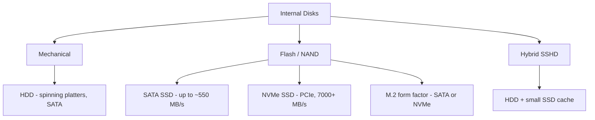

# Types of Internal Disks

Internal disks are storage devices installed inside a computer or server, used to hold the operating system, applications, and user data. They differ mainly in their underlying technology (mechanical vs. flash), the interface they connect through (SATA vs. PCIe), and their physical form factor.

## Overview

Choosing a disk is a trade-off between speed, capacity, cost, and durability. Mechanical **hard disk drives (HDDs)** offer the most capacity per dollar; **solid-state drives (SSDs)** trade cost for speed and reliability; and **NVMe** drives push flash performance further by connecting over the PCIe bus instead of SATA. On top of the raw media sit the [file systems](File-System.md) (FAT, NTFS, ReFS) that organize data, and — for availability — [RAID](RAID-(Redundant-Array-of-Independent-Disks).md) arrays that combine several disks. For long-term archival, [magnetic tape](Tape-Storage.md) remains the cheapest medium per terabyte.

> [!NOTE]
> **Interface vs. form factor**
> "M.2" describes a **physical form factor** (the slot and card shape), not a speed. An M.2 drive may speak either **SATA** or **NVMe** underneath, and the two are not interchangeable — always check which protocol the slot and drive support before buying.

## Disk Types

### Taxonomy



### 1. Hard Disk Drive (HDD)

Traditional magnetic storage with spinning platters and a moving read/write head.

- **Type**: Mechanical
- **Speed**: Slower (5400–7200 RPM typical; 10000+ RPM for high-end)
- **Storage**: High (up to 20 TB+)
- **Cost**: Cheaper per GB
- **Usage**: General data storage, backup

### 2. Solid State Drive (SSD)

No moving parts; uses NAND flash memory. Great for speed and performance.

- **Type**: Electronic (flash-based)
- **Speed**: Fast (much faster than HDD)
- **Storage**: Medium to high (256 GB – 8 TB+)
- **Cost**: More expensive than HDD per GB
- **Usage**: OS drive, high-speed storage

### 3. NVMe SSD (Non-Volatile Memory Express)

Modern SSDs that connect via PCIe for extremely fast data transfer speeds.

- **Type**: Flash storage using the PCIe interface
- **Speed**: Very fast (up to 7000+ MB/s)
- **Storage**: Medium to high
- **Cost**: Higher than SATA SSD
- **Usage**: Gaming, video editing, high-performance tasks

### 4. SATA SSD (Serial ATA Solid State Drive)

SSDs that use the older SATA interface — slower than NVMe but faster than HDDs.

- **Type**: Flash storage using the SATA interface
- **Speed**: Moderate (up to 550 MB/s)
- **Storage**: Medium to high
- **Cost**: Cheaper than NVMe, costlier than HDD
- **Usage**: Standard SSD upgrade

### 5. Hybrid Drive (SSHD — Solid State Hybrid Drive)

Uses an SSD cache for frequently accessed data and an HDD for bulk storage.

- **Type**: Combination of HDD + small SSD cache
- **Speed**: Faster than HDD, slower than SSD
- **Storage**: High (1 TB+ HDD + 8–32 GB SSD cache)
- **Cost**: Mid-range
- **Usage**: Budget performance improvement

### 6. M.2 Drives

Small, compact drives that can be either SATA-based or NVMe-based depending on the model.

- **Type**: Form factor (can be SATA or NVMe)
- **Speed**: Depends on interface
- **Storage**: Varies
- **Cost**: Depends on type
- **Usage**: Laptops and desktops with M.2 slots

> [!TIP]
> **Match the drive to the workload**
> Put the OS and latency-sensitive applications on an NVMe or SATA SSD, and reserve HDDs (or an SSHD) for bulk data and backups where capacity-per-dollar matters more than raw speed.

### Comparison Summary

| Type      | Interface | Speed      | Cost     | Use Case               |
|-----------|-----------|------------|----------|------------------------|
| HDD       | SATA      | Slow       | Low      | Mass storage           |
| SATA SSD  | SATA      | Medium     | Moderate | OS, apps, upgrades     |
| NVMe SSD  | PCIe      | Very Fast  | High     | High-performance tasks |
| SSHD      | SATA      | Medium     | Moderate | Budget mixed usage     |
| M.2 SATA  | SATA      | Medium     | Moderate | Compact systems        |
| M.2 NVMe  | PCIe      | Very Fast  | High     | Ultrabooks, gaming PCs |

## Tape Drive

A **tape drive** uses magnetic tape as the storage medium. It reads and writes data sequentially, making it slower than HDDs and SSDs for frequent access, but it excels at **cost-effective long-term storage**. See [Tape-Storage](Tape-Storage.md) for the dedicated note.

- **Type**: Magnetic storage (sequential access)
- **Speed**: Slow (especially for random access)
- **Storage**: Very high (up to 45 TB compressed per cartridge)
- **Cost**: Low per TB for large-scale storage
- **Usage**: Backup, archival, disaster recovery

### Features of Tape Drives

- **High capacity**: Modern tapes like LTO-9 offer up to 45 TB compressed storage.
- **Longevity**: Tapes can last 20–30 years if stored properly.
- **Low cost per TB**: Ideal for archiving huge datasets.
- **Sequential access**: Slower for frequent reads/writes; best for full backups.

### Common Tape Drive Formats

| Format | Native Capacity | Compressed Capacity | Notes                          |
|--------|-----------------|---------------------|--------------------------------|
| LTO-5  | 1.5 TB          | 3.0 TB              | Common in mid-range backup     |
| LTO-7  | 6.0 TB          | 15.0 TB             | High-performance tape          |
| LTO-9  | 18.0 TB         | 45.0 TB             | Latest generation (as of 2024) |

### Use Cases

- Enterprise **backup solutions**
- Long-term **data archiving**
- **Compliance** with data-retention laws
- **Cold storage** for rarely accessed data

### Advantages and Disadvantages

| Advantages | Disadvantages |
|------------|---------------|
| Durable and long-lasting | Slow random access |
| Low power consumption | Requires dedicated tape drives and software |
| Excellent for offsite, **air-gapped** backups | Less common in personal computing |

## Drive Letters A: and B:

`A:` and `B:` are traditionally **reserved drive letters for floppy disk drives**.

| Drive Letter | Purpose |
|--------------|---------|
| `A:` | First floppy disk drive (e.g., 3.5" or 5.25") |
| `B:` | Second floppy disk drive |

Background:

- In early DOS and Windows systems, `A:` was assigned to the primary floppy drive and `B:` to a second (if available).
- Hard drives were typically assigned starting from `C:` because `A:` and `B:` were already used for floppies.
- Even today, Windows usually avoids assigning `A:` or `B:` to partitions or USB drives **unless done manually**.

You can manually assign `A:` or `B:` to another drive (such as a USB stick) using **Disk Management** or `diskpart`. Some legacy programs may expect those letters to be floppy drives, but on modern systems this rarely causes issues.

Assign a USB drive the letter `A:` with `diskpart`:

```cmd
diskpart
list volume
select volume <X>
assign letter=A
```

## Security Considerations

Physical disks store data below the operating system's access controls. Once a disk is removed from its host, [NTFS permissions](NTFS-(New-Technology-File-System)-Permissions.md) no longer protect it — anyone who can image the platters or flash chips can read whatever was on them.

> [!WARNING]
> **Deleting a file does not erase the data**
> "Deleting" or formatting only removes filesystem pointers; the underlying blocks persist until overwritten. Forensic and data-recovery tools routinely reconstruct such **data remanence** from HDDs, SSDs, and even discarded tapes. Treat every retired or resold drive as a potential data leak.

- **SSD/NVMe secure erasure is different from HDD**: wear-leveling and over-provisioning keep spare NAND cells outside the addressable range, so single-pass overwrite utilities may leave recoverable copies. Use the drive's **ATA Secure Erase** / **NVMe Format (crypto erase)** command, or rely on full-disk encryption from day one.
- **Full-disk encryption (e.g. BitLocker)** is the practical defense against disk theft and offline imaging, since it renders remanent data useless without the key.
- **Tape** is attractive to defenders because offline, **air-gapped** cartridges resist ransomware — but unencrypted tapes shipped offsite are a physical-theft risk; encrypt archival media.
- **Provisioning and disposal**: enforce a media sanitization / destruction policy for decommissioned disks; physical shredding or degaussing is the surest method for failed drives that can't run a secure-erase command.

## Best Practices

- Put the OS and latency-sensitive workloads on SSD/NVMe; keep HDDs for bulk capacity and backups.
- Use RAID for availability, but never as a substitute for real backups — RAID does not protect against deletion, corruption, or ransomware.
- Encrypt disks at rest and require a documented secure-erase or destruction step before any drive leaves the organization.
- Verify whether an M.2 slot is SATA or NVMe (or both) before purchasing a drive for it.
- Keep at least one offline, air-gapped backup copy (e.g. tape or a rotated external disk) for disaster recovery.

## Troubleshooting

| Symptom | Likely cause & fix |
|---------|--------------------|
| New M.2 drive not detected | Slot/drive protocol mismatch (SATA vs. NVMe) — confirm the slot supports the drive's interface |
| SSD much slower than rated | Wrong port/interface (SATA SSD in a slow port, or NVMe running in SATA mode) — check the connection and BIOS setting |
| Disk missing a drive letter | Unassigned volume — assign a letter in **Disk Management** or with `diskpart` (`assign letter=`) |
| Recovered "deleted" sensitive data on a wiped drive | Data remanence — a plain format/delete does not sanitize; run a secure-erase or destroy the media |
| Tape restore fails or is corrupt | Aged/mishandled cartridge or drive head — validate backups periodically and store tapes in spec conditions |

## References

- Microsoft Learn — `diskpart` command reference: https://learn.microsoft.com/windows-server/administration/windows-commands/diskpart
- Microsoft Learn — Manage disks (Disk Management): https://learn.microsoft.com/windows-server/storage/disk-management/manage-disks
- NVM Express — official specifications and overview: https://nvmexpress.org/
- LTO Program — LTO Ultrium tape technology: https://www.lto.org/

## Related

- [File-System](File-System.md) — file systems formatted onto these disks
- [RAID-(Redundant-Array-of-Independent-Disks)](RAID-(Redundant-Array-of-Independent-Disks).md) — combining disks for redundancy
- [Tape-Storage](Tape-Storage.md) — magnetic tape backup and archival storage
- Data-Recovery — recovering data and the remanence problem
- [Enterprise Windows Infrastructure Security](../Readme.md) — course hub
