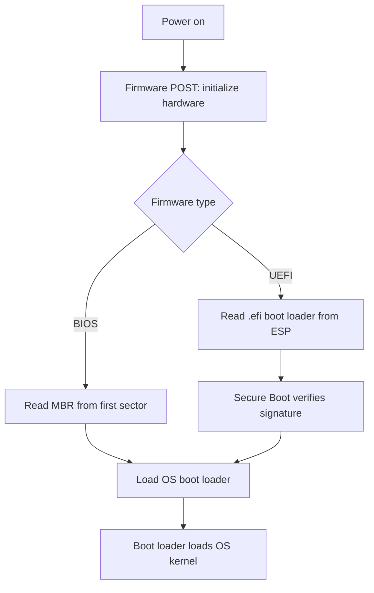

# BIOS and UEFI

**BIOS** (Basic Input/Output System) and **UEFI** (Unified Extensible Firmware Interface) are the two firmware interfaces that initialize a computer's hardware at power-on and hand control to the operating system's boot loader. BIOS is the legacy method; UEFI is its modern replacement, adding security, larger-disk support, and a richer interface.

## Overview

Firmware is the first code that runs when a machine powers on. It sits between the hardware and the operating system, performing hardware initialization (POST), exposing a setup interface, and then locating and launching a boot loader. This is the earliest link in the trust chain — everything above it inherits whatever the firmware allows to run. See [Firmware](Firmware.md) for firmware in general and [Booting-Process](Booting-Process.md) for the full power-on-to-logon sequence.

BIOS has been the traditional PC boot method for decades but carries hard limits (16-bit operation, MBR partitioning, small-disk support, no built-in integrity checking). UEFI was designed to replace it, introducing GPT partitioning for large disks, a modular architecture, and **Secure Boot** for boot-loader signature verification. Once firmware finishes, it hands off to the OS loader — on Windows that is the [Windows-Boot-Manager](Windows-Boot-Manager.md).

> [!TIP]
> **Enter firmware setup**
> Press a vendor hotkey (commonly `Del`, `F2`, or `Esc`) during the earliest moments of power-on to open the setup screen where you configure boot order, Secure Boot, and firmware passwords.

## What Is BIOS (Basic Input/Output System)

BIOS is legacy firmware embedded on the motherboard that initializes hardware during the booting process and provides runtime services for operating systems and programs. It has been the traditional boot method for PCs.

Key characteristics:

- Stored in a ROM chip on the motherboard (typically EEPROM or flash memory)
- Operates in **16-bit real mode**
- Provides a **text-based interface** (no mouse support)
- Limited to booting from drives **≤ 2 TB** using the **MBR** partition scheme
- Supports only **4 primary partitions**
- Access BIOS setup by pressing keys like `Del`, `F2`, or `Esc` during boot

```text
Press F2 or DEL during startup to enter BIOS Setup
```

## What Is UEFI (Unified Extensible Firmware Interface)

UEFI is a modern, flexible firmware interface designed to replace BIOS, offering enhanced features, better security, and faster boot times.

Key characteristics:

- Operates in **32-bit or 64-bit mode**
- Supports booting from drives **> 2 TB** using the **GPT** partition scheme
- Provides a **graphical user interface** (GUI) and **mouse support**
- Includes **Secure Boot** to prevent unauthorized OS loading (signature verification)
- Designed to be modular and upgradeable firmware stored on flash memory

## Boot Handoff

The firmware runs first, then transfers control to a boot loader, which in turn loads the OS kernel. The path differs by firmware type: BIOS reads boot code from the MBR in the first disk sector, while UEFI reads a `.efi` boot loader from the EFI System Partition and (when enabled) verifies its signature via Secure Boot before executing it.



## Architecture

### UEFI Firmware on Motherboard

- Stored on an SPI flash chip replacing the traditional ROM
- Typical size ranges from **16 MB to 32 MB**, depending on manufacturer and feature set

### EFI System Partition (ESP) on Disk

- Reserved partition on disk to store UEFI applications such as bootloaders and drivers (`.efi` files)
- Typical size:
  - About **100 MB** on Windows installs (default)
  - Up to **200–500 MB** for Linux distributions or dual-boot configurations
- Formatted with the **FAT32** file system
- Contains bootloader files (like `bootx64.efi`), device drivers, and UEFI NVRAM configuration data

### UEFI Runtime

- Allocates memory dynamically during boot/runtime for boot services and drivers
- Size varies and is system dependent (not user-configurable)

## MBR and GPT Partitioning Schemes

### What Is MBR (Master Boot Record)

An older partitioning format used by BIOS systems, stored in the first 512 bytes of the disk.

MBR layout:

- **446 bytes**: Bootloader code to start OS loading
- **64 bytes**: Partition table (4 partitions max, 16 bytes each)
- **2 bytes**: Boot signature (`0x55AA`)

Key features:

- Supports disks only up to **2 TB**
- Supports only **4 primary partitions** (or 3 primary + 1 extended)
- Bootloader stored in the first sector of the disk

```text
+---------------------+
| Bootloader (446 B)  |
+---------------------+
| Partition Table     |
+---------------------+
| Primary Partitions  |
+---------------------+
```

### What Is GPT (GUID Partition Table)

Modern partitioning scheme, part of the UEFI specification, that overcomes many limitations of MBR.

GPT layout features:

- Contains a **protective MBR** to guard against legacy disk tools
- Stores a **primary GPT header** and **backup GPT header** for resiliency
- Supports up to **128 partitions** by default in Windows (Linux supports even more)
- Uses **CRC32 checksums** for integrity verification of headers and partition tables
- Supports disks larger than **2 TB**

```text
+-------------------------+
| Protective MBR          |
+-------------------------+
| GPT Header              |
+-------------------------+
| Partition Entries       |
+-------------------------+
| Data Partitions         |
+-------------------------+
| Backup GPT Header       |
+-------------------------+
```

## Comparison

### BIOS vs UEFI

| Feature | BIOS | UEFI |
| :-- | :-- | :-- |
| Firmware Location | ROM (EEPROM/Flash) | SPI Flash chip |
| Operating Mode | 16-bit real mode | 32-bit/64-bit mode |
| Interface | Text-based, keyboard only | GUI and mouse support |
| Boot Drive Size Support | ≤ 2 TB (MBR only) | > 2 TB (GPT support) |
| Partition Limit | Up to 4 primary partitions | Up to 128 partitions (Windows) |
| Security Features | None | Secure Boot |
| Upgradeability | Limited | Modular and upgradeable |
| Setup Access Keys | F2, Del, Esc | Same keys, plus graphical setup |

### MBR vs GPT

| Feature | MBR | GPT |
| :-- | :-- | :-- |
| Partition Table Location | First 512 bytes | After protective MBR |
| Disk Size Support | Up to 2 TB | Greater than 2 TB |
| Partition Limits | Up to 4 primary partitions | Up to 128 or more |
| Redundancy | None | Primary and backup headers |
| Integrity Checking | None | CRC32 checksums |
| Compatibility | Legacy BIOS systems | UEFI systems (Windows, Linux) |

## Security Considerations

Firmware runs below the operating system and every OS-level defense, which makes it a high-value target: code that persists here survives OS reinstalls and is difficult to detect or remediate.

> [!WARNING]
> **Firmware is below every OS control**
> - **Bootkits / firmware implants** — malicious code planted in firmware or the boot chain loads before the OS and any endpoint protection, giving stealthy, reboot-persistent access.
> - **"Evil maid" attacks** — with physical access, an attacker can alter boot order, boot attacker-controlled media, or tamper with the boot loader when Secure Boot and a firmware password are absent.
> - **Secure Boot disabled or misconfigured** — turning Secure Boot off (or trusting rogue keys) lets unsigned or tampered boot loaders run, removing the main defense against bootkits.
> - **No firmware/setup password** — allows anyone with console access to change boot settings and bypass Secure Boot.

- **Secure Boot** verifies the signature of boot loaders and drivers, blocking unauthorized or tampered OS loaders — a primary defense against bootkits.
- Set a **firmware/setup password** to prevent unauthorized changes to boot order and Secure Boot settings.
- Because firmware sits beneath the OS, a compromised BIOS/UEFI is hard to detect and remediate — treat firmware integrity as part of the trust chain.

## Best Practices

- Prefer **UEFI + GPT** on modern hardware for large-disk support and resiliency.
- Enable **Secure Boot** where the operating system and drivers are properly signed.
- Set a **firmware/setup password** and restrict which boot devices are permitted.
- Keep firmware up to date to receive security and compatibility fixes; source updates from the vendor and verify integrity.
- Record the correct setup hotkey for your vendor before troubleshooting boot issues.

## Troubleshooting

| Symptom | Likely cause & fix |
| --- | --- |
| Disk larger than 2 TB not fully usable | MBR partition scheme on a BIOS system — convert to GPT and boot in UEFI mode |
| OS will not boot after enabling Secure Boot | Unsigned boot loader or drivers — sign components or temporarily disable Secure Boot |
| Cannot enter firmware setup | Fast boot skips the setup prompt — use the vendor recovery key or disable fast boot |
| OS install fails with Secure Boot errors | Firmware/media mismatch — align UEFI vs Legacy mode with GPT vs MBR install media |

## References

- [UEFI and Secure Boot (Microsoft Learn)](https://learn.microsoft.com/en-us/windows-hardware/design/device-experiences/oem-secure-boot)
- [Boot and UEFI (Microsoft Learn)](https://learn.microsoft.com/en-us/windows-hardware/drivers/bringup/boot-and-uefi)
- [UEFI Specifications (UEFI Forum)](https://uefi.org/specifications)
- <https://www.disk-image.com/faq-bootmenu.htm> — BIOS/boot hotkeys reference

## Related

- [Enterprise Windows Infrastructure Security](../Readme.md) — course hub and map of content
- [Firmware](Firmware.md) — BIOS/UEFI is a form of firmware
- [Booting-Process](Booting-Process.md) — power-on to logon boot sequence
- [Windows-Boot-Manager](Windows-Boot-Manager.md) — the boot loader UEFI hands control to
- [CPU-Architecture](CPU-Architecture.md) — 32-bit vs 64-bit execution the firmware sets up
- [Fundamental-Of-Computers](Fundamental-Of-Computers.md) — computer fundamentals overview
