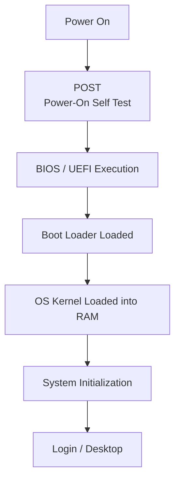

# Booting Process

Booting is the process of starting or restarting a computer and loading the operating system into main memory (RAM) so the machine can begin functioning. This note walks the sequence from power-on to logon, the firmware and bootloader stages in between, and why that early chain matters to an attacker.

## Overview

At power-on the CPU cannot yet run the operating system — the OS lives on disk and nothing has loaded it into RAM. The boot process is the chain of small, increasingly capable stages that bridges that gap: firmware brings the hardware to life and finds a bootable device, a bootloader pulls the OS kernel into RAM and hands off control, and the kernel finishes initialization until a logon prompt or desktop appears.

Each stage trusts the one that started it, so the whole chain is a **trust anchor**: whoever controls an early stage controls everything above it. That is why [Firmware](Firmware.md), [BIOS-and-UEFI](BIOS-and-UEFI.md), and the [Windows-Boot-Manager](Windows-Boot-Manager.md) are studied together, and why Secure Boot exists.

> [!NOTE]
> **Where this fits**
> The boot chain sits directly on top of the [CPU](CPU-Architecture.md) and firmware and directly below the [Operating-System](Operating-System.md). Understanding it is the prerequisite for boot-time attacks, offline disk access, and recovery/troubleshooting of a machine that won't start.

## Types of Booting

- **Cold Boot (Hard Boot)** — starting the computer from a fully powered-off state. Firmware runs a complete hardware initialization and POST.
- **Warm Boot (Soft Boot)** — restarting a running system without cutting power (a reboot or restart command). Some hardware checks may be skipped, so it is faster.

## Boot Flow

The following diagram shows the ordered handoff from pressing the power button to reaching a logon or desktop.



## Steps in the Booting Process

### 1. Power On

- When the power button is pressed, electrical power is supplied to the system components.
- The CPU is initialized and begins executing instructions from a fixed firmware entry point.

```text
Power Button → Power Supply → Motherboard + CPU
```

### 2. POST (Power-On Self Test)

A hardware diagnostic test run by the firmware (BIOS/UEFI) before any OS code runs. It checks critical devices and components:

- Memory (RAM) test
- Keyboard / input detection
- Storage device availability

If a problem is detected, the firmware signals it with on-screen error messages or **beep codes** (the meaning of each beep pattern is vendor-specific).

### 3. BIOS / UEFI Execution

- Firmware (BIOS or UEFI) initializes the hardware configuration and system settings.
- It identifies and orders the bootable devices based on the configured **boot priority**.

Example boot priority order:

1. SSD
2. USB
3. Network

See [BIOS-and-UEFI](BIOS-and-UEFI.md) for the difference between legacy BIOS and modern UEFI, and how Secure Boot changes this stage.

### 4. Boot Loader Is Loaded

- The firmware searches the first bootable device for a **bootloader** program.
- The bootloader is responsible for locating and loading the operating system.

Bootloader location depends on the partition scheme:

| Partition Scheme | Bootloader Location |
| :-- | :-- |
| MBR | First 512 bytes of the disk (the MBR sector) |
| GPT with UEFI | EFI System Partition (ESP) |

Common bootloaders:

- **GRUB** (Linux)
- **Windows Boot Manager** (Windows) — see [Windows-Boot-Manager](Windows-Boot-Manager.md)

### 5. Operating System Kernel Is Loaded

- The bootloader loads the OS kernel into RAM and passes control to it.
- The kernel initializes core system resources and takes over management of the hardware.

Example GRUB message:

```text
Loading Linux 5.15.0-76-generic...
```

### 6. System Initialization

- The kernel initializes hardware drivers and mounts the root filesystem.
- System services start, and finally the login interface or desktop environment appears.

```text
Starting system services...
Welcome to Ubuntu!
Login:
```

### Boot Sequence Summary

```text
Power On → POST → BIOS/UEFI → Bootloader → Kernel → System Initialization → Login
```

## Security Considerations

The boot chain runs before the operating system — and before any OS-level security control such as antivirus, EDR, or account permissions. Code that executes here therefore sits *beneath* everything defenders normally rely on, which makes it valuable to attackers for persistence and for bypassing on-disk protections.

> [!WARNING]
> **The boot chain is a trust anchor**
> - **Bootkits / MBR rootkits** — malware that infects the MBR or bootloader executes before the OS loads, so it can hide from and subvert OS-level defenses and survive reinstalls of the OS.
> - **Boot-order tampering / bootable media** — with physical access and no disk encryption, an attacker changes the boot order to boot an external OS (USB/live disk), mounts the internal disk offline, and reads or modifies files freely — including local password stores and, on a Domain Controller, `NTDS.dit`.
> - **"Evil maid" attacks** — brief unattended physical access is used to plant a malicious bootloader that later captures credentials or disk-encryption keys.
> - **Firmware attacks** — malicious or tampered firmware persists below even the bootloader.

Defensive countermeasures anchored at the boot stage:

- **Secure Boot** — firmware verifies the bootloader's signature and refuses to load unsigned or tampered boot code, breaking many bootkit and boot-media attacks.
- **Full-disk encryption** (for example, BitLocker) — makes offline disk access useless without the key, defeating the "boot from external media" path.
- **Firmware / BIOS password** and disabling external boot devices — stops boot-order tampering by casual physical attackers.

## Best Practices

- Keep **UEFI + Secure Boot enabled** on lab and production machines unless a test explicitly requires disabling them.
- Prefer **UEFI/GPT** over legacy **BIOS/MBR** for new builds — legacy BIOS/MBR has no Secure Boot.
- Set a **firmware/BIOS password** and restrict boot from external media on machines exposed to physical access.
- Enable **full-disk encryption** so an offline attacker cannot read the disk after changing the boot order.
- Treat **firmware updates like any other patch**: source them from the vendor and verify integrity before applying.

## Troubleshooting

| Symptom | Likely cause & fix |
| :-- | :-- |
| No display, beep codes at power-on | POST hardware failure (RAM/GPU) — reseat components; decode the beep pattern against the board vendor's reference |
| Machine boots to firmware instead of the OS | Boot order wrong or boot entry missing — check the UEFI boot menu; on Windows rebuild with `bcdedit` / `bootrec /rebuildbcd` `# untested` |
| "No bootable device" / "Operating System not found" | Bootloader or partition table damaged, or wrong device first in boot order — verify boot device, repair the bootloader |
| OS won't install / "Secure Boot" error | Firmware/media mismatch — align UEFI vs Legacy mode with GPT vs MBR install media |

## References

- [Windows boot process fundamentals (Microsoft Learn)](https://learn.microsoft.com/en-us/windows-hardware/drivers/bringup/boot-and-uefi)
- [UEFI Secure Boot (Microsoft Learn)](https://learn.microsoft.com/en-us/windows-hardware/design/device-experiences/oem-secure-boot)
- [BCDEdit command-line options (Microsoft Learn)](https://learn.microsoft.com/en-us/windows-hardware/manufacture/desktop/bcdedit-command-line-options)

## Related

- [Enterprise Windows Infrastructure Security](../Readme.md) — course hub and map of content
- [Firmware](Firmware.md) — low-level code that runs at the start of boot
- [BIOS-and-UEFI](BIOS-and-UEFI.md) — firmware types and Secure Boot
- [Windows-Boot-Manager](Windows-Boot-Manager.md) — the Windows bootloader stage in detail
- [Operating-System](Operating-System.md) — what the boot process ultimately loads
- [CPU-Architecture](CPU-Architecture.md) — the processor that begins executing at power-on
