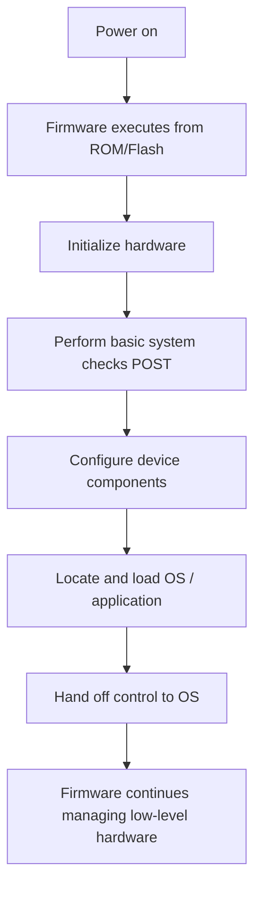

# Firmware

Firmware is low-level software stored in non-volatile memory (ROM, EEPROM, or Flash) that provides the first control layer for a hardware device. It initializes and manages the hardware and acts as the bridge between the physical components and higher-level software such as the operating system.

## Overview

Every computing device — from a motherboard to an SSD, router, or IoT sensor — ships with firmware baked into a chip on the device itself. Unlike ordinary applications, firmware runs the moment power is applied, before any [Operating-System](Operating-System.md) exists in memory. On a PC the most familiar firmware is the motherboard's [BIOS-and-UEFI](BIOS-and-UEFI.md), which brings up the hardware and then hands control to the [Windows-Boot-Manager](Windows-Boot-Manager.md) as part of the [Booting-Process](Booting-Process.md).

Firmware sits at the base of the trust chain: because it executes first and controls the hardware directly, everything loaded afterwards inherits its integrity. That position is exactly why it matters both to system builders (see [Fundamental-Of-Computers](Fundamental-Of-Computers.md) and [CPU-Architecture](CPU-Architecture.md)) and to attackers.

> [!NOTE]
> **Firmware vs. software**
> Firmware is *device-resident* and rarely changes; ordinary software lives on disk, runs after the OS is up, and changes often. Firmware is required for the hardware to function at all, whereas software depends on both the OS and the underlying firmware.

## Characteristics

- Stored directly on the hardware device in non-volatile memory.
- Begins executing automatically when the device powers on.
- Controls basic, low-level hardware functions.
- Usually remains unchanged for long periods.
- Can typically be updated through a controlled firmware-upgrade process.

## How It Works

When a device is powered on, its firmware runs a fixed startup routine before any operating system is involved.



On a PC this sequence is what the [BIOS-and-UEFI](BIOS-and-UEFI.md) firmware performs before the [Windows-Boot-Manager](Windows-Boot-Manager.md) takes over — the full power-on-to-logon flow is covered in [Booting-Process](Booting-Process.md).

## Types and Examples

Firmware exists in almost every hardware component. Common examples:

| Device | Firmware Example |
| --- | --- |
| Motherboard | BIOS / UEFI |
| Router | Router operating firmware |
| SSD | SSD controller firmware |
| Hard drive | Disk controller firmware |
| Printer | Printer firmware |
| Keyboard | Keyboard controller firmware |
| GPU | Video BIOS (vBIOS) |
| Smartphone | Bootloader and device firmware |
| IoT device | Embedded device firmware |

### Firmware vs. Software

| Feature | Firmware | Software |
| --- | --- | --- |
| Location | Stored on hardware memory | Stored on disk/storage |
| Purpose | Controls hardware | Performs user tasks |
| Startup | Runs immediately at boot | Runs after OS loads |
| Updates | Infrequent | Frequent |
| Dependency | Required for hardware operation | Depends on OS and firmware |

## Firmware in Computers

On a PC the primary firmware is the motherboard firmware, which comes in two forms.

### BIOS

The **Basic Input/Output System (BIOS)** is the legacy PC firmware. It initializes hardware during startup, runs the Power-On Self-Test (POST), and begins the boot process from an MBR-partitioned disk.

### UEFI

The **Unified Extensible Firmware Interface (UEFI)** is the modern replacement for BIOS. It provides:

- Faster boot times
- Secure Boot support
- GPT disk support (boot volumes larger than 2 TB)
- A graphical configuration interface
- A modular, extensible architecture

See [BIOS-and-UEFI](BIOS-and-UEFI.md) for the full legacy-vs-modern comparison.

## Firmware Management Commands

The following commands read firmware/BIOS information from a running system.

### Linux

View BIOS/UEFI information:

```bash
sudo dmidecode -t bios
```

Show the firmware version fields:

```bash
sudo dmidecode | grep -A3 BIOS
```

List firmware blobs loaded by the kernel:

```bash
dmesg | grep firmware
```

### Windows

PowerShell — read BIOS properties:

```powershell
Get-ComputerInfo | Select-Object Bios*
```

Command Prompt — query the SMBIOS BIOS version (legacy `wmic`, deprecated on modern Windows):

```cmd
wmic bios get smbiosbiosversion
```

## Firmware Updates

Firmware updates ("flashing") are applied to fix bugs, improve stability, patch security vulnerabilities, improve hardware compatibility, or add features. Typical examples include motherboard BIOS/UEFI updates, SSD firmware updates, router firmware updates, and GPU vBIOS updates.

> [!IMPORTANT]
> **Flashing is a high-risk operation**
> A failed or interrupted firmware update can permanently brick a device. Always source firmware from the hardware vendor, verify its integrity, and never power off mid-update.

## Security Considerations

Firmware runs below the operating system, so a firmware compromise (a *bootkit* or *implant*) executes before any OS-level defense — antivirus, EDR, and even disk encryption can be subverted from beneath. Such implants survive OS reinstalls and disk wipes, making them a prized objective for advanced attackers and a difficult one for defenders to detect.

> [!WARNING]
> **Firmware compromise is persistence below the OS**
> Because firmware loads first and anchors the trust chain, malicious firmware defeats controls that assume a trustworthy boot. It persists across reinstalls, hides from OS-based tooling, and can re-infect a freshly imaged disk. Treat firmware integrity as a foundational control, not an afterthought.

Common protections:

- **Secure Boot** — the firmware verifies signatures on boot components before executing them.
- **TPM (Trusted Platform Module)** — hardware root of trust for measuring and attesting boot integrity.
- **Firmware / driver signing** — only vendor-signed images are accepted.
- **Signed UEFI firmware updates** — updates are cryptographically verified before flashing.
- **Hardware Root of Trust** — an immutable, trusted starting point for the boot measurement chain.

## Best Practices

- Keep **Secure Boot** enabled and set a **firmware (BIOS/UEFI) password** to block unauthorized configuration changes and boot-media substitution.
- Apply vendor firmware updates promptly, and only from the official vendor, verifying integrity before flashing.
- Prefer **UEFI/GPT** over legacy BIOS/MBR for new builds so Secure Boot is available.
- Enable a **TPM** and use it to anchor measured boot and disk encryption.
- Record firmware versions in your notes so lab and production hosts are reproducible and auditable.

## Troubleshooting

| Symptom | Likely cause & fix |
| --- | --- |
| Device won't power on / no display after a firmware update | Interrupted or corrupt flash — use the vendor recovery/rollback procedure (e.g. BIOS flashback) |
| "Secure Boot" errors during OS install | Firmware/media mismatch — align UEFI vs Legacy mode with GPT vs MBR install media |
| Firmware version not reported by tooling | Query the correct source — `dmidecode` on Linux, `Get-ComputerInfo` on Windows; some fields need elevated privileges |
| New hardware not initialized at boot | Outdated firmware lacking support — update to the latest vendor firmware |

## References

- [Firmware and boot (Microsoft Learn — boot and UEFI)](https://learn.microsoft.com/en-us/windows-hardware/drivers/bringup/boot-and-uefi)
- [UEFI Secure Boot (Microsoft Learn)](https://learn.microsoft.com/en-us/windows-hardware/design/device-experiences/oem-secure-boot)
- [UEFI Specification (UEFI Forum)](https://uefi.org/specifications)
- [Platform Firmware Resiliency Guidelines (NIST SP 800-193)](https://csrc.nist.gov/pubs/sp/800/193/final)

## Related

- [Enterprise Windows Infrastructure Security](../Readme.md) — course hub and map of content
- [BIOS-and-UEFI](BIOS-and-UEFI.md) — primary firmware on a PC
- [Booting-Process](Booting-Process.md) — firmware initializes hardware before boot
- [Windows-Boot-Manager](Windows-Boot-Manager.md) — the bootloader firmware hands off to
- [Operating-System](Operating-System.md) — the software firmware loads
- [Fundamental-Of-Computers](Fundamental-Of-Computers.md) — computer fundamentals overview
- [CPU-Architecture](CPU-Architecture.md) — the processor firmware initializes
