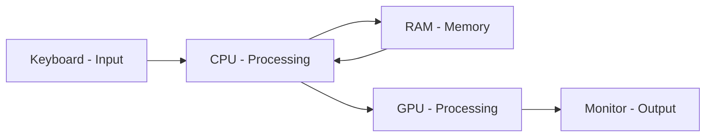

# Fundamental of Computers

Foundational computer concepts — electrical power (AC/DC), the machine/device distinction, and the hardware and software layers that together make up a computer system. This is the ground floor every later topic in the course builds on.

## Overview

A computer is an electronic system that takes input, processes it, stores data, and produces output. Understanding how its physical parts (hardware) and its instructions (software) cooperate is the prerequisite for everything that follows — from the firmware and [boot sequence](Booting-Process.md) that bring the machine to life, through [CPU architecture](CPU-Architecture.md) and [hardware specifications](Laptop-or-PC-Specifications.md), up to the [operating system](Operating-System.md) that manages it all. For an offensive practitioner, that same stack is the attack surface: hardware, firmware ([BIOS-and-UEFI](BIOS-and-UEFI.md)), the OS, and the data left behind on storage media are all potential entry points or evidence.

## Alternating Current & Direct Current

Electrical power reaches and moves through a computer in two forms. The power-supply unit (PSU) converts wall power (AC) into the stable low-voltage DC that the internal components need.

### Alternating Current (AC)

- Alternating Current is a type of electrical current in which the direction of electron flow reverses periodically at regular intervals or cycles.
  - Commonly used in power lines and household electricity.
  - Delivered through wall outlets; power leads that plug into sockets supply AC.

### Direct Current (DC)

- Direct Current flows consistently in one direction.
  - Found in flashlights, battery-powered devices, and many electronics.
  - Most battery-operated devices use DC.
  - Internal PC components (CPU, RAM, drives) run on DC supplied by the PSU.

## Machine & Device

- **Machine** — an apparatus using mechanical power and consisting of several parts, each with a specific function, working together to perform a particular task.
- **Device** — any piece of equipment made for a specific purpose, especially mechanical or electrical, operating under certain rules or principles.

## What Is a Computer?

**COMPUTER** is a popular backronym: **C**ommon **O**perating **M**achine **P**articularly **U**sed for **T**echnology and **E**ducational **R**esearch. It is a memory aid rather than a formal definition, but it captures the idea of a general-purpose processing machine.

A computer is built from two cooperating layers: **hardware** (the physical parts) and **software** (the instructions that drive them).

### Hardware

Hardware refers to **all the physical, tangible parts of a computer system** — anything you can see, touch, or plug in. It works hand-in-hand with software (the instructions) to perform tasks. The table below groups the major hardware categories.

| Category | Typical Components | What They Do |
| :-- | :-- | :-- |
| **Input** | Keyboard, mouse, touch-screen, scanner, webcam, microphone, game controller | Send data and control signals _into_ the computer |
| **Processing** | **CPU**, **GPU**, motherboard chipsets (PCH/GMCH/ICH), embedded controllers | Execute instructions, perform calculations, manage data flow |
| **Memory** | **RAM**, **ROM**, cache (L1/L2/L3) | Store data the CPU can access quickly (RAM is volatile, ROM is non-volatile) |
| **Storage** | **SSD**, **HDD**, NVMe, optical drives, SD cards, USB flash drives | Keep data and programs long-term — even when power is off |
| **Output** | Monitor, printer, speakers, VR headset, projector, LEDs | Present information _from_ the computer _to_ the user |
| **Communication / I/O** | Network cards (Ethernet, Wi-Fi, Bluetooth), USB/Thunderbolt ports, serial/parallel ports | Move data between the computer and external devices or networks |
| **Power** | Power-supply unit (PSU), AC adapters, batteries | Convert AC ↔ DC and distribute stable voltages throughout the system |
| **Peripheral / Expansion** | Graphics card, sound card, capture card, M.2 NVMe drives, PCIe accelerators | Add or enhance capabilities beyond the base motherboard features |
| **Cooling & Chassis** | Heat sinks, fans, liquid-cooling loops, cases, dust filters | Dissipate heat and protect components |

See [Laptop-or-PC-Specifications](Laptop-or-PC-Specifications.md) for how these components are described on spec sheets, and [CPU-Architecture](CPU-Architecture.md) for what happens inside the processing unit.

> [!IMPORTANT]
> **Key takeaway**
> Hardware provides the _physical platform_; software provides the _instructions_. Both are essential for a functional computer — neither does useful work alone.

The data-flow example below traces a single keystroke through the hardware categories, showing how input, processing, memory, and output cooperate.

- Pressing a key ⇒ the keyboard (input) captures the keystroke.
- The CPU (processing) interprets it and stores it briefly in RAM (memory).
- The GPU (processing) renders the character.
- The monitor (output) displays the result.

### Software

Software is the set of instructions that tells the hardware what to do. It falls into three broad classes.

#### System Software

- Controls the computer hardware and provides a platform for running application software.
- Examples:
  - Operating System (`OS`) — see [Operating-System](Operating-System.md)
  - Basic Input/Output System (`BIOS`) — see [BIOS-and-UEFI](BIOS-and-UEFI.md)

#### Application Software

- Programs designed for end-users to perform specific tasks.
- Examples:
  - `VLC` (media player)
  - `Notepad` (text editor)
  - `MSPaint` (drawing tool)

#### Utility Software

- Tools that help manage, maintain, and control computer resources.
- Examples:
  - Disk cleanup tools
  - Antivirus programs
  - File compression utilities

> [!NOTE]
> **Where the OS fits**
> The operating system is system software that sits between applications and hardware, brokering access to the CPU, memory, storage, and devices. Firmware ([Firmware](Firmware.md), [BIOS-and-UEFI](BIOS-and-UEFI.md)) runs even lower, initializing hardware before the OS loads.

## Security Considerations

Every layer of the computer — hardware, firmware, OS, and the data on storage media — is relevant to both attackers and defenders. Physical access and leftover data are frequently underestimated risks.

> [!WARNING]
> **Data remanence on discarded storage**
> Deleting a file or performing a "quick format" does **not** erase the underlying data — it only removes the pointer to it. Discarded, resold, or improperly wiped HDDs/SSDs commonly still hold recoverable credentials, keys, and sensitive files. Treat media sanitization as a security control, not housekeeping.

- **Physical access = high impact** — with hands on the hardware, an attacker can boot alternate media, reset firmware, or pull the drive. This is why firmware passwords and Secure Boot ([BIOS-and-UEFI](BIOS-and-UEFI.md)) matter.
- **Volatile vs non-volatile memory** — RAM (volatile) can still yield secrets via cold-boot / memory-dump attacks shortly after power-off; storage (non-volatile) retains data until deliberately sanitized.
- **Secure disposal** — sanitize media before decommissioning. NIST distinguishes three levels: **Clear** (overwrite), **Purge** (cryptographic erase / secure-erase commands), and **Destroy** (physical destruction) — escalate with the sensitivity of the data.

### Destroying a Hard Drive

For data that must be rendered unrecoverable, physical destruction (shredding, degaussing magnetic media, incineration) is the definitive method. Reference video guides:

- https://www.youtube.com/watch?v=YRSHfV-AcVM
- https://www.youtube.com/watch?v=jYsonW7dXyk
- https://www.youtube.com/watch?v=XZmGGAbHqa0

> [!TIP]
> **Match the method to the media**
> Degaussing destroys data on magnetic HDDs but does **not** work on flash-based SSDs (no magnetic domains). For SSDs, use the drive's built-in secure-erase / cryptographic-erase, or physically shred the chips.

## Best Practices

- Use a quality PSU rated for the system's load and keep it on clean, protected power (surge protection / UPS) to avoid data-corrupting outages.
- Keep components within thermal limits — adequate cooling preserves both stability and hardware lifespan.
- Match hardware specs to the workload; record host and VM specs so lab work is reproducible.
- Keep firmware and drivers sourced from the vendor and up to date (see [BIOS-and-UEFI](BIOS-and-UEFI.md)).
- Sanitize storage media before disposal or reuse, escalating to physical destruction for sensitive data.

## Troubleshooting

| Symptom | Likely cause & fix |
| --- | --- |
| No power / no fans | Faulty or unplugged PSU, wall power, or loose power cable — verify AC source and PSU switch |
| Powers on but no display | Loose/failed RAM, GPU, or display cable — reseat memory and check the monitor connection |
| Random shutdowns or throttling | Overheating from failed cooling or dust buildup — clean fans/heat sinks and check airflow |
| Deleted files still recoverable | "Delete"/quick-format only removes pointers — use a secure-erase or overwrite tool for true removal |

## References

- NIST SP 800-88 Rev. 1 — Guidelines for Media Sanitization: https://csrc.nist.gov/pubs/sp/800/88/r1/final
- Microsoft Learn — Boot and UEFI: https://learn.microsoft.com/en-us/windows-hardware/drivers/bringup/boot-and-uefi

## Related

- [Enterprise Windows Infrastructure Security](../Readme.md) — course hub
- [Laptop-or-PC-Specifications](Laptop-or-PC-Specifications.md) — reading and comparing hardware specs
- [CPU-Architecture](CPU-Architecture.md) — CPU internals and 32-bit vs 64-bit execution
- [Firmware](Firmware.md) — the low-level software between hardware and the OS
- [BIOS-and-UEFI](BIOS-and-UEFI.md) — boot firmware and Secure Boot
- [Booting-Process](Booting-Process.md) — how a computer starts up, power-on to logon
- [Operating-System](Operating-System.md) — software that manages the hardware
- [Windows-Operating-System-Editions](Windows-Operating-System-Editions.md) — client vs server editions
