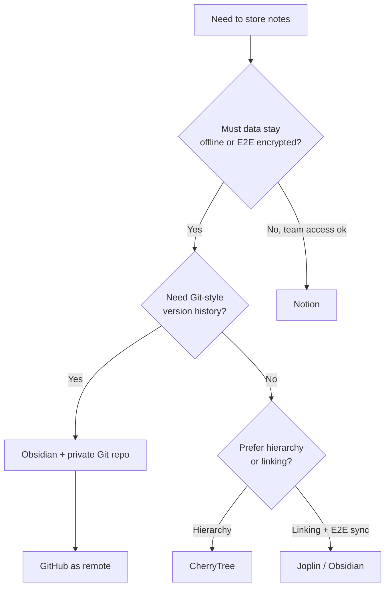

# Note-Taking Tools

A comparison of popular note-taking and knowledge-management tools for documenting lab work, findings, and study notes — covering each tool's strengths, weaknesses, and best-fit use cases. For penetration testers the choice is not just about convenience: engagement notes hold credentials, client data, and scope details, so where and how they are stored is itself a security decision.

## Overview

Good documentation is the difference between a repeatable methodology and a pile of forgotten commands. Throughout this course you will capture command output, screenshots, host inventories, and findings — the same discipline that underpins a professional report. A note-taking tool should let you organize hierarchically, embed code and images, link related ideas, and — critically for security work — keep sensitive data under your control.

The tools below fall into three broad families: **local-first hierarchical editors** (CherryTree), **local-first linked knowledge bases** (Obsidian, Joplin), **cloud collaboration suites** (Notion), and **version-controlled repositories** (GitHub). This very vault is an [Obsidian](Operating-System.md)-based knowledge base kept in Git, which illustrates both the power and the pitfalls of the last two families.

> [!TIP]
> **Pick by workflow, not by hype**
> Match the tool to how you actually work. Solo lab study and offline engagements favour local-first tools; team red-team ops favour collaboration; anything you want diffed and versioned favours Git. It is common to combine two — for example, Obsidian notes stored in a private Git repo.

## Tools Compared

| Tool | Storage model | Encryption | Collaboration | Best fit |
| --- | --- | --- | --- | --- |
| CherryTree | Local file | Optional password-protected file | Weak | Offline hierarchical notes |
| Obsidian | Local Markdown | Via sync add-on / disk encryption | Plugin-only | Personal knowledge base, linking |
| Joplin | Local + sync | End-to-end encryption | Weak | Secure cross-device notes |
| Notion | Cloud | In transit / at rest (provider-held) | Strong | Team documentation |
| GitHub | Remote Git repo | Repo-visibility + transport | Strong | Versioned technical docs |

### CherryTree

[CherryTree](https://www.giuspen.net/) — a hierarchical note-taking application with rich text formatting, syntax highlighting, and strong export options.

- **Pros**: tree-structured organization (easy nesting); rich text and code support; no cloud dependency (local storage).
- **Cons**: outdated UI; limited collaboration features.
- **Best for**: personal note databases, technical documentation, offline use.

### Obsidian

[Obsidian](https://obsidian.md) — a Markdown-based personal knowledge-management app built around linking notes together into a graph.

- **Pros**: local-first, privacy-focused; powerful linking and graph visualization; extensive plugin ecosystem.
- **Cons**: no built-in collaboration tools (without plugins); learning curve for beginners.
- **Best for**: personal knowledge bases, the Zettelkasten method, research projects.

### Joplin

[Joplin](https://joplinapp.org/) — an open-source note-taking app focused on privacy, Markdown notes, and synchronization across devices.

- **Pros**: end-to-end encryption; free and open-source; supports attachments and to-dos.
- **Cons**: interface can feel basic; limited real-time collaboration.
- **Best for**: secure personal notes, cross-platform use, offline-first note-taking.

### Notion

[Notion](https://www.notion.so/pricing) — an all-in-one productivity tool for notes, tasks, databases, and team collaboration.

- **Pros**: highly customizable (templates, databases, kanban boards); great for team collaboration; polished UI and UX.
- **Cons**: cloud-only (limited offline support); can feel overwhelming due to feature overload.
- **Best for**: project management, team collaboration, structured documentation.

### GitHub

[GitHub](https://github.com/) — a code-hosting platform primarily for version control, but also useful for documentation and collaborative notes.

- **Pros**: version control (Git); collaboration and issue tracking; GitHub Pages for publishing notes.
- **Cons**: geared mainly toward developers; steeper learning curve for non-technical users.
- **Best for**: technical documentation, code-related note-taking, collaborative project management.

## Choosing a Tool

The main fork is whether your data must stay local/encrypted, whether you need collaboration, and whether you want version history.

## Security Considerations

Penetration-testing notes are among the most sensitive artifacts you produce. They routinely contain captured hashes and cleartext passwords, internal hostnames and IPs, client scope, and screenshots of compromised systems — everything an attacker (or a leak) would want in one place.

> [!WARNING]
> **Where your notes live is part of the attack surface**
> - **Cloud tools (Notion) put engagement data on a third party's servers** — often disallowed by client contracts and out of your control. Confirm the rules of engagement before using cloud storage for findings.
> - **Public Git repos leak secrets.** Committed credentials, tokens, and API keys persist in history even after deletion. A real example lives in this vault: a plaintext GitHub Personal Access Token was committed in the `github-sync` plugin config and must be rotated. Treat any secret that ever hit a repo as compromised.
> - **Local files are only as safe as the disk.** Without full-disk or app-level encryption, an unlocked or stolen laptop hands over every note. Prefer tools with encryption (Joplin E2E) or store the vault on an encrypted volume.

- Keep client/engagement notes in **private** repositories or offline, never public.
- Scrub or vault real credentials before sharing notes; use placeholders in study material.
- Add secret-scanning (e.g. `git-secrets`, GitHub push protection) and a `.gitignore` for any file that may hold tokens.

## Best Practices

- Choose local-first + encrypted tools for anything containing live engagement data; reserve cloud/collaboration tools for sanitized or study content.
- Use one consistent structure (per-host, per-finding, per-course) so notes stay searchable and reproducible.
- Tag code and command output in fenced blocks and record exact commands so labs can be replayed.
- Back up your notes (encrypted) and, if using Git, keep the remote private and secret-free.
- Standardize on one primary tool to avoid fragmenting knowledge across apps.

## Troubleshooting

| Symptom | Likely cause & fix |
| --- | --- |
| Notes not syncing across devices | Sync target misconfigured or credentials expired — re-authenticate the sync backend (Joplin/Obsidian Sync) |
| Secret accidentally committed to Git | Rotate the secret immediately; history rewrite alone is not enough since forks/caches persist |
| Obsidian wikilinks break after rename | Enable "Automatically update internal links" before moving/renaming notes |
| Notion notes unavailable offline | Cloud-only by design — cache pages in advance or use a local-first tool for field work |

## References

- [Obsidian Help — official documentation](https://help.obsidian.md/)
- [Joplin — end-to-end encryption](https://joplinapp.org/help/apps/sync/e2ee/)
- [GitHub Docs — keeping secrets out of a repository (push protection)](https://docs.github.com/en/code-security/secret-scanning/about-secret-scanning)
- [CherryTree — official site](https://www.giuspen.net/cherrytree/)

## Related

- [Enterprise Windows Infrastructure Security](../Readme.md) — course hub and map of content
- [Operating-System](Operating-System.md) — related note (OS fundamentals this documentation supports)
- [Fundamental-Of-Computers](Fundamental-Of-Computers.md) — related note (foundational hardware/OS concepts)
