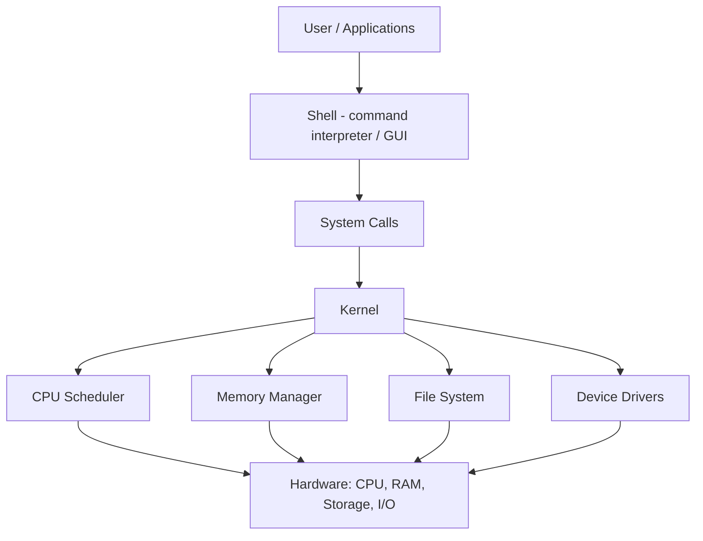

# Operating System

An operating system (OS) is the core system software that manages a computer's hardware and software resources and provides common services for application programs. It acts as the bridge between the user, the applications, and the underlying hardware — without it, a computer cannot function.

## Overview

The OS sits between raw hardware (CPU, memory, storage, and I/O devices described in [Fundamental-Of-Computers](Fundamental-Of-Computers.md) and [CPU-Architecture](CPU-Architecture.md)) and the programs a user runs. It abstracts that hardware so applications don't have to talk to devices directly, arbitrates access when many programs compete for the same resources, and enforces the security boundaries that keep processes and users isolated from one another.

The OS is loaded by the firmware/boot chain — see [Firmware](Firmware.md), [BIOS-and-UEFI](BIOS-and-UEFI.md), [Windows-Boot-Manager](Windows-Boot-Manager.md), and the full [Booting-Process](Booting-Process.md) — and then remains resident, scheduling work and mediating every request for hardware until the machine shuts down. Because it controls everything above it, the operating system is both the foundation of a secure system and the primary target in most attacks.

## Functions of an Operating System

An operating system performs several key tasks:

- **Memory Management** — allocates and tracks memory across processes, reclaiming it when they exit and isolating each process's address space.
- **Process / Task Management** — creates, schedules, and terminates processes, enabling multitasking and multithreading so many tasks appear to run at once.
- **Storage / File Management** — organizes files and directories, manages disk space, and handles read/write operations.
- **Device / I/O Management** — mediates communication between the system and hardware devices through drivers.
- **Scheduling (Kernel)** — decides which process gets the CPU and when, and oversees low-level system operations.

> [!NOTE]
> **Resource arbitration is the core job**
> Almost everything the OS does reduces to safely sharing finite resources (CPU time, memory, disk, devices) among many competing processes while keeping them isolated from each other.

## Types of Operating Systems

Operating systems are commonly grouped by the interface they present to the user:

- **Character User Interface (CUI)** — operated through text-based commands at a command-line interface (for example, a Linux shell or Windows `cmd`/PowerShell). Efficient, scriptable, and low-overhead.
- **Graphical User Interface (GUI)** — presents a visual desktop of windows, icons, and menus for point-and-click interaction; easier for general users at the cost of more resources.

Most modern systems (Windows, Linux desktops, macOS) ship both — a GUI for everyday use and a shell for administration and automation.

## Architecture

The OS is layered: user applications sit on top, the shell provides an interface into the system, and the kernel manages hardware underneath. Requests flow downward toward hardware and results flow back up.



### Shell

The **shell** is the interface between the user and the kernel. It interprets user commands and passes them to the kernel for execution, then returns the results. A shell can be a text-based command interpreter or a graphical environment.

Example of shell usage (Linux terminal):

```bash
ls -l
```

### Kernel

The **kernel** is the core of the operating system. It acts as the bridge between applications and hardware, managing CPU, memory, and I/O, and it runs in a privileged **kernel mode** that ordinary applications (running in **user mode**) cannot enter directly. Applications cross that boundary only through controlled **system calls**.

Kernel-level pseudo-code (conceptual):

```text
void start_process(Process p) {
    allocate_memory(p);
    schedule(p);
}
```

> [!IMPORTANT]
> **User mode vs kernel mode**
> The user/kernel privilege boundary is the OS's most important security line. Code in kernel mode can touch any hardware and any memory; code in user mode is confined to its own address space. Most local privilege-escalation attacks aim to get untrusted user-mode code executing with kernel-mode privileges.

## Windows Editions

The Windows family ships in client and server editions tuned for different needs. See [Windows-Operating-System-Editions](Windows-Operating-System-Editions.md) for the full breakdown and [Windows-Operating-Systems-Timeline](Windows-Operating-Systems-Timeline.md) for release history.

### Client (Windows 7 / 8 / 10 / 11)

- **Developer / Consumer Preview** — early test and public beta builds released for feedback.
- **Starter (OEM)** — basic, feature-limited edition, typically pre-installed on low-end devices.
- **Home** — personal use with core features.
- **Professional** — adds business features such as domain join and BitLocker encryption.
- **Enterprise** — for medium-to-large organizations; advanced security and deployment options.
- **Ultimate** — legacy top-tier edition combining Home and Professional features.

### Windows Server

- **Essentials** — simplified management aimed at small businesses.
- **Standard** — full-featured with limited virtualization rights.
- **Datacenter** — all features plus unlimited virtualization rights.

List installed server roles and features with PowerShell:

```powershell
Get-WindowsFeature
```

## Security Considerations

The operating system is the layer that enforces every access-control decision above the firmware, which makes it the highest-value target once an attacker has code execution on a host.

> [!WARNING]
> **The OS is the primary attack surface**
> - **Privilege escalation** — attackers who land as a low-privileged user hunt for kernel bugs, misconfigured services, or weak permissions to reach `SYSTEM`/root.
> - **Kernel exploits** — a flaw in kernel-mode code hands the attacker full control of the machine, bypassing user-mode protections entirely.
> - **Unpatched systems** — missing OS patches are one of the most common initial and escalation vectors; end-of-life editions receive no fixes.
> - **Weak defaults** — unnecessary roles, services, and default accounts widen the attack surface.

- Keep the OS and all components patched; retire editions past end-of-support.
- Run day-to-day work as a standard (non-admin) user to preserve the privilege boundary.
- Reduce attack surface by installing only the roles/features actually needed (a Server Core install exposes less than a full GUI install).

## Best Practices

- Choose the edition that matches the workload — a Server SKU for infrastructure roles, a client SKU for endpoints.
- Enable OS-level protections (host firewall, disk encryption such as BitLocker, and update automation).
- Enforce least privilege: separate admin accounts from daily-use accounts.
- Record host and VM OS edition/build in your notes so labs are reproducible (`winver` on Windows).
- Monitor and log system activity so privilege changes and unexpected processes are visible.

## Troubleshooting

| Symptom | Likely cause & fix |
| --- | --- |
| OS fails to load after power-on | Boot chain issue — verify firmware boot order and boot entries (see [Booting-Process](Booting-Process.md) and [Windows-Boot-Manager](Windows-Boot-Manager.md)) |
| Application won't run / "unsupported" | Edition or architecture mismatch — confirm the OS edition and 32/64-bit build with `winver` |
| Feature/role missing on a server | Role not installed — check with `Get-WindowsFeature` and add it |

## References

- [Windows kernel-mode and user-mode (Microsoft Learn)](https://learn.microsoft.com/en-us/windows-hardware/drivers/gettingstarted/user-mode-and-kernel-mode)
- [Overview of Windows components (Microsoft Learn)](https://learn.microsoft.com/en-us/windows-hardware/drivers/gettingstarted/overview-of-windows-components)
- [Compare Windows editions (Microsoft)](https://www.microsoft.com/en-us/windows/compare-windows-11-home-vs-pro)

## Related

- [Enterprise Windows Infrastructure Security](../Readme.md) — course hub and map of content
- [Fundamental-Of-Computers](Fundamental-Of-Computers.md) — the hardware the OS manages
- [CPU-Architecture](CPU-Architecture.md) — CPU internals the kernel schedules onto
- [Booting-Process](Booting-Process.md) — how the OS is loaded at power-on
- [Windows-Boot-Manager](Windows-Boot-Manager.md) — the bootloader that hands control to the OS
- [Windows-Operating-System-Editions](Windows-Operating-System-Editions.md) — client vs server editions in depth
- [Windows-Operating-Systems-Timeline](Windows-Operating-Systems-Timeline.md) — Windows release history
