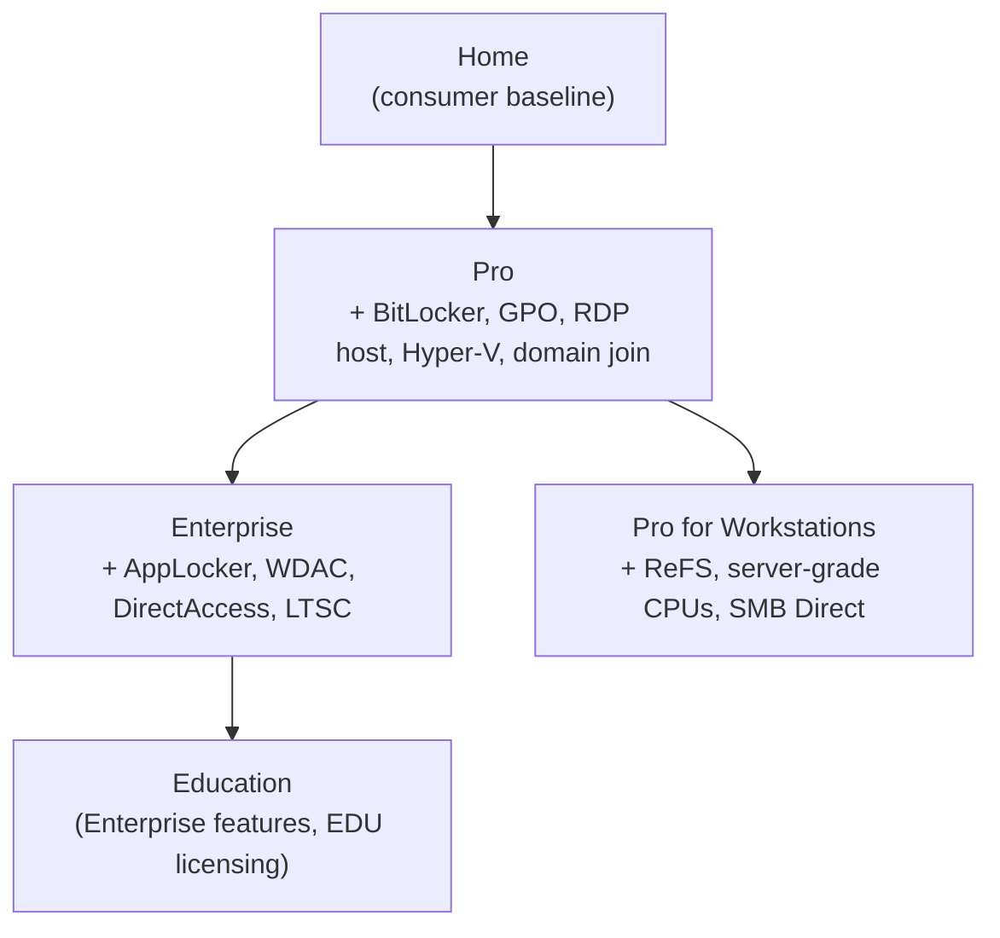

# Windows Operating System Editions

Microsoft ships Windows in several **editions** (SKUs) that share a common kernel but differ in features, licensing, and target audience — from consumer **Home** through business **Pro**, managed **Enterprise/Education**, specialised **IoT** and **Pro for Workstations**, and pre-release **preview** builds. Knowing which edition a host runs is a practical concern for both administrators (what can I manage?) and attackers (what defends this box?).

## Overview

All modern Windows editions build on the same NT kernel and core [Operating-System](Operating-System.md) services; editions are differentiated by which features are unlocked and how the license is granted. The general pattern is **feature inheritance** — each business tier is a superset of the one below it: Pro includes everything in Home, Enterprise includes everything in Pro, and Education mirrors Enterprise. This matters when placing a machine in an [Enterprise Windows Infrastructure Security](../Readme.md) estate: only certain editions can join a domain, apply Group Policy, or run enterprise defences.

For how these editions map onto the historical product line (Windows 7/8/10/11 and their servicing), see [Windows-Operating-Systems-Timeline](Windows-Operating-Systems-Timeline.md).



> [!NOTE]
> **Same kernel, different unlocks**
> An edition is not a different operating system — it is the same binaries with features gated by licensing. This is why an in-place edition upgrade (Home → Pro) can be done with a product key alone, no reinstall.

## Core Editions

### Windows Home

- **Target:** general consumers, home users.
- **Features:** Microsoft Store, virtual desktops, Snap Layouts, basic device encryption and family-safety tools.
- **Limitations:** **no Group Policy Editor, no BitLocker, no Remote Desktop host, cannot join Active Directory / Entra ID.** Max **128 GB** RAM, 1 physical CPU.

### Windows Pro

- **Target:** small businesses, power users.
- **Includes all Home features**, plus:
  - **BitLocker** Drive Encryption
  - **Group Policy** Editor (local GPO)
  - **Remote Desktop** host (accept incoming RDP)
  - **Hyper-V** virtualization and **Windows Sandbox**
  - **Domain / Entra ID join**, MDM enrolment, Assigned Access (kiosk)
- Max **2 TB** RAM, up to 2 physical CPUs.

### Windows Enterprise

- **Target:** large organizations with managed IT infrastructure.
- **Includes all Pro features**, plus:
  - **AppLocker** and Windows Defender Application Control (WDAC)
  - **DirectAccess** / advanced networking
  - Microsoft Defender for Endpoint (formerly Defender ATP) integration
  - **Long-Term Servicing Channel (LTSC)** availability
- Licensed through **volume licensing** (not sold as a single retail key).

### Windows Education

- **Target:** academic institutions (students, faculty, staff).
- Functionally **similar to Enterprise**, with simplified licensing and school-tailored defaults.

### Windows Pro for Workstations

- **Target:** power users with high-performance / server-grade hardware.
- **Key features:** support for server-grade CPUs (up to 4 sockets), **ReFS** (Resilient File System), **persistent memory** support, **SMB Direct** for faster file transfers.

### Windows IoT (Internet of Things)

- **Target:** embedded systems — kiosks, ATMs, point-of-sale, medical devices.
- **Variants:** **IoT Core** (lightweight, single-app) and **IoT Enterprise** (full Windows tailored for devices, LTSC-based).

### Windows S Mode

- A **locked-down mode** of Home or Pro rather than a separate edition.
- **Key trait:** runs only apps installed from the Microsoft Store, for a smaller attack surface and predictable performance.
- Can be switched out of **once** (one-way, irreversible).

## Pre-release and Preview Editions

Before a feature reaches general availability, Microsoft ships it as a preview build for testing.

### Legacy previews (Windows 8 era)

| Edition | Purpose | Audience | Example |
| --- | --- | --- | --- |
| **Developer Preview** | Test APIs and build apps on the upcoming OS | Developers, IT admins | Windows 8 Developer Preview (Sept 2011) |
| **Consumer Preview** | Public beta for feedback and UI testing | Tech-savvy consumers | Windows 8 Consumer Preview (Feb 2012) |

The Developer Preview was early and experimental; the Consumer Preview was more stable and introduced the Windows Store and Metro UI. Both were superseded by the Insider Program.

### Modern preview system (Windows 10/11)

Since Windows 10, previews are delivered through the **Windows Insider Program** across three channels:

| Channel | Description |
| --- | --- |
| **Dev Channel** | Experimental, cutting-edge features; least stable |
| **Beta Channel** | More stable, tied to upcoming releases |
| **Release Preview** | Near-final; best for validation before general availability |

> [!WARNING]
> **Preview builds are not for production**
> Insider Dev/Beta builds are experimental, may be unstable, and often carry more diagnostics/telemetry. Never run them on machines holding sensitive data or joined to a production domain.

## Editions Comparison

| Edition | Target audience | App Store | Virtualization | Domain / Entra join | BitLocker |
| --- | --- | --- | --- | --- | --- |
| **Home** | Home users | Yes | No | No | No |
| **Pro** | Small businesses | Yes | Yes (Hyper-V) | Yes | Yes |
| **Enterprise** | Large organizations | Yes | Yes | Yes | Yes |
| **Education** | Schools & universities | Yes | Yes | Yes | Yes |
| **Pro for Workstations** | Power users / workstations | Yes | Yes | Yes | Yes |
| **IoT Enterprise** | Embedded / kiosks | Optional | Yes | Yes | Yes |
| **S Mode** (Home/Pro) | Locked-down clients | Store only | Depends on base | Depends on base | Depends on base |

### Windows 11 Home vs Pro — key differences

| Capability | Home | Pro |
| --- | --- | --- |
| Microsoft Store, virtual desktops, Snap Layouts | Yes | Yes |
| Join Active Directory / Entra ID | No | Yes |
| Mobile Device Management (MDM) | No | Yes |
| Group Policy Editor | No | Yes |
| Hyper-V / Windows Sandbox | No | Yes |
| BitLocker Drive Encryption | No | Yes |
| Assigned Access / Kiosk Mode | No | Yes |
| Max RAM | 128 GB | 2 TB |
| CPU sockets / cores | 1 / 64 | 2 / 128 |

> [!TIP]
> **Home is fine for a home; Pro is the floor for managed fleets**
> Windows 11 Pro is the minimum edition that can join a domain/Entra ID, receive Group Policy, and encrypt disks with BitLocker — the baseline any centrally managed environment needs.

## Licensing — OEM vs Retail

**Windows OEM** (Original Equipment Manufacturer) is the version **pre-installed** on new PCs by makers such as Dell, HP, or Lenovo. It is functionally identical to the matching retail edition but licensed differently.

| Feature | OEM | Retail |
| --- | --- | --- |
| Transferable to another PC | No (device-bound) | Yes (if removed from the old PC first) |
| Reinstallation allowed | Same hardware only | Any device |
| Support | From the PC manufacturer | From Microsoft |
| Typical use | New pre-built PCs | Custom builds / upgrades |
| Price | Lower (bulk to makers) | Higher |
| Activation | Usually pre-activated | User-activated with a key |

- **Choose OEM** when buying a new PC with Windows already installed and no plan to move the license.
- **Choose Retail** when building your own PC or when you may replace hardware later.
- **Limitation:** an OEM license effectively **dies with the hardware** (a motherboard replacement can invalidate it) and cannot legally move to another device.

## Identifying an Edition

Confirm the running edition and build — useful for both admin inventory and post-exploitation recon.

Quick GUI check (opens the About dialog):

```cmd
winver
```

Full system summary including edition, build, and licensing status:

```cmd
systeminfo
```

From PowerShell:

```powershell
Get-ComputerInfo | Select-Object WindowsProductName, WindowsEditionId, OsBuildNumber
```

Query the current edition and detailed license/activation state:

```cmd
DISM /Online /Get-CurrentEdition
slmgr /dlv
```

## Security Considerations

The edition dictates which defensive controls are even *available* on a host, so it is a first-order piece of reconnaissance and a hardening decision.

> [!WARNING]
> **Edition = available defences (and their absence)**
> Consumer **Home** cannot join a domain, apply Group Policy, or run BitLocker — so a Home box in an enterprise is typically **unmanaged and unmonitored** (shadow IT). Advanced controls such as **AppLocker/WDAC**, Credential Guard, and Defender for Endpoint are gated to **Enterprise/Education** licensing. When an attacker fingerprints the edition (`systeminfo`, `Get-ComputerInfo`), they are effectively enumerating which of these controls could be in the way.

- **Recon value:** the edition tells an attacker whether disk encryption (BitLocker), application allow-listing (AppLocker/WDAC), and EDR integration are plausible on the target.
- **S Mode** narrows the app-execution surface (Store apps only), frustrating dropped-binary payloads — but it can be exited and is not a security boundary to rely on.
- **LTSC / IoT Enterprise** trade features for a long, fixed servicing life; they can lag on feature-level security improvements and must be patched diligently.
- Mismatched editions in a fleet create **inconsistent policy coverage** — the weakest edition is often the easiest foothold.

## Best Practices

- Standardise managed endpoints on **Pro or higher**; reserve Home for genuinely standalone/home use.
- Require **Enterprise/Education** where AppLocker/WDAC, Credential Guard, or Defender for Endpoint are part of the security baseline.
- Enable **BitLocker** wherever the edition supports it, and enforce it via Group Policy / MDM.
- Keep preview (Insider) builds off production and off domain-joined machines.
- Record each host's edition and build in your asset inventory so policy gaps and shadow-IT Home installs are visible.

## Troubleshooting

| Symptom | Likely cause & fix |
| --- | --- |
| BitLocker / Group Policy Editor missing | Host is **Home** edition — upgrade to Pro (product key, no reinstall) |
| Cannot join the domain or Entra ID | Home edition — requires Pro or higher |
| Can only install Store apps | Device is in **S Mode** — switch out of S Mode (one-way) via Settings |
| Edition upgrade key rejected | Key is for the wrong edition/channel — match retail vs volume and the target edition |
| `slmgr /dlv` shows "not activated" | Licensing/activation issue — verify the key matches the installed edition |

## References

- [Windows edition upgrade (Microsoft Learn)](https://learn.microsoft.com/en-us/windows/deployment/upgrade/windows-10-edition-upgrades)
- [Compare Windows 11 editions (Microsoft)](https://www.microsoft.com/en-us/windows/business/compare-windows-11)
- [Windows 11 IoT Enterprise / LTSC (Microsoft Learn)](https://learn.microsoft.com/en-us/windows/iot/iot-enterprise/getting_started/getstarted)
- [Windows Insider Program](https://learn.microsoft.com/en-us/windows-insider/)

## Related

- [Enterprise Windows Infrastructure Security](../Readme.md) — course hub and map of content
- [Operating-System](Operating-System.md) — processes, memory, and the kernel these editions share
- [Windows-Operating-Systems-Timeline](Windows-Operating-Systems-Timeline.md) — how editions map across the Windows release history
- [Fundamental-Of-Computers](Fundamental-Of-Computers.md) — the hardware these editions run on
