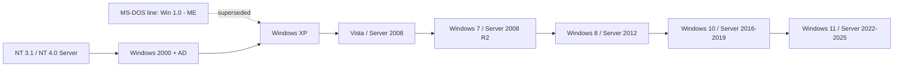

# Windows Operating Systems Timeline

The Windows Operating Systems timeline traces Microsoft's client and server releases from the first GUI shells of the mid-1980s through the modern NT-based Windows 11 and Windows Server 2025. Knowing where a given release sits on this line tells you its kernel lineage, its support status, and — for an attacker or defender — which security mitigations it does or does not ship with.

## Overview

Windows has two parallel product lines that share the same underlying **NT kernel** family since Windows 2000/XP: a **client** line (desktop and laptop editions) and a **server** line (infrastructure and datacenter editions). Early consumer releases (Windows 1.0 through Windows ME) were built on MS-DOS, while the NT branch — starting with Windows NT 3.1 Server in 1993 — provided the preemptive multitasking, memory protection, and security model that all current Windows systems inherit.

Placing a release on the timeline is a foundational skill: it drives edition choice (see [Windows-Operating-System-Editions](Windows-Operating-System-Editions.md)), boot behavior (see [Windows-Boot-Manager](Windows-Boot-Manager.md) and [BIOS-and-UEFI](BIOS-and-UEFI.md)), the 32-bit vs 64-bit execution model (see [CPU-Architecture](CPU-Architecture.md)), and the core OS concepts covered in [Operating-System](Operating-System.md). This note builds on the hardware groundwork in [Fundamental-Of-Computers](Fundamental-Of-Computers.md).

> [!NOTE]
> **DOS-based vs NT-based**
> Windows 1.0–ME run on top of MS-DOS. Windows XP was the first consumer release to move the mainstream desktop onto the NT kernel, unifying the client and server code bases from 2001 onward. Everything supported today is NT-based.

## Client Versions

| Year | Version       | Notes                                          |
|------|---------------|------------------------------------------------|
| 1985 | Windows 1.0   | First GUI-based OS from Microsoft.             |
| 1990 | Windows 3.0   | Improved GUI, better multitasking.             |
| 1995 | Windows 95    | Start menu introduced, 32-bit support.         |
| 1998 | Windows 98    | Improved USB and hardware support.             |
| 2000 | Windows ME    | Last DOS-based Windows, focused on home users. |
| 2001 | Windows XP    | Highly popular, NT-based, stable.              |
| 2007 | Windows Vista | New Aero UI, security features (UAC).          |
| 2009 | Windows 7     | Improved performance, user-friendly.           |
| 2012 | Windows 8     | Tile-based Start screen, touchscreen focus.    |
| 2015 | Windows 10    | Unified platform, frequent updates.            |
| 2021 | Windows 11    | New design, TPM 2.0 requirement, improved productivity. |

## Server Versions

| Year | Version                | Notes                                         |
|------|------------------------|-----------------------------------------------|
| 1993 | Windows NT 3.1 Server  | First Windows NT server OS.                   |
| 1996 | Windows NT 4.0 Server  | Improved UI, better networking.               |
| 2000 | Windows 2000 Server    | Active Directory introduced.                  |
| 2003 | Windows Server 2003    | Improved security, IIS 6.0.                   |
| 2008 | Windows Server 2008    | Server Core option, Hyper-V virtualization.   |
| 2012 | Windows Server 2012    | Modern UI, improved virtualization.           |
| 2016 | Windows Server 2016    | Nano Server, container support.               |
| 2019 | Windows Server 2019    | Hybrid cloud features, security enhancements. |
| 2022 | Windows Server 2022    | Secured-core server, advanced security.       |
| 2024 | Windows Server 2025    | Latest LTSC release; hotpatching, further security hardening. |

> [!NOTE]
> **Client and server releases track together**
> Many server editions share a kernel and release window with a client version (for example, Windows Server 2008 with Windows Vista/7-era code, and Windows Server 2016 with Windows 10). Server SKUs typically carry longer support lifecycles than their client counterparts.

## NT Kernel Lineage

The modern lineage runs through the NT kernel branch. The following diagram shows how the mainstream client and server lines converged onto NT and evolved from there.



## Notes

- Client versions focus on desktop user experience.
- Server versions focus on network services, virtualization, and enterprise features.
- Many server versions align with client releases but often come with extended support cycles.
- Active Directory was introduced with Windows 2000 Server and remains the backbone of enterprise Windows identity.

## Security Considerations

The timeline is a security tool in its own right. During reconnaissance, OS and build fingerprinting tells an attacker which mitigations are present and which known vulnerabilities may apply; during defense, it flags which hosts have aged out of support.

> [!WARNING]
> **End-of-life systems are prime targets**
> Releases past their support window (Windows XP, Windows 7, Windows Server 2003, and Windows Server 2008/2008 R2) no longer receive security patches. Legacy hosts frequently expose **SMBv1** and lack modern protections such as Credential Guard, making them high-value pivot points. Unpatched Windows 7 / Server 2008 systems remain vulnerable to the **MS17-010 (EternalBlue)** SMBv1 flaw — a classic wormable entry point in Windows-focused engagements.

- Newer releases ship stronger defaults: UAC (Vista+), Secure Boot and UEFI reliance (Windows 8/Server 2012+), virtualization-based security and Credential Guard (Windows 10/Server 2016+), and a mandatory **TPM 2.0** baseline for Windows 11.
- OS version is a first-order recon signal — it narrows the exploit surface before any credential is touched.
- Mixed-age estates are common: a single legacy DC or file server can undermine an otherwise well-patched domain.

## Best Practices

- Run only **in-support** releases; plan migrations off end-of-life client and server versions before support ends.
- Match the SKU to the role — use a Server edition for infrastructure workloads, not a client edition.
- Disable **SMBv1** everywhere; it is only present for compatibility with obsolete systems.
- Keep an accurate inventory of OS versions and build numbers so patch gaps and EOL hosts are visible.
- Prefer the newest LTSC server release for new infrastructure to inherit the strongest security baseline.

## Troubleshooting

| Symptom | Likely cause & fix |
| --- | --- |
| Unsure which Windows version/build a host runs | Run `winver` for the friendly version, or `systeminfo` for the full OS name and build number. |
| Feature or role missing on an older server | Feature was introduced in a later release — confirm the version against this timeline and upgrade if the workload requires it. |
| Legacy client can't join or authenticate to a modern domain | Outdated OS lacks required auth/signing support — patch, or retire the unsupported client. |

```cmd
winver
systeminfo | findstr /B /C:"OS Name" /C:"OS Version"
```

## References

- [Windows release information (Microsoft Learn)](https://learn.microsoft.com/en-us/windows/release-health/release-information)
- [Windows Server release information (Microsoft Learn)](https://learn.microsoft.com/en-us/windows-server/get-started/windows-server-release-info)
- [Microsoft product lifecycle (search)](https://learn.microsoft.com/en-us/lifecycle/products/)

## Related

- [Enterprise Windows Infrastructure Security](../Readme.md) — course hub
- [Windows-Operating-System-Editions](Windows-Operating-System-Editions.md) — editions across the timeline
- [Operating-System](Operating-System.md) — core OS concepts and lineage
- [Windows-Boot-Manager](Windows-Boot-Manager.md) — how each release boots to the kernel
- [BIOS-and-UEFI](BIOS-and-UEFI.md) — firmware that newer releases depend on
- [CPU-Architecture](CPU-Architecture.md) — 32-bit vs 64-bit execution across releases
- [Fundamental-Of-Computers](Fundamental-Of-Computers.md) — hardware groundwork
