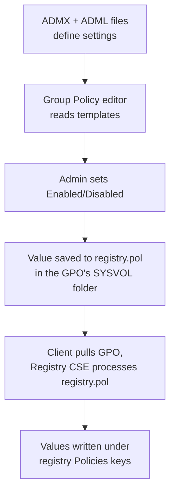

# Administrative Templates (ADMX)

Administrative Templates are the registry-based portion of Group Policy — a large catalog of settings that turn friendly toggles in the editor into values written under protected registry policy keys. Since Windows Vista / Server 2008 the templates are defined in XML **ADMX** files (with language strings in companion **ADML** files), replacing the older token-based `.adm` format.

## Overview

Inside every GPO, under both **Computer Configuration** and **User Configuration**, sits an **Administrative Templates** node. Each setting there is backed by an ADMX definition that says which registry value to write, where, and with what data. When you enable a setting, the value is saved into the GPO and later stamped into the client's registry by the Group Policy Registry client-side extension. This is how policies such as [PowerShell restriction](PowerShell-Blocking-Using-Group-Policy.md), Windows Update behaviour, and script-host logging are delivered.

Administrative Templates are one building block of a [Group Policy Object](Group-Policy(GPO).md); see [Domain-Based-Group-Policy-Configuration](Domain-Based-Group-Policy-Configuration.md) for how such a GPO is linked and scoped in a domain, and [Default-Domain-Policy](Default-Domain-Policy.md) for the built-in policy that ships with every domain.

> [!NOTE]
> **ADMX vs. ADML**
> **ADMX** (`.admx`) is language-neutral — it defines the settings, categories, and the registry keys/values they control. **ADML** (`.adml`) supplies the human-readable display strings for one language (for example `en-US`). You need both for the setting to appear correctly in the editor.

## How It Works

The lifecycle from a template file to an enforced registry value:



- The editor (GPMC's Group Policy Management Editor, or `gpedit.msc` for the local machine) renders the tree from the ADMX/ADML files it can find.
- Configured values are stored as binary `registry.pol` files inside the GPO, one per node:

```text
\\<domain>\SYSVOL\<domain>\Policies\{GUID}\Machine\registry.pol
\\<domain>\SYSVOL\<domain>\Policies\{GUID}\User\registry.pol
```

- On the client, the **Registry client-side extension** reads `registry.pol` and writes the values into the registry during Group Policy processing.

## Setting States

Every Administrative Template setting has exactly three states:

| State | Meaning |
|-------|---------|
| **Not Configured** | The GPO does not touch this value; whatever is already there (or another GPO) decides. |
| **Enabled** | The setting is turned on; its configured data is written to the registry. |
| **Disabled** | The setting is explicitly turned off (which may write a different value). |

## Where Values Land — Managed vs. Preferences

"True" Administrative Template policies write only to four **managed** registry locations, which are ACL'd so standard users cannot modify them:

```text
HKLM\Software\Policies
HKLM\Software\Microsoft\Windows\CurrentVersion\Policies
HKCU\Software\Policies
HKCU\Software\Microsoft\Windows\CurrentVersion\Policies
```

> [!IMPORTANT]
> **Managed policies do not "tattoo"**
> Because values under these keys are cleared when the GPO falls out of scope, a managed policy reverts cleanly once it no longer applies. Settings written **outside** these keys persist even after the policy is removed — this is called **tattooing** and is why custom/legacy `.adm` settings could permanently alter a machine.

Inspect an applied policy value directly with:

```cmd
reg query "HKLM\Software\Policies" /s
```

## Local Store vs. Central Store

By default the editor reads templates from the **local store** on the machine you run it from:

```text
C:\Windows\PolicyDefinitions          (ADMX files)
C:\Windows\PolicyDefinitions\en-US    (ADML language files)
```

The problem: different admins on different machines can have different ADMX versions, so a GPO may show inconsistent or missing settings. The fix is a domain **Central Store** — a `PolicyDefinitions` folder in SYSVOL that every editor uses in preference to its local copy:

```text
\\<domain-FQDN>\SYSVOL\<domain-FQDN>\Policies\PolicyDefinitions
```

Create it by copying a reference machine's templates into SYSVOL:

```powershell
# Seed the Central Store from a local PolicyDefinitions folder
robocopy "C:\Windows\PolicyDefinitions" "\\corp.local\SYSVOL\corp.local\Policies\PolicyDefinitions" /E   # untested
```

> [!TIP]
> **Add third-party templates once, in the Central Store**
> Vendors ship ADMX packs (Microsoft Office, Microsoft Edge, Google Chrome, LAPS, and others). Drop the `.admx` into `PolicyDefinitions` and the matching `.adml` into the language subfolder of the Central Store, and every administrator immediately sees the new settings.

## Security Considerations

Administrative Templates are the delivery mechanism for much of Windows' security hardening — PowerShell script-block logging and transcription, Attack Surface Reduction rules, LAPS, credential and authentication restrictions, and disabling legacy features are all Administrative Template settings. They are equally the surface a defender must protect and an attacker studies.

> [!WARNING]
> **Registry-backed enforcement is only as strong as the registry ACLs**
> - Managed policy keys are protected from **standard** users, but a **local Administrator or SYSTEM** on the endpoint can rewrite those `Policies` keys directly, locally undoing a policy until the next Group Policy refresh re-applies it — an Administrative Template restriction is a control, not a hard security boundary.
> - Anyone who can **edit a GPO or write to its SYSVOL folder** can change `registry.pol` and push settings domain-wide. This maps to MITRE ATT&CK **Group Policy Modification (T1484.001)** and is a classic lateral-movement / persistence path.
> - A tampered or malicious ADMX in the Central Store won't itself enforce anything (only `registry.pol` is applied) but can mislead administrators about what a GPO actually does — treat SYSVOL write access as sensitive.

Defenders should pair interpreter and application restrictions delivered here with an allow-listing boundary such as AppLocker or WDAC, since a registry policy alone can be bypassed by a sufficiently privileged local process.

## Best Practices

- Deploy a **Central Store** so every admin edits GPOs against the same template set; keep it updated when you patch or add products.
- Keep ADMX and ADML **versions in sync** with the OS build to avoid missing or mislabelled settings.
- Prefer **managed** Administrative Template settings over legacy custom `.adm` files to avoid registry tattooing.
- Scope hardening GPOs tightly with OUs and security filtering (see [Domain-Based-Group-Policy-Configuration](Domain-Based-Group-Policy-Configuration.md)); verify the result with `gpresult`.
- Audit who can create, edit, and link GPOs, and monitor changes to SYSVOL `registry.pol` files.

## Troubleshooting

| Symptom | Likely cause & fix |
|---------|--------------------|
| Settings show as "not available" or with raw names in the editor | Missing or mismatched **ADML** language file, or an old **ADMX** — refresh the Central Store from a current OS build. |
| Third-party settings (Office/Edge/Chrome) don't appear | Vendor ADMX/ADML not copied into `PolicyDefinitions` — add them to the Central Store. |
| A configured setting isn't taking effect on a client | Scoping/inheritance or CSE issue — run `gpupdate /force`, then `gpresult /h report.html` to see which GPO wins. |
| Policy value persists after the GPO is unlinked | The setting **tattooed** (wrote outside the managed `Policies` keys) — remove the value manually or via a corrective policy. |

## References

- [Administrative Templates (.admx) for Windows (Microsoft Learn)](https://learn.microsoft.com/en-us/troubleshoot/windows-client/group-policy/create-and-manage-central-store)
- [How to create and manage the Central Store for Group Policy Administrative Templates (Microsoft Learn)](https://learn.microsoft.com/en-us/troubleshoot/windows-client/group-policy/create-and-manage-central-store)
- [Group Policy overview (Microsoft Learn)](https://learn.microsoft.com/en-us/previous-versions/windows/it-pro/windows-server-2012-r2-and-2012/hh831791(v=ws.11))
- [MITRE ATT&CK — Domain Policy Modification: Group Policy Modification (T1484.001)](https://attack.mitre.org/techniques/T1484/001/)

## Related

- [Enterprise Windows Infrastructure Security](../Readme.md) — course hub
- [Group-Policy(GPO)](Group-Policy(GPO).md) — the GPO these templates live inside
- [Default-Domain-Policy](Default-Domain-Policy.md) — the built-in domain GPO
- [Domain-Based-Group-Policy-Configuration](Domain-Based-Group-Policy-Configuration.md) — linking and scoping policy in a domain
- [PowerShell-Blocking-Using-Group-Policy](PowerShell-Blocking-Using-Group-Policy.md) — an Administrative Template hardening example
- [10-Common-Ways-Users-Leak-Data](10-Common-Ways-Users-Leak-Data.md) — data-leakage vectors policy can reduce
- [Active-Directory-Domain-Services](../Active-Directory-Domain-Services-AD-DS/Active-Directory-Domain-Services.md) — the directory service that stores and delivers GPOs
- [Organizational-Units-OU](../Active-Directory-Domain-Services-AD-DS/Organizational-Units-OU.md) — the containers Administrative Template GPOs are usually scoped to
