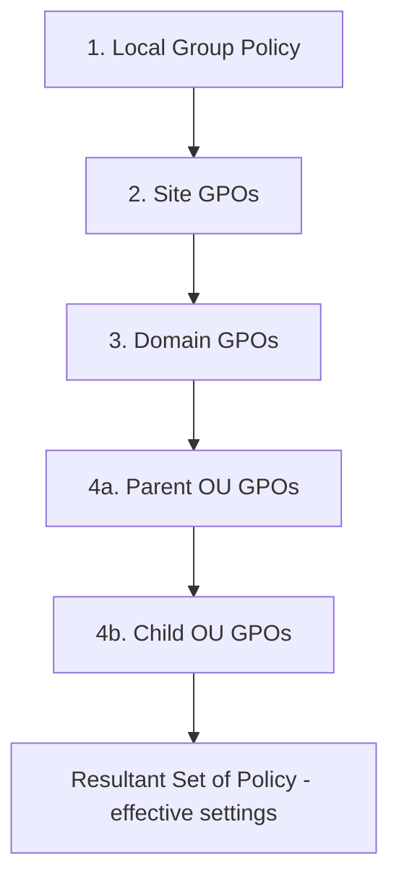

# GPO Processing Order (LSDOU)

When a computer boots or a user logs on, Windows applies Group Policy Objects (GPOs) in a fixed order known as **LSDOU** — **L**ocal, **S**ite, **D**omain, **O**rganizational Unit. Understanding this order is essential because settings applied later overwrite earlier ones, so the *last writer wins* determines the effective policy on a machine or account.

## Overview

Every domain-joined system evaluates the GPOs that are linked to the containers it belongs to, from the broadest to the most specific. The result is a merged set of settings called the **Resultant Set of Policy (RSoP)**. Because processing follows a strict sequence, a setting configured on a deeply nested [OU](../Active-Directory-Domain-Services-AD-DS/Organizational-Units-OU.md) normally beats the same setting configured at the domain level. This is the mechanism behind the [Default-Domain-Policy](Default-Domain-Policy.md) applying broadly while a tightly scoped GPO from [domain-based configuration](Domain-Based-Group-Policy-Configuration.md) overrides it for a subset of hosts.

The order interacts with three modifiers — **Enforced**, **Block Inheritance**, and **security/WMI filtering** — which change the default outcome. See [Group-Policy(GPO)](Group-Policy(GPO).md) for the broader Group Policy overview.

## How It Works — the LSDOU Sequence

GPOs are processed in four stages. Each stage can overwrite conflicting settings from the previous one:

1. **Local** — the Local Group Policy stored on the machine itself (edited with `gpedit.msc`). Weakest; overwritten by any conflicting domain policy.
2. **Site** — GPOs linked to the Active Directory [site](../Active-Directory-Domain-Services-AD-DS/AD-Sites-and-Services.md) the computer's IP maps to.
3. **Domain** — GPOs linked at the domain root (for example, the Default Domain Policy).
4. **Organizational Unit** — GPOs linked to OUs, processed from the parent OU down to the child OU that directly contains the object. The **closest OU is processed last and wins**.

> [!IMPORTANT]
> **Last writer wins**
> Within LSDOU, the container processed *last* has the highest precedence for conflicting settings. Because OUs are processed after the domain, and child OUs after parent OUs, the GPO linked nearest the object normally determines the effective value.

### Link Order within one container

When multiple GPOs are linked to the **same** container, they are applied by **Link Order**: the GPO with **Link Order 1 has the highest precedence** and is applied *last*. In the Group Policy Management Console (GPMC), link order 1 sits at the top of the list.



## Modifiers That Change the Order

The default LSDOU precedence can be altered by three mechanisms:

- **Enforced** (formerly "No Override") — an Enforced link forces that GPO's settings to win over any conflicting setting processed later, and it cannot be blocked by a downstream OU. Enforced inverts the normal "last writer wins" rule.
- **Block Inheritance** — set on an OU, it stops GPOs inherited from parent containers (site and domain) from applying to that OU. **Enforced links pierce Block Inheritance.**
- **Security filtering / WMI filtering** — a GPO only applies to objects that have *Read* and *Apply group policy* rights (security filtering) and that match the WMI query (WMI filtering). A filtered-out GPO is skipped entirely, regardless of where it sits in LSDOU.

> [!NOTE]
> **User vs. Computer settings**
> A GPO has a **Computer Configuration** half and a **User Configuration** half. Computer settings apply during startup based on the *computer's* location in AD; user settings apply at logon based on the *user's* location. **Loopback processing** is the exception that makes user settings follow the computer's OU instead — useful for kiosks and shared terminals.

## Verifying the Result

Use these commands on a client to see which GPOs won and why:

```cmd
gpresult /r
gpresult /h C:\report.html
```

```powershell
# Force a foreground policy refresh, then generate an HTML RSoP report
gpupdate /force
Get-GPResultantSetOfPolicy -ReportType Html -Path C:\rsop.html   # untested
```

The `gpresult /h` report lists applied GPOs, denied GPOs (with the reason — Access Denied via filtering, Empty, Disabled Link, etc.), and the winning GPO for each setting.

## Security Considerations

> [!WARNING]
> **Precedence is an attack surface**
> An attacker who can create or link a GPO — or who controls a GPO linked *closer* to a target object — can override defensive settings because of last-writer-wins. A malicious GPO linked to a leaf OU, or an **Enforced** link high in the tree, can silently beat hardening policies applied elsewhere. This maps to MITRE ATT&CK **T1484 — Domain Policy Modification**.

- **Delegation is the weak point.** Rights to link GPOs to a site/domain/OU, or edit an existing GPO, translate directly into precedence. Audit who holds `gPLink`/`gPOptions` write access and GPO edit permissions.
- **Enforced links** are powerful for defenders (they cannot be blocked) but equally dangerous if an attacker sets one — they override everything below.
- **Block Inheritance** can be abused to strip inherited security baselines from an OU; watch for its unexpected appearance.
- GPO-based restrictions on interpreters (e.g. [blocking PowerShell](PowerShell-Blocking-Using-Group-Policy.md)) are a speed bump, not a boundary — precedence games or a higher-priority GPO can undo them; pair with AppLocker/WDAC.

## Best Practices

- Keep the design shallow and predictable: prefer scoping at the OU that directly contains objects over broad site/domain links.
- Reserve **Enforced** for a small number of critical, non-negotiable baselines; document every Enforced link.
- Avoid **Block Inheritance** where possible — it makes effective policy hard to reason about; use security filtering for exceptions instead.
- Name GPOs and set Link Order deliberately; verify with `gpresult`/RSoP after every change.
- Restrict and audit who can create, link, and edit GPOs (delegation on sites, the domain, and OUs).

## Troubleshooting

| Symptom | Likely cause & fix |
| --- | --- |
| A setting is not the value you configured | A GPO processed later (closer OU, lower Link Order number, or an Enforced link) overrides it — check winners in `gpresult /h report.html` |
| A domain/site GPO does not reach an OU | **Block Inheritance** is set on the OU — remove it or mark the required GPO **Enforced** |
| A GPO never applies to a user/computer | Security filtering (missing *Apply group policy*) or a non-matching WMI filter — check the "Denied" section of the RSoP report |
| Changes apply late or inconsistently | Slow-link detection or DC replication lag — run `gpupdate /force` and confirm replication with `repadmin` |
| User settings ignore the user's OU | **Loopback processing** is enabled on the computer's OU (Replace/Merge mode) |

## References

- [Group Policy processing and precedence (Microsoft Learn)](https://learn.microsoft.com/en-us/previous-versions/windows/it-pro/windows-server-2003/cc785665(v=ws.10))
- [Group Policy overview (Microsoft Learn)](https://learn.microsoft.com/en-us/previous-versions/windows/it-pro/windows-server-2012-r2-and-2012/hh831791(v=ws.11))
- [MITRE ATT&CK — Domain Policy Modification (T1484)](https://attack.mitre.org/techniques/T1484/)

## Related

- [Enterprise Windows Infrastructure Security](../Readme.md) — course hub
- [Group-Policy(GPO)](Group-Policy(GPO).md) — related note (Group Policy overview)
- [Default-Domain-Policy](Default-Domain-Policy.md) — related note (the domain-level GPO in this order)
- [Domain-Based-Group-Policy-Configuration](Domain-Based-Group-Policy-Configuration.md) — related note (linking and scoping policy)
- [PowerShell-Blocking-Using-Group-Policy](PowerShell-Blocking-Using-Group-Policy.md) — related note (a hardening GPO subject to precedence)
- [Organizational-Units-OU](../Active-Directory-Domain-Services-AD-DS/Organizational-Units-OU.md) — related note (the O in LSDOU)
- [AD-Sites-and-Services](../Active-Directory-Domain-Services-AD-DS/AD-Sites-and-Services.md) — related note (the S in LSDOU)
- [Active-Directory-Domain-Services](../Active-Directory-Domain-Services-AD-DS/Active-Directory-Domain-Services.md) — related note (the directory GPOs are stored in)
