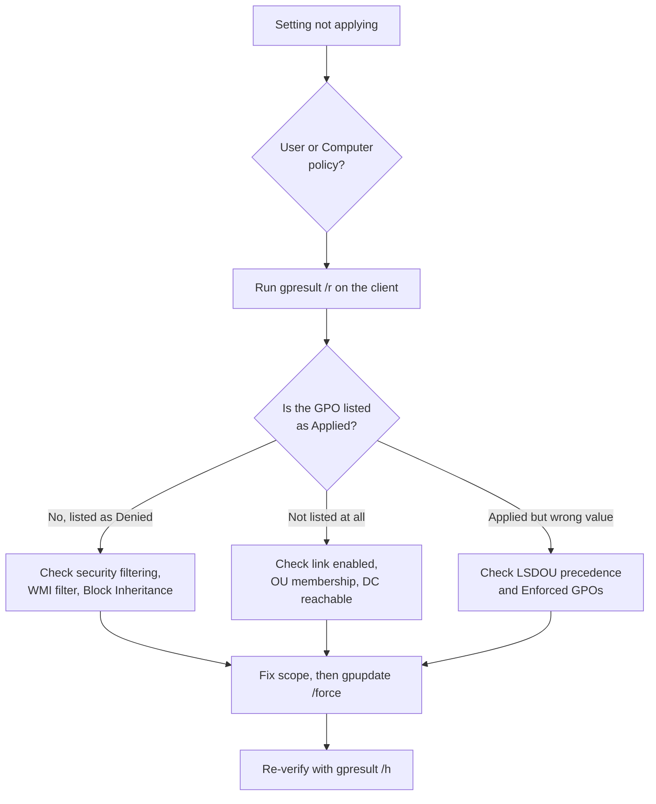

# GPO Troubleshooting

A structured workflow for diagnosing why a Group Policy Object is not applying, is applying to the wrong targets, or is being overridden. Most GPO problems reduce to a small set of causes — scoping, inheritance, replication, or client connectivity — and the same handful of tools (`gpresult`, `gpupdate`, RSoP, and the Group Policy operational log) will find nearly all of them.

## Overview

When a policy "doesn't work," the setting itself is rarely broken — the GPO simply is not reaching the target, or a higher-precedence GPO is winning. Effective policy is the product of the [LSDOU processing order](Group-Policy(GPO).md) (Local → Site → Domain → OU), security filtering, WMI filters, inheritance blocking, and enforcement. Troubleshooting means reconstructing that chain for a specific user/computer and comparing *intended* scope against *actual* Resultant Set of Policy (RSoP).

This note pairs with [Domain-Based-Group-Policy-Configuration](Domain-Based-Group-Policy-Configuration.md) (how policy is linked and scoped), [Default-Domain-Policy](Default-Domain-Policy.md) (the baseline GPO), and [PowerShell-Blocking-Using-Group-Policy](PowerShell-Blocking-Using-Group-Policy.md) (a concrete hardening GPO whose application you may need to verify).

## Diagnostic Workflow



## Core Tools

### gpresult — see the Resultant Set of Policy

`gpresult` reports which GPOs actually applied to a user/computer and why others were filtered out. This is the single most important tool.

```cmd
gpresult /r
gpresult /r /scope computer
gpresult /r /scope user
gpresult /h C:\rsop.html
```

`/r` prints a text summary (applied GPOs, denied GPOs, security group membership, WMI filters). `/h` produces a rich HTML report showing winning settings and, crucially, the reason a GPO was **Denied** (Access Denied - Security Filtering, WMI filter mismatch, disabled link, etc.). Query a remote user with elevated rights:

```cmd
gpresult /s CLIENT01 /user CONTOSO\jdoe /h C:\rsop-jdoe.html
```

### gpupdate — force reprocessing

```cmd
gpupdate /force
gpupdate /target:user /force
gpupdate /force /boot /logoff
```

`/force` reapplies **all** settings, not just changed ones. `/boot` and `/logoff` allow extensions that only process at startup/logon (software installation, folder redirection) to complete.

### RSoP MMC and GPMC reports

```cmd
rsop.msc
```

In the Group Policy Management Console, **Group Policy Results** replays what actually happened on a target, while **Group Policy Modeling** simulates "what if" scenarios (a user in a different OU, a slow link, loopback). The PowerShell equivalents live in the GroupPolicy module:

```powershell
Get-GPResultantSetOfPolicy -ReportType Html -Path C:\rsop.html
Get-GPO -All | Select-Object DisplayName, GpoStatus, ModificationTime
Get-GPOReport -All -ReportType Html -Path C:\all-gpos.html
```

> [!TIP]
> **Read the Denied list, not just the Applied list**
> The fastest diagnosis usually comes from the **Denied GPOs** section of `gpresult /h`. It names the exact filter that blocked the GPO — security filtering, WMI, an empty policy, or a disabled link — so you don't have to guess.

## Event Logs

Group Policy processing is logged in the operational channel:

```text
Event Viewer > Applications and Services Logs > Microsoft > Windows >
GroupPolicy > Operational
```

Useful events in that log:

| Event ID | Meaning |
| --- | --- |
| 4001 / 4016 | Start of policy / Client-Side Extension (CSE) processing |
| 5016 | CSE processing completed successfully |
| 6016 / 7016 | CSE processing returned a warning / an error |
| 8000 / 8001 | Computer boot / user logon policy processing completed |

On older systems the classic Userenv errors in the **System** log are still worth knowing: **1058** ("cannot access gpt.ini") and **1030** ("failed to query the list of Group Policy Objects") almost always mean a SYSVOL/DFS access or permissions problem on the DC.

## Common Causes and Fixes

- **Security filtering** — the target user/computer is not in the ACE list. Default is `Authenticated Users`; if that was removed, add the object (or a group) back with Read + Apply Group Policy.
- **WMI filter mismatch** — the linked WMI query returns false on the target (wrong OS version, architecture). Test the query with `Get-CimInstance`.
- **Block Inheritance / Enforced** — an OU blocks inherited GPOs, or a higher GPO is `Enforced` and overrides the OU. Enforced always wins and ignores Block Inheritance.
- **Disabled link or half-disabled GPO** — the link is disabled, or the User/Computer half of the GPO is disabled while your setting lives in that half.
- **Wrong scope** — the setting is under Computer Configuration but you scoped it to users (or vice versa); computer settings never apply to a user object.
- **Replication / SYSVOL lag** — the edit hasn't reached the DC the client authenticated against, or SYSVOL (DFSR) is out of sync.
- **Client can't reach a DC** — DNS failure, time skew breaking Kerberos, or the client is off-VPN.

> [!IMPORTANT]
> **MS16-072 changed how user GPOs are read**
> After the June 2016 update (MS16-072), user Group Policy is retrieved in the security context of the **computer**, not the user. If you tightened security filtering by removing `Authenticated Users`, user GPOs silently stop applying unless the **computer** account (or `Domain Computers` / `Authenticated Users`) still has **Read** permission on the GPO. Add Read for the computers and the policy returns.

## SYSVOL and Replication Checks

A GPO has two halves that must stay in sync: the **Group Policy Container** (GPC) object in Active Directory and the **Group Policy Template** (GPT) files in SYSVOL. Each carries a version number; if they diverge, or if SYSVOL hasn't replicated, clients apply stale or partial policy.

```powershell
Get-GPO "Restrict PowerShell" | Select-Object DisplayName, @{n='ADVersion';e={$_.Computer.DSVersion}}, @{n='SysvolVersion';e={$_.Computer.SysvolVersion}}
```

```cmd
repadmin /replsummary
dfsrdiag replicationstate
dfsrdiag pollad
nltest /dsgetdc:contoso.com
```

Mismatched AD vs. SYSVOL version numbers point to a replication or SYSVOL problem; `repadmin`/`dfsrdiag` confirm whether the DCs themselves are converged.

## Security Considerations

> [!WARNING]
> **Troubleshooting output leaks the security posture**
> `gpresult /h` and `Get-GPOReport` enumerate every applied and denied policy — password rules, AppLocker/WDAC state, LAPS, restricted groups, delegated rights. To an attacker on the host this is a **reconnaissance goldmine**: it reveals exactly which hardening controls exist and which are missing or filtered out. Treat RSoP reports as sensitive, don't leave them on shares, and remember that a low-privileged user can run `gpresult /r` for their own result set.

- GPO edit rights are effectively domain-wide code execution; a "policy that won't apply" can also mask a **malicious GPO** an attacker linked or modified (MITRE ATT&CK **T1484 — Domain Policy Modification**). Verify *who last changed* a GPO, not just its settings.
- Interpreter restrictions surfaced during troubleshooting (blocking `cmd.exe`/`powershell.exe`) are a speed bump, not a security boundary — confirm they are backed by AppLocker/WDAC, and see [PowerShell-Blocking-Using-Group-Policy](PowerShell-Blocking-Using-Group-Policy.md).
- Audit `SYSVOL` scripts referenced by GPOs; logon/startup scripts run in a privileged context and are a common persistence and lateral-movement path.

## Best Practices

- Always start from **RSoP for the specific target** (`gpresult /h` or GPMC Group Policy Results) rather than inspecting GPOs in isolation.
- Change one variable at a time, then `gpupdate /force` and re-verify — don't stack fixes.
- Keep GPO scope simple: prefer OU placement and security-group filtering over stacked WMI filters and Block/Enforce, which make precedence hard to reason about.
- Confirm the client authenticated against a healthy, replicated DC before blaming the GPO (`nltest /dsgetdc:`).
- Document each GPO's intent and owner so a "not applying" report can be distinguished from an unauthorized change.

## Troubleshooting

| Symptom | Likely cause & fix |
| --- | --- |
| GPO not in the Applied list at all | Link disabled, target outside the linked OU, or DC unreachable — check OU membership and `nltest /dsgetdc:` |
| GPO shows as Denied (Security Filtering) | Target lacks Read + Apply; after MS16-072 also ensure the **computer** account has Read |
| User settings ignored on a server/kiosk | Loopback processing needed (Merge/Replace) — model it in GPMC |
| Wrong value wins | LSDOU precedence — a lower GPO or an **Enforced** higher GPO overrides; check inheritance |
| Setting applies inconsistently across clients | SYSVOL/DFSR replication lag or AD-vs-SYSVOL version mismatch — `repadmin /replsummary`, `dfsrdiag replicationstate` |
| Software install / folder redirection never runs | These CSEs process at boot/logon only — `gpupdate /force /boot /logoff` |
| System log 1058/1030 on the client | Cannot reach `gpt.ini` in SYSVOL — DNS, DFS, or SYSVOL permissions problem on the DC |

## References

- [Group Policy processing and precedence (Microsoft Learn)](https://learn.microsoft.com/en-us/previous-versions/windows/it-pro/windows-server-2012-r2-and-2012/jj573586(v=ws.11))
- [gpresult command reference (Microsoft Learn)](https://learn.microsoft.com/en-us/windows-server/administration/windows-commands/gpresult)
- [gpupdate command reference (Microsoft Learn)](https://learn.microsoft.com/en-us/windows-server/administration/windows-commands/gpupdate)
- [MS16-072 — changes to Group Policy user retrieval context](https://support.microsoft.com/en-us/topic/ms16-072-security-update-for-group-policy-june-14-2016-6b5e5ab2-7f56-2e33-f26b-e73df0b6b8f2)
- [MITRE ATT&CK — Domain Policy Modification (T1484)](https://attack.mitre.org/techniques/T1484/)

## Related

- [Enterprise Windows Infrastructure Security](../Readme.md) — course hub and map of content
- [Group-Policy(GPO)](Group-Policy(GPO).md) — Group Policy overview and LSDOU processing order — related note
- [Domain-Based-Group-Policy-Configuration](Domain-Based-Group-Policy-Configuration.md) — linking and scoping policy in a domain — related note
- [Default-Domain-Policy](Default-Domain-Policy.md) — the baseline domain-wide GPO — related note
- [PowerShell-Blocking-Using-Group-Policy](PowerShell-Blocking-Using-Group-Policy.md) — a hardening GPO whose application you verify here — related note
- [10-Common-Ways-Users-Leak-Data](10-Common-Ways-Users-Leak-Data.md) — data-leakage vectors policy reduces — related note
- [Active-Directory-Domain-Services](../Active-Directory-Domain-Services-AD-DS/Active-Directory-Domain-Services.md) — the directory GPOs are linked into — related note
