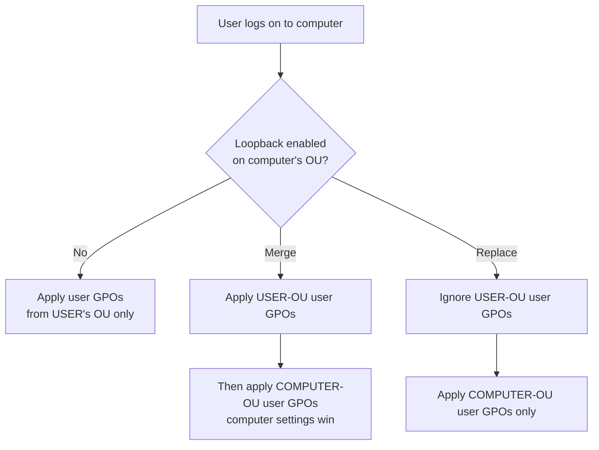

# Group Policy Loopback Processing

Group Policy Loopback Processing is a Group Policy feature that applies the **User Configuration** settings of the GPOs linked to a **computer's** location, rather than the GPOs linked to the user's own location in Active Directory. It exists for shared or special-purpose machines — kiosks, classroom PCs, jump hosts, and Remote Desktop Session Hosts — where the desired user experience should depend on the computer being used, not on who logs in.

## Overview

Under normal processing, [Group Policy](Group-Policy(GPO).md) applies **Computer Configuration** based on where the computer object sits in the directory, and **User Configuration** based on where the *user* object sits — regardless of which machine that user logs onto. Loopback changes only the second half of that rule: it makes the User Configuration follow the **computer's** Organizational Unit (OU) instead.

This is essential for locked-down, multi-user machines. Without loopback, a domain admin logging into a hardened kiosk would still receive their own permissive user settings; with loopback, every user who signs in inherits the same computer-scoped user policy. It is closely related to how policy precedence works generally (site → domain → OU, see [Domain-Based-Group-Policy-Configuration](Domain-Based-Group-Policy-Configuration.md)) and is a common answer to "why are my user settings not applying on a server?" — see [Group-Policy(GPO)](Group-Policy(GPO).md#troubleshooting).

## How It Works

The loopback toggle itself is a **computer** policy: *Configure user Group Policy loopback processing mode*. It must live in a GPO linked to the OU containing the **computer** account. Once enabled, at user logon the system gathers an additional set of user settings from the computer's GPOs.

Policy location:

```text
Computer Configuration > Policies > Administrative Templates > System >
Group Policy > Configure user Group Policy loopback processing mode
```

> [!IMPORTANT]
> **The loopback GPO follows the computer, not the user**
> Enabling loopback on a GPO linked to the *user's* OU does nothing. The setting only takes effect when it is in a GPO applied to the **computer** object's OU. The computer account also needs Read + Apply Group Policy on that GPO.

Internally, enabling the policy writes the mode to the registry on the client:

```text
HKLM\SOFTWARE\Policies\Microsoft\Windows\System\UserPolicyMode
  1 = Merge   2 = Replace   (absent/0 = disabled)
```

## Types

Loopback offers two modes, which differ in whether the user's *own* GPOs still apply:

| Mode | User's own GPOs | Computer-OU user settings | Result on conflict |
| --- | --- | --- | --- |
| **Merge** | Applied first | Applied second (appended) | Computer-OU settings win (last applied) |
| **Replace** | Ignored entirely | Only these apply | Only computer-OU user settings exist |

- **Merge** — the user's normal user GPOs are collected, then the computer's user GPOs are collected and appended to the end. Because the last-applied policy wins, the computer's user settings take precedence, but the user still keeps any non-conflicting personal settings. Higher processing cost (two passes).
- **Replace** — the user's normal user GPOs are never gathered. Only the user settings from the computer's OU apply. This is the stricter, more predictable choice for true kiosks and hardened session hosts.



## Configuration

Typical workflow in the Group Policy Management Console (GPMC):

1. Create a GPO and link it to the OU that holds the target **computer** accounts (e.g. `OU=RDS-Hosts`).
2. Edit it: `Computer Configuration > Administrative Templates > System > Group Policy`.
3. Enable **Configure user Group Policy loopback processing mode** and choose **Merge** or **Replace**.
4. In the same (or another linked) GPO, define the **User Configuration** settings you want enforced on those machines.
5. Refresh and verify:

```cmd
gpupdate /force
```

```powershell
# Resultant Set of Policy for the current user/computer
gpresult /r
gpresult /h C:\gpresult-report.html
```

> [!TIP]
> **Read the RSoP report**
> `gpresult /h` (or `rsop.msc`) shows a *User Details* section that lists loopback mode and which GPOs contributed the winning user settings. If a user setting is not applying on a shared host, this report is the fastest way to confirm loopback is active and in the mode you expect.

## Security Considerations

> [!WARNING]
> **Loopback is a lateral-movement and persistence surface**
> Loopback GPOs let an attacker who can edit a GPO linked to a computer OU push **user** settings — logon scripts, `Run` keys, redirected folders, restricted groups — onto **every** account that logs into those machines. On a Remote Desktop Session Host or admin jump box, that includes privileged users, turning a single GPO write into credential-theft or code-execution against high-value logons. This maps to MITRE ATT&CK **Domain Policy Modification (T1484.001)**.

- **Offensive relevance** — enumerate GPOs linked to server/RDS OUs and check for loopback (Merge/Replace) plus writable ACLs; a loopback GPO is a high-yield target because its user payload lands on interactive admin sessions.
- **Defensive relevance** — loopback *widens* the set of user settings applied to a machine, so a misconfiguration can silently weaken hardening or apply unexpected scripts. Audit which server GPOs use loopback and review their user-side settings.
- Restrict who can create, link, and edit GPOs on sensitive OUs; monitor GPO change events and version bumps.
- Note the Microsoft caveat: you **cannot** filter the applied user settings by denying Apply/Read on the computer object for the loopback GPO — scope with OU placement instead.

## Best Practices

- Prefer **Replace** for true kiosks/lab/RDS hosts where predictability matters; reserve **Merge** for cases where users must keep some personal settings.
- Put the loopback setting and its user policies in a **dedicated GPO** linked to the computer OU — never bolt loopback onto the Default Domain Policy (see [Default-Domain-Policy](Default-Domain-Policy.md)).
- Keep computer accounts that need loopback in their own OU so the blast radius is explicit and easy to audit.
- Always confirm the effective result with `gpresult`/`rsop.msc` after any change — loopback interactions are easy to misread.
- Document why each loopback GPO exists; pair interpreter restrictions with AppLocker/WDAC (see [PowerShell-Blocking-Using-Group-Policy](PowerShell-Blocking-Using-Group-Policy.md)), since GPO alone is a speed bump.

## Troubleshooting

| Symptom | Likely cause & fix |
| --- | --- |
| User settings not applying on a shared/RDS host | Loopback not enabled, or set on the user's OU instead of the computer's OU — link it to the computer OU and re-check with `gpresult /h` |
| Unexpected personal settings still appear on a kiosk | Mode is **Merge** and pulling the user's own GPOs — switch to **Replace** |
| Loopback GPO is ignored | Computer account lacks Read + Apply Group Policy on the GPO, or slow-link/WMI-filter blocking — verify filtering and force `gpupdate /force` |
| Loopback works on some machines only | The GPO isn't linked to (or inherited by) every target computer's OU — check link scope and Block Inheritance |
| "Loopback not supported" behavior | Loopback requires both user and computer objects in Active Directory; it does not apply to workgroup/local-only scenarios |

## References

- [Loopback processing of Group Policy — Microsoft Learn (KB231287)](https://learn.microsoft.com/en-us/troubleshoot/windows-server/group-policy/loopback-processing-of-group-policy)
- [Group Policy overview — Microsoft Learn](https://learn.microsoft.com/en-us/previous-versions/windows/it-pro/windows-server-2012-r2-and-2012/hh831791(v=ws.11))
- [MITRE ATT&CK — Domain Policy Modification: Group Policy Modification (T1484.001)](https://attack.mitre.org/techniques/T1484/001/)

## Related

- [Enterprise Windows Infrastructure Security](../Readme.md) — course hub
- [Group-Policy(GPO)](Group-Policy(GPO).md) — Group Policy fundamentals and processing model
- [Domain-Based-Group-Policy-Configuration](Domain-Based-Group-Policy-Configuration.md) — linking and scoping policy by OU
- [Default-Domain-Policy](Default-Domain-Policy.md) — why loopback belongs in a dedicated GPO, not this one
- [PowerShell-Blocking-Using-Group-Policy](PowerShell-Blocking-Using-Group-Policy.md) — a user-restriction policy commonly enforced on hardened hosts
- [Active Directory Domain Services](../Active-Directory-Domain-Services-AD-DS/Active-Directory-Domain-Services.md) — the directory GPOs are linked into
