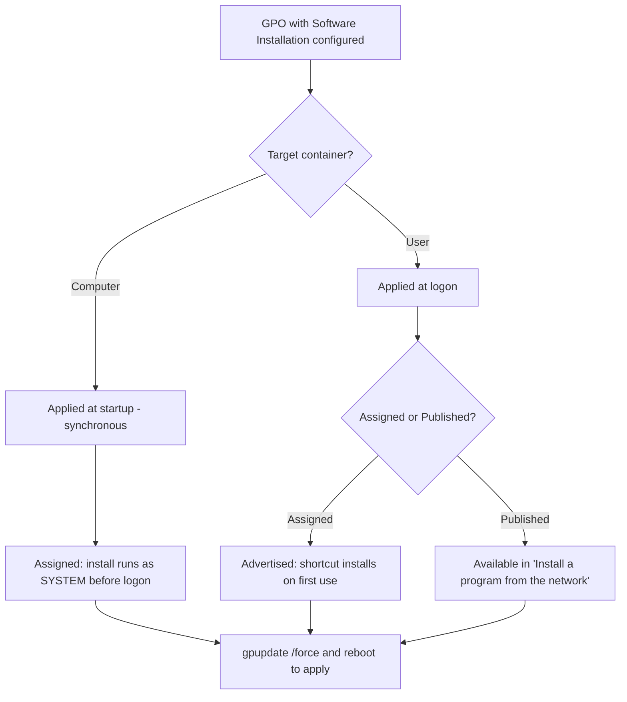

# Software Deployment via GPO

Group Policy Software Installation (GPSI) lets an administrator package an application once and deploy it to thousands of domain-joined computers or users without touching each machine. It is the native, agentless way to distribute Windows Installer (`.msi`) packages across an Active Directory domain.

## Overview

Software deployment is one of the [Group Policy](Group-Policy(GPO).md) extensions configured inside a GPO and delivered through the same site → domain → OU processing chain described in [Domain-Based-Group-Policy-Configuration](Domain-Based-Group-Policy-Configuration.md). The administrator places an `.msi` package on a network share, points a GPO's **Software Installation** node at it, and the Group Policy engine handles the rest — installing, upgrading, or removing the product on every computer or user in scope.

Because installation is driven by **Windows Installer**, GPSI natively understands only `.msi` (and transform `.mst` / patch `.msp`) files. Legacy `.exe` installers must be repackaged into an MSI or wrapped some other way — GPSI cannot run an arbitrary executable on its own.

## How It Works

A GPO exposes two software-installation containers:

- **Computer Configuration → Policies → Software Settings → Software Installation** — targets the machine.
- **User Configuration → Policies → Software Settings → Software Installation** — targets the user.

The package must live on a **UNC share** (for example `\\dc01\Deploy$\7zip.msi`) whose permissions grant **Read** to the accounts that will install it — `Domain Computers` for computer-assigned apps, or the relevant users/groups for user-targeted apps. A local `C:\` path will not work because the target machine reads the file over the network.



> [!IMPORTANT]
> **Software installs only during foreground processing**
> GPSI runs during **synchronous (foreground)** policy processing — at computer startup for machine-assigned apps and at user logon for user-targeted apps — not during the periodic background refresh. Installing or removing an application therefore requires a **reboot** (computer) or **log off / log on** (user); `gpupdate /force` alone often will not complete a software change.

## Types

There are two deployment methods, and where you can use each depends on the target.

| Method | Computer target | User target | Behaviour |
| --- | --- | --- | --- |
| **Assigned** | Yes | Yes | Mandatory. Computer-assigned installs fully at next boot. User-assigned is *advertised* — a shortcut appears and the app installs on first launch or document activation. |
| **Published** | No | Yes | Optional. The app is offered to the user in **Control Panel → Programs → Install a program from the network** (or installed via document invocation). Not available for computers. |

> [!NOTE]
> **Assign vs. publish, in one line**
> **Assign** when everyone in scope must have the app; **publish** when you want to make it available for users to install on demand. Only *assignment* works against computers.

## Configuration

Create the package, share it, then wire it into a GPO.

Create a share and stage the MSI (from an elevated prompt on the file/domain server):

```cmd
mkdir C:\Deploy
net share Deploy$=C:\Deploy /grant:"Authenticated Users",READ   :: # untested
copy \\src\media\7zip.msi C:\Deploy\
```

Open the Group Policy Management Console and edit a GPO:

```cmd
gpmc.msc
```

Inside the Group Policy Management Editor, navigate to the software-installation node:

```text
Computer Configuration
└── Policies
    └── Software Settings
        └── Software Installation
```

Right-click **Software Installation → New → Package**, browse to the package **using its UNC path** (not a drive letter), and choose **Assigned** or **Published**. Confirm scope by linking the GPO to the correct OU as covered in [Domain-Based-Group-Policy-Configuration](Domain-Based-Group-Policy-Configuration.md).

Apply and verify on a client:

```cmd
gpupdate /force
gpresult /r
gpresult /h report.html
```

## Management Options

Right-clicking a deployed package (or its **Properties**) exposes lifecycle actions:

- **Redeploy** — reinstalls the package everywhere it is assigned (useful after replacing the MSI on the share).
- **Upgrade** — links a new package as an upgrade of an existing one; can be mandatory or optional.
- **Remove** — either *immediately uninstall* the software from users/computers, or *allow users to continue using it* but block new installs.

> [!TIP]
> **Use categories and transforms for large catalogs**
> Assign **software categories** so published apps are grouped sensibly in the client's install list, and apply **`.mst` transform files** at deployment time to customise an MSI (silent options, feature selection) without editing the vendor package.

## Security Considerations

> [!WARNING]
> **GPSI is a domain-wide code-execution primitive**
> Computer-assigned packages install as **NT AUTHORITY\SYSTEM** on every machine in scope, before any user logs on. An attacker who can (a) edit a GPO that has Software Installation configured, or (b) write to the **software distribution share** or the GPO's SYSVOL folder, can plant a malicious `.msi` and gain SYSTEM-level code execution across all targeted hosts. This is a classic lateral-movement and persistence technique — MITRE ATT&CK **T1484.001 (Group Policy Modification)**.

- Treat **write access to the deployment share and to any GPO** as equivalent to admin on every computer that GPO applies to; audit and minimise both.
- Set share/NTFS permissions so target accounts have **Read only** — never allow the general population write access to the MSI source.
- Watch for MSIs appearing in SYSVOL or on distribution shares that no legitimate change ticket accounts for; unexpected computer-assigned packages are high-signal.
- Remember GPSI runs vendor installer logic as SYSTEM — a booby-trapped custom action needs no separate exploit. Pair deployment control with **[application control](PowerShell-Blocking-Using-Group-Policy.md)** (AppLocker/WDAC) and GPO change auditing.

## Best Practices

- Deploy only **signed, vetted MSIs** from a controlled, tightly-ACL'd distribution share (ideally separate from SYSVOL).
- Create **purpose-built GPOs** for software deployment and scope them with OUs / security-group filtering — never bolt software onto the [Default-Domain-Policy](Default-Domain-Policy.md).
- Pilot on a **test OU** before broad rollout; use the **Upgrade** relationship rather than remove-then-add so users keep settings.
- Do not delete a package's source before choosing **Remove**, or clients can be left with orphaned, un-uninstallable software.
- For anything MSI cannot handle (or at scale), prefer a dedicated tool such as **Intune**, **Configuration Manager (SCCM)**, or **WSUS** — GPSI is best for simple, small-scale distribution.

## Troubleshooting

| Symptom | Likely cause & fix |
| --- | --- |
| App never installs on clients | Software change applies only in the foreground — **reboot** (computer-assigned) or **log off/on** (user-assigned); `gpupdate /force` alone is not enough. |
| "Could not access the package" / install fails silently | Target account lacks **Read** on the UNC share, or the package was added by drive letter instead of UNC path. Re-add using `\\server\share\pkg.msi`. |
| GPO not reaching the client at all | Scoping/inheritance — run `gpresult /h report.html` to see which GPOs win; check security filtering and Block Inheritance (see [Domain-Based-Group-Policy-Configuration](Domain-Based-Group-Policy-Configuration.md)). |
| Only `.exe` available, won't add | GPSI accepts `.msi`/`.mst`/`.msp` only. Repackage the installer as an MSI. |
| Verifying install / failure on the client | Check the **Application** event log, source **MsiInstaller** — Event ID **11707** (install succeeded) / **11708** (install failed) / **1033** (product configured). |

## References

- [Group Policy Software Installation overview (Microsoft Learn)](https://learn.microsoft.com/en-us/previous-versions/windows/it-pro/windows-server-2012-r2-and-2012/dn789189(v=ws.11))
- [Best practices for Group Policy Software Installation (Microsoft Learn)](https://learn.microsoft.com/en-us/troubleshoot/windows-server/group-policy/use-group-policy-to-install-software)
- [MITRE ATT&CK — Domain Policy Modification: Group Policy Modification (T1484.001)](https://attack.mitre.org/techniques/T1484/001/)

## Related

- [Enterprise Windows Infrastructure Security](../Readme.md) — course hub
- [Group-Policy(GPO)](Group-Policy(GPO).md) — the Group Policy engine that delivers this extension — related note
- [Domain-Based-Group-Policy-Configuration](Domain-Based-Group-Policy-Configuration.md) — linking and scoping the GPO that carries the package — related note
- [Default-Domain-Policy](Default-Domain-Policy.md) — the baseline policy this deployment sits alongside — related note
- [PowerShell-Blocking-Using-Group-Policy](PowerShell-Blocking-Using-Group-Policy.md) — application control that complements deployment restrictions — related note
