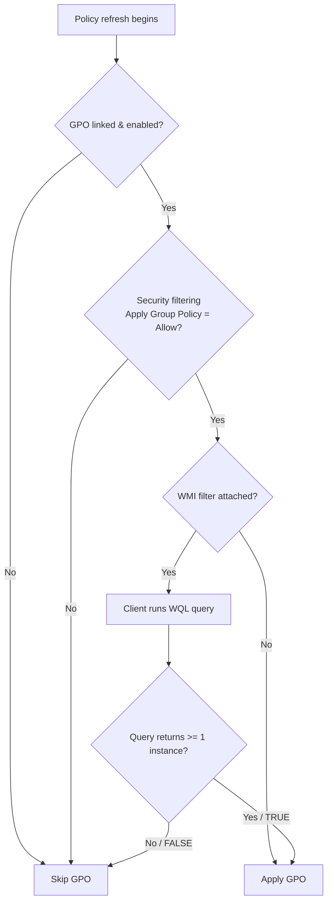

# WMI Filters

A WMI filter is a WQL query attached to a Group Policy Object that lets a GPO apply only to computers whose live state (OS version, hardware, free disk space, role, etc.) satisfies the query. It adds a dynamic, per-machine condition on top of the static link-and-security-filtering scope of Group Policy.

## Overview

By default a GPO applies to every user and computer in the [OU it is linked to](Domain-Based-Group-Policy-Configuration.md), narrowed only by security-group filtering. A WMI filter adds a second gate: during policy processing the client evaluates the filter's [Windows Management Instrumentation](https://learn.microsoft.com/windows/win32/wmisdk/about-wmi) query against itself. If the query returns **at least one instance** (TRUE) the GPO applies; if it returns nothing (FALSE) the GPO is skipped for that machine. This makes WMI filters ideal for targeting by attribute rather than by container — for example, "only 64-bit Windows 11 clients" or "only servers with more than 10 GB free on C:".

WMI filters complement the other scoping mechanisms discussed across this module — see [Group-Policy(GPO)](Group-Policy(GPO).md) for core concepts and [Default-Domain-Policy](Default-Domain-Policy.md) for the baseline GPO you should *not* filter this way.

## How It Works

A WMI filter is a separate AD object stored in the domain; a single GPO can have **at most one** WMI filter linked to it, but the same filter can be reused across many GPOs. The filter contains one or more **WQL** (WMI Query Language, an SQL-like dialect) queries, each targeting a namespace (almost always `root\CIMv2`).

Evaluation rules:

- The filter is evaluated **on the client**, in the security context of the computer, at each policy refresh.
- If a filter contains multiple queries, **all** must evaluate TRUE (logical AND) for the GPO to apply.
- WMI filters gate **computer-side and user-side** settings, but the query always runs against the **computer** — WMI has no per-user view of the machine.



> [!IMPORTANT]
> **Order of scoping**
> WMI evaluation happens **after** link scope and security-group filtering. A machine excluded by security filtering never reaches the WMI check. Think of scoping as a funnel: **Link → Security filter → WMI filter → apply**.

## Common WQL Filters

Queries typically hit `root\CIMv2`. The examples below are standard WMI classes and properties.

Target only client (workstation) operating systems — `ProductType` is `1` for a workstation, `2` for a domain controller, `3` for a member server:

```text
SELECT * FROM Win32_OperatingSystem WHERE ProductType = "1"
```

Target only servers (member server or DC):

```text
SELECT * FROM Win32_OperatingSystem WHERE ProductType = "2" OR ProductType = "3"
```

Target a specific OS build family by version (e.g. Windows 10 / 11 report version `10.x`):

```text
SELECT * FROM Win32_OperatingSystem WHERE Version LIKE "10.%" AND ProductType = "1"
```

Target 64-bit machines by processor address width:

```text
SELECT AddressWidth FROM Win32_Processor WHERE AddressWidth = "64"
```

Apply only when a threshold of free disk space exists (value in bytes):

```text
SELECT * FROM Win32_LogicalDisk WHERE DeviceID = "C:" AND DriveType = 3 AND FreeSpace > 10737418240
```

> [!TIP]
> **Test the query before you attach it**
> A WQL query that is syntactically valid but semantically wrong (wrong property, wrong type) silently returns FALSE and the GPO simply never applies — with no error. Validate the query on a representative client first, then attach it in GPMC.

## Configuration

WMI filters are created and linked in the **Group Policy Management Console** (`gpmc.msc`):

```cmd
gpmc.msc
```

1. In the forest/domain tree, right-click **WMI Filters** → **New**.
2. Give the filter a descriptive name and add one or more queries (namespace `root\CIMv2`, then the WQL).
3. Select the GPO, and on its **Scope** tab set **WMI Filtering** to the filter.

Validate a candidate query on a target client with `Get-CimInstance` — an instance returned means the filter would evaluate TRUE there:

```powershell
Get-CimInstance -Query "SELECT * FROM Win32_OperatingSystem WHERE ProductType = '1'"
```

Or with the legacy WMI command-line tool:

```cmd
wmic os get ProductType,Version,Caption
```

Force a policy refresh and confirm scoping after attaching the filter:

```cmd
gpupdate /force
gpresult /h report.html
```

## Security Considerations

> [!WARNING]
> **WMI filters are not a security boundary**
> A WMI filter decides **whether** a GPO applies, not **who is allowed** to receive it. It is an evaluation of client-reported state, and a machine (or an attacker with local control of it) can influence what WMI reports. Never treat a WMI filter as an access control — it is a targeting convenience, not a trust boundary. Enforce real restrictions with AppLocker/WDAC and least-privilege, as noted in [PowerShell-Blocking-Using-Group-Policy](PowerShell-Blocking-Using-Group-Policy.md).

Offensive and defensive relevance:

- **Recon** — an attacker who can read GPOs (any authenticated user can read WMI filter objects and GPO scope in the domain) learns which classes of machines receive which policies, revealing the environment's OS/hardware landscape and where hardening GPOs *don't* reach.
- **Bypass by omission** — if a hardening GPO is scoped with a fragile WMI filter, a host that falls outside the query (an unexpected OS build, a re-imaged box reporting different attributes) silently misses the control. Attackers hunt for exactly these gaps.
- **Tampering** — an attacker with GPO edit rights can add or alter a WMI filter to quietly de-scope a security GPO from targeted hosts without deleting the visible GPO link — a subtle, auditable-only-if-you-look change (see MITRE ATT&CK [T1484 Domain Policy Modification](https://attack.mitre.org/techniques/T1484/)).
- **Performance/DoS** — heavy or malformed WMI queries slow every policy refresh across the affected scope.

## Best Practices

- Use WMI filters sparingly — each one adds a query cost to **every** policy refresh on machines in the GPO's link scope; prefer OU structure and security-group filtering when they can express the same intent.
- Keep queries narrow and cheap: query one class, one namespace (`root\CIMv2`), and avoid `LIKE` wildcards that force full scans where an equality test would do.
- Name filters by what they select ("Client OS only", "64-bit servers") and document intent, mirroring the GPO naming discipline in [Group-Policy(GPO)](Group-Policy(GPO).md).
- Never attach a WMI filter to the [Default-Domain-Policy](Default-Domain-Policy.md) or Default Domain Controllers Policy — baseline policies must apply unconditionally.
- Validate every query on real target hardware with `Get-CimInstance` before production, and re-verify after OS upgrades change reported versions.

## Troubleshooting

| Symptom | Likely cause & fix |
| --- | --- |
| GPO never applies to any machine | WQL query returns FALSE everywhere — wrong property, wrong type (numeric vs. quoted), or wrong namespace. Test with `Get-CimInstance -Query "…"`. |
| GPO applies to machines it shouldn't | Query too broad (e.g. `ProductType` matches servers too). Tighten the WHERE clause. |
| `gpresult` shows the GPO as "Denied (WMI Filter)" | Expected when the filter is FALSE for that host; confirm the query result on that client to verify it is intended. |
| Slow logon / long policy processing | Expensive WMI query evaluated on every refresh; simplify the query or replace with OU/security-group scoping. |
| Filter change not taking effect | Client cached policy — run `gpupdate /force` and re-check with `gpresult /h report.html`. |

## References

- Microsoft Learn — [WMI Filtering using GPMC](https://learn.microsoft.com/en-us/previous-versions/windows/it-pro/windows-server-2003/cc779036(v=ws.10))
- Microsoft Learn — [Querying with WQL](https://learn.microsoft.com/windows/win32/wmisdk/querying-with-wql)
- Microsoft Learn — [Win32_OperatingSystem class](https://learn.microsoft.com/windows/win32/cimwin32prov/win32-operatingsystem)
- MITRE ATT&CK — [Domain Policy Modification (T1484)](https://attack.mitre.org/techniques/T1484/)

## Related

- [Enterprise Windows Infrastructure Security](../Readme.md) — course hub and map of content
- [Group-Policy(GPO)](Group-Policy(GPO).md) — core Group Policy concepts and processing order — related note
- [Domain-Based-Group-Policy-Configuration](Domain-Based-Group-Policy-Configuration.md) — linking and scoping policy in a domain — related note
- [Default-Domain-Policy](Default-Domain-Policy.md) — baseline GPO that should never be WMI-filtered — related note
- [PowerShell-Blocking-Using-Group-Policy](PowerShell-Blocking-Using-Group-Policy.md) — a hardening GPO you might scope with a WMI filter — related note
