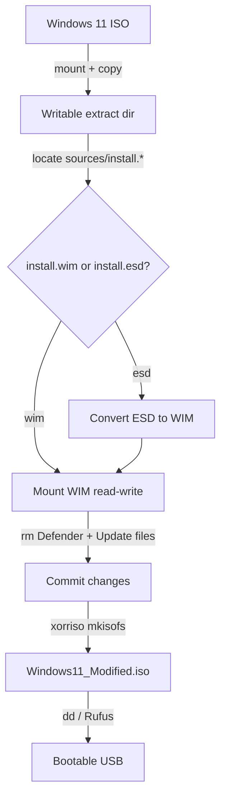

# Custom-build Windows 11 ISO

Building a customized Windows 11 installation ISO by mounting the image, stripping components such as **Windows Defender** and **Windows Update** from the offline `install.wim`, then repacking and rebuilding a bootable ISO — done entirely from Kali Linux using `wimtools` and `xorriso`. The result is a lightweight lab image for offensive tooling and detonation work where built-in AV would otherwise interfere.

## Overview

A Windows installation ISO carries the OS as a compressed image file (`install.wim` or `install.esd`) inside the `sources\` folder. Because that image is just a mountable filesystem, you can open it offline on Linux, delete or alter files, and repackage it — no Windows host or DISM required. This note documents that workflow: mount the ISO, extract/convert the image, mount the WIM read-write, remove Defender and Update artifacts, commit, and rebuild a bootable ISO you can write to USB with `dd`.

This complements [Win11Debloat](../Windows-Commands/Win11Debloat.md) (which strips a *running* install) and the trial-media workflow in [Windows-Evaluation-Center](Windows-Evaluation-Center.md). Choose the edition first — see [Windows-Operating-System-Editions](../Fundamental-Of-Operating-System/Windows-Operating-System-Editions.md) — because each edition is a separate image index inside `install.wim`.

> [!WARNING]
> **Lab images only**
> An image with Defender and Windows Update removed is intentionally insecure and will never receive patches. Use it **only** inside an isolated lab (see [Virtualization](Virtualization.md) / [Vulnerable-Machines](Vulnerable-Machines.md)), never on a network-connected or production machine.

## How It Works

The pipeline transforms the vendor ISO into a modified bootable ISO through five stages:



> [!NOTE]
> **Tooling**
> `wimtools` (the wimlib package) provides `wiminfo`, `wimmountrw`, `wimunmount`, `wimextract`, `wimcapture` and `wimexport`. `xorriso` rebuilds the El Torito bootable ISO. Install with `apt install wimtools -y`.

## Mount the Windows 11 ISO

Create a mount point and mount the ISO read-only via a loop device:

```bash
mkdir /mnt/winiso
```

```bash
mount -o loop /path/to/en-us_windows_11_iot_enterprise_version_24h2_x64_dvd_3a99b72b.iso /mnt/winiso
```

Copy the contents to a writable directory (the mounted ISO itself is read-only):

```bash
mkdir /d-data/win11iso_extract
```

```bash
cp -vr /mnt/winiso/* /d-data/win11iso_extract
```

## Extract the install.wim or install.esd

Navigate to the `sources` folder and check which image format is present:

```bash
cd /d-data/win11iso_extract/sources
```

```bash
ls install.*
```

Install the wimlib toolset if needed:

```bash
apt install wimtools -y
```

If `install.esd` is present instead of `install.wim`, convert it. Inspect the image indexes first, then export the desired edition index into a new WIM:

```bash
wiminfo /d-data/win11iso_extract/sources/install.esd
```

```bash
wimextract install.esd 1 --dest-dir=install.wim   # untested
```

> [!TIP]
> **Prefer wimexport for ESD → WIM**
> The canonical wimlib way to convert an ESD to a WIM is `wimexport install.esd 1 install.wim --compress=LZX`, which copies image index 1 into a new LZX-compressed WIM. `wimextract` unpacks *files* from an image rather than producing a new WIM, so verify the output before repacking.

## Mount and Modify the install.wim

1. **Create a mount directory:**

    ```bash
    mkdir /mnt/wim
    ```

2. **Inspect the image, then mount index 1 read-write:**

    ```bash
    wiminfo /d-data/win11iso_extract/sources/install.wim
    ```

    ```bash
    wimmountrw /d-data/win11iso_extract/sources/install.wim 1 /mnt/wim --allow-other
    ```

    The image is now browsable at `/mnt/wim` as a normal filesystem.

3. **Remove Windows Defender files:**

    ```bash
    rm -rf /mnt/wim/Windows/System32/MsMpEng.exe
    rm -rf /mnt/wim/Windows/System32/WindowsPowerShell/v1.0/Modules/Defender
    rm -rf /mnt/wim/Windows/System32/Drivers/MpFilter.sys
    rm -rf /mnt/wim/Windows/System32/MpSigStub.exe
    rm -rf "/mnt/wim/ProgramData/Microsoft/Windows Defender"
    rm -rf "/mnt/wim/Program Files/Windows Defender"
    ```

4. **Remove Windows Update (wuauserv):**

    - Delete Windows Update service files:

        ```bash
        rm -rf /mnt/wim/Windows/System32/svchost.exe.wuauserv   # untested
        rm -rf /mnt/wim/Windows/System32/Tasks/Microsoft/Windows/WindowsUpdate
        rm -rf /mnt/wim/Windows/System32/wuaueng.dll
        rm -rf /mnt/wim/Windows/System32/wups.dll
        rm -rf /mnt/wim/Windows/System32/wuapi.dll
        rm -rf /mnt/wim/Windows/System32/wuauserv.dll   # untested
        rm -rf /mnt/wim/Windows/System32/drivers/wdfilter.sys
        ```

    - Remove Windows Update registry entries:

        ```bash
        rm -rf /mnt/wim/Windows/System32/config/SOFTWARE/Microsoft/Windows/CurrentVersion/WindowsUpdate   # untested
        rm -rf /mnt/wim/Windows/System32/config/SYSTEM/ControlSet001/Services/wuauserv   # untested
        rm -rf /mnt/wim/Windows/System32/config/SYSTEM/ControlSet002/Services/wuauserv   # untested
        ```

> [!WARNING]
> **Registry hives are binary files, not folders**
> `SOFTWARE` and `SYSTEM` under `config\` are single **binary registry hive files**, not directories — `rm -rf` on a path *inside* them (e.g. `config/SOFTWARE/Microsoft/...`) will not match anything and silently no-ops. Editing offline registry entries requires a hive editor such as `hivexregedit` / `chntpw` / `reged`. Treat the registry-deletion steps above as unverified. Removing signed system binaries can also break servicing, WinRE, or setup; always test in a VM first.

## Repack the install.wim

Unmount the image and commit the changes back into the WIM:

```bash
wimunmount /mnt/wim --commit
```

If `install.esd` was originally present, convert `install.wim` back to ESD and remove the intermediate WIM:

```bash
wimcapture ~/winiso_extract/sources/install.wim install.esd   # untested
```

```bash
rm ~/winiso_extract/sources/install.wim
```

> [!NOTE]
> **Path and command caveats**
> The repack step references `~/winiso_extract` while earlier steps used `/d-data/win11iso_extract` — keep one consistent extract path throughout. Also note `wimcapture` captures a *directory tree* into a new WIM; to re-pack an existing WIM back into ESD, `wimexport install.wim 1 install.esd --compress=LZMS` is the intended operation.

## Rebuild the Windows 11 ISO

Rebuild a UEFI-bootable ISO from the modified extract directory with `xorriso` (BIOS El Torito boot via `etfsboot.com`, UEFI boot via `efisys_noprompt.bin`):

```bash
xorriso -as mkisofs \
    -iso-level 4 \
    -full-iso9660-filenames \
    -volid "Win11_Mod" \
    -eltorito-boot boot/etfsboot.com \
    -no-emul-boot \
    -boot-load-size 8 \
    -boot-info-table \
    -eltorito-alt-boot \
    -e efi/microsoft/boot/efisys_noprompt.bin \
    -no-emul-boot \
    -o /d-data/Windows11_Modified.iso \
    /d-data/win11iso_extract
```

## Write to USB and Test

Use `dd` (or Rufus on Windows) to make a bootable USB:

```bash
dd if=/d-data/Windows11_Modified.iso of=/dev/sdX bs=4M status=progress
```

> [!WARNING]
> **dd overwrites the target device**
> Replace `/dev/sdX` with the correct USB device — `dd` will irreversibly overwrite whatever it points at. Confirm with `lsblk` before running. Always **test the modified ISO in a virtual machine** before installing on hardware.

## Security Considerations

> [!WARNING]
> **Offensive and defensive relevance**
> Stripping Defender and Windows Update produces a deliberately weakened Windows build. Offensively, it is convenient for a **malware / C2 detonation lab** where real-time protection and cloud submission would flag or quarantine tooling. Defensively, the same technique is a supply-chain and tampering concern: a modified installation ISO can ship with security controls disabled or with implanted binaries. Verify vendor media hashes, deploy only signed images through trusted channels, and enable Tamper Protection and WDAC so removed/altered components are detectable at scale.

- Never connect a Defender-less, patch-less image to a production or internet-facing network.
- Keep such images inside isolated, snapshot-capable lab environments only.
- Removing signed OS components can trigger setup failures, Secure Boot/servicing issues, and WinRE breakage — validate every build.

## Best Practices

- Always work on a **copy** of the ISO contents; never modify the original media.
- Verify the source ISO's SHA-256 hash against Microsoft before customizing.
- Run `wiminfo` to confirm the correct **image index** (edition) before mounting or exporting.
- Test the rebuilt ISO in a VM ([Virtualization](Virtualization.md)) before writing to USB or deploying.
- Keep the extract path consistent end-to-end and snapshot the lab VM before first boot.

## Troubleshooting

| Symptom | Likely cause & fix |
|---------|--------------------|
| `mount: failed` on the ISO | Missing loop support or bad path; use `mount -o loop` and verify the ISO path. |
| `ls install.*` shows only `install.esd` | The edition ships an ESD; export/convert it to WIM before mounting (`wimexport ... install.wim`). |
| `wimmountrw` fails with FUSE/permission error | Run as root and pass `--allow-other`; ensure `fuse` is available. |
| Registry `rm -rf` commands appear to do nothing | Hives are binary files, not folders — use a hive editor (`hivexregedit`/`chntpw`). |
| Rebuilt ISO won't UEFI-boot | Wrong or missing `efisys_noprompt.bin` / boot paths in `xorriso`; confirm `efi/microsoft/boot/` exists in the extract. |
| Windows Setup crashes or servicing errors after install | A removed signed component broke setup; rebuild removing fewer files and retest. |

## References

- wimlib — WIM/ESD image tooling (`wimmountrw`, `wimcapture`, `wimexport`): https://wimlib.net/
- Microsoft Learn — DISM Image Management Command-Line Options: https://learn.microsoft.com/windows-hardware/manufacture/desktop/dism-image-management-command-line-options-s14
- Microsoft Learn — Windows Setup and the `install.wim` image: https://learn.microsoft.com/windows-hardware/manufacture/desktop/windows-setup-installation-process
- GNU xorriso — ISO 9660 / El Torito image creation: https://www.gnu.org/software/xorriso/

## Related

- [Enterprise Windows Infrastructure Security](../Readme.md) — course hub
- [Windows-Evaluation-Center](Windows-Evaluation-Center.md) — source of trial Windows ISOs
- [Windows-Operating-System-Editions](../Fundamental-Of-Operating-System/Windows-Operating-System-Editions.md) — choosing which edition (image index) to build
- [Win11Debloat](../Windows-Commands/Win11Debloat.md) — stripping a running Windows 11 install
- [Virtualization](Virtualization.md) — testing the rebuilt image in an isolated VM
- [Vulnerable-Machines](Vulnerable-Machines.md) — building intentionally weak lab targets
- [Microsoft-Windows-Activation](Microsoft-Windows-Activation.md) — activating the deployed image
