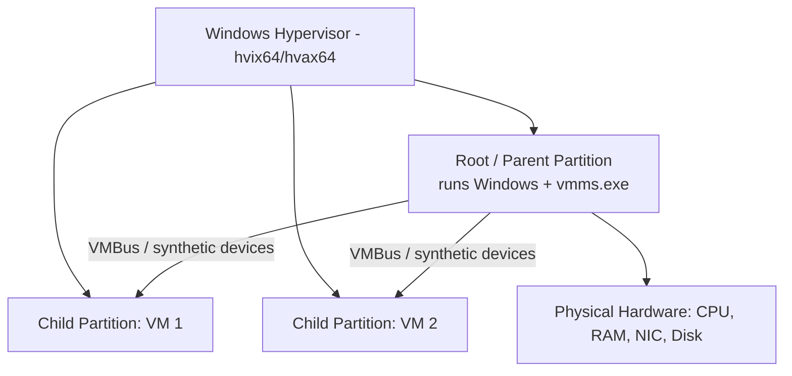

# Hyper-V

Hyper-V is Microsoft's native **Type 1 (bare-metal) hypervisor**, built into Windows client (Pro/Enterprise/Education) and Windows Server. It lets a single physical host run multiple isolated virtual machines, and it is the same technology that underpins Windows Virtualization-Based Security (VBS) and Credential Guard.

## Overview

In a Windows/Active Directory home lab, Hyper-V is the "Windows-native" alternative to [VirtualBox](Virtualization.md), [KVM/QEMU](KVM(Kernel-based-Virtual-Machine).md), or [Proxmox](Proxmox-Setup.md). Because it is a [Type 1 hypervisor](Virtualization.md), enabling Hyper-V converts the running Windows install into the privileged **root (parent) partition** that sits *on top of* the hypervisor rather than beside it — an important detail, because it changes how other hypervisors and offensive tooling behave on the same host. It pairs naturally with [Windows evaluation media](Windows-Evaluation-Center.md) and [vulnerable target VMs](Vulnerable-Machines.md) to build a snapshot-driven lab.

## How It Works

When Hyper-V is enabled, the Windows Hypervisor (`hvix64.exe` on Intel / `hvax64.exe` on AMD) boots first. The original Windows OS is then re-parented into the **root partition**, which owns the hardware and hosts the virtualization stack (the VM Management Service, `vmms.exe`). Each guest runs in its own **child partition** with no direct hardware access — it talks to the root partition over the high-speed **VMBus** through *synthetic* devices (or emulated devices for unenlightened guests).



> [!NOTE]
> **SLAT is mandatory**
> Hyper-V requires a 64-bit CPU with hardware-assisted virtualization (Intel VT-x / AMD-V), hardware-enforced DEP, and **Second Level Address Translation (SLAT)** — Intel EPT / AMD RVI. Without SLAT the role will not install.

## Components

- **Windows Hypervisor** — the thin Type 1 layer that partitions CPU and memory.
- **Virtual Machine Management Service (VMMS)** — the `vmms.exe` service in the root partition that manages VM lifecycle.
- **Hyper-V Manager / PowerShell `Hyper-V` module** — the GUI and CLI management surfaces.
- **Virtual switches (vSwitch)** — software network switches; see [Configuration](#configuration).
- **Virtual disks** — `.vhdx` (modern, resilient, up to 64 TB) or legacy `.vhd`.
- **Integration Services** — in-guest drivers/services that enable synthetic devices, heartbeat, and Enhanced Session Mode.

## Types

### Generation 1 vs Generation 2 VMs

| Feature | Generation 1 | Generation 2 |
|---------|--------------|--------------|
| Firmware | Legacy BIOS | UEFI |
| Boot disk | IDE | SCSI |
| Secure Boot | Not supported | Supported (default on) |
| PXE boot | Legacy network adapter only | Standard network adapter |
| Guest support | Older OSes (incl. 32-bit) | Modern 64-bit OSes only |

> [!TIP]
> **Pick Generation 2 for modern Windows labs**
> Use Generation 2 for Windows Server 2016+ and Windows 10/11 guests to get UEFI, Secure Boot, and TPM support. Fall back to Generation 1 only for legacy or 32-bit operating systems — the generation cannot be changed after the VM is created.

## Configuration

### Enabling Hyper-V

On Windows **client** (Pro/Enterprise/Education), enable the optional feature and reboot:

```powershell
Enable-WindowsOptionalFeature -Online -FeatureName Microsoft-Hyper-V -All
```

On Windows **Server**, install the role with its management tools:

```powershell
Install-WindowsFeature -Name Hyper-V -IncludeManagementTools -Restart
```

### Virtual switch types

| Switch type | Connectivity |
|-------------|--------------|
| **External** | VMs reach the physical LAN/internet via a host NIC (bridged-style) |
| **Internal** | VMs talk to each other and to the host only — no physical network |
| **Private** | VMs talk only to each other — fully isolated, not even the host |

For a contained lab, prefer **Private** or **Internal** switches so target traffic never reaches production (compare with [VirtualBox-Network-Modes](VirtualBox-Network-Modes.md)).

```powershell
# Create an isolated lab switch and a VM
New-VMSwitch -Name "LabPrivate" -SwitchType Private
New-VM -Name "DC01" -Generation 2 -MemoryStartupBytes 4GB `
  -NewVHDPath "C:\VMs\DC01.vhdx" -NewVHDSizeBytes 60GB -SwitchName "LabPrivate"
```

### Checkpoints (snapshots)

Hyper-V calls snapshots **checkpoints**. *Production* checkpoints use VSS for an application-consistent, backup-style image; *Standard* checkpoints also capture live memory/device state.

```powershell
Checkpoint-VM -Name "DC01" -SnapshotName "clean-baseline"
Restore-VMCheckpoint -VMName "DC01" -Name "clean-baseline" -Confirm:$false  # untested
```

### Nested virtualization

To run a hypervisor (another Hyper-V, or an AD lab that itself virtualizes) *inside* a Hyper-V guest, expose virtualization extensions to that guest's CPU while it is powered off:

```powershell
Set-VMProcessor -VMName "LabHost" -ExposeVirtualizationExtensions $true
```

## Security Considerations

> [!WARNING]
> **Offensive and defensive relevance**
> - **VM state files leak memory.** Saved-state and checkpoint artifacts (`.vhdx`/`.avhdx` differencing disks, `.vmrs` runtime-state, `.vmcx` config) can contain **guest RAM**. An attacker who exfiltrates a running/saved VM's files can carve credentials (e.g. LSASS secrets) *offline*, bypassing in-guest defenses — see LSASS-Dumping-Credential-Extraction-using-pypykatz.
> - **The hypervisor is attack surface.** A guest-to-host **VM escape** breaks isolation for every VM on the host; keep the host patched and treat lab guests as hostile to the host.
> - **Hyper-V is defensive too.** Windows **Virtualization-Based Security (VBS)** and **Credential Guard** run LSASS secrets inside a Hyper-V-isolated trustlet, which defeats classic in-memory hash theft — worth knowing when an engagement's `mimikatz`/`sekurlsa` dumps come back empty.
> - **Coexistence conflict.** Because Hyper-V claims VT-x/AMD-V for the root partition, it historically breaks other Type 2 hypervisors (VirtualBox/VMware) on the same host; VBS/Credential Guard/WSL2/Sandbox silently pull Hyper-V in.

## Best Practices

- Keep lab VMs on **Private/Internal** virtual switches so intentionally-weak targets never route to production.
- Snapshot (checkpoint) every VM in a known-good state before each lab and roll back afterward.
- Use **Generation 2 + `.vhdx`** for modern Windows guests; enable Secure Boot unless a lab requires it off.
- Enable **nested virtualization** on any guest that must itself run a hypervisor (Hyper-V/WSL2/Sandbox).
- Store VM files on an encrypted volume — checkpoint/state files can contain guest memory and credentials.

## Troubleshooting

| Symptom | Likely cause & fix |
| --- | --- |
| Hyper-V role/feature won't install | CPU lacks SLAT/VT-x/AMD-V, or virtualization is disabled in BIOS/UEFI — enable VT-x/AMD-V (and VT-d/IOMMU for passthrough) |
| VirtualBox/VMware VMs fail or run slowly after enabling Hyper-V | Hyper-V (or VBS/Credential Guard/WSL2) owns the CPU virtualization extensions — disable with `bcdedit /set hypervisorlaunchtype off` and reboot to test |
| VMs on the same switch can't see each other | Wrong switch type — put lab VMs on the same **Internal/Private** switch, not separate ones |
| Nested Hyper-V guest won't start its own hypervisor | `ExposeVirtualizationExtensions` not set on the parent VM's processor while it was powered off |

## References

- Microsoft Learn — Introduction to Hyper-V on Windows: https://learn.microsoft.com/virtualization/hyper-v-on-windows/about/
- Microsoft Learn — Should I create a generation 1 or 2 virtual machine: https://learn.microsoft.com/windows-server/virtualization/hyper-v/plan/should-i-create-a-generation-1-or-2-virtual-machine-in-hyper-v
- Microsoft Learn — Run Hyper-V in a virtual machine with nested virtualization: https://learn.microsoft.com/virtualization/hyper-v-on-windows/user-guide/nested-virtualization
- Microsoft Learn — Hyper-V PowerShell module reference: https://learn.microsoft.com/powershell/module/hyper-v/

## Related

- [Enterprise Windows Infrastructure Security](../Readme.md) — course hub
- [Virtualization](Virtualization.md) — related note (hypervisor concepts and Type 1 vs Type 2)
- [VirtualBox-Network-Modes](VirtualBox-Network-Modes.md) — related note (comparable isolated networking modes)
- [KVM(Kernel-based-Virtual-Machine)](KVM(Kernel-based-Virtual-Machine).md) — related note (Linux Type 1 alternative)
- [Proxmox-Setup](Proxmox-Setup.md) — related note (dedicated hypervisor host alternative)
- [Windows-Evaluation-Center](Windows-Evaluation-Center.md) — related note (sourcing Windows media for guests)
- [Vulnerable-Machines](Vulnerable-Machines.md) — related note (practice targets to run as VMs)
