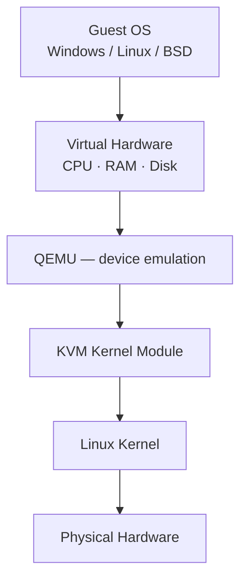

# KVM (Kernel-based Virtual Machine)

**KVM (Kernel-based Virtual Machine)** is a full virtualization solution built into the Linux kernel. It turns a Linux machine into a Type-1 (bare-metal) hypervisor, allowing multiple isolated virtual machines (VMs) to run simultaneously at near-native speed.

## Overview

Each KVM VM behaves like a completely independent physical computer with its own CPU, memory (RAM), disk, network interfaces, BIOS/UEFI, and operating system. KVM has been included in the Linux kernel since version 2.6.20 (2007).

KVM itself does **not** emulate hardware — it provides CPU and memory virtualization using the processor's hardware extensions, while **QEMU** supplies the virtual devices. Together they form a complete VM.

## Concepts

### KVM components

| Component | Role |
|---|---|
| `kvm` | Core kernel module — CPU virtualization, memory virtualization, VM scheduling. |
| `kvm-intel` | Intel-specific module (VT-x). |
| `kvm-amd` | AMD-specific module (AMD-V). |
| QEMU | Emulates virtual BIOS, disks, PCI, VGA, USB, sound, networking. |
| libvirt | Management layer — VM management, networking, storage pools, snapshots, migration (`virsh`). |
| virt-manager | GUI application — create VMs, configure hardware, snapshots, console access. |

Check loaded modules:

```bash
lsmod | grep kvm
```

Intel example:

```text
kvm_intel
kvm
```

AMD example:

```text
kvm_amd               217088  0
kvm                  1396736  1 kvm_amd
irqbypass              12288  1 kvm
ccp                   163840  1 kvm_amd
```

### Virtualization extensions

Without hardware virtualization, sensitive guest instructions must be binary-translated — very slow:

```text
Guest OS  →  Binary Translation  →  Host CPU
```

With KVM, the CPU's VMX (Intel) / SVM (AMD) extensions run guest code almost natively:

```text
Guest OS  →  VMX / SVM  →  Host CPU
```

### CPU virtualization

The guest believes it owns Ring 0, interrupts, and page tables. In reality, sensitive instructions trap into KVM:

```text
Guest  →  VM Exit  →  Linux Kernel  →  Host CPU
```

### Memory virtualization

Each VM receives virtual RAM (e.g. VM1 = 4 GB, VM2 = 8 GB, VM3 = 2 GB). KVM maps guest pages to host physical pages using Extended Page Tables (EPT, Intel) or Nested Page Tables (NPT, AMD).

### Storage virtualization

Virtual disks (e.g. `Windows.img`, `Ubuntu.qcow2`, `Debian.raw`) support formats: `raw`, `qcow2`, `qcow`, `VMDK`, `VHD`, `VDI`.

### Networking

| Mode | Behaviour |
|---|---|
| NAT | Default. `Internet → Host → VM`. |
| Bridge | VM gets its own LAN IP. `LAN → Switch → VM`. |
| Macvtap | Direct access to the physical NIC. |
| SR-IOV | Near-native networking via hardware NIC partitioning. |

### CPU modes

- **host-model** — compatible CPU model presented to the guest.
- **host-passthrough** — exposes the real CPU features; best performance.

### VirtIO (paravirtualized devices)

VirtIO drivers provide faster disk, lower latency, and better throughput than emulated IDE. Examples: `virtio-net`, `virtio-blk`, `virtio-scsi`, `virtio-rng`, `virtio-balloon`, `virtio-gpu`, `virtio-fs`.

```text
IDE     →  Slow
VirtIO  →  Near Native
```

### GPU options

- **Software rendering** — `Guest → VirtIO GPU → CPU Rendering`. Good for desktops.
- **VirGL** — OpenGL acceleration; host GPU assists rendering.
- **PCI passthrough** — an entire GPU assigned to one VM. Requires IOMMU + VT-d/AMD-Vi. Performance nearly identical to bare metal.
- **NVIDIA vGPU / AMD MxGPU** — enterprise GPU sharing (expensive).

## Architecture



Equivalent ASCII view:

```text
+--------------------------------------+
| Guest OS (Windows/Linux/BSD/macOS*)  |
+--------------------------------------+
| Virtual Hardware (CPU, RAM, Disk)    |
+--------------------------------------+
| QEMU (Device Emulation)              |
+--------------------------------------+
| KVM Kernel Module                    |
+--------------------------------------+
| Linux Kernel                         |
+--------------------------------------+
| Physical Hardware                    |
+--------------------------------------+
```

## Installation

KVM requires hardware virtualization support:

- **Intel:** VT-x, plus VT-d (optional, for PCI passthrough).
- **AMD:** AMD-V, plus AMD-Vi (IOMMU).

Check support:

```bash
egrep -c '(vmx|svm)' /proc/cpuinfo
```

```text
0  -> Not Supported
>0 -> Supported
```

> [!TIP]
> **Full install walkthrough**
> For the complete package install and setup on Kali, see [KVM-and-QEMU-Setup-on-Kali-Linux](KVM-and-QEMU-Setup-on-Kali-Linux.md).

## Administration

Check virtualization support:

```bash
egrep -c '(vmx|svm)' /proc/cpuinfo
```

List VMs:

```bash
virsh list --all
```

Start a VM:

```bash
virsh start ubuntu
```

Shutdown a VM:

```bash
virsh shutdown ubuntu
```

Connect to a VM console:

```bash
virsh console ubuntu
```

Check loaded KVM modules:

```bash
lsmod | grep kvm
```

Check QEMU version:

```bash
qemu-system-x86_64 --version
```

### Live migration

Move a running VM between hosts with no shutdown. Requirements: shared storage, compatible CPUs, and libvirt.

### Snapshots

Capture VM state — RAM, CPU state, and disk. Useful for malware analysis, penetration testing, and software testing. See [Snapshots-and-Templates](Snapshots-and-Templates.md).

## Security Considerations

Each VM is isolated. Additional security layers on the host:

- SELinux
- AppArmor
- sVirt
- cgroups
- Namespaces

## Best Practices

### Performance

Typical virtualization overhead:

| Resource | Performance |
|---|--:|
| CPU | 95–99% of native |
| Memory | 95–99% |
| Disk (VirtIO) | 90–98% |
| Network (VirtIO) | 95–99% |
| GPU Passthrough | 98–100% |

- Use VirtIO drivers for disk and network in every guest.
- Use `host-passthrough` CPU mode when guest CPU compatibility across hosts is not required.

### Advantages

- Open source and included in Linux.
- Near-native performance; enterprise ready.
- Supports Windows, Linux, BSD, and many other guest operating systems.
- Live migration, snapshots, PCI passthrough.
- Huge ecosystem; works with cloud platforms like OpenStack.

### Limitations

- Requires Linux as the host OS.
- PCI passthrough setup can be complex.
- GPU sharing usually requires enterprise hardware/software.
- Some advanced features require compatible CPUs and chipsets.

## KVM vs QEMU

| Feature | KVM | QEMU |
|---|---|---|
| Type | Kernel virtualization | Machine emulator |
| Location | Linux kernel | User-space application |
| CPU virtualization | Hardware-assisted | Software emulation (or uses KVM acceleration) |
| Device emulation | No | Yes |
| Hardware acceleration | Yes | Via KVM |
| Performance | Near native | Slow without KVM |

**In practice, KVM and QEMU are used together:** KVM provides hardware-accelerated virtualization, while QEMU supplies the virtual hardware that guest operating systems interact with.

## References

- KVM project: <https://linux-kvm.org/>
- QEMU documentation: <https://www.qemu.org/docs/master/>
- libvirt: <https://libvirt.org/>

## Related

- [Enterprise Windows Infrastructure Security](../Readme.md) — course hub and map of content
- [KVM-and-QEMU-Setup-on-Kali-Linux](KVM-and-QEMU-Setup-on-Kali-Linux.md) — installing and configuring this stack — related note
- [Virtualization](Virtualization.md) — hypervisor concepts and the type 1/type 2 split — related note
- [Proxmox-Setup](Proxmox-Setup.md) — Proxmox uses KVM/QEMU under the hood — related note
- [Snapshots-and-Templates](Snapshots-and-Templates.md) — capturing and cloning VM state — related note
