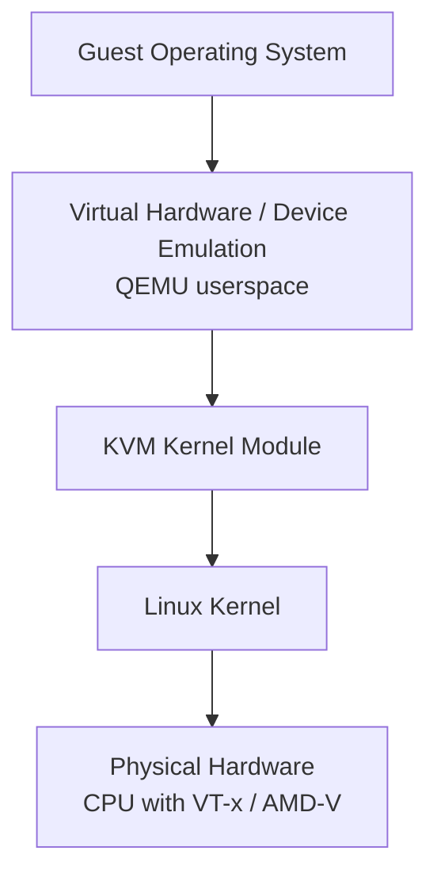

# KVM and QEMU Setup on Kali Linux

Step-by-step setup of the **KVM + QEMU** virtualization stack on Kali Linux — the standard, near-native hypervisor for running Windows and Linux lab guests on a Linux attacker host.

## Overview

| Component | Purpose | Required? |
|---|---|---|
| **KVM** | Hardware virtualization inside the Linux kernel | Yes (for near-native performance) |
| **QEMU** | Emulates virtual hardware and runs virtual machines | Yes |
| **libvirt** | Manages VMs, networks, and storage | Recommended |
| **virt-manager** | Graphical interface for managing VMs | Recommended |

**KVM + QEMU** is the standard [virtualization](Virtualization.md) stack on Kali Linux: KVM turns the Linux kernel into a type-1-style hypervisor while QEMU supplies the emulated devices, and `libvirt`/`virt-manager` provide management. See [KVM(Kernel-based-Virtual-Machine)](KVM(Kernel-based-Virtual-Machine).md) for the underlying concepts.

## Installation

### Step 1: Check CPU virtualization support

Check CPU flags:

```bash
egrep -c '(vmx|svm)' /proc/cpuinfo
```

Example:

```text
16
```

- `0` → Virtualization not supported or disabled.
- `>0` → Supported.

If the command returns `0`, enable the following in BIOS/UEFI:

- Intel VT-x
- Intel VT-d (optional)
- AMD-V
- AMD IOMMU

> [!WARNING]
> **Firmware setting required**
> A `0` result almost always means VT-x/AMD-V is disabled in BIOS/UEFI, not that the CPU lacks support. Reboot into firmware and enable it before continuing.

### Step 2: Verify KVM compatibility

Install the checker:

```bash
sudo apt update
```

```bash
sudo apt install cpu-checker
```

Run:

```bash
kvm-ok
```

Example:

```text
INFO: /dev/kvm exists
KVM acceleration can be used
```

### Step 3: Install KVM and QEMU

```bash
sudo apt update
```

```bash
sudo apt install \
qemu-kvm \
libvirt-daemon-system \
libvirt-clients \
virt-manager \
bridge-utils \
ovmf \
virtinst \
cpu-checker \
dnsmasq-base \
ebtables
```

Package explanation:

| Package | Purpose |
|---|---|
| `qemu-kvm` | QEMU with KVM acceleration |
| `libvirt-daemon-system` | libvirt daemon |
| `libvirt-clients` | `virsh` command |
| `virt-manager` | GUI VM manager |
| `bridge-utils` | Network bridges |
| `ovmf` | UEFI firmware |
| `virtinst` | VM creation tools |
| `cpu-checker` | Tests KVM support |
| `dnsmasq-base` | Virtual networking |
| `ebtables` | Bridge firewall rules |

## Configuration

### Step 4: Start libvirt

```bash
sudo systemctl enable libvirtd
```

```bash
sudo systemctl start libvirtd
```

Verify:

```bash
systemctl status libvirtd
```

### Step 5: Add your user to the libvirt and kvm groups

```bash
sudo usermod -aG libvirt $USER
sudo usermod -aG kvm $USER
```

Apply the changes by logging out and back in, or rebooting. Verify:

```bash
groups
```

Expected output should include:

```text
libvirt
kvm
```

### Step 6: Verify installation

Check loaded modules:

```bash
lsmod | grep kvm
```

Intel:

```text
kvm_intel
kvm
```

AMD:

```text
kvm_amd
kvm
```

Check QEMU version:

```bash
qemu-system-x86_64 --version
```

Check libvirt:

```bash
virsh version
```

List VMs:

```bash
virsh list --all
```

## GUI Steps

### Step 7: Launch virt-manager

```bash
virt-manager
```

You should see:

```text
QEMU/KVM
localhost
```

> [!NOTE]
> **Screenshot**
> 

From here you can create new VMs, import existing disks, configure CPU/RAM, take snapshots, and manage virtual networks.

### Step 8: Create a VM (GUI)

1. Open **Virtual Machine Manager** (`virt-manager`).
2. Click **Create a new virtual machine**.
3. Select an ISO image.
4. Choose memory and CPU.
5. Create a virtual disk.
6. Select **UEFI (OVMF)** if desired.
7. Finish and install the guest OS.

> [!NOTE]
> **Screenshot**
> 

## Examples

### Step 9: Create a VM (CLI)

```bash
virt-install \
--name ubuntu \
--memory 4096 \
--vcpus 4 \
--disk size=40 \
--cdrom ubuntu.iso \
--os-variant ubuntu22.04 \
--network default \
--graphics spice
```

### Useful `virsh` commands

List VMs:

```bash
virsh list --all
```

Start a VM:

```bash
virsh start ubuntu
```

Shutdown a VM:

```bash
virsh shutdown ubuntu
```

Force stop:

```bash
virsh destroy ubuntu
```

Autostart:

```bash
virsh autostart ubuntu
```

Delete a VM:

```bash
virsh undefine ubuntu --remove-all-storage
```

### Verify hardware acceleration

Check if `/dev/kvm` exists:

```bash
ls -l /dev/kvm
```

Example:

```text
crw-rw----+ root kvm
```

If this device exists and `kvm-ok` reports acceleration is available, your VMs will use hardware virtualization.

## Administration

### Common directory layout

```text
VM Images
    /var/lib/libvirt/images/

Configuration
    /etc/libvirt/

Logs
    /var/log/libvirt/

Networks
    /etc/libvirt/qemu/networks/
```

### KVM vs QEMU

| Feature | KVM | QEMU |
|---|---|---|
| Runs in kernel | Yes | No |
| Hardware virtualization | Yes | Only when using KVM |
| CPU execution | Hardware-assisted | Software emulation or KVM-accelerated |
| Device emulation | No | Yes |
| Performance | Near native | Slow without KVM |
| Can boot operating systems | With QEMU | Yes |

- **KVM only** — virtualizes CPU and memory; cannot boot a VM by itself; requires a userspace VMM like QEMU.
- **QEMU only** — fully emulates a computer in software; can emulate different CPU architectures (e.g. ARM on x86); much slower without KVM acceleration.
- **KVM + QEMU (recommended)** — QEMU provides the virtual hardware in userspace while KVM accelerates CPU and memory in the kernel:



This combination provides near-native CPU performance, full hardware emulation, broad guest OS support, snapshots and live migration (via libvirt), GPU passthrough and VirtIO support, and management through `virt-manager` or `virsh`. It is the standard virtualization architecture used by most Linux distributions, cloud platforms, and enterprise environments.

## Security Considerations

A KVM/QEMU lab is where you detonate malware, run offensive tooling, and stand up deliberately vulnerable Windows and Active Directory targets. Because the host kernel is directly involved (KVM is a kernel module), the isolation boundary between a compromised guest and your attacker host matters.

> [!WARNING]
> **The lab host is a trust boundary**
> Membership in the `kvm` and `libvirt` groups is effectively local privilege — a user who can talk to `/dev/kvm` and `libvirtd` can define VMs, attach host block devices, and read/write VM disk images. Treat these groups like `sudo`. Never place a vulnerable target on a `bridge`/`macvtap` network that routes to your real LAN; keep lab traffic on an isolated `default` (NAT) or an internal-only libvirt network so a popped guest cannot pivot into production.

- **VM escape** — a chain of QEMU/KVM CVEs (device-emulation bugs) can break a guest out to the host; keep the host patched and treat guests running untrusted samples as hostile to the host.
- **Snapshot before detonation** — malware and post-exploitation change guest state; roll back from a clean snapshot instead of trusting a "cleaned" VM.
- **Disable shared clipboard/folders and SPICE agent** when running untrusted samples — these channels can leak data or be abused for guest-to-host interaction.
- **libvirt sockets** — `libvirtd` listens on a local Unix socket by default; do not expose `virsh` over TCP without TLS in a lab that touches other networks.

## Best Practices

- Snapshot every VM in a known-good state before each lab and roll back afterwards (`virsh snapshot-create-as` / virt-manager).
- Keep lab guests on an isolated internal or host-only libvirt network with no route to production unless a specific lab requires internet.
- Use **VirtIO** disk and network drivers plus the `host-passthrough` CPU model for near-native performance on Windows and Linux guests.
- Store base images read-only and build practice VMs as linked clones or `--reflink` copies so you can rebuild fast and cheap.
- Add your user to `libvirt`/`kvm` deliberately and audit membership — do not run `virt-manager` as root.

## Troubleshooting

| Symptom | Likely cause & fix |
| --- | --- |
| `kvm-ok` reports acceleration cannot be used | VT-x/AMD-V disabled in firmware — enable it in BIOS/UEFI (Step 1) |
| `virsh` / virt-manager permission denied | User not in `libvirt` and `kvm` groups, or session not refreshed — add groups and log out/in (Step 5) |
| `default` network inactive / guests have no DHCP | Start and persist it: `virsh net-start default` then `virsh net-autostart default` |
| `/dev/kvm` missing after install | KVM module not loaded — check `lsmod \| grep kvm`; ensure virtualization is enabled in firmware and the correct `kvm_intel`/`kvm_amd` module loads |
| Nested VM won't use acceleration | Nested virtualization disabled on the host — enable the `kvm_intel`/`kvm_amd` `nested` module parameter |

## References

- [KVM project](https://linux-kvm.org/)
- [libvirt documentation](https://libvirt.org/)
- [QEMU documentation](https://www.qemu.org/documentation/)
- [Kali Linux documentation](https://www.kali.org/docs/)

## Related

- [Enterprise Windows Infrastructure Security](../Readme.md) — course hub and map of content
- [KVM(Kernel-based-Virtual-Machine)](KVM(Kernel-based-Virtual-Machine).md) — concepts behind this stack
- [Virtualization](Virtualization.md) — virtualization concepts and hypervisor types
- [VirtualBox-Network-Modes](VirtualBox-Network-Modes.md) — NAT/host-only/internal/bridged network modes for isolating lab traffic
- [Proxmox-Setup](Proxmox-Setup.md) — a managed appliance built around KVM/QEMU
- [Vulnerable-Machines](Vulnerable-Machines.md) — deliberately vulnerable targets to run as KVM guests
