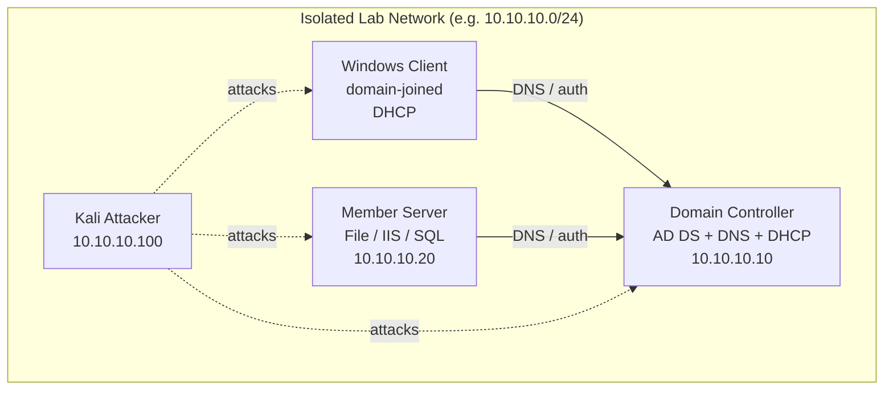

# Lab Design

Lab design is the deliberate layout of a multi-VM enterprise environment — how many machines, what roles they play, how they are networked, and how they are isolated — so that every attack and defense technique in this course can be practiced safely and repeatably. A well-designed lab mirrors a small Windows enterprise (a Domain Controller, member servers, clients, and an attacker) on an isolated network you can break and rebuild at will.

## Overview

Where [Virtualization](Virtualization.md) covers the hypervisor and [VirtualBox-Network-Modes](VirtualBox-Network-Modes.md) (or [Virtual-Networking](Virtual-Networking.md)) covers how individual VMs talk, lab design is the blueprint that ties them together into a realistic domain. The goal is a topology that is **representative** enough to reproduce real Active Directory behaviour — [AD DS](../Active-Directory-Domain-Services-AD-DS/Active-Directory-Domain-Services.md), DNS, DHCP, Group Policy, file shares — yet **contained** enough that malware and offensive tooling never reach production or the internet.

A good design is planned before you install a single OS. Decide the domain name, the IP scheme, the machine roles, and the network segments up front; then build each VM from clean, snapshotted media so the whole lab is disposable. Pair this note with [Snapshots-and-Templates](Snapshots-and-Templates.md) for the clone/rollback workflow and [Vulnerable-Machines](Vulnerable-Machines.md) for the deliberately weak targets you add on top of the baseline.

## Components

A minimal-but-realistic Windows enterprise lab has four building blocks:

| Role | Typical OS | Purpose in the lab |
| --- | --- | --- |
| Domain Controller (DC) | Windows Server (eval) | Runs AD DS, DNS, and DHCP; the identity core of the domain |
| Member server(s) | Windows Server (eval) | File server, IIS web server, SQL, etc. — services to attack and defend |
| Domain-joined client | Windows 10/11 (eval) | The user workstation; where phishing, credential theft, and GPO land |
| Attacker | Kali Linux | Your offensive toolbox on the same isolated segment |

> [!TIP]
> **Start small, grow deliberately**
> Begin with exactly these four VMs on one isolated network. Only add a second DC, a child domain, or a separate subnet once the baseline works and you have a reason (replication testing, trust attacks, pivoting). Every extra VM is more RAM, more disk, and more state to keep clean.

## Network Topology

The whole lab lives on an **isolated internal / host-only network** with no route to your home LAN. The Domain Controller provides DNS and DHCP for the lab so that domain join and name resolution work exactly as they would in production. Optionally, a second NIC on one machine (or a pfSense/router VM) provides gated internet access only when a lab explicitly needs it.



> [!IMPORTANT]
> **One authority for DNS and DHCP**
> In a Windows domain the **DC owns DNS**. Point every lab member at the DC's IP for DNS (not a public resolver, not the hypervisor NAT gateway) or domain join and Kerberos will fail. Let the DC's DHCP scope hand out that DNS server automatically to clients.

## Configuration

A repeatable design nails down these decisions before build time:

- **Domain name** — use a routable-but-owned or clearly-lab name such as `lab.local` or `corp.lab.internal`; avoid a real domain you do not control.
- **IP scheme** — a single private /24 (for example `10.10.10.0/24`), static IPs for servers, DHCP for clients.
- **Hostnames** — descriptive and consistent (`DC01`, `SRV01`, `WS01`, `KALI`).
- **Sizing** — thin-provision disks; give the DC ~2 vCPU / 2–4 GB RAM, clients 2–4 GB, and keep everything on SSD for snapshot speed.

Example static configuration on the Domain Controller (adjust to your scheme):

```powershell
# Set a static IP + point DNS at self, then promote to a DC   # untested
New-NetIPAddress -InterfaceAlias "Ethernet" -IPAddress 10.10.10.10 `
  -PrefixLength 24 -DefaultGateway 10.10.10.1
Set-DnsClientServerAddress -InterfaceAlias "Ethernet" -ServerAddresses 10.10.10.10
Install-WindowsFeature AD-Domain-Services -IncludeManagementTools
Install-ADDSForest -DomainName "lab.local"
```

Verify domain membership and DNS resolution from a joined client:

```cmd
:: Confirm the client resolves and reaches the domain
nltest /dsgetdc:lab.local
nslookup lab.local
```

## Types

Common lab shapes, from simplest to most involved:

- **Single-forest, single-domain** — one DC, a few members and clients. The default for learning AD, GPO, and Kerberos/NTLM tradecraft.
- **Multi-DC / replication lab** — two DCs to practise [AD DS](../Active-Directory-Domain-Services-AD-DS/Active-Directory-Domain-Services.md) replication, FSMO, and sites.
- **Multi-domain / forest with trusts** — parent and child (or two forests) to study trust relationships and cross-domain attacks.
- **Segmented / pivoting lab** — multiple subnets with a router or firewall VM so you must tunnel and pivot between segments.

## Security Considerations

> [!WARNING]
> **The lab is hostile to everything outside it**
> Lab machines are intentionally weak, unpatched, and often running malware or C2 tooling. A single bridged adapter or a shared folder can turn your practice domain into a foothold on your real network.
> - **Never bridge** a lab VM directly onto your home/office LAN — use internal/host-only networking.
> - **No internet by default**; open a gated path only for the duration of a lab that needs it.
> - **Disable clipboard and shared-folder integration** when detonating untrusted samples.
> - **Rebuild from snapshot** rather than "cleaning" a compromised host — you can never fully trust it again.

From the offensive side, the lab exists precisely so you can safely reproduce credential theft, [AD](../Active-Directory-Domain-Services-AD-DS/Active-Directory-Domain-Services.md) enumeration, lateral movement, and relay attacks. From the defensive side, it is where you validate Group Policy hardening, logging, and detections before recommending them for production.

## Best Practices

- Plan domain name, IP scheme, roles, and network segment **before** installing any OS.
- Snapshot every VM in a known-good, clean state before each lab and roll back afterward (see [Snapshots-and-Templates](Snapshots-and-Templates.md)).
- Keep the whole lab on an isolated network with no route to production or the internet unless a specific lab requires it.
- Use evaluation media from the [Windows-Evaluation-Center](Windows-Evaluation-Center.md) and re-arm rather than pirated keys; document each VM's specs for reproducibility.
- Build a golden client/server template once, then clone it — faster rebuilds and consistent baselines.

## Troubleshooting

| Symptom | Likely cause & fix |
| --- | --- |
| Client cannot join the domain | Client DNS not pointed at the DC — set its DNS server to the DC's IP, not NAT/public |
| VMs can't see each other but should | Different network modes/segments — put all lab VMs on the **same** internal/host-only network |
| Kerberos / auth errors after join | Time skew between client and DC too large — sync clocks (the DC is the domain time source) |
| DHCP not handing out addresses | DHCP scope not authorized/activated on the DC, or a second rogue DHCP on the segment |
| Lab has unexpected internet access | A bridged or NAT adapter is attached — remove it and use internal-only networking |

## References

- [Microsoft Learn — Install Active Directory Domain Services](https://learn.microsoft.com/windows-server/identity/ad-ds/deploy/install-active-directory-domain-services)
- [Microsoft Evaluation Center](https://www.microsoft.com/en-us/evalcenter/)
- [Microsoft Learn — DNS in Active Directory Domain Services](https://learn.microsoft.com/windows-server/networking/dns/dns-top)
- [VirtualBox networking modes](https://www.virtualbox.org/manual/ch06.html)

## Related

- [Enterprise Windows Infrastructure Security](../Readme.md) — course hub
- [Virtualization](Virtualization.md) — the hypervisor layer this lab runs on
- [VirtualBox-Network-Modes](VirtualBox-Network-Modes.md) — where NAT/host-only/internal fit into the topology
- [Virtual-Networking](Virtual-Networking.md) — virtual switch and segment concepts
- [Snapshots-and-Templates](Snapshots-and-Templates.md) — clone/rollback workflow that keeps the lab reproducible
- [Vulnerable-Machines](Vulnerable-Machines.md) — deliberately weak targets to add on top of the baseline
- [Windows-Evaluation-Center](Windows-Evaluation-Center.md) — legally sourcing the Windows media for each VM
- [Active-Directory-Domain-Services](../Active-Directory-Domain-Services-AD-DS/Active-Directory-Domain-Services.md) — the identity service at the core of the lab
