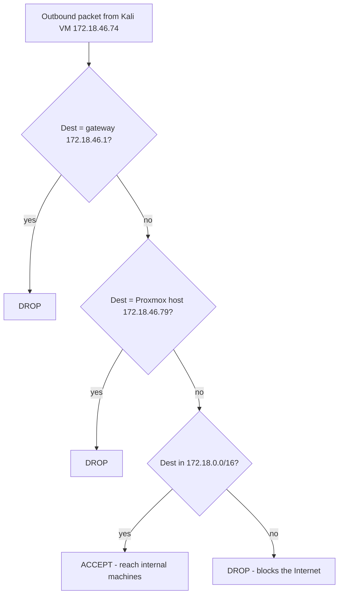

# Proxmox Setup

Proxmox VE (Virtual Environment) is a free, open-source, Debian-based **type-1 hypervisor** that combines KVM virtual machines and LXC containers under a single web-managed platform. In this lab it is the host that runs the isolated Kali attacker, Windows targets, and supporting machines used throughout the course.

## Overview

Proxmox VE is well suited to a home/lab [Virtualization](Virtualization.md) stack because it manages VMs, storage, and networking from one browser UI (port `8006`) and supports snapshots, firewalling, and USB passthrough out of the box. Compared with a desktop hypervisor it runs bare-metal, so the whole machine becomes a dedicated lab host. This note walks through installing Proxmox, building Kali and Windows 11 [target/attacker VMs](Vulnerable-Machines.md), containing them with the Proxmox firewall, and the day-to-day operations (snapshots, USB Wi-Fi passthrough) needed to run the lab safely.

> [!NOTE]
> **Where Proxmox fits**
> Proxmox is one of three hypervisor options in this module, alongside [VirtualBox](VirtualBox-Network-Modes.md) and [KVM/QEMU](KVM(Kernel-based-Virtual-Machine).md). Choose it when you want a dedicated bare-metal lab host with centralized web management rather than a hypervisor running on top of your daily-driver OS.

## Download & Install Proxmox VE

1. Download Proxmox ISO File:

	- Visit: [https://www.proxmox.com/en/downloads](https://www.proxmox.com/en/downloads)

    - Direct ISO Link: [proxmox-ve_8.3-1.iso](https://enterprise.proxmox.com/iso/proxmox-ve_8.3-1.iso)

2. Create Bootable USB using Rufus:

    - Open [Rufus](https://rufus.ie/)

    - Insert USB drive

    - Select the downloaded Proxmox ISO

    - Click Start to create a bootable USB

3. Boot from USB & Install Proxmox:

    - Restart your PC

    - Boot from USB drive (use BIOS/boot menu)

    - Follow the on-screen instructions to install Proxmox

> [!WARNING]
> **Ethernet required**
> Proxmox does not support Wi-Fi out of the box. Make sure your system is connected via **Ethernet** during installation, or the management network step will fail.

## Proxmox VE Installation Process

1. Boot from USB Drive
    Start system with Proxmox bootable USB and select:

     Install Proxmox VE (Graphical)

2. License Agreement
     Accept the license terms and click Next

3. Select Target Hard Disk
     Choose your installation drive
     Click Next

4. Set Location and Time Zone
     Choose your Country, Timezone, and Keyboard layout
     Click Next

5. Set Administrator Password & Email

    - Password: `<PROXMOX_ROOT_PASSWORD>`

    - Email: `proxmox@armourinfosec.com`
         Click Next

6. Management Network Configuration
    You can use the default configuration, or modify if needed.

    - Select Interface

    - Hostname: `infosec.armour.lan`
         Click Next to proceed with default config

7. Installation Summary
     Review all settings
     Click Install

## Access Proxmox Web Interface

After installation completes and system reboots, open a browser and go to the web UI on port `8006`:

```text
https://{IP}:8006
```

> Example: `https://192.168.1.100:8006`

Login using:

- Username: `root`

- Password: `<PROXMOX_ROOT_PASSWORD>`

> [!TIP]
> **Self-signed certificate warning**
> Proxmox ships with a self-signed TLS certificate, so the browser will warn on first connection. This is expected for a lab host — accept and proceed.

## Install Kali in Proxmox VM

### How to Create Kali Linux VM in Proxmox VE

#### Step 1: Access Proxmox Web Interface

- Open your browser and go to:

    ```text
    https://{IP}:8006
    ```

    > Example: `https://192.168.1.100:8006`

- Login Credentials:

    - Username: `root`
    - Password: `<KALI_VM_PASSWORD>`

	- Username: `armour`
    - Password: `<LAB_VM_PASSWORD>`

#### Step 2: Upload Kali Linux ISO

1. In the left panel, navigate to:

    ```text
    Datacenter > [Node Name] (e.g. infosec) > local
    ```

1. Click on ISO Images

2. Click Upload (to upload ISO from your system)
    OR click Download from URL and paste Kali ISO link:
     [https://www.kali.org/get-kali/](https://www.kali.org/get-kali/)

#### Step 3: Create a New Virtual Machine

Click Create VM (Top-right)

Then follow these steps:

1. General

    - Node: Select your node (e.g. infosec)

    - Name: `Kali`

    - Click Next

2. OS

    - Select Kali ISO image

    - Click Next

3. System

    - Leave default settings

    - Click Next

4. Disks

    - Set disk size (e.g. 20 GB or more)

    - Click Next

5. CPU

    - Set number of cores (e.g. 2)

    - Click Next

6. Memory

    - Allocate RAM (e.g. 2048 MB or more)

    - Click Next

7. Network

    - Use default bridge (e.g. `vmbr0`) or configure as needed

    - Click Next, then Finish

#### Step 4: Start the Kali VM

1. In the left panel, go to your node

2. Click on the new VM (e.g. `100 (Kali)`)

3. Click Console

4. Click Start

#### Username and Password

- root :- root
- armour :- 123

## Firewall Configuration

### Proxmox VM Firewall Configuration (Allow Only Internal Network Access)

The Proxmox firewall is layered: it must be enabled at the **Datacenter** level, the **VM** level, and then rules are attached per VM. Egress rules are evaluated **top-to-bottom**, so ordering matters — put the specific DROP rules for the gateway and host *above* the broad ACCEPT for the internal subnet, and end with a catch-all DROP to block the internet.

#### Step 1: Enable Firewall Globally

1. Open Proxmox Web UI

2. Go to:

```text
Datacenter > Firewall > Options
```

3. Configure the following:

    - Input Policy: `ACCEPT`

    - Output Policy: `ACCEPT`

    - Forward Policy: `ACCEPT`

    - Firewall: `Yes`

#### Step 2: Add Firewall Rules for Specific VM

1. In the Web UI, navigate to:

```text
Select VM > Firewall > Add
```

2. Add Rule to Allow LAN Access:

    - Direction: `Out`

    - Action: `Accept`

    - Destination: `192.168.1.0/24` (Adjust to your LAN range)

#### Step 3: Enable Firewall on the VM

1. Go to:

```text
VM > Firewall > Options
```

2. Set:

    - Firewall: `Yes`

    - Input Policy: `ACCEPT`

    - Output Policy: `ACCEPT`

### Worked example: isolate a single Kali VM

Setup the Kali VM (single VM) to the following requirements:

* Kali VM **cannot** reach the Internet
* Kali VM **cannot** reach the Proxmox host (`172.18.46.79`)
* Kali VM **cannot** reach the gateway (`172.18.46.1`)
* Kali VM **can** reach other internal machines (`172.18.0.0/16` except `.1` and `.79`)

The egress decision, evaluated in rule order, looks like this:



#### Proxmox VM Firewall Rules (for Kali `172.18.46.74`)

In Proxmox UI → Select Kali VM → Firewall → Rules, add rules in this order:

0. Block gateway (172.18.46.1)

```text
Action: DROP
Direction: OUT
Destination: 172.18.46.1
```

1. Block Proxmox host (172.18.46.79)

```text
Action: DROP
Direction: OUT
Destination: 172.18.46.79
```

2. Allow internal network except exclusions

```text
Action: ACCEPT
Direction: OUT
Destination: 172.18.0.0/16
```

3. Block Internet (everything else)

```text
Action: DROP
Direction: OUT
Destination: 0.0.0.0/0
```

> [!IMPORTANT]
> **Order and default policy**
> Because rules are matched top-down and the first match wins, the two host/gateway DROP rules must sit **above** the `172.18.0.0/16` ACCEPT, and the `0.0.0.0/0` DROP must sit **last**. If the internal ACCEPT came first it would also let gateway/host traffic through.

## Install Windows 11 in Proxmox VM

### Step 1: Upload Windows ISO & VirtIO Drivers

1. Open Proxmox Web UI
    Go to:

```text
Datacenter > [Node Name] (e.g. infosec) > local > ISO Images
```

2. Upload Required ISOs:

    - Windows 11 ISO:
         [https://massgrave.dev/windows_11_links](https://massgrave.dev/windows_11_links)

    - VirtIO Driver ISO:
         [https://fedorapeople.org/groups/virt/virtio-win/direct-downloads/stable-virtio/virtio-win.iso](https://fedorapeople.org/groups/virt/virtio-win/direct-downloads/stable-virtio/virtio-win.iso)

> [!TIP]
> **Legally sourcing Windows media**
> For a durable lab, prefer official evaluation media — see [Windows-Evaluation-Center](Windows-Evaluation-Center.md), [Microsoft-Windows-Activation](Microsoft-Windows-Activation.md), and [Custom-build-Windows-11-ISO](Custom-build-Windows-11-ISO.md) — over ad-hoc download mirrors.

### Step 2: Create a New Windows VM

1. Click Create VM

2. Fill the following:

#### General

- Node: Select your node (e.g. infosec)

- VM ID & Name: e.g. `win11-vm`

- Click Next

#### OS

- Select Windows 11 ISO

- Type: Microsoft Windows

-  Check: _Add additional drive for VirtIO drivers_

- Select: `virtio-win.iso`

- Click Next

#### System

- Machine: Default

- EFI Storage: `local-vm`

- TPM Storage: `local-vm`

- Click Next

#### Disk

- Disk Size: Minimum 64 GB

- Click Next

#### CPU

- Assign at least 2 cores

- Click Next

#### Memory

- Minimum 4 GB RAM

- Click Next

#### Network

- Model: `VirtIO`

- Click Next > Finish

> [!NOTE]
> **Windows 11 needs TPM + Secure Boot**
> Windows 11 requires a **TPM 2.0** and **UEFI/Secure Boot**, which is why the VM needs both **EFI Storage** and **TPM Storage** configured above. The VirtIO drivers supply the disk and network drivers Windows lacks natively for the paravirtualized hardware.

### Step 3: Start VM & Begin Installation

1. Go to:

```text
Datacenter > Node > VM (e.g. 101) > Console
```

2. Click Start to power on the VM

### Step 4: Windows 11 Installation Process

1. Choose Language & Keyboard

2. Accept License Agreement

3. Click Load Driver

    - Navigate to: `D:\amd64\w11`

    - Click OK

4. VirtIO drivers will load — select the Windows 11 compatible drivers

5. Now the virtual disk will appear
     Select it and click Next

### Step 5: Continue Install process

During the installation process [Install Network Driver]:

- Username :- armour
- Password :- <VM_PASSWORD>

You're now ready to use Windows 11 in Proxmox!

## Connect a USB Adapter to a Proxmox VM

### Kali VM

1. Go to Kali VM → Hardware

2. Click on Add → USB Device

3. Choose Use USB Port

4. Select the correct Port

5. Click Add

### Windows VM

1. Go to Windows VM → Hardware

2. Click on Add → USB Device

3. Choose Use USB Port

4. Select the correct Port

5. Click Add

### Install USB Wi-Fi Adapter Drivers in Kali

Build and load the `rtl8188eus` driver, then blacklist the conflicting in-tree modules:

```bash
sudo apt update
sudo apt install bc
sudo apt install linux-headers-$(uname -r)
reboot

git clone https://github.com/aircrack-ng/rtl8188eus.git
cd rtl8188eus
make && sudo make install

echo 'blacklist r8188eu' | sudo tee -a '/etc/modprobe.d/realtek.conf'
echo 'blacklist rtl8xxxu' | sudo tee -a '/etc/modprobe.d/realtek.conf'

rmmod r8188eu rtl8xxxu 8188eu
sudo modprobe 8188eu
```

### Check if USB Adapter is Connected

```bash
# Show USB devices
lsusb

# Check network interfaces
ip a     # or use: ifconfig

# Bring up wlan interface
sudo ip link set wlan0 up

# Confirm again
ip a
```

## Snapshots

Snapshots capture a VM's disk (and optionally RAM) state so you can roll back after breaking something — the core lab-hygiene workflow.

### Create a Snapshot of Your VM

1. Log in to Proxmox Web UI (`https://your-proxmox-ip:8006`)
2. Select your VM from the left sidebar.
3. Go to "Snapshots" tab.
4. Click "Take Snapshot".
5. Enter a name and description (e.g., "Before Config Change").
6. (Optional) Check "RAM" if you want to save the running state.
7. Click "Take Snapshot".

### Restore a Snapshot

If your VM is misconfigured, restore the snapshot:
1. Go to VM > Snapshots tab.
2. Select the snapshot you want to restore.
3. Click "Rollback".
4. Confirm the rollback.

> [!NOTE]
> **Rolling back RAM state**
> If you included RAM in the snapshot, a rollback resumes the VM exactly where you left off, rather than at a cold boot.

## Lab Machine Reference

Credentials and settings for the supporting machines in this lab environment.

### Debian

- root :- `32awR%rW2Q8&`
- armour :- `32awR%rW2`

### Router

- Name :- `<WIFI_SSID>`
- Username: `admin`
- Password: `<ROUTER_ADMIN_PASSWORD>`
- Wi-Fi password: `<WIFI_PASSWORD>`

### OpenWrt

- Password :- `<OPENWRT_PASSWORD>`

### Debian Wi-Fi Auto-Reconnect Script

On the Debian machine, this script reconnects Wi-Fi after a disconnect:

```bash
vim /root/wifi-monitor.sh
```

```bash
#!/bin/bash

SSID="<WIFI_SSID>"
PASSWORD="<WIFI_PASSWORD>"

while true; do
    WIFI_RADIO=$(nmcli -t -f WIFI g)                 # enabled / disabled
    CONN_STATE=$(nmcli -t -f STATE g)                # connected / disconnected / connecting
    ACTIVE_SSID=$(nmcli -t -f ACTIVE,SSID dev wifi | grep '^yes' | cut -d: -f2)

    echo "[*] WiFi status: $WIFI_RADIO, NM state: $CONN_STATE, Active SSID: $ACTIVE_SSID"

    if [[ "$WIFI_RADIO" != "enabled" ]]; then
        echo "[!] Wi-Fi is disabled. Enabling..."
        nmcli radio wifi on
    elif [[ "$CONN_STATE" != "connected" || "$ACTIVE_SSID" != "$SSID" ]]; then
        echo "[!] Wi-Fi is not connected to $SSID. Attempting reconnect..."

        if nmcli con show | grep -q "$SSID"; then
            nmcli con up "$SSID"
        else
            nmcli dev wifi connect "$SSID" password "$PASSWORD"
        fi

        sleep 10
    else
        echo "[*] Wi-Fi is connected to $SSID. No action needed."
    fi

    sleep 5
done
```

#### Auto-start the Script as a systemd Service

**Step 1: Move Script to a Proper Location** — system-wide scripts usually go into `/usr/local/bin/`:

```bash
mv /root/wifi-monitor.sh /usr/local/bin/wifi-monitor.sh
chmod +x /usr/local/bin/wifi-monitor.sh
```

**Step 2: Create a `systemd` Service File**:

```bash
vim /etc/systemd/system/wifi-monitor.service
```

Paste this:

```ini
[Unit]
Description=Wi-Fi Auto-Reconnect Monitor
After=network.target

[Service]
ExecStart=/usr/local/bin/wifi-monitor.sh
Restart=always
RestartSec=5
User=root

[Install]
WantedBy=multi-user.target
```

**Step 3: Reload systemd and Enable the Service**:

```bash
# Reload systemd to detect new service
systemctl daemon-reexec
systemctl daemon-reload

# Enable the service to run at boot
systemctl enable wifi-monitor.service

# Start the service now (optional)
systemctl start wifi-monitor.service
```

## Security Considerations

A Proxmox lab host concentrates risk: it runs deliberately weak targets, offensive tooling, and sometimes live malware, and its web UI plus SSH are high-value footholds.

> [!WARNING]
> **Contain the lab, protect the host**
> - The Proxmox web UI (`8006`) and SSH (`22`) expose the hypervisor — the single machine that can start, stop, snapshot, and read the disks of **every** VM. Never expose these to the internet; keep management on an isolated segment.
> - The default lab passwords in this note (Proxmox `root`, VM accounts, router/Wi-Fi keys) are **weak and shared** — fine for a throwaway lab, unacceptable anywhere reachable from production or the internet. Rotate them if the host is ever multi-homed.
> - Use the per-VM firewall (see the worked example above) to stop compromised targets from reaching the gateway, the Proxmox host, or the internet. Egress filtering is what turns "a vulnerable VM" into "a *contained* vulnerable VM".
> - A VM that can reach the Proxmox host management interface is a **guest-to-host escalation** opportunity — treat host isolation as a hard boundary.

## Best Practices

- Snapshot every VM in a known-good state before each lab and roll back afterward instead of trying to "clean" a compromised guest.
- Keep lab VMs on an isolated bridge with no route to production; use per-VM firewall rules to deny egress to the gateway, host, and internet unless a lab requires it.
- Keep the Proxmox host itself patched and its management interface off any untrusted network.
- Use evaluation media ([Windows-Evaluation-Center](Windows-Evaluation-Center.md)) and document each VM's specs (CPU/RAM/disk, VM ID) for reproducibility.
- Change the default lab credentials the moment the environment is anything other than fully isolated.

## Troubleshooting

| Symptom | Likely cause & fix |
| --- | --- |
| No network during Proxmox install / management step fails | Host is on Wi-Fi; Proxmox needs a wired **Ethernet** NIC. Connect via cable and retry. |
| Web UI unreachable at `https://{IP}:8006` | Wrong IP, firewall blocking `8006`, or you used `http://`. Confirm the node IP on the console and use HTTPS. |
| Windows 11 installer shows no disk | VirtIO storage driver not loaded — click **Load Driver**, browse the `virtio-win.iso` (e.g. `D:\amd64\w11`), then the disk appears. |
| Windows 11 refuses to install (TPM/Secure Boot) | VM missing TPM/EFI — add **TPM Storage** and **EFI Storage** and use an OVMF (UEFI) machine. |
| Kali VM can still reach the internet/gateway | Firewall rule order wrong; the broad `172.18.0.0/16` ACCEPT is above the DROP rules. Reorder so DROPs precede the ACCEPT and `0.0.0.0/0` DROP is last. |
| USB Wi-Fi adapter not seen in Kali | Adapter not passed through (VM → Hardware → Add → USB Device), or driver not built/loaded — rebuild `rtl8188eus` and `modprobe 8188eu`. |

## References

- [Proxmox VE Documentation Index](https://pve.proxmox.com/pve-docs/)
- [Proxmox VE Firewall documentation](https://pve.proxmox.com/wiki/Firewall)
- [Proxmox VE Installation guide](https://pve.proxmox.com/wiki/Installation)
- [VirtIO / virtio-win drivers (Fedora)](https://fedorapeople.org/groups/virt/virtio-win/direct-downloads/stable-virtio/)

## Related

- [Enterprise Windows Infrastructure Security](../Readme.md) — course hub
- [Virtualization](Virtualization.md) — parent hub for hypervisor concepts
- [VirtualBox-Network-Modes](VirtualBox-Network-Modes.md) — related note (desktop hypervisor + isolated networking)
- [KVM(Kernel-based-Virtual-Machine)](KVM(Kernel-based-Virtual-Machine).md) — related note (the KVM engine Proxmox is built on)
- [Vulnerable-Machines](Vulnerable-Machines.md) — deploy practice targets on this Proxmox host
- [Windows-Evaluation-Center](Windows-Evaluation-Center.md) — legally sourcing Windows media for the Windows VM
- Docker — container alternative to full VMs
